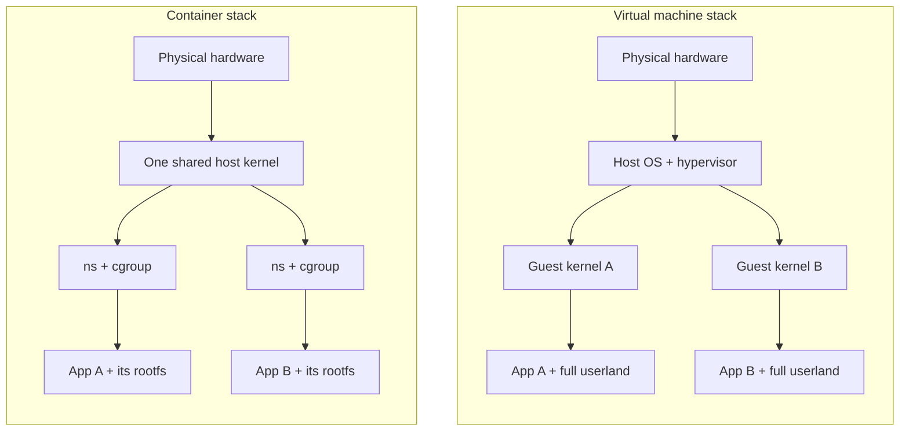
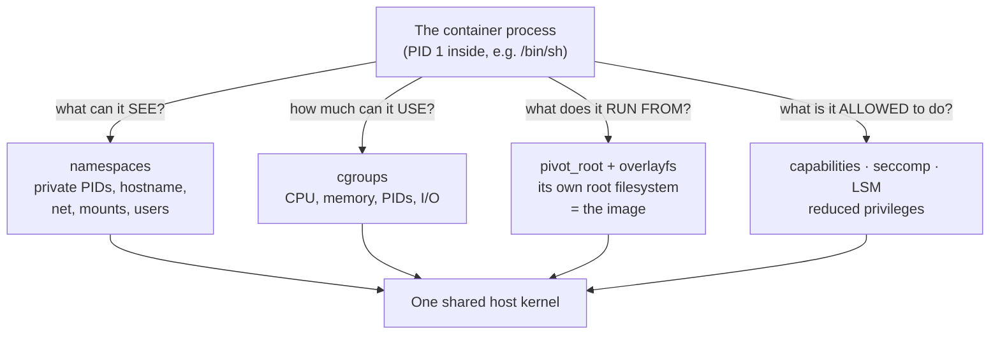

# Chapter 01 — What *is* a container?

> Before you build one, you have to unlearn one thing: a container is not a box, and
> there is no `container` system call. There is only a normal Linux process that the
> kernel has been talked into showing a very narrow, very private view of the world.

## What you'll learn

- Why "a container is a process in disguise" is not a metaphor but a literal fact.
- How containers differ from virtual machines — and the trade-offs that difference forces (speed, density, and a weaker isolation boundary).
- The **four-questions** model that structures this entire guide: what can a process *see*, *use*, *run from*, and is *allowed to do*.
- A tight lineage from `chroot` (1979) to today's OCI-standardized runtimes.
- What you'll actually build: a small container runtime in Go called `mini-docker`.

---

## There is no container syscall

Open the Linux kernel's system-call table and search for `container`. You won't find
it. There's no `create_container()`, no `struct container` living in the kernel, no
dedicated subsystem that owns the concept. This is the single most clarifying fact in
this whole guide, so let it land: **the kernel does not know what a container is.**

What the kernel *does* know is how to run processes, and how to give each process a
customized, restricted view of the machine. A "container" is what you get when you
take an ordinary process (or a small tree of processes) and, at the moment you start
it, wrap it in a bundle of unrelated kernel features:

- give it its own **namespaces**, so it sees its own process list, hostname, network,
  and filesystem mounts;
- put it in a **cgroup**, so it can only use so much CPU, memory, and I/O;
- `pivot_root` it into its own **root filesystem**, so `/` means the image and not the host;
- strip its **capabilities**, install a **seccomp** filter, and confine it with an
  **LSM**, so it can't do the dangerous things it never needed to do.

None of those features were invented "for containers." Namespaces isolate; cgroups
account and limit; `pivot_root` swaps a root directory. Assemble them around a single
`exec()` and the *emergent* result is a process that behaves as if it owns a small
private computer — while in reality it is sharing your one kernel with everything else
on the box. A container is an **assembly**, not a primitive. That's why you can build
one yourself, one feature at a time, which is exactly what the rest of this guide does.

> If you take one sentence away from this chapter: *a container is a process the kernel
> is lying to, and you get to choose which lies to tell.*

---

## Containers vs. virtual machines

The comparison people reach for first is "container = lightweight VM." It's a useful
starting intuition and a misleading finish. The two solve isolation at completely
different layers of the stack.

A **virtual machine** virtualizes *hardware*. A hypervisor (KVM, Hyper-V, ESXi, the
lightweight VMM behind Firecracker) presents each guest with what looks like real CPUs,
memory, disks, and NICs. Inside that fake hardware you boot a **complete second operating
system**, kernel and all. Two VMs on one host run two independent kernels that share
nothing but the hypervisor beneath them.

A **container** virtualizes the *operating system's view*. There is no second kernel and
no emulated hardware. Every container on a host makes syscalls into the **same host
kernel**; the kernel simply hands each one a different set of namespaces and cgroups so
they can't see or starve each other.



Notice what the container stack is *missing*: an entire layer. No per-tenant kernel, no
virtual hardware to emulate, no second boot sequence. That absence is the whole story —
it's the source of every advantage and the one serious disadvantage.

| Dimension | Virtual machine | Container |
| --- | --- | --- |
| Isolation unit | Emulated hardware + guest kernel | Namespaces + cgroups around a process |
| Kernel | Its own, per VM | Shared host kernel |
| Startup | Seconds (a full OS boots) | Milliseconds (just `exec` a process) |
| Overhead | Full OS image + RAM per guest | Roughly the process + its files |
| Density | Tens per host | Hundreds to thousands per host |
| Isolation boundary | Strong — the hypervisor's small, hardware-enforced interface | Weaker — the entire syscall surface of a shared kernel |
| Run a *different* kernel/OS? | Yes (Windows guest on a Linux host, etc.) | No — a Linux container needs a Linux kernel |

Be honest about the last two rows, because vendors often aren't. A VM's attack surface
is the narrow, hardware-assisted boundary the hypervisor exposes; a container's attack
surface is *the whole Linux kernel*. Millions of lines of shared C, thousands of
syscalls — and a single kernel bug can, in principle, let a process escape its
namespaces onto the host or into a neighbor. This is why "containers don't contain" is
a real, if overstated, warning, and why chapter [08](08-security-and-hardening.md) spends
its length shrinking that surface (dropping capabilities, seccomp, user namespaces), and
why security-focused systems like Kata Containers and gVisor deliberately put a thin VM
or a userspace kernel *back* between the container and the host. Containers trade a bit
of the boundary for a lot of speed and density. Whether that's the right trade is a
question of workload and threat model, not dogma.

---

## The four questions

Here is the spine of the entire guide. Every container mechanism answers one of four
questions about a process, and once you can name the question, you can name the tool.



Read that diagram as a checklist. Peel away any one mechanism and you still have a
process — just a leakier one. Stack all four and you have what everyone calls a container.

| Question | The process gets… | Mechanism | Chapter |
| --- | --- | --- | --- |
| What can it **see**? | its own view of the system | namespaces | [03](03-namespaces.md) |
| How much can it **use**? | a hard resource budget | cgroups | [04](04-cgroups.md) |
| What does it **run from**? | its own `/` (the image) | `pivot_root` + overlayfs | [06](06-rootfs-and-images.md) |
| What is it **allowed to do**? | only the privileges it needs | capabilities, seccomp, LSMs | [08](08-security-and-hardening.md) |

We won't crack any of these open here — that's what the later chapters are for. Chapter
[02](02-the-linux-toolbox.md) introduces the actual syscalls (`clone`, `unshare`, `setns`,
`mount`, `pivot_root`) that wire them up. For now, just memorize the four questions.
They'll be your map every time a container does something surprising: whatever went
wrong, it was one of these four answers being weaker or stronger than you assumed.

---

## A short lineage

None of this arrived fully formed in 2013. Containers are the accumulated sediment of
four decades of people wanting to give a process a smaller world:

**`chroot` (1979)** shipped in Version 7 Unix and gained its familiar form in
4.2BSD (1983): change a process's idea of `/` so it can't see the rest of the
filesystem. Just a filesystem trick, trivially escapable, but the seed of the idea.
**FreeBSD jails (2000)** hardened that into a real isolation boundary, adding process,
user, and network separation. **Solaris Zones (2004/2005)** pushed further with a full
virtualized-OS-instance model and resource controls. On Linux, the primitives arrived
piecemeal: the mount namespace landed in **2002 (kernel 2.4.19)**, the other namespaces
through the **2.6** series, and **cgroups** (originally "process containers" from Google)
merged in **2.6.24 (2008)**. **LXC (2008)** was the first project to stitch namespaces and
cgroups into whole "Linux containers." **Docker (2013)** didn't invent the primitives —
its breakthrough was *developer experience*: a `Dockerfile`, layered images, a registry,
and a one-line `docker run`. Success bred the need for standards, so the ecosystem
extracted the **Open Container Initiative (OCI)** specs and split the runtime into
**runc** (the low-level thing that actually calls `clone`) and **containerd** (the daemon
that manages images and lifecycles). Chapter [09](09-how-docker-really-works.md) traces
that `docker → containerd → runc` path in full.

The throughline: every generation gave a process a smaller, more private view of the
machine, and the Linux kernel just kept adding sharper tools for doing it.

---

## What you'll build

Theory is cheap. Starting in chapter [05](05-building-a-container-in-go.md) you'll write
a container runtime in Go, adding one primitive per step until it earns the name
`mini-docker`. The finished capstone lives in [src/step7-mini-docker](../src/step7-mini-docker/main.go)
and runs like this:

```console
$ sudo ROOTFS=/tmp/alpine ./bin/mini-docker run /bin/sh
[inside] hostname is 'container', I am PID 1,
[inside] I have my own /proc, my own root filesystem,
[inside] and I can't use more than 100 MB of RAM.
/ # ps
PID   USER     COMMAND
    1 root     /bin/sh
```

That `ps` output is the payoff of the whole guide: PID 1, an empty process list, a fresh
root filesystem — a process convinced it owns the machine, running a few centimeters away
from your shell on the very same kernel. Each step under [src/](../src/) is a small,
compilable program, and each maps directly onto one of the four questions:

| Step | Adds | Answers |
| --- | --- | --- |
| [step1-exec](../src/step1-exec/main.go) | just `exec` a command — no isolation at all | *(baseline)* |
| [step2-uts-namespace](../src/step2-uts-namespace/main.go) | a private hostname (`CLONE_NEWUTS`) | see |
| [step3-reexec](../src/step3-reexec/main.go) | the `/proc/self/exe` re-exec trick | see |
| [step4-pid-and-proc](../src/step4-pid-and-proc/main.go) | own PID namespace + its own `/proc` | see |
| [step5-rootfs-pivot-root](../src/step5-rootfs-pivot-root/main.go) | `pivot_root` into an image | run from |
| [step6-cgroups](../src/step6-cgroups/main.go) | memory + PID limits via cgroup v2 | use |
| [step7-mini-docker](../src/step7-mini-docker/main.go) | all of it, plus dropped privileges | see · use · run from · allowed |

You'll run every one of these yourself. By the time you reach step 7, nothing in it will
be magic — you'll have added each line for a reason you can name.

> ⚠️ The code needs **Linux and root**. Namespaces, cgroups, and `pivot_root` are Linux
> kernel features, so `mini-docker` does not run on macOS or Windows — which is itself one
> of the guide's lessons (chapters [11](11-macos-isolation.md) and [12](12-windows-isolation.md)).
> Run the demos in a throwaway VM, not your daily driver.

---

## Recap

- There is **no container syscall**. A container is an ordinary Linux process that the
  kernel gives a restricted view of the system — an *assembly* of features, not one feature.
- A **VM** virtualizes hardware and boots its own guest kernel; a **container** shares the
  host kernel and virtualizes only the OS's *view*. That buys millisecond startup and high
  density at the cost of a **larger, shared-kernel attack surface**.
- Four questions structure everything ahead: what a process can **see** (namespaces),
  **use** (cgroups), **run from** (rootfs + overlayfs), and is **allowed to do**
  (capabilities, seccomp, LSMs).
- The idea is old — `chroot` → FreeBSD jails → Solaris Zones → Linux namespaces + cgroups
  → LXC → Docker → OCI/runc/containerd — each step giving a process a smaller world.
- You'll build all of this in Go, one primitive per step, into a working `mini-docker`.

*Next → [Chapter 02: The Linux toolbox](02-the-linux-toolbox.md)*
