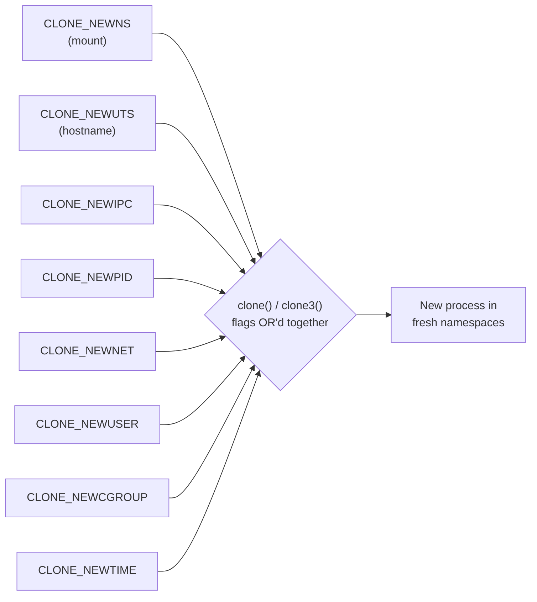

# Chapter 02 — The Linux toolbox

> There is no `container()` system call. What Docker sells as one seamless thing is
> really a small drawer of unrelated kernel features, each with its own history and
> its own syscall. This chapter is the map: a quick, honest tour of every tool in the
> drawer, what it does, and which later chapter picks it up and swings it. Shallow on
> purpose — depth comes later.

## What you'll learn

- The four questions a container has to answer — **see / use / run-from / allowed** —
  and which kernel feature answers each.
- All eight namespace types by name, plus cgroups, capabilities, seccomp, LSMs, and
  overlay filesystems, in one sentence each.
- The handful of **syscalls** that actually expose these features: `clone`, `unshare`,
  `setns`, `mount`, `pivot_root`, `prctl`, `capset`, `seccomp`.
- Where Go plugs into all this (`syscall.SysProcAttr.Cloneflags`) — the hook we start
  pulling on in chapter [05](05-building-a-container-in-go.md).

Keep the [README](../README.md)'s four-questions table open in another tab; this
chapter is where those four questions get their tools.

---

## The toolbox at a glance

Everything below fits into the same mental frame from chapter
[01](01-what-is-a-container.md): a container is one ordinary process that the kernel
has agreed to lie to. Each tool controls a *different lie*.

| Question the container asks | Tool | Exposed by | Deep dive |
| --- | --- | --- | --- |
| What can I **see**? | namespaces | `clone` / `unshare` / `setns` + `CLONE_NEW*` | [03](03-namespaces.md) |
| How much can I **use**? | cgroups | the `cgroup2` pseudo-filesystem (no dedicated syscall) | [04](04-cgroups.md) |
| What do I **run from**? | overlayfs + `pivot_root` | `mount`, `pivot_root` | [06](06-rootfs-and-images.md) |
| What am I **allowed to do**? | capabilities · seccomp · LSMs | `capset`, `prctl`, `seccomp` (+ policy files) | [08](08-security-and-hardening.md) |

Notice the asymmetry already: **namespaces and root-filesystem tricks are real
syscalls**, cgroups is a *filesystem you write text into*, and LSMs are *policy the
kernel enforces on your behalf*. "Container" glues these very different interfaces
together and hides the seams.

---

## The kernel features

### Namespaces — what a process can *see*

A namespace wraps one global kernel resource and hands the process a private copy of
it. Unshare all of them and the process gets its own hostname, its own PID 1, its own
network stack, its own mount table — a convincing little world. There are **eight**,
each with a `CLONE_NEW*` flag:

| Namespace | Flag | Isolates |
| --- | --- | --- |
| mount (`mnt`) | `CLONE_NEWNS` | the set of filesystem mounts |
| UTS | `CLONE_NEWUTS` | hostname and NIS domain name |
| IPC | `CLONE_NEWIPC` | System V IPC, POSIX message queues |
| PID | `CLONE_NEWPID` | the process-ID number space (its own PID 1) |
| network (`net`) | `CLONE_NEWNET` | interfaces, routes, ports, firewall rules |
| user | `CLONE_NEWUSER` | UID/GID mappings — the basis of *rootless* containers |
| cgroup | `CLONE_NEWCGROUP` | the process's view of the cgroup hierarchy root |
| time | `CLONE_NEWTIME` | the `CLOCK_MONOTONIC` / `CLOCK_BOOTTIME` offsets |

Two footnotes worth remembering: the mount-namespace flag is confusingly named
`CLONE_NEWNS` (it was the *first* namespace, back in Linux 2.4.19, so it just got
"NS"). And the two newest — cgroup and time — arrived in Linux **4.6** and **5.6**
respectively, which is why some old tutorials only list six. Full treatment with
runnable `unshare(1)` demos in chapter [03](03-namespaces.md).

### cgroups — how much a process can *use*

Namespaces limit *visibility*; **control groups** limit *consumption*. A cgroup is a
node in a tree that accounts for and caps a process's CPU time, memory, PID count,
and block-I/O bandwidth. On a modern system you drive it through the **cgroup v2**
unified hierarchy mounted at `/sys/fs/cgroup`: you create a directory, echo limits
into files like `memory.max` and `pids.max`, and write a PID into `cgroup.procs`.
This is why the mapping table above has no syscall for cgroups — the interface *is*
the filesystem. Chapter [04](04-cgroups.md) makes a process actually hit its memory
ceiling and get OOM-killed.

### Capabilities — slicing up root

Traditionally UID 0 could do everything. **Capabilities** shatter that monolithic
power into roughly **40** independent bits, so a process can hold exactly the
privileges it needs and no more. A few you'll meet again:

- `CAP_SYS_ADMIN` — the "kitchen sink" (mounting, `pivot_root`, and much more).
- `CAP_NET_ADMIN` — configure interfaces, routes, firewall.
- `CAP_NET_BIND_SERVICE` — bind to ports below 1024.
- `CAP_CHOWN`, `CAP_SETUID`, `CAP_SYS_BOOT`, `CAP_SYS_TIME` — chown any file, change
  UID, reboot, set the clock.

Docker starts a container with a *reduced* set (dropping things like `CAP_SYS_ADMIN`
and `CAP_SYS_BOOT`), which is a large part of why "root inside the container" is far
less dangerous than root on the host. See `man 7 capabilities` for the full list;
chapter [08](08-security-and-hardening.md) drops some.

### seccomp — filtering syscalls

**seccomp** (secure computing) lets a process install a **BPF** program that the
kernel runs on *every* syscall the process makes, deciding to allow it, fail it with
an errno, or kill the process. Docker's default profile allows most syscalls but
blocks a few dozen dangerous ones (`keyctl`, `mount`, `reboot`, older `clone`
variants…). It's a syscall-level firewall, and it composes with capabilities:
capabilities say *who you are*, seccomp says *which system calls you may even
attempt*. More in chapter [08](08-security-and-hardening.md).

### LSMs — mandatory access control

**Linux Security Modules** are a kernel hook framework that lets a security policy
veto operations the normal permission checks would have allowed. The two you'll see
in the container world are **AppArmor** (path-based rules; Ubuntu/Debian ship a
`docker-default` profile) and **SELinux** (label-based; the Fedora/RHEL default).
Both implement *mandatory* access control — the policy is set by the administrator
and a process cannot opt out of it, unlike ordinary file permissions it "owns."
You don't "call" an LSM; you configure a profile and the kernel enforces it. Touched
on in chapter [08](08-security-and-hardening.md).

### Union / overlay filesystems — layered images

A Docker image is a stack of read-only layers. **overlayfs** is the kernel filesystem
that makes that stack look like one directory: you give it `lowerdir` (the read-only
layers, bottom to top), an `upperdir` (a writable scratch layer), and a `workdir`,
and it presents a single **merged** mount. Writes go to the upper layer using
**copy-on-write**, so the shared base layers stay pristine and can back hundreds of
containers at once. This is how images stay small and start fast. Chapter
[06](06-rootfs-and-images.md) builds a layered rootfs by hand.

### pivot_root / chroot — swapping the root filesystem

Having assembled a root filesystem, the container has to actually *move into* it.

- **`chroot`** changes a process's idea of `/` to a subdirectory. It's simple, old,
  and — crucially — **not a security boundary**: a process with the right privileges
  can climb back out.
- **`pivot_root`** is the grown-up version. Inside a private mount namespace it swaps
  the *root mount itself*, then lets you unmount the old root entirely so there's no
  path back to the host filesystem. This is what real runtimes like `runc` use.

The difference (and why it matters) is the whole first half of chapter
[06](06-rootfs-and-images.md).

---

## The syscalls

The features above are abstractions; these are the actual system calls that turn them
on. This is the vocabulary the Go code in later chapters speaks.

| Syscall | What it does | Its role in a container |
| --- | --- | --- |
| `clone(2)` / `clone3(2)` | create a new process, with fine-grained control over what's shared | the birth of the container process; `CLONE_NEW*` flags request fresh namespaces at creation time |
| `unshare(2)` | move the **calling** process into new namespaces, no new process | "join namespaces after the fact"; also the `unshare(1)` CLI you'll use in ch03 |
| `setns(2)` | attach the caller to an **existing** namespace via an fd | how `docker exec` / `nsenter` step *into* a running container |
| `mount(2)` | mount, bind, remount, or change propagation of a filesystem | mount overlayfs, mount a private `/proc`, make mounts private before `pivot_root` |
| `pivot_root(2)` | swap the root mount of the current mount namespace | enter the container image and abandon the host root |
| `prctl(2)` | miscellaneous per-process knobs | `PR_SET_NO_NEW_PRIVS` locks out setuid privilege escalation — a prerequisite for unprivileged seccomp |
| `capset(2)` | set the capability sets of a process | drop the dangerous capabilities you don't want the container to keep |
| `seccomp(2)` | install a BPF syscall filter | apply the syscall allow/deny policy |

Three of these are worth a second look:

- **`clone` vs `unshare`.** `clone` makes a *new* process already inside new
  namespaces — that's what a runtime does to launch a container. `unshare` moves an
  *existing* process into new namespaces. (Subtlety for later: `unshare` with
  `CLONE_NEWPID` doesn't move the caller into a new PID namespace — its *children*
  are the first to land there. Chapter [03](03-namespaces.md) explains why.)
- **`clone3`** is the modern extensible form, taking a `struct clone_args` instead of
  a fixed argument list. It unlocks conveniences like `CLONE_INTO_CGROUP` (spawn
  directly into a target cgroup). The classic `CLONE_NEW*` flags work with both.
- **Order matters.** A real runtime calls these in a careful sequence — new
  namespaces, then mounts, then `pivot_root`, then `PR_SET_NO_NEW_PRIVS`, then drop
  capabilities, then `seccomp`, *then* `execve` the payload. Do it in the wrong order
  and you either can't set something up or you leave a hole open. The README's big
  sequence diagram is exactly this order; chapter [05](05-building-a-container-in-go.md)
  writes it out in Go.

### The `CLONE_NEW*` flag family

The namespace flags aren't separate calls — they're bits OR'd together into the one
`clone()` (or `unshare()`) call. Turn on the bits for the worlds you want private:



### Where Go grabs the wheel

You almost never call `clone` directly in Go — the runtime forbids raw `fork` because
a Go program is multi-threaded and a bare fork would leave the scheduler and GC
half-copied and broken (the [step3-reexec](../src/step3-reexec/main.go) comments walk
through this). Instead you hand the clone flags to the standard library and let
`os/exec` do the `clone`+`exec` for you:

```go
cmd := exec.Command("/proc/self/exe", append([]string{"child"}, args...)...)
cmd.SysProcAttr = &syscall.SysProcAttr{
    Cloneflags: syscall.CLONE_NEWUTS | syscall.CLONE_NEWPID | syscall.CLONE_NEWNS,
}
```

`SysProcAttr.Cloneflags` is the single hook through which everything in chapter
[03](03-namespaces.md) becomes real code. We pull hard on it in chapter
[05](05-building-a-container-in-go.md).

---

## See the toolbox yourself

You don't have to wait for the build chapters to meet these tools — most ship with any
Linux install. None of these change anything permanently:

```console
$ lsns                 # list every namespace on the host and who's in it
$ capsh --print        # show the capabilities of your current shell
$ ls /sys/fs/cgroup    # the cgroup v2 controllers, as files
$ cat /proc/self/status | grep -i seccomp   # is this process seccomp-filtered?
```

And a genuinely safe one-liner that spins up a throwaway UTS namespace — change its
hostname, exit, and the host's hostname is untouched:

```console
$ sudo unshare --uts sh -c 'hostname toolbox && hostname'
toolbox
$ hostname              # back on the host — unchanged
your-real-hostname
```

That is the entire magic trick in one command. Every remaining chapter is just doing
this deliberately, in Go, for all eight namespaces at once — and then locking the
doors behind it.

---

## Recap

- A container isn't a kernel object; it's a **bundle of independent features** glued
  together: namespaces, cgroups, capabilities, seccomp, LSMs, and overlay/`pivot_root`.
- Those features map cleanly onto the four questions — **see** (namespaces), **use**
  (cgroups), **run from** (overlayfs + `pivot_root`), **allowed** (capabilities,
  seccomp, LSMs).
- The interfaces are deliberately uneven: real syscalls for namespaces and root
  swapping, a *filesystem* for cgroups, and *policy files* for LSMs.
- The core syscalls to remember are `clone`/`clone3`, `unshare`, `setns`, `mount`,
  `pivot_root`, `prctl`, `capset`, and `seccomp` — and **order matters**.
- In Go you reach the namespace flags through `syscall.SysProcAttr.Cloneflags`, the
  hook the build chapters live on.

*Next → [Chapter 03: Namespaces](03-namespaces.md)*
