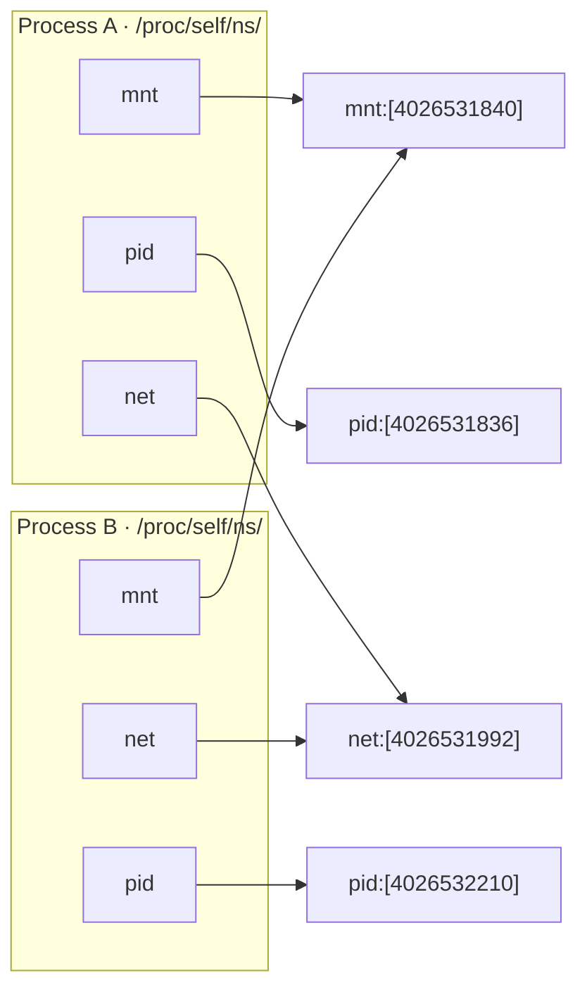
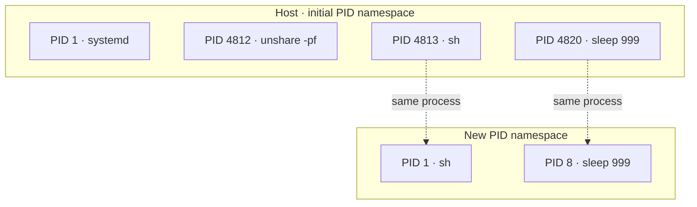

# Chapter 03 — Namespaces

> Namespaces are the kernel's answer to the first of our four questions: *what can a
> process see?* Each one takes a global resource — the hostname, the process table, the
> network stack — and hands the processes inside it a private copy. Nothing is emulated
> and nothing is copied on disk; the kernel simply keeps a second set of books and shows
> your process only its page.

## What you'll learn

- The one idea behind every namespace: wrap a global resource so a group of processes
  sees its own isolated instance of it.
- How the three syscalls fit together — `unshare(2)` creates and joins, `setns(2)` joins
  an existing one, `clone(2)` starts a child already inside new ones — and how
  `/proc/<pid>/ns/*` are the handles that name them.
- All **eight** namespace types: what each isolates, the one subtlety that bites people,
  and a `unshare(1)`/`nsenter(1)` demo you can paste into a terminal.
- Why PID 1 inside a container is special, and why a process can be root *inside* a user
  namespace while staying unprivileged outside.

---

## The core idea

A **namespace** partitions one kind of global kernel resource so that processes in
different namespaces see different, independent instances of it. "Global" is the word
that matters. On a plain Linux box there is exactly *one* hostname, *one* process table,
*one* network stack, *one* mount table — and every process shares them. A namespace
breaks that monopoly: put a process in a new UTS namespace and it gets its own hostname,
which it can change without the host ever noticing.

Crucially, a namespace is not attached to a process — it is an object with its own
lifetime, and processes *point at it*. That's what the magic directory
`/proc/<pid>/ns/` exposes: one symbolic link per namespace type, each naming the object
that process currently belongs to.

```console
$ ls -l /proc/self/ns/
lrwxrwxrwx 1 you you 0 ... cgroup -> 'cgroup:[4026531835]'
lrwxrwxrwx 1 you you 0 ... ipc    -> 'ipc:[4026531839]'
lrwxrwxrwx 1 you you 0 ... mnt    -> 'mnt:[4026531832]'
lrwxrwxrwx 1 you you 0 ... net    -> 'net:[4026531833]'
lrwxrwxrwx 1 you you 0 ... pid    -> 'pid:[4026531836]'
lrwxrwxrwx 1 you you 0 ... time   -> 'time:[4026531834]'
lrwxrwxrwx 1 you you 0 ... user   -> 'user:[4026531837]'
lrwxrwxrwx 1 you you 0 ... uts    -> 'uts:[4026531838]'
```

The number in brackets is the namespace's **inode**. Two processes whose `net` links show
the same inode share a network stack; two whose inodes differ are isolated. That single
comparison is the whole test for "are these in the same namespace?" — and it's how
`docker inspect` and `ip netns` figure out who lives where.

Three syscalls move a process between namespaces:

| Syscall | What it does | Typical caller |
| --- | --- | --- |
| `clone(2)` | start a **child** already inside new namespaces (pass `CLONE_NEW*` flags) | a runtime spawning a container process |
| `unshare(2)` | **create** new namespaces and move the **caller** into them | the `unshare(1)` tool; a process "leaving" a shared resource |
| `setns(2)` | **join** an existing namespace, given an open fd to a `.../ns/*` link | `nsenter(1)`, `docker exec` |

The link between two processes and the namespace objects they point at looks like this —
here Process A and B share their mount and network namespaces but each has its own PID
namespace:



A namespace stays alive as long as *something* references it: a member process, an open
fd, or a bind-mount of its `/proc/<pid>/ns/*` link. That last trick is how `ip netns add`
makes a network namespace persist with no process living in it. When the final reference
goes away, the kernel tears the namespace down.

You can hold a whole conversation about isolation with just `unshare(1)` (create + run a
command in new namespaces) and `nsenter(1)` (enter another process's namespaces). The
rest of this chapter is eight short demos built from exactly those two tools.

---

## The eight namespaces at a glance

| Namespace | `clone` flag | Isolates | `unshare(1)` | Since |
| --- | --- | --- | --- | --- |
| Mount | `CLONE_NEWNS` | the mount table (filesystem tree) | `-m` | 2.4.19 (2002) |
| UTS | `CLONE_NEWUTS` | hostname + NIS domain name | `-u` | 2.6.19 (2006) |
| IPC | `CLONE_NEWIPC` | System V IPC + POSIX message queues | `-i` | 2.6.19 (2006) |
| PID | `CLONE_NEWPID` | process ID number space | `-p` | 2.6.24 (2008) |
| Network | `CLONE_NEWNET` | interfaces, routes, ports, firewall | `-n` | 2.6.24–.29 (2008) |
| User | `CLONE_NEWUSER` | UID/GID mappings + capabilities | `-U` | 3.8 (2013) |
| Cgroup | `CLONE_NEWCGROUP` | the cgroup root a process sees | `-C` | 4.6 (2016) |
| Time | `CLONE_NEWTIME` | `CLOCK_MONOTONIC` / `CLOCK_BOOTTIME` | `-T` | 5.6 (2020) |

> ⚠️ Every demo below except the **user** one needs root, so they're prefixed with `sudo`.
> None are destructive — they change only the throwaway namespace they create — but run
> them in a VM anyway, per the guide's house rules.

### Mount (`CLONE_NEWNS`) — the mount table

The oldest namespace, shipped in 2002, and confusingly named: `NEWNS` predates the word
"namespace," so the *mount* namespace is the one without a resource in its flag name. It
isolates the list of mount points — the filesystem tree itself. Inside a new mount
namespace you can `mount`, `umount`, and `pivot_root` without the host seeing any of it,
which is precisely what a container needs to swap in its own root filesystem (chapter
[06](06-rootfs-and-images.md)).

The subtlety that bites everyone is **mount propagation**. A new mount namespace starts
as a *copy* of the parent's mounts, and each mount carries a propagation type that decides
whether later mount/unmount events cross the boundary:

| Propagation | Meaning |
| --- | --- |
| `shared` | events propagate both ways between peers (the modern default on many distros) |
| `private` | events propagate neither way |
| `slave` | events flow parent → child only, never back |
| `unbindable` | like private, and cannot be bind-mounted |

Because the tree starts as `shared`, a naive new namespace can leak its mounts straight
back to the host. That's why real runtimes (runc, systemd) begin by recursively marking
everything **private** — `mount("", "/", NULL, MS_REC | MS_PRIVATE, NULL)` — so nothing
the container mounts escapes:

```console
$ sudo unshare -m sh
# mount --make-rprivate /            # stop mounts leaking back to the host
# mount -t tmpfs none /mnt           # a private tmpfs...
# grep ' /mnt ' /proc/self/mounts    # ...visible here
none /mnt tmpfs rw,relatime 0 0
# exit
$ grep ' /mnt ' /proc/self/mounts    # ...and gone from the host
$
```

### UTS — hostname and NIS domain

UTS is named after the `utsname` struct that `uname(2)` fills in. It isolates just two
strings: the **hostname** and the (largely vestigial) NIS/`domainname`. Small, but it's
why your container can call itself `web-01` without renaming your laptop.

```console
$ sudo unshare -u sh -c 'hostname container; hostname'
container
$ hostname
your-laptop
```

The change is real inside and invisible outside. To prove that a namespace is a joinable
object, start a long-lived one and hop into it from another shell with `nsenter`:

```console
$ sudo unshare -u --fork sh -c 'hostname isolated; sleep 600' &
$ pid=$!
$ sudo nsenter -t "$pid" -u hostname
isolated
```

### IPC — System V IPC and POSIX message queues

The IPC namespace partitions the System V IPC objects (message queues, semaphore sets,
shared-memory segments) and POSIX message queues. Two processes in different IPC
namespaces cannot reach each other's queues even if they guess the same key, and each
gets its own `/dev/mqueue`. Handy isolation for anything that leans on shared memory —
databases, for instance — since a stale segment in one container can't collide with
another's.

```console
$ sudo unshare -i sh -c 'ipcmk -Q >/dev/null; ipcs -q | tail -2'
0x... 0   root  644  0  0          # the new queue exists in here
$ ipcs -q
------ Message Queues --------      # ...but the host's list is untouched
key  msqid  owner  perms  used-bytes  messages
$
```

### PID — the process ID number space

The PID namespace gives its members a private numbering of processes starting at **1**.
The first process placed inside becomes **PID 1**, and PID 1 is special in three ways you
must respect or your container will misbehave:

1. **It reaps orphans.** When any process's parent dies, the process is re-parented to
   PID 1, which must `wait()` on it or the system leaks **zombies**. On a normal box
   `init`/`systemd` does this; in a container *your* PID 1 must.
2. **It has default signal handling disabled.** The kernel won't deliver a signal to PID 1
   unless it has installed a handler for it — so a PID 1 that ignores `SIGTERM` can't be
   `docker stop`-ped cleanly and gets `SIGKILL`ed after the timeout.
3. **Killing it tears down the namespace.** When PID 1 exits, the kernel sends `SIGKILL`
   to every other process in that namespace. Kill the container's `init` and the whole
   container dies with it.

PID namespaces **nest**, and a process has a *different PID at every level it belongs to*.
The `sleep` below is PID 8 inside the new namespace but PID 4820 to the host:



Two flags on the demo matter. `unshare(2)` with `CLONE_NEWPID` does **not** move the
caller — it can't, a process's PID can't change under it — it only puts *future children*
in the new namespace (that's the `pid_for_children` link you'll see in `/proc/self/ns/`).
So you need `-f` to **fork** a child that becomes PID 1. And `--mount-proc` remounts
`/proc` inside a private mount namespace so `ps` reads the new namespace's process list
rather than the host's:

```console
$ sudo unshare -pf --mount-proc sh
# echo $$
1
# ps -e -o pid,comm
    PID COMMAND
      1 sh
      6 ps
```

An empty process list with your shell as PID 1 — that `ps` output is the "aha" moment of
the whole guide in miniature.

### Network (`netns`) — interfaces, routes, and firewall

A network namespace gets its **own** everything network: interfaces, routing tables,
ARP/neighbor tables, socket port space, and `netfilter`/`iptables` rules. A fresh one is
almost bare — a single `lo` loopback, and even that starts **DOWN**:

```console
$ sudo unshare -n ip addr
1: lo: <LOOPBACK> mtu 65536 qdisc noop state DOWN group default qlen 1000
    link/loopback 00:00:00:00:00:00 brd 00:00:00:00:00:00
```

That's it — no `eth0`, no default route, no connectivity. Giving the container a working
network means *wiring* this empty namespace to the outside with a `veth` pair, a bridge,
and NAT. That plumbing is a chapter of its own — [07](07-networking.md) — so we'll leave
the namespace bare here and pick it up there.

### User (`CLONE_NEWUSER`) — UID/GID mappings

The user namespace is the strange and powerful one. It maps ranges of user and group IDs
so that a UID *inside* the namespace corresponds to a *different* UID outside. The payoff:
a process can be **root (UID 0) inside** while being an ordinary unprivileged user on the
host — which is exactly what makes **rootless containers** possible. It's also the only
namespace an unprivileged user can create unaided, so this is the one demo with no `sudo`:

```console
$ id
uid=1000(you) gid=1000(you) ...
$ unshare -U -r id
uid=0(root) gid=0(root) groups=0(root)
```

Inside you're root; outside that same process is still UID 1000 and can't touch anything
1000 couldn't. The mapping lives in two files the kernel exposes per process — each line
is `inside_id  outside_id  length`. The `-r` above is shorthand for "map my outside UID
to inside 0", a single-ID range:

```console
$ unshare -U -r sh -c 'cat /proc/self/uid_map; cat /proc/self/gid_map'
         0       1000          1
         0       1000          1
```

Real rootless runtimes map *ranges* (via `/etc/subuid`, `/etc/subgid`, and the setuid
helpers `newuidmap`/`newgidmap`) so the container has a whole span of UIDs to hand out,
not just one. The capability rules that make "root inside" safe — and the ways it can go
wrong — are a security topic, so we only introduce the mapping here and dig into it in
chapter [08](08-security-and-hardening.md).

### Cgroup (`CLONE_NEWCGROUP`) — the cgroup root

The cgroup namespace virtualizes what a process sees as the **root of the cgroup
hierarchy**. Without it, a containerized process reading `/proc/self/cgroup` sees its full
host path — say `/system.slice/docker-abc123.scope/...` — which leaks the host layout and
confuses tools that expect to sit at the top. With a cgroup namespace, that same path is
rewritten to be **relative to the namespace's root**, so the container sees a clean `/`
and can't peer at siblings above it.

```console
$ sudo unshare -C cat /proc/self/cgroup
0::/
```

It's a small, mostly cosmetic-looking isolation, but it matters for correctness: it lets a
container run its *own* cgroup manager (a nested systemd, say) without tripping over the
host's hierarchy. Resource *limits* themselves — the actual capping of CPU and memory —
are cgroups the subsystem, not this namespace, and get their own chapter
[04](04-cgroups.md).

### Time (`CLONE_NEWTIME`) — monotonic and boot-time clocks

The newest namespace (Linux 5.6, 2020) lets a namespace apply a per-clock **offset** to
`CLOCK_MONOTONIC` and `CLOCK_BOOTTIME`. The headline subtlety: it deliberately does **not**
virtualize `CLOCK_REALTIME`, the wall-clock time. Wall time stays global — you can't put a
container in 1999 — but you *can* make a container believe it booted long ago, which
matters chiefly for checkpoint/restore (CRIU), so a restored process doesn't see monotonic
time jump backwards.

```console
$ cat /proc/uptime
219.44 758.21
$ sudo unshare -T --boottime 86400 -- cat /proc/uptime
86619.38 758.21
```

The first field of `/proc/uptime` derives from `CLOCK_BOOTTIME`, and the `--boottime 86400`
offset adds a day to it — inside, the box "has been up" 24 hours longer. Like PID, the time
namespace's offsets apply to *children*, not the caller (hence a `time_for_children` link in
`/proc/self/ns/`), and `unshare -T` forks for you.

---

## How this maps onto a real container

A container isn't one namespace — it's a *bundle* created in a single `clone(2)` call. The
capstone runtime you'll build stacks most of these at once; concretely, `mini-docker`
([src/step7-mini-docker](../src/step7-mini-docker/main.go)) starts its child with roughly
`CLONE_NEWUTS | CLONE_NEWPID | CLONE_NEWNS | CLONE_NEWIPC | CLONE_NEWNET` (add
`CLONE_NEWUSER` to go rootless), then sets the hostname, mounts a private `/proc`, and
`pivot_root`s into an image. Every
one of those flags is a namespace you just met by hand. The Go mechanics — the
`/proc/self/exe` re-exec trick and `SysProcAttr.Cloneflags` — are chapter
[05](05-building-a-container-in-go.md); here you've built the intuition those lines depend
on.

---

## Recap

- A namespace wraps one **global** resource so its members see a private instance;
  processes *point at* namespace objects, whose handles are the `/proc/<pid>/ns/*` links
  and whose identity is an inode number.
- Three syscalls do the work: `clone(2)` starts a child in new namespaces, `unshare(2)`
  moves the caller into fresh ones, and `setns(2)` joins an existing one — surfaced by the
  `unshare(1)` and `nsenter(1)` tools you drove above.
- There are **eight** types — mount, UTS, IPC, PID, network, user, cgroup, time — each
  isolating a specific resource, each toggled by a `CLONE_NEW*` flag.
- **PID 1 is special**: it reaps orphans, has default signal handling off, and takes the
  whole namespace down when it exits — and PIDs nest, so one process has a different number
  at each level.
- The **user** namespace is the key to rootless containers: root inside, unprivileged
  outside, via UID/GID range maps — the security depth of that lands in chapter 08.

*Next → [Chapter 04: cgroups](04-cgroups.md)*
