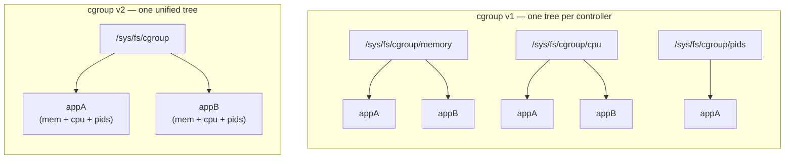
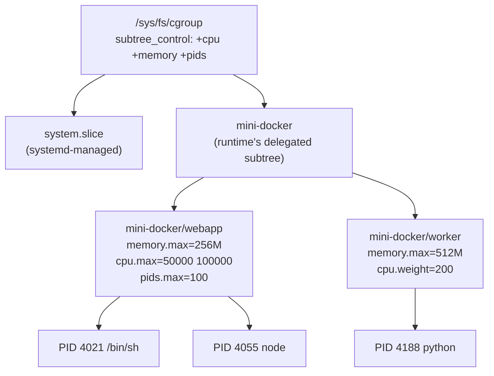

# Chapter 04 — cgroups

> Namespaces answered *what can this process **see**?* This chapter answers the other
> half of the isolation story: *how much can it **use**?* A process can be sealed
> inside its own PID, mount, and network namespaces and still fork-bomb your machine
> into the ground or eat every last byte of RAM. Namespaces limit *visibility*, not
> *consumption*. **Control groups** — cgroups — are the accountant and the bouncer:
> they meter what a process spends and slam the door when it goes over budget.

## What you'll learn

- Why namespaces alone can't stop a runaway process, and what cgroups add.
- The difference between **cgroup v1** (many hierarchies) and **cgroup v2** (one
  unified tree) — and a one-liner to tell which your host uses.
- That a cgroup is *just a directory*: you create it with `mkdir` and configure it by
  writing text into files like `memory.max`, `pids.max`, and `cpu.max`.
- A runnable demo where a fork bomb gets capped and a memory hog gets OOM-killed.
- Who really owns the cgroup tree on a modern distro (spoiler: **systemd**), and how a
  runtime carves out its own corner.

---

## The problem cgroups solve

Chapter [03](03-namespaces.md) gave our process a convincing private world. But
"private" is not "small." Consider the classic shell fork bomb:

```bash
:(){ :|:& };:
```

That defines a function `:` that calls itself twice and backgrounds both copies —
exponential process growth until the kernel's process table is exhausted and the
machine is unusable. Now run it *inside* a PID namespace. The namespace happily gives
those thousands of processes their own private PID numbers... and the host still dies,
because every one of them is a real task competing for real memory and real CPU on the
one shared kernel. Same story for memory: nothing in a mount or PID namespace stops
`malloc` from climbing until the **OOM killer** starts shooting host processes.

Isolation of *view* is not isolation of *resources*. A container that can't be
throttled isn't a container — it's a denial-of-service waiting to happen. cgroups are
the missing half.

> A cgroup does two jobs at once: **accounting** (how much CPU/memory/IO has this
> group used?) and **limiting** (it may not use more than X). The accounting is why
> `docker stats` can show you per-container numbers at all.

---

## v1 vs v2: two designs

cgroups have shipped in two incompatible generations. You need to recognize both,
because which one you get depends on the host.

**cgroup v1** (2008) organized controllers into **multiple independent hierarchies** —
one tree *per controller*. Each controller (`cpu`, `memory`, `pids`, `blkio`,
`devices`, `freezer`, `cpuset`, …) was mounted as its own filesystem under a
subdirectory:

```console
$ ls /sys/fs/cgroup            # on a v1 host
blkio  cpu  cpuacct  cpuset  devices  freezer  memory  net_cls  pids  ...
```

This was flexible to the point of confusing: a single process could sit in
`/sys/fs/cgroup/memory/foo` for memory but `/sys/fs/cgroup/cpu/bar` for CPU — different
groups in different trees. Coordinating limits across controllers meant keeping several
parallel hierarchies in sync by hand, and some controllers (memory vs. blkio) couldn't
cooperate at all.

**cgroup v2** (stable since Linux **4.5**, 2016) replaced all of that with a single
**unified hierarchy**: one tree rooted at `/sys/fs/cgroup`, where every controller acts
on the *same* set of groups. A process belongs to exactly **one** cgroup, full stop.
Controllers are turned on for a subtree by writing to its `cgroup.subtree_control`
file, and v2 enforces the **"no internal processes" rule**: a cgroup may hold processes
*or* have child cgroups with controllers enabled, but not both — leaves get the
processes, interior nodes do the organizing. This is now the default on essentially
every modern distro (anything with a recent systemd: Fedora 31+, Ubuntu 21.10+, Debian
11+, RHEL 9+).



There is also a **hybrid** mode, where the kernel mounts the v1 hierarchies *and* a v2
hierarchy (at `/sys/fs/cgroup/unified`) side by side. It exists for the awkward
transition years; you can mostly treat it as "v1 with a v2 mount bolted on."

### Which one am I on?

The fastest check is the filesystem *type* of the mount point:

```console
$ stat -fc %T /sys/fs/cgroup
cgroup2fs        # → pure cgroup v2 (what this guide targets)
```

| Output | Meaning |
| --- | --- |
| `cgroup2fs` | Unified **v2** — the modern default. |
| `tmpfs` | **v1** (or **hybrid**); the per-controller dirs are separate `cgroup` mounts under it. |

If you get `tmpfs`, you can usually switch a systemd host to pure v2 by booting with
the kernel parameter `systemd.unified_cgroup_hierarchy=1` and rebooting. The rest of
this chapter assumes **v2**.

---

## The interface *is* the filesystem

Here's the part that surprises people: **cgroups have no dedicated system call.** There
is no `cgroup_create()`. You manage everything through an ordinary pseudo-filesystem —
`mkdir` a directory to create a group, `rmdir` to destroy it, and `read`/`write` plain
text files to inspect and set limits. That's the whole API.

Let's cap a real shell. Run everything below **as root** (`sudo -i`), on a v2 host.

```console
# 1. Create a cgroup. It's just a directory — the kernel auto-populates the control files.
$ mkdir /sys/fs/cgroup/demo
$ ls /sys/fs/cgroup/demo
cgroup.controllers  cgroup.procs  cgroup.subtree_control  memory.stat  ...

# 2. Enable the controllers we want in this *parent* subtree, so children can use them.
#    (Note the leading '+'. This is written on the PARENT, not on demo/.)
$ echo '+memory +pids' > /sys/fs/cgroup/cgroup.subtree_control

# 3. Set limits by writing into demo/'s control files.
$ echo 104857600 > /sys/fs/cgroup/demo/memory.max   # 100 MB hard cap (bytes)
$ echo 20        > /sys/fs/cgroup/demo/pids.max      # at most 20 tasks

# 4. Move THIS shell into the cgroup. $$ is the shell's own PID.
$ echo $$ > /sys/fs/cgroup/demo/cgroup.procs

# Confirm we're in:
$ cat /proc/self/cgroup
0::/demo
```

Every process this shell forks now inherits `/demo` and lives under the same 100 MB /
20-task budget. Time to poke it.

**pids.max in action — the fork bomb that fizzles:**

```bash
# Still inside the capped shell. This tries to explode, but pids.max=20 refuses
# to let the kernel create task #21: fork() returns EAGAIN instead of succeeding.
:(){ :|:& };:
# → "sh: fork: retry: Resource temporarily unavailable"
```

Instead of taking the host down, the bomb hits a ceiling almost instantly. The kernel
returns `EAGAIN` from `fork(2)` / `clone(2)` the moment the group is at its task limit.
Nothing outside `/demo` even notices.

**memory.max in action — the OOM kill:**

```bash
# Try to allocate ~200 MB inside a 100 MB group.
tail /dev/zero            # reads zeros forever, growing its memory
# → "Killed"
```

When usage would cross `memory.max`, the kernel first tries to reclaim; if it can't, it
invokes the OOM killer **scoped to that cgroup** and kills a task *inside* `/demo` — not
a random victim on the host. You can watch the counter afterward:

```console
$ cat /sys/fs/cgroup/demo/memory.events
low 0
high 0
max 42
oom 1
oom_kill 1
```

`oom_kill 1` is the receipt: the group hit its limit once and one process was killed
for it.

**Cleaning up.** A cgroup can only be removed when it's empty, so move your shell back
to the root group first, then `rmdir`:

```console
$ echo $$ > /sys/fs/cgroup/cgroup.procs   # evacuate this shell to the root
$ rmdir /sys/fs/cgroup/demo               # rmdir, never rm -rf, on cgroupfs
```

> ⚠️ Never `rm -rf` a cgroup directory — the control files aren't real files and
> `rmdir(2)` is the only correct way to destroy a group. It fails with `EBUSY` if any
> task is still inside, which is a feature, not a bug.

---

## The controllers you'll actually use

A container runtime typically configures four of them. Everything is bytes, counts, or
microseconds — no magic units.

| Controller | Key file(s) | What it does | Example |
| --- | --- | --- | --- |
| **memory** | `memory.max` | Hard cap in bytes. Crossing it triggers reclaim, then a cgroup-scoped OOM kill. | `echo 104857600 > memory.max` |
| | `memory.high` | *Soft* cap: over this, the kernel throttles and reclaims aggressively but doesn't kill. A pressure valve. | `echo 90M > memory.high` |
| **cpu** | `cpu.max` | Bandwidth as `"<quota> <period>"` in µs. `50000 100000` = 50 000 µs of CPU per 100 000 µs = **50% of one core**. `max` = unlimited. | `echo "50000 100000" > cpu.max` |
| | `cpu.weight` | Proportional share (1–10000, default 100) when there's contention. Weight, not a cap: it only matters when the CPU is busy. | `echo 200 > cpu.weight` |
| **pids** | `pids.max` | Maximum number of tasks (processes + threads) in the group. The anti-fork-bomb. | `echo 20 > pids.max` |
| **io** | `io.max` | Block-I/O throttling per device, keyed by `major:minor`, e.g. read/write bytes and IOPS ceilings. | `echo "8:0 rbps=1048576" > io.max` |

A couple of things worth internalizing:

- **`cpu.max` is a quota, `cpu.weight` is a priority.** A quota is an absolute ceiling
  that applies even on an otherwise idle machine; a weight only redistributes CPU when
  processes are actually competing for it. Docker's `--cpus=1.5` compiles down to a
  `cpu.max` quota; `--cpu-shares` maps to `cpu.weight`.
- **`memory.high` vs `memory.max`.** `high` is the humane knob — it slows a greedy
  process down with reclaim and stalls, giving it a chance to behave. `max` is the hard
  wall with the OOM killer behind it. Good runtimes often set both.

---

## Putting limits and processes on one tree

Here's the shape of what a runtime actually builds: a small subtree it owns, with
limits annotated on the leaves and the container's processes assigned to them.



Each leaf cgroup holds the processes of one container; the limits on that leaf are the
container's resource contract. Add a process to a group by writing its PID to that
group's `cgroup.procs`, exactly as we did by hand above — and because children inherit
their parent's cgroup, moving the container's PID 1 in captures its whole tree.

---

## Who owns the tree: systemd and delegation

On a modern Linux box you do **not** own `/sys/fs/cgroup` — **systemd** does. It's the
cgroup manager for the whole machine, organizing everything into `.slice`, `.service`,
and `.scope` units (that's what `system.slice` in the diagram above is). If two
managers write to the same tree without coordinating, they fight and corrupt each
other's accounting.

So container runtimes don't scribble at the root. Instead systemd **delegates** a
subtree to the runtime, handing it a branch it may manage freely while systemd keeps
its hands off. `runc` supports two drivers for this — the `systemd` cgroup driver
(politely asks systemd to create a transient scope) and the `cgroupfs` driver (writes
the files directly, appropriate when there's no systemd, e.g. inside minimal
containers). This is why production runtimes and systemd coexist instead of colliding.

One more connection back to chapter [03](03-namespaces.md): the **cgroup namespace**
(`CLONE_NEWCGROUP`) virtualizes a process's *view* of the tree, so a container that
lives at `/sys/fs/cgroup/mini-docker/webapp` on the host sees its own cgroup as the
root (`0::/`). It doesn't change the limits at all — it just hides the host's directory
layout from the workload, so nothing inside can tell (or care) where in the real tree
it was placed.

---

## From filesystem to Go

Everything in this chapter was `mkdir`, `echo`, and `cat`. That maps *directly* to
code — there's no exotic syscall to wrap, just file I/O. In chapter
[06](06-rootfs-and-images.md) the [step6-cgroups](../src/step6-cgroups/main.go) program
does exactly what you did by hand: it `os.Mkdir`s a group under `/sys/fs/cgroup`,
`os.WriteFile`s `+memory +pids` into the parent's `cgroup.subtree_control`, writes
`memory.max` and `pids.max`, and drops the container's PID into `cgroup.procs` — then
the capstone [step7-mini-docker](../src/step7-mini-docker/main.go) folds those limits
in alongside the rootfs so `run /bin/sh` starts a process that genuinely *cannot* use
more than 100 MB of RAM. We're not writing that Go here — chapters
[05](05-building-a-container-in-go.md) and [06](06-rootfs-and-images.md) do — but now
you know every line of it is just the terminal session above, in a loop.

---

## Recap

- Namespaces isolate what a process can **see**; cgroups limit what it can **use**.
  Without cgroups, an isolated process can still fork-bomb or exhaust host memory.
- **cgroup v1** = many independent per-controller hierarchies (flexible, confusing);
  **cgroup v2** = one unified tree with a single group per process, the "no internal
  processes" rule, and the modern systemd default.
- Check with `stat -fc %T /sys/fs/cgroup`: `cgroup2fs` means v2, `tmpfs` means v1 or
  hybrid.
- A cgroup is a **directory**; you `mkdir` it, enable controllers via the parent's
  `cgroup.subtree_control`, write limits into files (`memory.max`, `pids.max`,
  `cpu.max`, `io.max`), and assign a process by writing its PID to `cgroup.procs`.
- **systemd owns the tree** on most distros and **delegates** a subtree to runtimes;
  the cgroup namespace hides the host path from the workload.

*Next → [Chapter 05: Building a container in Go](05-building-a-container-in-go.md)*
