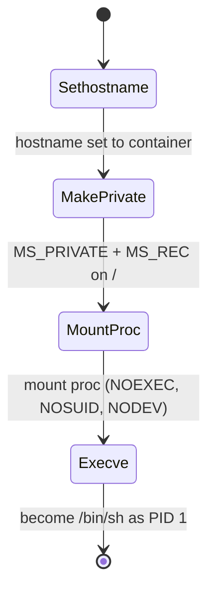

# Chapter 05 — Building a container in Go

> This is the chapter where the illusion stops being theory. We take the kernel
> features from [namespaces](03-namespaces.md) and turn them into a program that
> runs a shell you can't tell apart from a real container — in about forty lines
> of Go per step. By the end, `/bin/sh` will think it is PID 1 on a host named
> `container`, with a `/proc` that shows nothing but itself.

## What you'll learn

- Why "a container is just a process" is literally true, and how `exec.Command`
  is your entire runtime until you ask for more.
- How to place a child in a new namespace with `SysProcAttr.Cloneflags` — and
  why setting a flag isn't enough to *configure* that namespace.
- The **`/proc/self/exe` re-exec trick**: why Go's multithreaded runtime forbids
  a bare `fork()`, and how re-execing yourself sidesteps it cleanly.
- How to become PID 1 (`CLONE_NEWPID`) and mount a private `/proc`
  (`CLONE_NEWNS`) so `ps` tells the truth about the container.
- Where this is heading: pivot_root, cgroups, and the mini-docker capstone.

> ⚠️ **Linux and root only.** Every program here calls `clone(2)` and friends.
> It will not compile — let alone run — on macOS or Windows (that's a lesson, not
> a bug; see [11](11-macos-isolation.md) and [12](12-windows-isolation.md)).
> Creating namespaces needs `CAP_SYS_ADMIN`, so you run these with `sudo` until
> user namespaces let us go rootless in [chapter 08](08-security-and-hardening.md).
> Use a throwaway VM, not your daily driver.

The four programs in this chapter live under [`src/`](../src/README.md) as
`step1-exec` through `step4-pid-and-proc`. Read them open in one pane and this
chapter in the other — every excerpt below is quoted faithfully from the real
code.

---

## Step 1 — A container is a process

Before you can isolate something, you need a something. [`src/step1-exec`](../src/step1-exec/main.go)
does the least a runtime can do: run a command with its standard streams wired to
yours, and no isolation whatsoever.

```go
// exec.Command builds the child; we forward our own stdio so the program
// behaves like a normal shell would when launching a subprocess.
cmd := exec.Command(args[0], args[1:]...)
cmd.Stdin = os.Stdin
cmd.Stdout = os.Stdout
cmd.Stderr = os.Stderr

// Run blocks until the child exits. There is no fork/exec magic here yet —
// this is exactly what your shell does when you type a command.
if err := cmd.Run(); err != nil {
	fmt.Fprintf(os.Stderr, "[step1] child exited with error: %v\n", err)
	os.Exit(1)
}
```

That is the whole runtime. `exec.Command` builds a `*exec.Cmd`; assigning
`os.Stdin`/`os.Stdout`/`os.Stderr` forwards your terminal to the child; `cmd.Run()`
does `fork`+`execve` under the hood and blocks until the child exits. Run it:

```console
$ go build -o ../bin/step1-exec .
$ ./step1-exec run /bin/sh
[step1] running [/bin/sh] as a plain child process (no isolation)
```

Inside that shell, `hostname`, `ps aux`, and `ls /` are **identical to the host**.
There is no wall yet — only a process. The entire rest of the guide is about
progressively narrowing what this process can see. Notice, too, that step 1
needs no `sudo`: launching an ordinary child is an ordinary, unprivileged act.

---

## Step 2 — The first namespace (UTS)

[`src/step2-uts-namespace`](../src/step2-uts-namespace/main.go) changes exactly
one thing. It reaches past Go's tidy API into the raw `clone(2)` flags via
`SysProcAttr`:

```go
// The one new line compared to Step 1. SysProcAttr lets us reach the
// low-level clone(2) flags Go uses to create the child. CLONE_NEWUTS puts
// the child (and only the child) into a brand-new UTS namespace.
cmd.SysProcAttr = &syscall.SysProcAttr{
	Cloneflags: syscall.CLONE_NEWUTS,
}
```

`UTS` ("UNIX Time-sharing System") is the namespace that owns the hostname and
NIS domain name — the simplest of the eight, and a perfect first taste. A new UTS
namespace starts life as a **copy** of the parent's, but it is independent and
writable. That copy-then-diverge behaviour is the essence of *every* namespace.
Prove it to yourself:

```console
$ go build -o ../bin/step2-uts-namespace .
$ sudo ./step2-uts-namespace run /bin/sh
# inside the shell:
#   hostname                 -> same as host (it's a copy)
#   hostname isolated-box    -> change it
#   hostname                 -> isolated-box
# now in ANOTHER terminal on the host:
#   hostname                 -> UNCHANGED. The child's change was private.
```

But there is a catch, and it is the whole reason step 3 exists. We set the clone
flag on the command, so the moment the child is born it **immediately becomes
`/bin/sh`**. We never get a chance to run our own code inside the new namespace —
to, say, set the hostname to `container` *before* the shell starts. To configure
a namespace, we need to run inside it first. That is a harder problem than it
looks, and it is where Go's runtime gets in our way.

---

## Step 3 — The re-exec trick

Here is the instinct: fork, and in the child, set the hostname, then exec the
target. In C that works. **In Go it does not**, and understanding why is the most
important idea in this chapter.

A Go program is aggressively multithreaded before your `main` even runs: the
scheduler, the garbage collector, and the network poller all live on their own OS
threads. A raw `fork()` copies **only the calling thread** into the child. The
other threads simply don't exist there — but the runtime's data structures still
believe they do, mid-flight, holding locks that will never be released. The child
inherits a half-initialized, deadlock-prone runtime. Any allocation, any channel,
any `go` statement can wedge. This is why Go gives you no `syscall.Fork` that
returns twice, and it's why the standard library is careful to only ever
`fork`+`exec` in one atomic step.

The workaround is the **re-exec pattern**: don't run child logic in a forked copy
of a broken runtime — start a *brand new* runtime that is already inside the
namespaces. The parent re-executes its own binary with a sentinel argument, and
the clone flags are applied by that very exec:

```
parent:  run   -> exec /proc/self/exe child <cmd...>   (with clone flags)
child:   child -> configure namespace, then exec <cmd...>
```

The dispatcher in [`src/step3-reexec`](../src/step3-reexec/main.go) now has two
doors — one for the user, one for ourselves:

```go
switch os.Args[1] {
case "run":
	// Called by the user. Sets up namespaces and re-execs ourselves.
	run(os.Args[2:])
case "child":
	// Called by us (via /proc/self/exe). Runs INSIDE the new namespace.
	child(os.Args[2:])
}
```

`run` builds the re-exec. `/proc/self/exe` is a magic symlink the kernel maintains
to the currently-running executable, so we never have to know our own path on
disk:

```go
// "/proc/self/exe" always points at the currently-running executable, so we
// don't need to know our own path. We prepend "child" as the sub-command.
cmd := exec.Command("/proc/self/exe", append([]string{"child"}, args...)...)
cmd.SysProcAttr = &syscall.SysProcAttr{
	Cloneflags: syscall.CLONE_NEWUTS,
}
```

Because the clone flags decorate *this* exec, the new process boots its fresh Go
runtime **already inside** the new UTS namespace. Now `child` finally gets to run
our setup code where it matters:

```go
func child(args []string) {
	// This changes the hostname of OUR UTS namespace only. The host is untouched.
	must(syscall.Sethostname([]byte("container")))

	// Replace this process image with the user's command. syscall.Exec does not
	// return on success — the child *becomes* /bin/sh, inheriting our namespace,
	// hostname, and stdio. This is the same execve(2) a shell uses.
	must(syscall.Exec(args[0], args, os.Environ()))
}
```

Two subtleties worth internalizing. First, `syscall.Sethostname` here mutates
*our* UTS namespace only — the host name outside is untouched. Second,
`syscall.Exec` is `execve(2)`: on success **it does not return**. The process
keeps its PID but throws away its memory image and *becomes* `/bin/sh`, inheriting
the namespace, the new hostname, and our wired-up stdio. Our Go code has done its
job and steps offstage.

```console
$ go build -o ../bin/step3-reexec .
$ sudo ./step3-reexec run /bin/sh
[step3] parent pid=... — re-execing self as 'child' in a new UTS namespace
[step3] child pid=... — inside new UTS namespace, setting hostname
/ # hostname
container
```

Here is the full dance, with every actor visible:

```mermaid
sequenceDiagram
    autonumber
    participant U as User
    participant P as Parent
    participant K as Kernel
    participant C as Child
    Note over C: Child = re-exec of /proc/self/exe
    U->>P: run /bin/sh
    P->>K: exec /proc/self/exe child (Cloneflags=CLONE_NEWUTS)
    K-->>C: fresh Go runtime, already in new UTS ns
    C->>K: sethostname(container)
    C->>K: execve(/bin/sh)
    Note over C,K: child becomes /bin/sh; execve does not return
    C-->>U: interactive shell, hostname=container
    Note over P,C: parent's cmd.Run() blocks until child exits
```

---

## Step 4 — Its own process tree and its own `/proc`

A hostname is charming but harmless. [`src/step4-pid-and-proc`](../src/step4-pid-and-proc/main.go)
makes the container feel real by giving it its own **process tree** and its own
view of `/proc`. Two more clone flags:

```go
cmd.SysProcAttr = &syscall.SysProcAttr{
	// UTS: private hostname. PID: private process tree. NS: private mounts.
	Cloneflags: syscall.CLONE_NEWUTS |
		syscall.CLONE_NEWPID |
		syscall.CLONE_NEWNS,
}
```

`CLONE_NEWPID` makes the child **PID 1** in a fresh PID namespace; it can only see
processes it started. But there's a trap: `ps` and `top` don't ask the kernel for
process info directly — they *read `/proc`*. And `/proc` is still the host's,
mounted before we ever forked. A PID namespace with a stale `/proc` looks
completely unisolated. So the child rebuilds `/proc` from scratch:

```go
func child(args []string) {
	must(syscall.Sethostname([]byte("container")))

	// Step 1: stop our mounts from propagating back to the host. New mount
	// namespaces inherit "shared" propagation by default on modern distros; we
	// flip our whole tree to "private" so mount/umount events stay local.
	must(syscall.Mount("", "/", "", syscall.MS_PRIVATE|syscall.MS_REC, ""))

	// Step 2: mount a fresh procfs over /proc. Because we're in a new PID
	// namespace, this /proc shows only our processes. The flags mirror what
	// Docker uses to keep /proc from being an attack surface.
	const procFlags = syscall.MS_NOEXEC | syscall.MS_NOSUID | syscall.MS_NODEV
	must(syscall.Mount("proc", "/proc", "proc", procFlags, ""))

	must(syscall.Exec(args[0], args, os.Environ()))
}
```

That is why `CLONE_NEWNS` (a **mount** namespace — the "NS" name is a historical
accident, it predates the others) is essential here and not merely nice. Without
it, mounting a new `/proc` would clobber the host's `/proc` for every process on
the machine. With it, the child gets a private copy of the mount table, so the
mount is invisible outside. Three details in that function pay for themselves:

- **Make mounts private first.** Modern distros start new mount namespaces with
  `shared` propagation, meaning your mounts can *propagate back* to the host. The
  recursive `MS_PRIVATE|MS_REC` on `/` severs that link before you touch anything.
- **procfs reports the mounter's PID namespace.** This is the magic that makes it
  work: because *we* — a process inside the new PID namespace — mount `proc`, the
  kernel populates it with only our namespace's processes. The shell shows up as
  PID 1.
- **Harden the mount.** `MS_NOEXEC | MS_NOSUID | MS_NODEV` stop `/proc` from being
  used to execute binaries, honor setuid bits, or expose device nodes — the same
  flags Docker uses to keep `/proc` from becoming an attack surface.

And cleanup? There isn't any. When the container's last process exits, the mount
namespace disappears, and every mount in it — including our `/proc` — evaporates
with it. No unmount, no leftover state on the host.

```console
$ go build -o ../bin/step4-pid-and-proc .
$ sudo ./step4-pid-and-proc run /bin/sh
[step4] parent pid=... — new UTS + PID + mount namespaces
[step4] child pid=... (PID 1 in its namespace)
/ # echo $$
1
/ # ps aux
# only the shell and ps itself; the host's hundreds of processes are gone
```

The child's setup is a strict, ordered sequence — each step depends on the one
before it:



Order matters: make the tree private *before* mounting, so the mount never
escapes; mount `/proc` *before* exec, so the target program sees a correct process
view from its very first syscall.

---

## Where this is going — steps 5 to 7

Four programs in, you have a process with a private hostname, a private process
tree, and a private, honest `/proc`. Answering the guide's [four questions](../README.md),
you've now covered most of "what can it **see**?" The remaining steps fill in the
rest and combine everything into the capstone:

| Step | Adds | New CLONE flags | Chapter |
| --- | --- | --- | --- |
| `step5-rootfs-pivot-root` | `pivot_root` into an image so `/` is the container's own filesystem | (mount ns from step 4) | [06 — rootfs & images](06-rootfs-and-images.md) |
| `step6-cgroups` | cgroup v2 `memory.max` + `pids.max` limits | — (cgroups, not a namespace) | [04](04-cgroups.md) · [06](06-rootfs-and-images.md) |
| `mini-docker` (step 7) | all of the above, combined, plus an IPC and network namespace | `CLONE_NEWIPC`, `CLONE_NEWNET` (opt-in `CLONE_NEWUSER`) | [07](07-networking.md) · [08](08-security-and-hardening.md) |

- **Step 5** answers "what does it **run from**?" — swapping the host root for an
  unpacked image with `pivot_root(2)`, which is safer than `chroot`. That's why it
  needs a rootfs (Alpine's is ~3 MB); see [chapter 06](06-rootfs-and-images.md).
- **Step 6** answers "how much can it **use**?" — writing memory and PID caps into
  the cgroup v2 tree. Try a fork bomb inside; it hits the wall. The mechanism is
  [chapter 04](04-cgroups.md).
- **Step 7, `mini-docker`,** combines every primitive above and adds an IPC
  namespace and a network namespace (`CLONE_NEWNET`, [chapter 07](07-networking.md)).
  It also marks — in a comment, right before `exec` — exactly where a hardened
  runtime would answer "what is it **allowed to do**?": dropping capabilities,
  setting `no_new_privs`, and loading a seccomp filter, plus the opt-in user
  namespace (`CLONE_NEWUSER`) that finally sheds `sudo`
  ([chapter 08](08-security-and-hardening.md)). It reads knobs like `ROOTFS`,
  `MEM_MAX`, and `PIDS_MAX` from the environment. Build and run it per
  [`src/README.md`](../src/README.md):

```console
$ make rootfs                                              # Alpine into /tmp/alpine
$ sudo ROOTFS=/tmp/alpine ./bin/mini-docker run /bin/sh
```

Each of those is a short, readable `main.go` that adds exactly one primitive to
the pattern you now understand. The scaffolding — dispatch, re-exec, exec — never
changes. That is the quiet lesson of this chapter: a container runtime isn't a
monolith, it's a stack of small, independent kernel requests bolted onto one
ordinary process.

---

## Recap

- A container **is** a process; `exec.Command` + wired stdio + `cmd.Run()` is a
  runtime with zero isolation (step 1).
- `SysProcAttr.Cloneflags` places the child in new namespaces, but a bare flag
  gives you no chance to configure the namespace before the target program takes
  over (step 2).
- Go's multithreaded runtime makes `fork()` unsafe, so we **re-exec
  `/proc/self/exe`** with a `child` sentinel: a fresh runtime boots already inside
  the namespaces, configures them, then `syscall.Exec`s the target (step 3).
- `CLONE_NEWPID` makes the child PID 1; `CLONE_NEWNS` plus making mounts private
  and mounting a hardened `/proc` gives it an honest, self-cleaning process view
  (step 4).
- Steps 5–7 add rootfs, cgroups, networking, and privilege-dropping — the same
  pattern, one primitive at a time.

*Next → [Chapter 06 — Root filesystems & images](06-rootfs-and-images.md)*
