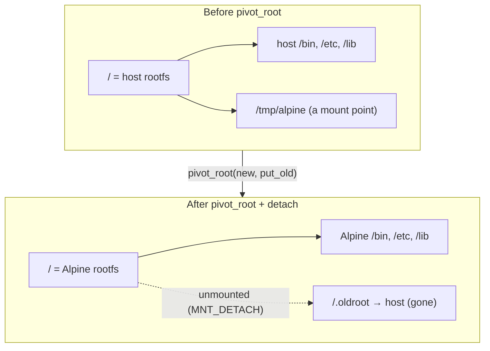
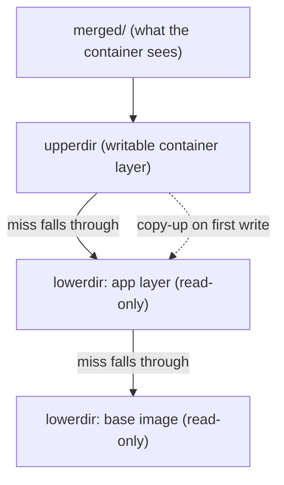
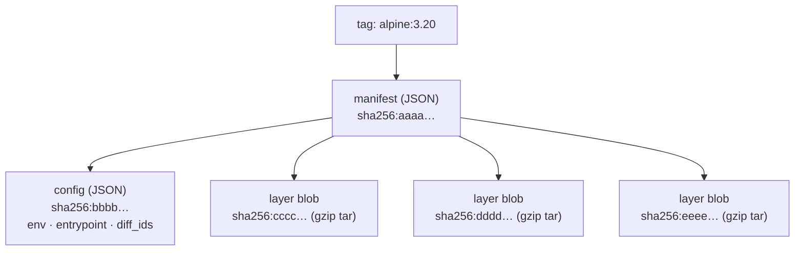

# Chapter 06 — Root filesystems & images

> A process wearing the disguise from [chapter 05](05-building-a-container-in-go.md)
> is isolated, but it is still looking at *your* files. In this chapter we cut that
> last cord: we give the container its own root filesystem — the thing a Docker
> *image* actually is — and we learn why an image is just tarballs and JSON stacked
> cleverly on top of each other.

This is the third of the four questions from the [README](../README.md): what does
the process **run from**? So far our container can `run /bin/sh`, but only because
`/bin/sh` exists on the host. A real container ships with its own `/bin`, `/etc`,
`/lib` — a whole userland — and never touches yours.

## What you'll learn

- Why `chroot(2)` is escapable and `pivot_root(2)` is not, and what "swap the mount
  that is `/`" really means.
- The exact `pivot_root` dance our code performs, line by line, from
  [src/step5-rootfs-pivot-root](../src/step5-rootfs-pivot-root/main.go).
- Where a rootfs comes from: unpacking a tarball, either an Alpine minirootfs or a
  `docker export` of any image.
- How **overlayfs** turns a stack of read-only layers plus one writable layer into
  a single filesystem, using copy-on-write and whiteouts.
- What an **OCI/Docker image** is on disk: a content-addressable manifest pointing at
  a config and an ordered list of gzipped layer blobs.

## chroot vs pivot_root: two ways to change "/"

The oldest trick for "give a process a different root directory" is `chroot(2)`,
which dates to Version 7 Unix. It does exactly one thing: it changes what `/` means
for *path resolution* in the calling process. After `chroot("/tmp/alpine")`, opening
`/etc/hostname` resolves to `/tmp/alpine/etc/hostname`.

That is a convenience, not a cage. `chroot` never touches the *mounts* underneath —
the host filesystem is still mounted, still present, still reachable if you can get a
file descriptor that points above the new root. The classic escape is barely ten
lines of C:

```c
/* Running as root inside a chroot? Climb back out. */
mkdir("escape", 0755);
chroot("escape");          /* now our "/" is .../escape, but cwd is above it */
for (int i = 0; i < 256; i++) chdir("..");  /* walk up past the real root */
chroot(".");               /* re-root at the real "/" — we're free */
execl("/bin/sh", "sh", NULL);
```

Because `chdir` was never confined to the new root, the process still holds a
directory handle *above* it and can walk up with `..`. Any process that keeps
`CAP_SYS_CHROOT` — or an already-open fd to a directory outside the jail — can do
this. `chroot` is a housekeeping tool, not a security boundary.

`pivot_root(2)` is the grown-up version. Instead of relabelling path lookups, it
operates on the mount tree: it makes `new_root` the process's root **mount** and
moves the *old* root mount to a directory (`put_old`) you provide. Once the old root
is a mount you control, you can **unmount it** — and after that the container has no
mount, no fd, and no path that leads back to the host filesystem. There is nothing
left to climb.

| | `chroot(2)` | `pivot_root(2)` |
| --- | --- | --- |
| What it changes | path-resolution root for the process | the root **mount** of the mount namespace |
| Old root afterwards | still mounted and reachable | moved to `put_old`, then unmountable |
| Escapable? | yes (open fd / `CAP_SYS_CHROOT` / `..`) | no once old root is detached |
| Needs a mount namespace? | no | yes, in practice (you must own the mounts) |
| Used by | quick jails, build tools | `runc`, and us |

## The pivot_root dance, line by line

Here is the heart of [src/step5-rootfs-pivot-root](../src/step5-rootfs-pivot-root/main.go),
running in the child *after* it has been re-exec'd into fresh UTS + PID + mount
namespaces (the mechanics of that re-exec are [chapter 05](05-building-a-container-in-go.md)'s
story, not ours):

```go
must(syscall.Sethostname([]byte("container")))

// Keep all our mount changes private to this namespace.
must(syscall.Mount("", "/", "", syscall.MS_PRIVATE|syscall.MS_REC, ""))

// pivot_root requires new_root to be a mount point, so bind-mount the rootfs
// directory onto itself.
must(syscall.Mount(rootfs, rootfs, "", syscall.MS_BIND|syscall.MS_REC, ""))

// put_old must live inside new_root. We'll unmount and remove it afterwards.
oldRoot := filepath.Join(rootfs, ".oldroot")
must(os.MkdirAll(oldRoot, 0700))

// Swap "/" for rootfs; the previous root is now reachable at /.oldroot.
must(syscall.PivotRoot(rootfs, oldRoot))
must(syscall.Chdir("/"))

// Fresh procfs for the new root + PID namespace.
const procFlags = syscall.MS_NOEXEC | syscall.MS_NOSUID | syscall.MS_NODEV
must(syscall.Mount("proc", "/proc", "proc", procFlags, ""))

// Detach the old root so the container has no path back to the host's files,
// then remove the now-empty mount point.
must(syscall.Unmount("/.oldroot", syscall.MNT_DETACH))
must(os.Remove("/.oldroot"))

must(syscall.Exec(args[0], args, os.Environ()))
```

Every line earns its place. Walking through them:

1. **`mount("", "/", "", MS_PRIVATE|MS_REC, "")`** — mark the whole mount tree
   *private and recursive*. New mount namespaces inherit their mounts as *shared* by
   default (Linux's mount propagation), which means our changes could leak back to
   the host and `pivot_root` will refuse to run. `MS_PRIVATE` cuts propagation;
   `MS_REC` applies it to every mount underneath. This is the "close the door behind
   you" step.
2. **`mount(rootfs, rootfs, "", MS_BIND|MS_REC, "")`** — bind-mount the rootfs
   directory onto itself. `pivot_root` requires `new_root` to be a *mount point*, not
   just a directory. A recursive bind mount turns a plain directory into one cheaply,
   without copying a byte.
3. **`mkdir(rootfs/.oldroot, 0700)`** — create the `put_old` target. The kernel
   requires it to live *underneath* `new_root` (so that after the swap it is
   reachable from the new `/`). We use a dotfile so it is out of the way.
4. **`pivot_root(rootfs, rootfs/.oldroot)`** — the swap. After this call, the
   process's `/` is the Alpine rootfs, and the *host's* old root has been moved to
   `/.oldroot` inside it.
5. **`chdir("/")`** — `pivot_root` does not move your current working directory. If
   you skip this, your cwd may still be an entry in the old root, handing you the
   very fd-above-root escape we just spent the chapter avoiding. This line is not
   optional.
6. **`mount("proc", "/proc", "proc", MS_NOEXEC|MS_NOSUID|MS_NODEV, "")`** — mount a
   *fresh* procfs. Because we are in a new PID namespace, this `/proc` shows only the
   container's processes. The three flags are defense in depth: no executables, no
   setuid bits, no device nodes honored from procfs.
7. **`umount2("/.oldroot", MNT_DETACH)`** — unmount the host's old root. `MNT_DETACH`
   is a *lazy* unmount: it detaches the subtree now and cleans up when the last
   reference goes away, which avoids "device busy" errors. This is the line that
   makes the jail a jail — after it, no path leads home.
8. **`rmdir("/.oldroot")` then `exec(...)`** — tidy up the empty mount point and
   hand the process over to the container's entrypoint with `execve`. From here on,
   this process *is* `/bin/sh` running inside Alpine.



### What step7 adds: a /dev of its own

The capstone, [src/step7-mini-docker](../src/step7-mini-docker/main.go), performs the
identical dance and then gives the container a working `/dev`. Real programs open
`/dev/null` and `/dev/urandom` constantly; an empty `/dev` breaks them. Rather than
expose the host's device nodes, step7 mounts a private `tmpfs` and populates it with
just the standard character devices:

```go
must(syscall.Mount("tmpfs", "/dev", "tmpfs", syscall.MS_NOSUID, "mode=0755"))
setupDevices()
```

`setupDevices()` calls `mknod(2)` for each node with the well-known major/minor
numbers:

```go
nodes := []dev{
    {"/dev/null", 1, 3},
    {"/dev/zero", 1, 5},
    {"/dev/full", 1, 7},
    {"/dev/random", 1, 8},
    {"/dev/urandom", 1, 9},
    {"/dev/tty", 5, 0},
}
// dev_t = (major << 8) | minor for these small standard numbers.
devNo := int(n.major<<8 | n.minor)
syscall.Mknod(n.path, syscall.S_IFCHR|0666, devNo)
```

`(major, minor) = (1, 3)` is the canonical `/dev/null`; `(1, 9)` is `/dev/urandom`.
`S_IFCHR` marks each as a *character* device. Note that creating device nodes needs
`CAP_MKNOD` — which is exactly why a hardened, capability-dropped runtime bind-mounts
these from the host instead. That trade-off is [chapter 08](08-security-and-hardening.md)'s
territory.

## Where does the rootfs come from?

`pivot_root` needs a directory full of a Linux userland to point at. You have two
easy ways to get one.

**Option A — an Alpine minirootfs.** Alpine publishes a ~3 MB tarball that unpacks
into a complete, if minimal, root filesystem. This is what our code's header
recommends:

```bash
ROOTFS=/tmp/alpine
mkdir -p "$ROOTFS"
curl -sSL https://dl-cdn.alpinelinux.org/alpine/v3.20/releases/x86_64/alpine-minirootfs-3.20.3-x86_64.tar.gz \
  | sudo tar -xz -C "$ROOTFS"

sudo ROOTFS=/tmp/alpine ./bin/mini-docker run /bin/sh
```

**Option B — export any Docker image.** A rootfs is just the *flattened* contents of
an image, so you can borrow one from Docker without pulling in any of its runtime:

```bash
mkdir rootfs
docker export "$(docker create alpine)" | tar -x -C rootfs
```

`docker create` makes a container without starting it; `docker export` streams that
container's filesystem — all image layers already merged into one — as a tar stream,
which we untar into `rootfs/`. The result is a plain directory tree you can hand
straight to `ROOTFS=`. That is the whole secret: **an "image", once flattened, is
just a directory.** The interesting part is how images avoid *storing* that flattened
directory, which is where overlayfs comes in.

## overlayfs: layers without copies

Unpacking a tarball per container would be wasteful — a hundred Alpine containers
would mean a hundred identical copies of `/bin/busybox`. Docker instead keeps each
image as a stack of read-only *layers* and unions them at runtime with **overlayfs**,
a union filesystem built into the Linux kernel since 3.18.

overlayfs takes four ingredients:

| Directory | Role |
| --- | --- |
| `lowerdir` | one or more **read-only** layers (the image). Colon-separated; leftmost is highest priority. |
| `upperdir` | the single **writable** layer where all changes land (the container's own layer). |
| `workdir` | an empty scratch dir on the same filesystem as `upperdir`; the kernel uses it for atomic internal bookkeeping. |
| `merged` | the mount point where the unified view appears. |

You can build one by hand — this is exactly what a runtime does for you:

```bash
mkdir -p lower1 lower2 upper work merged
echo "from base image"  > lower1/base.txt
echo "from app layer"   > lower2/app.txt

sudo mount -t overlay overlay \
  -o lowerdir=lower2:lower1,upperdir=upper,workdir=work \
  merged

ls merged           # base.txt  app.txt   ← unified view of both layers
echo hi > merged/new.txt   # write lands in upper/, not in either lower
cat upper/new.txt          # -> hi
```

The rules that make this efficient are **copy-on-write** semantics:

- **Read** a file: overlayfs searches `upperdir` first, then each `lowerdir` left to
  right, and serves the first hit. Untouched files are read straight from the shared,
  read-only image layers — no copy.
- **Write** to a file that lives in a lower layer: overlayfs **copies it up** into
  `upperdir` first, then applies your write there. The lower copy is untouched; only
  this container sees the change.
- **Delete** a file from a lower layer: you cannot actually remove it from a
  read-only layer, so overlayfs writes a **whiteout** — a character device with
  major/minor `0/0` — into `upperdir` at that path. The whiteout masks the lower
  file, so it vanishes from `merged` while the layer stays pristine.



Because the lower layers never change, **many containers and even many images can
share the same layer blobs on disk**. Ten containers from the same image add ten tiny
`upperdir`s, not ten full root filesystems. That sharing is the entire economic
argument for layered images.

Our `mini-docker` (step 7) deliberately stops short of this — it points `pivot_root`
at a single already-flattened directory. But [`src/step9-overlayfs`](../src/step9-overlayfs/main.go)
does the real thing: it stacks an app layer over a base image, mounts the union, and
pivots into `merged`, then proves copy-on-write by showing that everything the
container wrote landed in `upperdir` while the base image stayed byte-for-byte
untouched.

```console
$ sudo ROOTFS=/tmp/alpine ./bin/step9-overlayfs run /bin/sh -c 'echo hi > /new.txt; ls /'
[step9] mounting overlay at /tmp/overlay-demo/merged
         lowerdir=.../app-layer:/tmp/alpine,upperdir=.../upper,workdir=.../work
...
[step9] contents of the writable UPPER layer after the run:
         + new.txt          # the write copied up here; the base image is unchanged
```

## What an OCI/Docker image actually is

Now zoom out from one filesystem to the packaging format. A Docker image — precisely,
an **OCI image** — is **content-addressable**: every piece is named by the SHA-256
digest of its bytes, so the name *is* a checksum. Pulling `alpine:3.20` walks a small
tree of JSON and blobs:



The three kinds of object:

- **Manifest** — a small JSON document (media type
  `application/vnd.oci.image.manifest.v1+json`) that references, by digest, exactly
  one config and an *ordered* list of layers. A multi-arch tag adds an *index*
  (a manifest list) one level up, mapping `linux/amd64`, `linux/arm64`, etc. to
  per-platform manifests.
- **Config** — a JSON blob holding the runtime metadata: environment variables,
  `Entrypoint`/`Cmd`, working directory, exposed ports, and a `rootfs.diff_ids`
  array. Each `diff_id` is the digest of a layer's *uncompressed* tar, and their
  order defines how the layers stack.
- **Layer blobs** — the actual filesystem content, each a **gzipped tar** of one
  layer's *diff*: the files added, changed, or (via whiteouts) removed relative to
  the layers below it. This is the same diff idea overlayfs consumes.

So `docker pull` is really: fetch the manifest, then fetch each layer blob it names
(skipping any digest already in the local store — that is layer dedup in action),
verify every blob against its digest, and unpack the layers into the overlay
`lowerdir` stack in the order the config specifies. `docker run` then adds a fresh,
empty `upperdir` on top — **the writable container layer** — and mounts the union.
Delete the container and only that top layer is discarded; the shared image layers
below it live on for the next container.

Two facts fall out of the content-addressable design and are worth keeping:

- **Immutability & caching.** Change one byte in a layer and its digest changes, so
  it is a *different* blob with a *different* name. This is why editing an early
  Dockerfile line invalidates every layer built after it — their inputs, and thus
  their digests, all shift.
- **Dedup for free.** Two images built `FROM alpine` reference the *same* base-layer
  digest, so it is stored once and downloaded once. Content addressing makes "same
  bytes → same name → store once" automatic.

That is the whole trick. An image is tarballs (the layers) plus JSON (the manifest
and config), tied together by SHA-256 digests; a running container is those layers
unioned by overlayfs with one writable layer on top; and the leap from "shares the
host's files" to "runs from its own image" is the eight-line `pivot_root` dance you
read above. The daemon and registry plumbing that orchestrates `pull` and `run` at
scale is [chapter 09](09-how-docker-really-works.md)'s job.

## Recap

- `chroot(2)` only relabels path lookups and is escapable via an fd or cwd above the
  new root; `pivot_root(2)` swaps the root **mount** so the old root can be unmounted,
  leaving no path back to the host.
- Our `pivot_root` dance is: make mounts `MS_PRIVATE`, bind-mount the rootfs onto
  itself, create `.oldroot`, `pivot_root`, `chdir("/")`, mount a fresh `/proc`, then
  `umount2(MNT_DETACH)` and remove `.oldroot`.
- step7 additionally mounts a `tmpfs` `/dev` and `mknod`s the standard character
  devices (`/dev/null` is `1,3`; `/dev/urandom` is `1,9`).
- A rootfs is just an unpacked tarball — an Alpine minirootfs, or
  `docker export $(docker create alpine) | tar -x -C rootfs`.
- overlayfs unions read-only `lowerdir` image layers under a writable `upperdir` with
  copy-on-write reads, copy-up writes, and whiteout deletions; an OCI image is a
  content-addressable manifest → config + ordered gzipped-tar layer blobs, all named
  by SHA-256, with the writable container layer added at `run` time.

*Next → [Chapter 07 — Networking](07-networking.md)*
