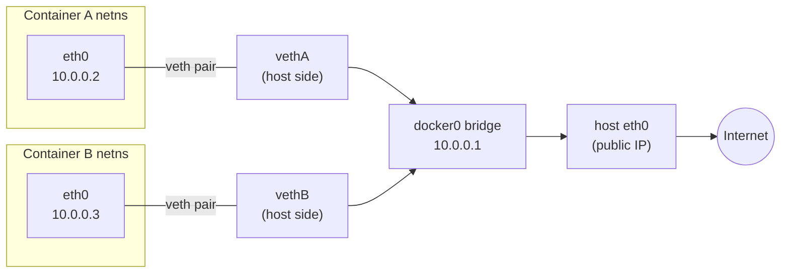
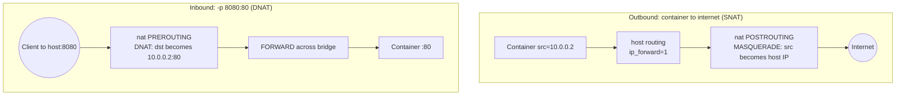

# Chapter 07 — Networking

> A container with `CLONE_NEWNET` boots into a network namespace that owns exactly
> one interface — a loopback — and even *that* is switched off. Our
> [mini-docker](../src/step7-mini-docker/main.go) has no connectivity at all, and
> that is not a bug: an empty netns is a blank patch panel. This chapter is about
> the cables. You'll wire a container to the host with a virtual Ethernet cable,
> gang many of them onto a bridge (that's all `docker0` is), and teach the host to
> route and NAT their packets to the internet and back.

## What you'll learn

- Why a fresh network namespace has *only* a down `lo`, and what "wiring it up" means.
- How a **veth pair** works as a two-ended virtual cable, with the exact `ip` commands
  to build one and drop one end into a container.
- How a **Linux bridge** turns many veth pairs into a switch — the real job of `docker0`.
- How the host **NATs** (masquerades) container traffic to the internet, and why that
  needs `net.ipv4.ip_forward=1`.
- How `-p 8080:80` is just a **DNAT** rule, and what Docker's default bridge model
  stitches together — plus a one-line tour of the other drivers and CNI.
- Why you do this in Go with **netlink**, not by shelling out to `ip`.

> ⚠️ **Linux and root only.** Creating interfaces, bridges, and firewall rules needs
> `CAP_NET_ADMIN` (in practice, `sudo`). The commands below add real interfaces and
> `iptables`/`nftables` rules to your host — run them in a throwaway VM. Every
> namespace-basics detail lives in [chapter 03](03-namespaces.md); we only recap here.

---

## Recap: a fresh netns is an island

A network namespace gets its **own** interfaces, routing table, ARP cache, and
firewall rules — none shared with the host. When the kernel hands you a brand-new one
(via `CLONE_NEWNET` or `ip netns add`), it contains a single loopback device, and that
device starts **DOWN**:

```console
$ sudo ROOTFS=/tmp/alpine ./bin/mini-docker run /bin/sh
/ # ip addr
1: lo: <LOOPBACK> mtu 65536 qdisc noop state DOWN group default qlen 1000
    link/loopback 00:00:00:00:00:00 brd 00:00:00:00:00:00
```

No `eth0`, no default route, no DNS — you can't even `ping 127.0.0.1` until you run
`ip link set lo up`. This is deliberate isolation: the namespace is a sealed room, and
every wire that leaves it is something *you* have to run. The rest of the chapter is
that wiring, from one container to the open internet.

---

## The veth pair: a virtual Ethernet cable

The primitive that crosses a namespace boundary is the **veth pair** (virtual
Ethernet). Think of it as a patch cable with a plug on each end: whatever goes in one
end comes out the other. The trick is that the two ends can live in *different*
network namespaces — so you leave one plug on the host and push the other into the
container.

Create the pair on the host:

```bash
sudo ip link add veth0 type veth peer name veth1
```

You now have two linked interfaces, `veth0` and `veth1`, both currently on the host.
Move one end into the container's namespace. A netns has no name of its own here, so
we address it by the PID of a process living inside it — mini-docker prints the child
PID at startup:

```bash
sudo ip link set veth1 netns <pid>          # push one plug into the container
```

Give the host end an address and bring it up; it becomes the container's gateway:

```bash
sudo ip addr add 10.0.0.1/24 dev veth0
sudo ip link set veth0 up
```

Now configure the container end *inside* the netns. Enter it with `nsenter -t <pid> -n`
(or `ip netns exec <name>` if you named it):

```bash
# inside the container's network namespace:
ip addr add 10.0.0.2/24 dev veth1
ip link set veth1 up
ip link set lo up                            # loopback matters too
ip route add default via 10.0.0.1            # send everything to the host end
```

That's a working point-to-point link. From inside, `ping 10.0.0.1` reaches the host;
from the host, `ping 10.0.0.2` reaches the container. (Real runtimes rename the
container end to `eth0` — a cosmetic `ip link set veth1 name eth0` — so it looks like a
normal machine. Same cable, friendlier name.)

One veth pair connects one container to the host. For a fleet, you don't want a
tangle of point-to-point cables — you want a switch.

---

## The Linux bridge: one switch, many containers

A **Linux bridge** is a software Ethernet switch built into the kernel. You attach the
*host-side* end of each container's veth pair to it, and the bridge forwards frames
between them by MAC address, exactly like a physical switch. Give the bridge itself an
IP and it doubles as the containers' default gateway. **This is precisely what
`docker0` is** — the bridge Docker creates on first start.

```bash
sudo ip link add name br0 type bridge        # create the switch
sudo ip link set br0 up
sudo ip addr add 10.0.0.1/24 dev br0         # the gateway address moves to the bridge
sudo ip link set veth0 master br0            # plug the host end of a veth into it
sudo ip link set another-veth0 master br0    # ...and the next container's, etc.
```

The `master` assignment is the enrollment: it makes `veth0` a *port* of `br0`. (The
older `brctl` tool spells this `brctl addbr br0` / `brctl addif br0 veth0`; it's the
deprecated front-end to the same kernel bridge.) Note the gateway `10.0.0.1/24` now
lives on `br0`, not on any single veth — every container points its default route at
the bridge.



Containers on the same bridge can now talk to each other at layer 2 with no further
setup. But the bridge is a private island: `10.0.0.0/24` means nothing to the internet.
Getting *out* is the next problem.

---

## Reaching the internet: routing and NAT

Your containers have private RFC 1918 addresses. No upstream router will carry a packet
whose source is `10.0.0.2` — and even if it did, the reply would have nowhere to go.
Two things fix this, both on the host.

**First, make the host a router.** By default Linux does not forward packets between
interfaces. Turn that on:

```bash
sudo sysctl -w net.ipv4.ip_forward=1
# equivalently: echo 1 | sudo tee /proc/sys/net/ipv4/ip_forward
```

**Second, masquerade.** Source-NAT rewrites each outbound packet's source address from
the container's private IP to the host's real IP, and remembers the mapping so replies
can be rewritten back. `MASQUERADE` is the SNAT variant that uses whatever address the
outgoing interface currently has (handy for DHCP/laptops):

```bash
# rewrite traffic leaving the 10.0.0.0/24 net, except back onto the bridge itself:
sudo iptables -t nat -A POSTROUTING -s 10.0.0.0/24 ! -o br0 -j MASQUERADE
```

That single rule is the whole magic trick behind "my container can reach the internet."
To the outside world every container's traffic looks like it came from the host. (On
modern distros the actual backend is `nftables`; `iptables` is usually a compatibility
shim over it, and Docker writes the equivalent rules either way.)



---

## Publishing ports: `-p 8080:80` is a DNAT rule

MASQUERADE lets containers dial *out*. Publishing lets the world dial *in*. When you
run `docker run -p 8080:80 nginx`, nothing about the container changes — the magic is a
**destination-NAT** rule on the host that catches inbound packets for the host's port
8080 and rewrites their destination to the container's `IP:80`:

```bash
# conceptually, what -p 8080:80 installs:
sudo iptables -t nat -A PREROUTING -p tcp --dport 8080 -j DNAT --to-destination 10.0.0.2:80
```

The reply path is automatic: the same conntrack entry that rewrote the destination on
the way in rewrites the source on the way out, so the client sees answers coming from
`host:8080`. Docker also runs a small **userland proxy** (`docker-proxy`) that binds the
published port; it's a belt-and-suspenders fallback for cases the DNAT path doesn't
cover (such as connections from the host to its own published port), not the primary
data path.

---

## The default Docker bridge model, in one picture

Put the pieces together and you have Docker's default `bridge` network — the one every
container joins unless you say otherwise:

1. A bridge named **`docker0`** with a gateway IP (default subnet `172.17.0.0/16`).
2. A **veth pair per container**: one end renamed `eth0` inside, the other enrolled as a
   `docker0` port.
3. A **MASQUERADE** rule so containers reach the internet.
4. **DNAT** rules (plus `docker-proxy`) for every published `-p` port.

That's the entire "how does my container have a network" story. Docker ships other
drivers for when the default doesn't fit:

| Driver | What it does | Typical use |
| --- | --- | --- |
| `bridge` | The default: `docker0` + veth + NAT (above). | Single-host, most containers. |
| `host` | No netns at all — shares the host's stack directly. | Max performance, no isolation. |
| `none` | Netns with only `lo`; you wire it yourself. | Fully custom / air-gapped. |
| `macvlan` | Container gets its own MAC on the physical LAN. | Container appears as a real box on the network. |
| `overlay` | VXLAN tunnel spanning multiple hosts. | Swarm / multi-host clusters. |

And in the Kubernetes world, the wiring is deliberately pluggable: **CNI** (Container
Network Interface) is a spec where the kubelet calls out to a plugin binary — Calico,
Cilium, Flannel, and friends — to attach each pod's netns exactly as we did by hand,
using veth pairs, bridges, or eBPF datapaths under the hood.

---

## Doing it in Go: netlink, not shell

Every `ip` command above is a front-end to the kernel's **netlink** interface — a
socket protocol (`AF_NETLINK`) for configuring interfaces, addresses, routes, and
namespaces. A real runtime doesn't fork `/bin/ip`; it opens a netlink socket and sends
the structured messages directly.

The Go standard library deliberately doesn't expose this: `net` is for *using* the
network, not *building* it. So runtimes reach for a library — the de facto choice is
[`github.com/vishvananda/netlink`](https://github.com/vishvananda/netlink), paired with
`vishvananda/netns` to switch the calling goroutine into a target namespace. Creating
and moving a veth looks roughly like this:

```go
// Sketch — the netlink equivalent of `ip link add ... type veth peer ...`.
veth := &netlink.Veth{
    LinkAttrs: netlink.LinkAttrs{Name: "veth0"},
    PeerName:  "veth1",
}
if err := netlink.LinkAdd(veth); err != nil {   // create the pair
    return err
}
peer, _ := netlink.LinkByName("veth1")
netlink.LinkSetNsPid(peer, containerPID)         // push one end into the container
```

There's a subtlety Go forces on you: netns is a *per-thread* property, so code that
switches namespaces must first `runtime.LockOSThread()` so the goroutine can't be
rescheduled onto a thread still in the host namespace — a real footgun that libraries
like `vishvananda/netns` exist to manage.

Our [mini-docker](../src/step7-mini-docker/main.go) stops short of all this on purpose:
it creates the empty network namespace with `CLONE_NEWNET` and leaves the wiring as a
labelled exercise (`ip addr` inside shows only a down `lo`). Adding a veth-to-bridge
setup — either shelling out to `ip` after the child starts, or driving netlink from the
parent — is the natural next project once the [security work](08-security-and-hardening.md)
is done. The mechanism is no longer mysterious; it's just more of the same wiring you
ran by hand above.

---

## Recap

- A fresh network namespace has only a **down loopback** — no connectivity by design;
  mini-docker's `CLONE_NEWNET` gives you a blank slate you must wire up.
- A **veth pair** is a two-ended virtual cable; put one end in the container's netns
  (`ip link set veth1 netns <pid>`), keep the other on the host as the gateway.
- A **Linux bridge** (`docker0`) is a software switch; enroll host-side veths with
  `ip link set veth0 master br0` to connect many containers at layer 2.
- Outbound internet access needs `net.ipv4.ip_forward=1` plus a **MASQUERADE** SNAT
  rule; `-p 8080:80` is a **DNAT** rule (with a `docker-proxy` helper) for inbound.
- Real runtimes drive **netlink** (via `vishvananda/netlink`), not the shell; Docker's
  default `bridge` driver is exactly the bridge + veth + NAT stack you built here, and
  Kubernetes generalizes it through **CNI** plugins.

*Next → [Chapter 08 — Security & hardening](08-security-and-hardening.md)*
