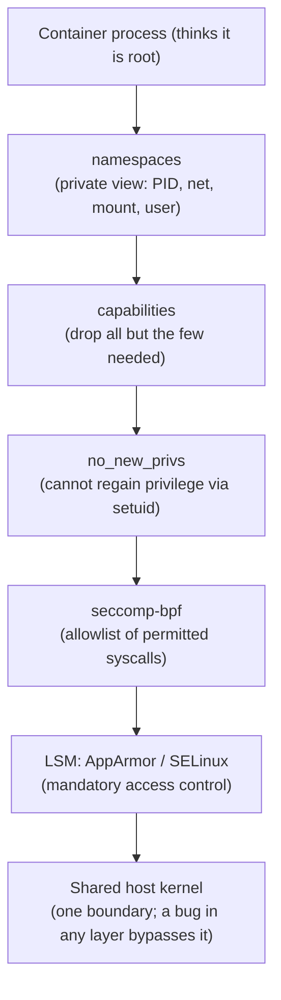
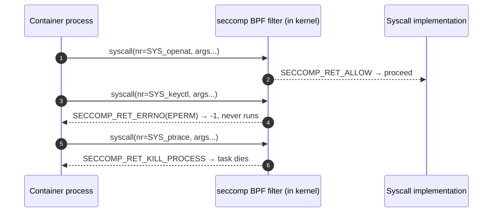
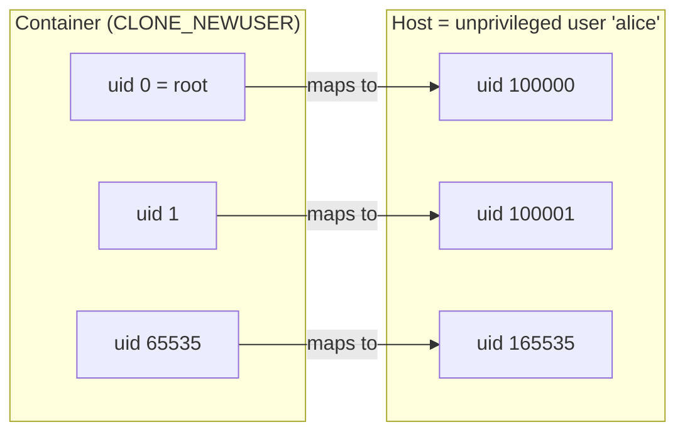

# Chapter 08 — Security & hardening

> Three chapters answered *what can it **see***, *how much can it **use***, and *what
> does it **run from***. This is the fourth question: **what is it allowed to *do*?** And
> it comes with an uncomfortable admission — everything we've built so far (namespaces,
> cgroups, pivot_root) is **isolation**, not a hard security boundary. A container is a
> process the kernel is lying to, running on *your* kernel, with the *same* syscalls,
> right next to everything else. This chapter shrinks what that process is permitted to
> attempt, so that when (not if) something goes wrong, the blast radius is small.

## What you'll learn

- Why "isolation" is not "security," and why **root in the container is real root on
  the host** unless you do something about it.
- **Linux capabilities** — how to slice root's power into ~40 bits and drop all but a
  handful (least privilege), and why `CAP_SYS_ADMIN` is basically root wearing a hat.
- **`no_new_privs`** and **seccomp-bpf** — stopping privilege regain, and filtering the
  syscall surface with a kernel-enforced BPF allowlist.
- **User namespaces & rootless containers** — mapping container uid 0 to an
  unprivileged host uid, with the real, correct Go code to do it.
- Where **LSMs** (AppArmor, SELinux) and stronger sandboxes (**gVisor**, **Kata**) fit.
- The exact line in [mini-docker](../src/step7-mini-docker/main.go) where hardening
  belongs.

---

## The threat: one kernel, shared by everyone

Say it plainly, because it's the single most important fact in container security:

> A container **shares the host kernel**. Namespaces and cgroups are conveniences the
> kernel offers a process — they change what it *sees* and what it can *spend*, not
> which kernel it runs on. There is exactly **one** kernel, exactly **one** set of
> syscalls, and every container is one bad `execve` away from touching it.

Two consequences follow, and both are load-bearing:

1. **A kernel bug is a container escape.** Unlike a VM — which runs a *second* kernel
   behind a hypervisor — a container's attack surface is the entire Linux syscall
   interface, every ioctl, every `/proc` and `/sys` file. A privilege-escalation bug
   anywhere in it (Dirty COW, `CVE-2016-5195`, the various `OverlayFS`/`nf_tables`
   escapes) is reachable from inside the container.
2. **By default, `root` in the container *is* `root` on the host.** Without a user
   namespace (below), uid 0 inside maps to uid 0 outside — the *same* credential the
   kernel checks. A breakout by a root process lands you as root on the machine. That's
   why "just run it in a container" is not a sandbox for hostile code.

Hardening makes that shared kernel as small a target as possible: **take away powers,
filter syscalls, and demote root** so even a successful breakout is underwhelming. These
are **layers** — defense in depth — because any single one can have a hole.



Read that top to bottom: a syscall from the workload has to survive every layer before
it reaches the kernel. Remove a layer and you widen the target.

---

## Capabilities: splitting root into ~40 bits

Traditional Unix was binary: you were uid 0 (omnipotent) or you weren't. Linux
**capabilities** (`man 7 capabilities`) break root's omnipotence into roughly **40
independent bits**, each guarding one class of privileged operation. A process holds some
subset, and the kernel checks the *specific* bit for each action instead of "are you
root?"

The container security move is **least privilege**: start from nothing and grant back
only what the workload genuinely needs. Docker doesn't run containers with full root
power — by default it **keeps a small set (about 14 capabilities)** and **drops the
rest**. You can drop further with `--cap-drop=ALL --cap-add=NET_BIND_SERVICE`, which is
what a well-behaved image should ask for.

| Capability | Grants the power to… | Default in Docker |
| --- | --- | --- |
| `CAP_SYS_ADMIN` | mount, `pivot_root`, `sethostname`, `setns`, BPF, and dozens more — the "kitchen-sink" cap | **dropped** |
| `CAP_SYS_MODULE` | load/unload kernel modules (i.e. run code *in* the kernel) | **dropped** |
| `CAP_SYS_PTRACE` | `ptrace` any process, read its memory | **dropped** |
| `CAP_NET_ADMIN` | reconfigure interfaces, routes, firewall rules | **dropped** |
| `CAP_NET_RAW` | open raw/packet sockets (this is what lets `ping` work) | kept |
| `CAP_NET_BIND_SERVICE` | bind to ports below 1024 | kept |
| `CAP_CHOWN`, `CAP_SETUID`, `CAP_SETGID` | change file ownership; switch uid/gid (needed to *drop* to a normal user) | kept |
| `CAP_DAC_OVERRIDE` | bypass file read/write/execute permission checks | kept (broad; drop if you can) |

> **`CAP_SYS_ADMIN` is nearly-root.** It has accreted so many unrelated privileges over
> the years that granting it is close to handing back uid 0. If an image asks for
> `--cap-add=SYS_ADMIN` (or worse, `--privileged`, which restores *all* caps, disables
> seccomp, and exposes host devices), treat that as a red flag and find another way.

**Doing this in Go.** An honest limitation: the Go **standard library has no wrapper for
`capset(2)`** nor for the per-capability bounding-set drop (`prctl(PR_CAPBSET_DROP)`).
`syscall.SysProcAttr` can set namespaces and even `AmbientCaps` (since Go 1.9) — caps to
*raise* — but not a full drop-everything policy. Real runtimes call `capset` directly,
via **cgo/libcap** (the kernel.org C library) or raw syscalls through
**`golang.org/x/sys/unix`**: shrink the **bounding set** (the ceiling of what can ever be
held), then clear the **effective/permitted/inheritable** sets down to the allowlist — all
before `exec`.

---

## `no_new_privs`: no take-backs

Dropping capabilities is pointless if the workload can just *earn them back*. The
classic path is a **setuid binary**: `execve`-ing a file with the setuid bit (say a
vendored `/usr/bin/sudo` or `ping`) can hand the new program privileges the caller
didn't have. `no_new_privs` slams that door.

A process sets it with one `prctl`:

```c
prctl(PR_SET_NO_NEW_PRIVS, 1, 0, 0, 0);
```

Once set, the flag is **sticky and inherited** across `fork` and `execve`, and it can
**never be unset**. From then on, no `execve` can grant the process more privileges than
it already has — setuid/setgid bits and file capabilities are ignored. In Go you'd reach
for `golang.org/x/sys/unix`:

```go
import "golang.org/x/sys/unix"

// Call this in the child, before exec. After this, setuid binaries can't elevate us.
if err := unix.Prctl(unix.PR_SET_NO_NEW_PRIVS, 1, 0, 0, 0); err != nil {
    return err
}
```

There's a second reason to care: **installing a seccomp filter as an unprivileged
process requires `no_new_privs` to be set first** (otherwise the kernel refuses, to stop
you from filtering your way around a setuid boundary). So it's also the on-ramp to the
next layer.

---

## seccomp-bpf: filtering the syscall surface

Capabilities gate *privileged* operations, but plenty of kernel attack surface lives in
perfectly "unprivileged" syscalls that a container simply never needs — `keyctl`,
`ptrace`, `mount`, `kexec_load`, obscure `ioctl`s. **seccomp** ("secure computing") lets
a process hand the kernel a **BPF program** that runs on **every syscall the process
makes**, inspecting the syscall number (and argument registers) and returning an action:
allow it, fail it with an errno, kill the process, trap, log, or hand off to a tracer.



The filter is installed with `seccomp(2)` (`SECCOMP_SET_MODE_FILTER`) and, once loaded,
**cannot be removed or loosened** — only made stricter by stacking another filter. Two
philosophies:

| Approach | Rule | Trade-off |
| --- | --- | --- |
| **Allowlist** (default-deny) | list the syscalls you permit; block everything else | Safer — an unknown/new syscall is denied by default. The setup Docker uses. |
| **Denylist** (default-allow) | list the syscalls you forbid; permit everything else | Easier to write, but every syscall you forgot is a hole. Brittle. |

Writing raw BPF by hand is miserable, so runtimes use **`libseccomp`** to compile a
high-level profile (a JSON list of syscall names + actions) into the BPF program.
**Docker ships a default profile** that allowlists the ~300 syscalls a normal workload
uses and blocks **dozens** of dangerous ones — `keyctl`, `add_key`, `mount`/`umount2`,
`kexec_load`, `finit_module`, `open_by_handle_at`, `ptrace` (restricted), `reboot`,
`swapon`. It's on automatically; `--privileged` turns it *off*. Enforcement is entirely
in-kernel, per-syscall, per-process — no userspace daemon in the hot path.

---

## User namespaces & rootless containers

Now the big lever. Everything above shrinks what root-in-the-container can *do*; the
**user namespace** changes *who root even is*. Introduced in the namespaces chapter
([03](03-namespaces.md)) as "the one that virtualizes uids," here's why it's the
centerpiece of the security story: a user namespace lets you **map container uid 0 to an
unprivileged host uid.** Root inside becomes a nobody outside.

The mapping is written to two files on the child process:
`/proc/<pid>/uid_map` and `/proc/<pid>/gid_map`, each line being
`inside_id  outside_id  length`. So a line `0 100000 65536` means "uid 0 inside = uid
100000 outside, for 65536 ids." Those outside ranges aren't arbitrary — they come from
**`/etc/subuid`** and **`/etc/subgid`**, which an admin pre-allocates per user:

```text
# /etc/subuid
alice:100000:65536      # alice may use host uids 100000..165535 for her containers
```



The payoff: a process that is **root inside** the container is uid 100000 — an ordinary,
powerless user — **outside** it. A breakout no longer lands as host root; it lands as a
user who can't read anyone else's files, kill anyone else's processes, or touch the
kernel's privileged surface. This is exactly how **rootless Docker** and **Podman** run
containers as a normal login user, no daemon-as-root required.

There's a second gift here: **inside a fresh user namespace you hold a full set of
capabilities** *(scoped to that namespace)*, which is what lets an unprivileged user
create the *other* namespaces — PID, mount, UTS, net — that normally demand real root.
Enter the user namespace first, and everything else becomes reachable without `sudo`.

### The real, correct Go

`syscall.SysProcAttr` supports this directly — no cgo needed. Add `CLONE_NEWUSER` and
describe the mappings; the Go runtime writes the map files for you at the right moment
(after `clone`, before the child proceeds):

```go
cmd.SysProcAttr = &syscall.SysProcAttr{
    Cloneflags: syscall.CLONE_NEWUSER | // the enabler: gives us caps *inside*
        syscall.CLONE_NEWUTS |
        syscall.CLONE_NEWPID |
        syscall.CLONE_NEWNS |
        syscall.CLONE_NEWNET,
    UidMappings: []syscall.SysProcIDMap{
        {ContainerID: 0, HostID: os.Getuid(), Size: 1}, // root-inside = me-outside
    },
    GidMappings: []syscall.SysProcIDMap{
        {ContainerID: 0, HostID: os.Getgid(), Size: 1},
    },
    // Unprivileged callers MUST leave this false: it makes Go write "deny" to
    // /proc/<pid>/setgroups before gid_map, which the kernel requires for an
    // unprivileged mapping. Set it true only when you're already privileged.
    GidMappingsEnableSetgroups: false,
}
```

Two honest caveats:

- The one-line mapping above (map *your* single uid to 0) is one the kernel lets **any**
  unprivileged process write directly — which is why this runs without `sudo`. Mapping a
  whole **range** from `/etc/subuid` (uid 0..65535 inside) requires the setuid helpers
  **`newuidmap`/`newgidmap`**; that's what rootless Docker/Podman shell out to, since Go's
  built-in writer can't invoke them.
- A rootless net namespace can't reach host interfaces, so rootless setups use a userspace
  network shim like `slirp4netns`. See [networking](07-networking.md) for the wiring.

This is exactly what [`src/step8-rootless`](../src/step8-rootless/main.go) does — run it as
an ordinary user and watch a container appear with **no `sudo`**:

```console
$ ./bin/step8-rootless run /bin/sh -c 'id; cat /proc/self/uid_map'
[step8] parent uid=1000 ... — creating a USER namespace (no root needed)
uid=0(root) gid=0(root) groups=0(root)
         0       1000          1        # container uid 0 maps to your real uid outside
```

---

## LSMs: mandatory access control on top

Everything so far is **discretionary** — the process (or the runtime acting for it)
chooses to give up power. **Linux Security Modules** add **mandatory** access control: a
policy the kernel enforces that *the process cannot opt out of*, even as root. Two matter
for containers, split cleanly by distro family:

| LSM | Model | Ships on | Container integration |
| --- | --- | --- | --- |
| **AppArmor** | **path-based** — rules over file paths and capabilities | Debian, Ubuntu, SUSE | Docker applies the `docker-default` profile to every container automatically; you can supply your own with `--security-opt apparmor=...`. |
| **SELinux** | **label-based** — every process and file carries a security *type*/label | RHEL, Fedora, CentOS | Docker labels container processes (e.g. type `container_t`) and gives each container a unique **MCS** category, so containers can't touch each other's files. Enabled via `--security-opt label=...` / daemon config. |

An LSM is the backstop: even if the workload keeps a capability it shouldn't and passes
seccomp, the policy can still say "`container_t` may not read `/etc/shadow`." That's why
it's the outermost ring in the layered diagram.

---

## When "shrink the surface" isn't enough

All of the above still leaves the container talking directly to the host kernel. For
hostile or untrusted code, two projects change the *shape* of the problem instead of just
filtering it:

- **gVisor** (`runsc`) runs a **userspace kernel** (the "Sentry") that intercepts the
  container's syscalls and services most of them itself, so the workload almost never
  reaches the real host kernel — dramatically shrinking its attack surface.
- **Kata Containers** runs each container inside a **lightweight VM** (a microVM via
  QEMU/Firecracker) with its *own* guest kernel — container ergonomics, VM isolation.

Both trade some performance and compatibility for a much harder wall. Chapter
[13](13-comparison-and-further-reading.md) lays these out on the full isolation spectrum,
from "plain namespaces" to "full VM."

---

## Where this goes in mini-docker

Our capstone, [step7-mini-docker](../src/step7-mini-docker/main.go), deliberately stops
one step short of hardening — and marks the spot. In `child()`, after `pivot_root` and
mounting `/proc`, a comment sits right before the final `syscall.Exec`:

```go
// This is the point where a hardened runtime would drop capabilities, set
// no_new_privs, and install a seccomp filter (docs/08) — right before exec.

must(syscall.Exec(args[0], args, os.Environ()))
```

That ordering is not incidental — it's the **only** correct place:

1. In the **child**, in its new namespaces, so the policy binds the workload and not the
   parent runtime.
2. **Last**, after the setup that legitimately *needs* privilege (mounting, `pivot_root`,
   device nodes) — you can't mount `/proc` after dropping `CAP_SYS_ADMIN` or blocking
   `mount` in seccomp.
3. In this order: **set `no_new_privs` → drop capabilities → install seccomp → `exec`.**
   `no_new_privs` first so the unprivileged seccomp load is allowed; caps dropped so the
   new program starts demoted; seccomp last so it covers the very first syscall.

[`src/step10-hardening`](../src/step10-hardening/main.go) fills in that spot with
standard-library code only (no libcap/libseccomp): it sets `no_new_privs` via
`prctl`, empties the bounding set (`prctl(PR_CAPBSET_DROP)` across every capability),
and zeroes the effective/permitted/inheritable sets with `capset(2)` — then execs into
capability-less root:

```console
$ sudo ./bin/step10-hardening run /bin/sh -c 'grep -E "^Cap|^NoNewPrivs" /proc/self/status'
CapInh: 0000000000000000
CapPrm: 0000000000000000
CapEff: 0000000000000000   # no capabilities at all
CapBnd: 0000000000000000   # and none can ever be regained
NoNewPrivs: 1
```

The seccomp layer is the one piece left to the reader, because a real BPF filter
needs libseccomp or `golang.org/x/sys/unix`. And if you added `CLONE_NEWUSER` with the
mappings shown above to the `run()` `SysProcAttr` (as [`step8-rootless`](../src/step8-rootless/main.go)
does), mini-docker would become **rootless** — you could launch it without `sudo`, and a
breakout would surface as your own unprivileged uid. That single flag is the difference
between "isolation" and "isolation with a safety net."

---

## Recap

- Containers **share one kernel**; namespaces/cgroups are isolation, **not** a security
  boundary. A kernel bug is an escape, and by default **container root == host root**.
- **Capabilities** split root into ~40 bits — drop all you don't need; `CAP_SYS_ADMIN`
  and `--privileged` are effectively "give it all back."
- **`no_new_privs`** stops setuid-based privilege regain and is a prerequisite for
  unprivileged **seccomp**, whose kernel-enforced BPF **allowlist** shrinks the syscall
  attack surface (denylists leak).
- **User namespaces** map container uid 0 to an unprivileged host uid via
  `uid_map`/`gid_map` and `/etc/subuid`,`/etc/subgid` — the foundation of **rootless**
  Docker/Podman, and expressible directly in Go's `SysProcAttr`.
- **LSMs** (AppArmor path-based, SELinux label-based) add mandatory access control as a
  backstop; **gVisor** and **Kata** trade compatibility for a much stronger boundary. In
  mini-docker, all of this belongs in the child, **immediately before `exec`**.

*Next → [Chapter 09: How Docker really works](09-how-docker-really-works.md)*
