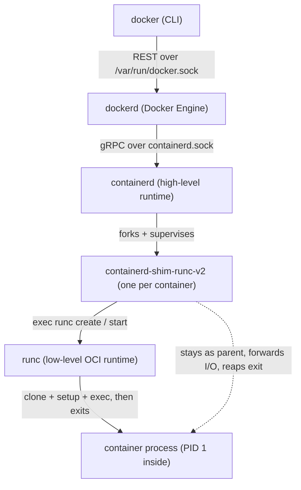
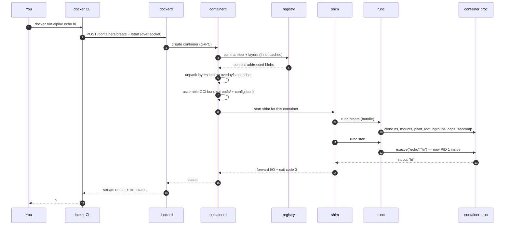

# Chapter 09 — How Docker really works

> You've now built, by hand, every mechanism a real container runtime relies on:
> namespaces, cgroups, `pivot_root`, capability drops, seccomp. So here's the
> punchline of the whole guide — **Docker is not magic, and it is not one program.**
> It's a short stack of daemons and tools that pass the work down a chain until, at
> the very bottom, something does *exactly* what our [mini-docker](../src/step7-mini-docker/main.go)
> does. This chapter names every layer, tells you who does what, and walks a single
> `docker run alpine echo hi` from your keystroke to an isolated process and back.

## What you'll learn

- The layer cake: how `docker` (CLI) → `dockerd` → `containerd` → `containerd-shim` →
  `runc` delegate work, and why there are so many pieces.
- What `runc` *actually does* — and why it's the same list of syscalls you already wrote.
- The shim's quiet, important job, and what "daemonless" really buys you.
- The **OCI specs** (Runtime + Image) that make Docker, Podman, and CRI-O interchangeable.
- Where **Kubernetes** and the **CRI** plug in, and how registries distribute images.
- The full `docker run` sequence, layer by layer.

> This chapter is a *map*, not a build step. We won't re-teach namespaces or cgroups
> mechanics — those live in [chapter 03](03-namespaces.md), [chapter 04](04-cgroups.md),
> and the Go build in [chapter 05](05-building-a-container-in-go.md). Here we connect
> what you built to the production stack it mirrors.

---

## One command, five programs

When you type `docker run`, it *feels* like a single tool. It isn't. The word
"Docker" is a whole product built from independently-shipped layers, each with a
narrow job, each talking to the next over a socket. Here is the delegation chain for
a running container:



Read it top to bottom as *decreasing altitude*: each layer knows less about "images"
and "users" and more about "syscalls." Let's take them one at a time.

| Layer | Kind | Responsible for |
| --- | --- | --- |
| `docker` | CLI client | Parses your command; sends an HTTP request to the daemon. Holds no container state. |
| `dockerd` | Daemon (Engine) | The Docker-branded API: images, networks, volumes, `docker build`, auth. Delegates *running* down. |
| `containerd` | High-level runtime | Image pull & storage, snapshots (layers), container lifecycle, supervision. The real workhorse. |
| `containerd-shim-runc-v2` | Per-container process | Stays alive as the container's parent; forwards stdio; reports the exit code. |
| `runc` | Low-level OCI runtime | Reads a bundle, does the syscalls, execs the entrypoint — then **exits**. |

### `docker` — the thin client

The `docker` CLI is almost dumb by design. It turns `docker run alpine echo hi` into
an HTTP request and writes it to a Unix socket at `/var/run/docker.sock` (or a TCP
endpoint, or a remote host via `DOCKER_HOST`). It keeps no container state of its own.
Kill the CLI after starting a detached container and nothing happens to the container —
proof that the client is not where containers *live*.

### `dockerd` — the Engine and its API

`dockerd` is the long-running daemon that answers that socket. It owns the
*Docker-flavoured* concerns: the `docker build` engine, image tags and the local
image store, named volumes, the `bridge`/`docker0` networking from
[chapter 07](07-networking.md), and authentication to registries. What it deliberately
does **not** do anymore is talk to the kernel to start containers. For that it hands
off, over gRPC, to `containerd`.

### `containerd` — the high-level runtime

`containerd` is the piece most people have never heard of and that does most of the
work. It is a standalone daemon (a graduated CNCF project, usable entirely without
Docker) responsible for:

- **Pulling images** from registries and verifying their content-addressed digests.
- **Snapshots** — unpacking image layers into the overlayfs stack you met in
  [chapter 06](06-rootfs-and-images.md), and producing the writable top layer.
- **Container lifecycle** — create, start, kill, delete — exposed as a clean gRPC API.
- **Supervision** — knowing which containers exist and what state they're in.

But `containerd` doesn't call `clone()` either. It goes one level lower still.

### `containerd-shim-runc-v2` — one small parent per container

For every container, `containerd` starts a **shim** — `containerd-shim-runc-v2` — and
then the shim, not containerd, invokes `runc`. Why insert a whole extra process? Because
the shim is what makes Docker **daemonless-capable**, which we'll unpack in a moment.

### `runc` — where the guide's code lives

At the bottom sits `runc`: a small, non-daemon CLI that receives a directory and a
config file and *does the container*. When it's done setting up, it execs your program
and gets out of the way. **`runc` is the thing our mini-docker is a toy version of.**

---

## What `runc` actually does (you already wrote it)

Here is the quietly satisfying part. Point `runc` at an **OCI bundle** — a directory
containing a `rootfs/` and a `config.json` — and run `runc create` then `runc start`.
Under the hood it performs, in order, essentially this list:

1. `clone()` / `unshare()` the namespaces named in `config.json` (`CLONE_NEWPID`,
   `CLONE_NEWNS`, `CLONE_NEWUTS`, `CLONE_NEWNET`, `CLONE_NEWIPC`, and — for rootless —
   `CLONE_NEWUSER` with UID/GID maps). → **[chapter 03](03-namespaces.md)**
2. Set the hostname, mount `/proc`, `/sys`, `/dev` and the bind mounts the config asks for.
3. `pivot_root` into `rootfs/`, then detach the old root so there's no path back to the host.
   → **[chapter 06](06-rootfs-and-images.md)**
4. Move the process into the **cgroup** the config specifies and write the resource limits
   (`memory.max`, `pids.max`, CPU shares). → **[chapter 04](04-cgroups.md)**
5. Drop the capabilities not on the allow-list, set the **`no_new_privs`** bit, and load
   the **seccomp** BPF filter. → **[chapter 08](08-security-and-hardening.md)**
6. `execve()` the entrypoint from `config.json`'s `process.args`. That exec'd program
   becomes PID 1 inside the container.

Recognize that list? It is, almost line for line, what
[`step7-mini-docker/main.go`](../src/step7-mini-docker/main.go) does in its `child`
function — clone the namespaces via `SysProcAttr.Cloneflags`, `Sethostname`, bind-mount
and `PivotRoot`, mount `/proc`, write the cgroup files, and finally `syscall.Exec`.
The differences between our toy and the real thing are **completeness and rigor**, not
kind: `runc` reads its whole configuration from a spec file instead of environment
variables, handles the rootless UID-mapping dance and the seccomp/capabilities steps we
left as labelled exercises, cleans up meticulously on failure, and speaks a defined
lifecycle protocol so a supervisor can drive it. Same syscalls, grown up.

> **The one-sentence version:** `runc` is a faithful, hardened implementation of the
> exact program you built by hand. Everything above it — the shim, containerd, dockerd,
> the CLI — exists to *feed `runc` a bundle* and *manage the process it leaves behind.*

---

## The shim's job, and "daemonless"

So why does `containerd` start a shim and let *it* run `runc`, instead of running
`runc` directly? Because of what happens **after** `runc` execs and exits.

Remember: `runc` is short-lived. It sets everything up, execs your entrypoint, and
terminates. That would orphan the container process — so *something* has to remain as
its parent to hold the stdio pipes, keep the pseudo-terminal open, and collect the exit
status when it finally dies. That something is the **shim**.

The shim is a tiny process that:

- **Stays alive as the container's parent** (a subreaper) for the container's whole life.
- **Forwards I/O** — stdin/stdout/stderr, or a PTY — between the container and whoever attached.
- **Reaps the exit code** and reports it back up to `containerd`.

Because the shim owns the container and the shim is *not* a child of `dockerd` or even
of `containerd`, you get the property that makes the whole architecture worthwhile:

> **You can restart or upgrade `dockerd` and `containerd` without killing running
> containers.** Stop the daemon, install a new version, start it again — the shims kept
> the containers running the entire time, and the restarted daemon simply reconnects to
> the still-present shims.

This is what people mean by Docker/containerd being **daemonless-capable**: the
long-lived daemons are the *control plane*, not the *thing that must exist for the
container to keep breathing*. A crashed or upgraded daemon is an outage of the API, not
of your workloads. (Contrast the bad old days when a Docker restart took every container
with it.)

---

## The OCI specs: why any image runs on any runtime

None of this interoperates by accident. The **Open Container Initiative (OCI)** — a
Linux Foundation project seeded by Docker in 2015 — publishes the contracts that let
you pull an image built by Docker and run it under Podman via CRI-O without anyone
having negotiated. There are three specs; two matter here.

**The Runtime Spec** defines the **bundle** and the **lifecycle**. A bundle is just:

```text
mybundle/
├── config.json      # the container's entire configuration
└── rootfs/          # the root filesystem to pivot into
```

`config.json` is the machine-readable version of every decision you made by hand: which
namespaces, which mounts, the cgroup limits, the capability set, the seccomp profile,
and `process.args` (the entrypoint). The spec also defines the **lifecycle** a runtime
must implement — the states `creating → created → running → stopped` and the operations
`create`, `start`, `kill`, `delete`, `state` — which is exactly the protocol the shim
uses to drive `runc`.

**The Image Spec** defines what a distributable image *is* — a **manifest** pointing at
a **config** (env, entrypoint, the ordered list of layers) and the **layers** themselves,
every object addressed by its `sha256` digest. You took this apart in
[chapter 06](06-rootfs-and-images.md); the point here is that it's a standard, not a
Docker-proprietary blob.

Because these are *specs*, the ecosystem is a grid of interchangeable parts:

| Role | Options that all follow the OCI spec |
| --- | --- |
| Low-level runtime (Runtime Spec) | `runc`, `crun` (C, faster), `runsc` (gVisor sandbox), `kata-runtime` (micro-VM) |
| High-level runtime | `containerd`, CRI-O |
| Image builder/format (Image Spec) | Docker, BuildKit, Buildah, Kaniko |
| Client / engine | Docker, Podman, nerdctl |

Swap `runc` for `crun` and containers start faster. Swap it for `runsc` and each
container runs inside a user-space kernel sandbox — *stronger isolation, same bundle*.
That plug-compatibility is the entire payoff of standardizing the mechanisms you built.

---

## The Kubernetes angle, briefly

Kubernetes never talks to Docker or `runc` directly. Its node agent, the **kubelet**,
speaks the **CRI (Container Runtime Interface)** — a gRPC API for "pull this image,"
"create this pod sandbox," "start this container." Any runtime that implements the CRI
can back a cluster. In practice the kubelet calls **`containerd`** (via its built-in CRI
plugin) or **CRI-O**, and *those* invoke a shim and `runc` exactly as described above.
(The old `dockershim` adapter that let the kubelet drive Docker directly was removed in
Kubernetes 1.24 — Docker's engine wasn't a CRI runtime, so it needed a translator, and
that translator is gone. `containerd`, which Docker already used underneath, stayed.)
So the chain under Kubernetes is simply: `kubelet → CRI → containerd/CRI-O → shim → runc`.

---

## Registries and distribution, briefly

Where do the layers come from? An **OCI registry** (Docker Hub, GHCR, ECR, a self-hosted
Harbor) speaks the **OCI Distribution Spec** — an HTTP API for pushing and pulling
content-addressed blobs. When `containerd` pulls `alpine`, it fetches the manifest, then
requests each layer *by its digest*. Because layers are content-addressed, a layer you
already have is never downloaded again, and the digest is self-verifying — the bytes
either hash to the name you asked for or they don't. Push is the same in reverse: upload
each new blob, then the manifest that references them. Registries are, in essence, a
content-addressed store with an auth layer.

---

## The full journey: `docker run alpine echo hi`

Now put every layer in motion at once. Here is what actually happens between your Enter
key and the two characters `hi` appearing on your terminal.



Narrated, layer by layer:

1. **CLI → Engine.** `docker` serializes your command and POSTs it to `dockerd` over
   `/var/run/docker.sock`. The CLI's job is now essentially done.
2. **Engine → containerd.** `dockerd` resolves the `alpine` reference and asks
   `containerd` to create the container over gRPC.
3. **Pull.** If `alpine` isn't already local, `containerd` fetches the manifest and each
   missing layer *by digest* from the registry, verifying as it goes.
4. **Unpack → snapshot.** `containerd` unpacks the layers into an **overlayfs** stack and
   adds a writable upper layer — the container's root filesystem
   ([chapter 06](06-rootfs-and-images.md)).
5. **Bundle.** It writes a `config.json` (namespaces, mounts, cgroup limits, capability
   set, seccomp profile, and `process.args = ["echo","hi"]`) beside that `rootfs/`. That
   directory is now a valid **OCI bundle**.
6. **Shim.** `containerd` starts a `containerd-shim-runc-v2` for this container and hands
   it the bundle.
7. **`runc create`.** The shim invokes `runc`, which does the syscall dance —
   the very steps in mini-docker's `child`: clone the namespaces, mount, `pivot_root`,
   join the cgroup, drop capabilities, `no_new_privs`, load seccomp — and leaves the
   container process blocked, *created but not yet executing your program*.
8. **`runc start`.** The shim tells `runc` to proceed; the container process
   `execve`s `echo hi` and becomes PID 1 inside its namespaces. `runc` exits.
9. **Run & reap.** `echo` writes `hi`; the shim forwards that up through `containerd` and
   `dockerd` to your terminal, then reaps the exit code (`0`) and reports it. The
   overlay snapshot and bundle are torn down.

Nine steps, five programs, and at the heart of it — step 7 — the exact code you already
wrote. The rest is plumbing to fetch the image, build the bundle, and babysit the
process. Everything the *kernel* does to make `hi` come from an isolated PID 1, you now
understand from the inside.

---

## Recap

- **"Docker" is a layer cake**, not a program: `docker` (CLI) → `dockerd` (Engine) →
  `containerd` (high-level runtime) → `containerd-shim-runc-v2` (per-container parent) →
  `runc` (low-level OCI runtime) → your process.
- **`runc` does exactly what you built** — clone namespaces, mount + `pivot_root`, apply
  cgroups, drop capabilities, set `no_new_privs`, load seccomp, then `execve` the
  entrypoint — from an OCI bundle (`rootfs/` + `config.json`). **mini-docker is a toy `runc`.**
- **The shim stays alive as the container's parent**, forwarding I/O and reaping the exit
  code, which is why you can **restart or upgrade the daemons without killing containers**
  ("daemonless").
- **The OCI Runtime and Image specs** are why images and runtimes are interchangeable
  across Docker, Podman, CRI-O, `runc`, `crun`, and gVisor.
- **Kubernetes** plugs in via the **CRI** (`kubelet → containerd/CRI-O → shim → runc`), and
  **registries** distribute content-addressed layers over the OCI Distribution Spec.

*Next → [Chapter 10 — AppImage](10-appimage.md)*
