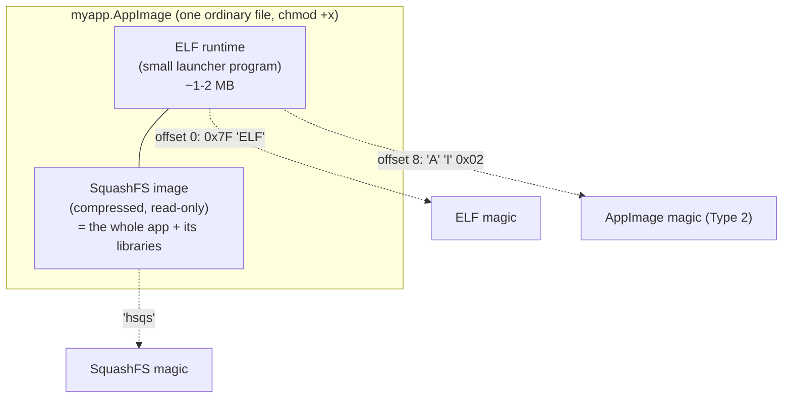
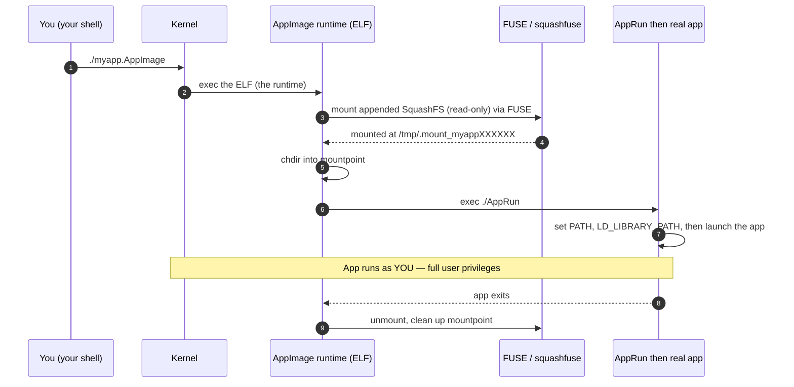

# Chapter 10 — AppImage

> Every chapter so far has been about *confining* a process — taking powers away,
> narrowing its view, capping what it can use. AppImage is the plot twist: a Linux
> technology whose whole job is the *opposite*. It doesn't lock an app down; it sets
> an app *free* to run anywhere. Understanding why it isn't a sandbox — and why it was
> never meant to be — sharpens the four-questions model better than another cgroup ever
> could.

## What you'll learn

- How a Type 2 AppImage is physically laid out on disk: a tiny ELF **runtime**
  concatenated with a compressed **SquashFS** image, plus the AppImage magic bytes.
- What actually happens the instant you run one — the FUSE mount, the temporary
  mountpoint, and the `AppRun` entrypoint.
- What AppImage bundles, and how that solves "dependency hell" and per-distro packaging.
- Why AppImage provides **zero isolation** — no namespaces, no cgroups, no seccomp —
  and how that maps onto the guide's four questions.
- How AppImage compares to **Flatpak** and **Snap**, and how to add a sandbox yourself
  with Firejail or bubblewrap.

## One app, one file

Before AppImage, shipping a Linux desktop app meant shipping it *N* times: a `.deb` for
Debian and Ubuntu, an `.rpm` for Fedora and openSUSE, an Arch `PKGBUILD`, and a prayer
that every distro carries the exact library versions you built against. Miss one and
your user meets `error while loading shared libraries` — the infamous *dependency hell*.

AppImage's pitch is a single sentence: **one app equals one file; download it, `chmod
+x`, and run it.** No installer, no root, no package manager, no touching `/usr`. The
file you download *is* the application, dependencies included, and it runs on more or
less any reasonably modern Linux distribution.

That convenience is the entire point — and, as you'll see, the entire limitation.

## The format: an executable that carries its own filesystem

A modern (Type 2) AppImage is a clever concatenation of two things stapled into one
file:



Read that top to bottom:

- **The ELF runtime** comes first, so the file starts with the standard ELF magic
  `0x7F 45 4C 46` (`\x7FELF`). To the kernel it's just a normal executable — which is
  exactly why double-clicking or `./myapp.AppImage` works with no special handling.
- **The AppImage magic bytes** sit at **offset 8**: `0x41 0x49` (ASCII `A` `I`) followed
  by a type byte — `0x02` for Type 2. This lands in the ELF header's `e_ident` padding
  area (the bytes after `EI_OSABI`), which the ELF loader ignores, so the marker
  identifies the file as an AppImage without breaking ELF compatibility.
- **The SquashFS image** is appended immediately after the runtime. SquashFS is a
  compressed, read-only Linux filesystem; its own superblock starts with the magic
  `hsqs`. The runtime knows where this image begins (it records the offset) and treats
  everything from there to EOF as the app's private filesystem.

> **Type 1 vs Type 2.** The original Type 1 AppImages embedded an **ISO 9660**
> filesystem (mountable with a plain loopback mount) and relied on a separate
> `AppRun` binary. Type 2 — the current, default format produced by `appimagetool` —
> switched to SquashFS for better compression and a self-contained runtime. When people
> say "AppImage" today, they mean Type 2.

Because it's just `[runtime][filesystem]`, you can inspect the pieces with ordinary
tools:

```bash
# The AppImage magic bytes at offset 8 (expect: 41 49 02 for Type 2)
xxd -s 8 -l 3 myapp.AppImage

# Where does the SquashFS image start? Find its 'hsqs' magic.
# (The runtime stores this offset; this just proves it's really in there.)
grep -aboe 'hsqs' myapp.AppImage | head -n1
```

## What happens when you run it

Since the file is a legitimate ELF, the kernel loads and runs the **embedded runtime**
— not the app itself. The runtime's job is to make the appended filesystem available
and then get out of the way:



Step by step:

1. **The runtime mounts the SquashFS image, read-only, using FUSE** — Filesystem in
   Userspace. It uses a bundled `squashfuse` (via `libfuse` / `libfuse3` on newer
   runtimes) and the `fusermount` / `fusermount3` helper to attach the filesystem
   without needing root. The mount appears at a temporary directory like
   **`/tmp/.mount_myappXXXXXX`** (the random suffix keeps concurrent runs from
   colliding).
2. **It `chdir`s into that mountpoint** and executes **`AppRun`**, the entrypoint at the
   root of the image. `AppRun` is often a small script (or binary) that sets up the
   environment — pointing `PATH`, `LD_LIBRARY_PATH`, and friends at the bundled
   `usr/bin` and `usr/lib` inside the mount — and then `exec`s the real application.
3. **The app runs** normally, reading its libraries and assets straight out of the
   read-only mount.
4. **On exit, the FUSE mount is torn down** and the temporary mountpoint is removed. No
   trace is left in `/usr`; nothing was "installed."

### The FUSE caveat, and the fallback

FUSE is AppImage's one real runtime dependency, and it's a common snag: on a host
without FUSE configured you'll see something like *"Cannot mount AppImage, please check
your FUSE setup."* Historically that meant `libfuse2`; the current Type 2 runtime can
build against **fuse3**, though distro coverage still varies.

When FUSE is unavailable, the runtime has an escape hatch — **extract-and-run**: it
unpacks the SquashFS into a temporary directory, runs the app from there, and cleans up
afterward. You can also unpack manually:

```console
$ ./myapp.AppImage --appimage-extract        # unpack to ./squashfs-root/
$ ./squashfs-root/AppRun                      # run without any FUSE mount

$ ./myapp.AppImage --appimage-extract-and-run # or let the runtime do it
$ APPIMAGE_EXTRACT_AND_RUN=1 ./myapp.AppImage # same, via env var
```

`--appimage-extract` is also your window into the format: it's just files. Which is the
whole point of the next section.

## The critical framing: packaging, not protection

Here's the sentence to tattoo on your mental model:

> **AppImage answers "how do I *distribute* an app," not "how do I *confine* an app."**

Run the four questions from the [README](../README.md) against a running AppImage and
the answer to every one is *"nothing is done":*

| The four questions | Container | AppImage |
| --- | --- | --- |
| What can it **see**? (namespaces) | private PIDs, mounts, net, users | the host, in full — no namespaces |
| How much can it **use**? (cgroups) | capped CPU/memory/PIDs | uncapped — no cgroups |
| What does it **run from**? (rootfs) | its own image via `pivot_root` | its own files, but on the *host* root |
| What is it **allowed to do**? (caps/seccomp) | dropped caps, syscall filter | your full privileges — no seccomp |

An AppImage process is an ordinary process that happens to load its libraries from a
FUSE mount. It runs as **you**, with **your** UID, with full read/write access to
`$HOME`, your SSH keys, your browser cookies, your `~/.aws/credentials` — everything you
can touch, it can touch. There is no namespace, no cgroup, and no seccomp filter between
it and your system unless *you* add one.

That's not a bug in AppImage; it's the design. Bundling libraries so an app runs
everywhere and confining an app so it can't hurt you are different problems. AppImage
solves the first and deliberately leaves the second to you.

And this is exactly why an AppImage is so trivially *hackable* from the outside — the
curiosity that motivates this guide. It's `[files] + [a mount]`. You can `--appimage-extract`
it, patch a binary or swap a library, repackage it with `appimagetool`, or just point a
debugger at the process. There's no signed, sealed, kernel-enforced boundary standing in
your way. On macOS (chapter [11](11-macos-isolation.md)) that same tampering runs into
code signing and the App Sandbox; here, portability *is* openness.

## Adding a sandbox yourself

Because AppImage brings no confinement, if you want to run an untrusted one safely you
supply the boundary — using the very primitives this guide is about. Two common wrappers:

```bash
# Firejail: a setuid sandbox that drops the app into namespaces + a seccomp filter
firejail ./myapp.AppImage

# bubblewrap: unprivileged namespace sandbox (the engine Flatpak uses under the hood)
bwrap --unshare-all --ro-bind /usr /usr --ro-bind /lib /lib \
      --dev /dev --proc /proc --tmpfs /tmp \
      ./myapp.AppImage --appimage-extract-and-run
```

Both put the app into fresh namespaces and restrict what it can see and do — bolting on,
after the fact, the isolation AppImage never had.

## AppImage vs Flatpak vs Snap

AppImage is one of three "universal Linux package" formats, and the other two make the
opposite trade: they *lead* with sandboxing.

- **Flatpak** runs every app inside **bubblewrap**, combining **namespaces + seccomp +
  cgroups** with a per-app permission model. By default an app sees only its own files
  and a read-only runtime, with no network or host access; reaching real host resources
  goes through **portals** — e.g. the file-chooser portal hands the app a single file
  descriptor the *user* picked, rather than blanket `$HOME` access. Crucially, this works
  even on distros with no system MAC policy, because it doesn't depend on AppArmor or
  SELinux.
- **Snap** confines "strict" snaps with an **AppArmor** profile plus a **seccomp** filter
  and a private mount namespace. The catch: AppArmor is enabled by default on Ubuntu but
  not everywhere (Fedora uses SELinux; Arch ships neither by default), so on some distros
  snapd falls back to weaker confinement. "Classic" snaps have no confinement at all.

| | AppImage | Flatpak | Snap |
| --- | --- | --- | --- |
| **Sandboxed by default?** | ❌ none | ✅ bubblewrap: namespaces + seccomp + portals | ✅ AppArmor + seccomp + mount ns (strict) |
| **Bundling model** | app + libs in one file | app + shared **runtimes** (dedup'd) | app + libs in a compressed image |
| **Central store?** | ❌ no — download the file anywhere | Flathub (decentralized remotes possible) | Snap Store (Canonical, centralized) |
| **Runtime mechanism** | ELF runtime → FUSE-mount SquashFS | `flatpak` + bubblewrap + OSTree | `snapd` daemon + SquashFS mounts |
| **Install / root needed?** | none — just `chmod +x` | per-user or system, no root for user installs | needs the `snapd` daemon |

Notice Flatpak and Snap both quietly reuse the machinery you built in earlier chapters:
namespaces ([03](03-namespaces.md)), cgroups ([04](04-cgroups.md)), and seccomp
([08](08-security-and-hardening.md)). They're desktop-app confinement built from the same
kernel Lego as containers. AppImage simply chose not to play that game — and by opting
out, it makes the boundary's *absence* wonderfully easy to see.

## Recap

- A Type 2 AppImage is a single file: a small **ELF runtime** with a compressed,
  read-only **SquashFS** image appended after it, marked by AppImage magic bytes
  (`A` `I` `0x02`) at offset 8 in the ELF header padding.
- Running it executes the runtime, which **FUSE-mounts** the SquashFS read-only at a temp
  path like `/tmp/.mount_...`, `chdir`s in, and `exec`s **`AppRun`**, which sets up the
  environment and launches the real app; the mount is torn down on exit. FUSE is the one
  real dependency, with `--appimage-extract`/extract-and-run as the fallback.
- Its purpose is **portability** — bundle the app and its libraries so it runs across
  distros without installation, killing dependency hell.
- It is **not a sandbox**: no namespaces, no cgroups, no seccomp; the app runs with your
  full user privileges and full access to `$HOME`. Add isolation yourself with **Firejail**
  or **bubblewrap**.
- **Flatpak** and **Snap** do sandbox by default (bubblewrap + portals; AppArmor +
  seccomp), reusing the same kernel primitives containers do — the opposite end of the
  spectrum from AppImage's "distribute, don't confine."

*Next → [Chapter 11 — macOS isolation](11-macos-isolation.md)*
