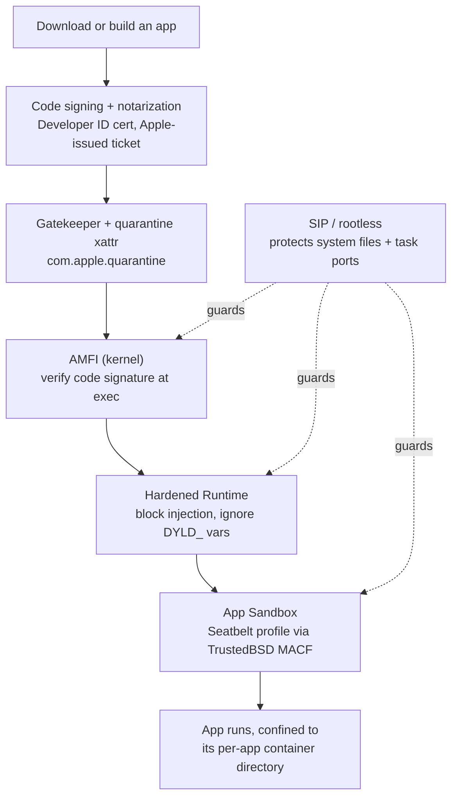
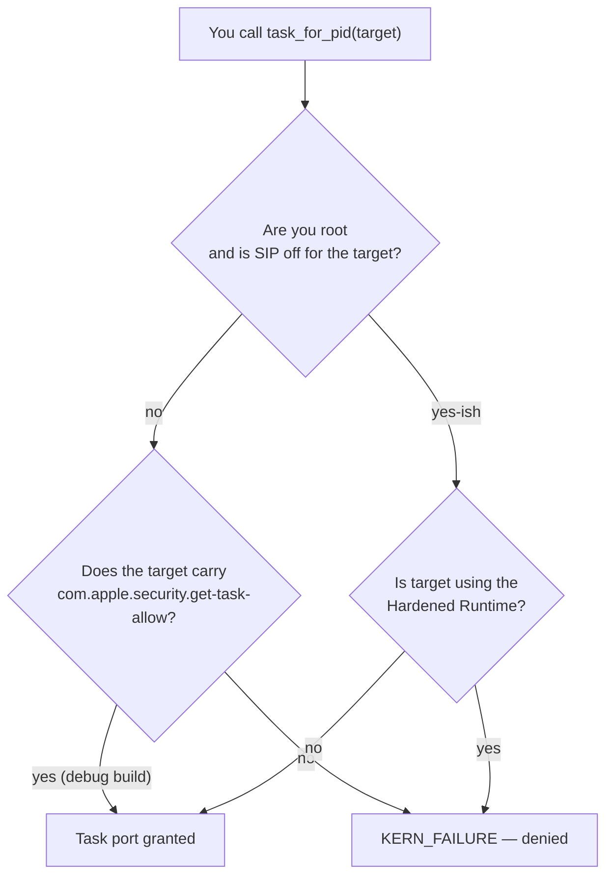
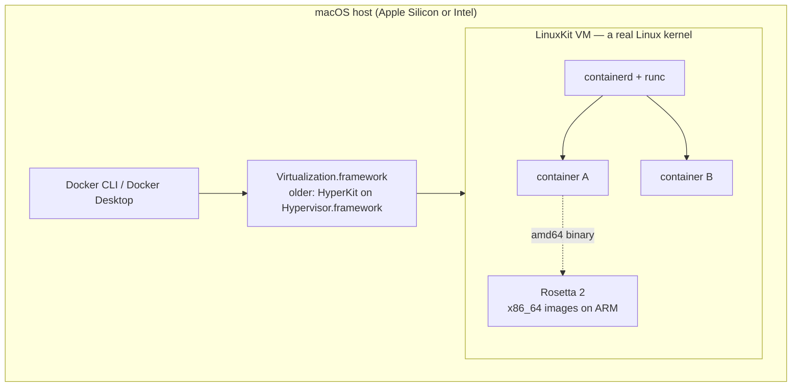

# Chapter 11 — macOS isolation

> Try to write a memory editor, a trainer, or a DLL-injector on macOS the way you
> would on Windows and you hit a wall that feels almost personal. `task_for_pid`
> returns `KERN_FAILURE`. Your dylib refuses to load. Gatekeeper won't even let your
> tool *launch*. And yet — somehow — `docker run ubuntu` works fine on the same
> machine. This chapter untangles that apparent contradiction. macOS isolates code
> for a completely different reason than Linux containers do, using a completely
> different stack, and once you see the layers the "no hacks" mystery dissolves.

## What you'll learn

- What the macOS **App Sandbox** actually is — a per-app, kernel-enforced **security**
  boundary built on **Seatbelt** and the **TrustedBSD MAC framework** — and how it
  differs from a Linux container.
- How **entitlements**, **code signing**, **notarization**, **Gatekeeper**, **AMFI**,
  the **Hardened Runtime**, and **SIP** stack into a defense-in-depth pipeline.
- The precise reason classic memory hacks fail: the `task_for_pid` / `mach_vm_*`
  chain and the `com.apple.security.get-task-allow` entitlement.
- Why "Docker on Mac" is really **Linux-in-a-VM** — a LinuxKit guest on Apple's
  **Virtualization.framework** — and where **Rosetta 2** fits.

## macOS isolates to protect *you*, not to package apps

Everything in this guide so far has been about **isolation for packaging and
resource control**: give a process its own view (namespaces), cap what it uses
(cgroups), give it its own root (pivot_root). A Linux container is fundamentally a
*deployment* technology that happens to also be a security boundary if you harden it.

macOS comes at the problem from the opposite end. Its confinement is a **Mandatory
Access Control (MAC)** system whose entire job is to stop code — even code you
installed on purpose — from touching things it has no business touching: your files,
your keychain, *other processes' memory*. It is a **security** sandbox first and
always. That difference in *goal* is why the two ecosystems feel so different, and
it's the thread we'll pull on all chapter (chapter [13](13-comparison-and-further-reading.md)
lines them up side by side).

## The App Sandbox: Seatbelt on top of TrustedBSD MAC

macOS inherits from FreeBSD the **TrustedBSD MAC framework** — a set of kernel hooks
sprinkled through the syscall paths (file opens, `mmap`, Mach port lookups, socket
creation, and so on). A policy module can register callbacks on those hooks; each
callback returns `0` to allow an operation or non-zero to deny it. Apple's sandbox is
implemented exactly this way: a kernel extension, **`Sandbox.kext`**, registers as a
MAC policy. The historical codename for this machinery is **Seatbelt**.

When a process is sandboxed, the kernel consults a **sandbox profile** on every
guarded operation. Profiles were historically written in a Scheme-like language
(SBPL — the Sandbox Profile Language, seen in `.sb` files such as those once under
`/System/Library/Sandbox/Profiles/`), then **compiled to bytecode** and evaluated
in-kernel — regex path matching and all. Userspace kicks a sandbox on via the
`sandbox_init()` family (the now-deprecated `sandbox-exec` tool wraps it); App Store
apps get it declaratively through an entitlement.

Two facts to keep straight, because people get them wrong:

- The App Sandbox is **opt-in** for apps distributed outside the Mac App Store. A
  developer enables it by adding the `com.apple.security.app-sandbox` entitlement.
- It is **mandatory** for anything shipped through the **Mac App Store** (a rule
  Apple has enforced since 2012).

A sandboxed app is confined to a **container directory** — `~/Library/Containers/<bundle-id>/`
— which becomes its private `$HOME`-like world. It cannot read your Documents, reach
the network, or use the camera unless a matching entitlement grants that specific
power. Deny by default; allow by declaration.

## Entitlements: signed capabilities baked into the binary

An **entitlement** is a key/value capability embedded *inside the code signature* of
the binary. Because it lives in the signature, it is **cryptographically sealed** —
you cannot add `com.apple.security.network.client` to someone else's app without
invalidating their signature. At load time the kernel (via AMFI, below) reads these
entitlements and grants exactly those powers.

| Entitlement | Grants |
| --- | --- |
| `com.apple.security.app-sandbox` | Turn the App Sandbox on for this app |
| `com.apple.security.network.client` | Make outbound network connections |
| `com.apple.security.files.user-selected.read-write` | Access files the user picks in an open/save panel |
| `com.apple.security.device.camera` | Use the camera |
| `com.apple.security.get-task-allow` | Let another process obtain this task's port (debug builds) |

That last one is the villain of the memory-hacking story. Hold that thought.

## Defense in depth: the gates every app passes through

No single mechanism does all the work. macOS stacks several independent layers, each
enforced in a different place, so that defeating one still leaves the others standing.



Walking the stack:

- **Code signing + notarization.** Apps are signed with a **Developer ID**
  certificate and, for distribution outside the App Store, uploaded to Apple for
  **notarization** — an automated malware scan that returns a **ticket**, which the
  developer **staples** to the app. The signature proves *who* built it and that it
  hasn't been altered since.
- **Gatekeeper + quarantine.** When you download something, the OS tags it with the
  `com.apple.quarantine` extended attribute. The first time you open a quarantined
  app, **Gatekeeper** checks that it is signed by an identified developer and
  notarized; unsigned or un-notarized code is refused by default. (You can strip the
  xattr with `xattr -d com.apple.quarantine ./App.app` — the manual "I know what I'm
  doing" escape hatch.)
- **AMFI — AppleMobileFileIntegrity.** A kernel component (backed by the userspace
  `amfid` daemon) that **enforces code signing at execution time**. It verifies every
  executable page's signature and reads the binary's entitlements. Tampered or
  unsigned code simply won't load. AMFI itself is wired in as a MACF policy.
- **Hardened Runtime.** An opt-in (and **notarization-required**) mode that clamps
  down a running process: it **blocks loading unsigned libraries** into the process,
  **ignores `DYLD_INSERT_LIBRARIES`** and friends, and forbids executable-memory and
  debugging tricks unless the app carries an explicit entitlement (e.g.
  `com.apple.security.cs.allow-jit`, `...allow-dyld-environment-variables`,
  `...get-task-allow`, `...disable-library-validation`).
- **App Sandbox.** The Seatbelt/MACF confinement described above — the per-app
  boundary around files, network, and hardware.
- **SIP — System Integrity Protection.** Also called *rootless*, toggled only from
  Recovery via `csrutil enable`/`disable`. SIP protects system files, system
  processes, and kernel extensions so that **even `root` cannot modify them** — and,
  crucially for us, it **restricts `task_for_pid` against protected and system
  processes**. Root is no longer omnipotent.

## Why memory hacks fail: the `task_for_pid` chain

Here is the payoff you came for. On Windows, reading another process's memory is a
short story: `OpenProcess` → `ReadProcessMemory` → done. The macOS equivalent runs
straight into the wall of layers above.

To touch another process's address space on macOS you need its **Mach task port**.
The classic recipe is:

```c
// The canonical injection / memory-edit sequence — and why each step is now gated.
task_for_pid(mach_task_self(), target_pid, &task);   // 1. get the target's task port
mach_vm_read(task, addr, size, &data, &count);        // 2. read its memory
mach_vm_write(task, addr, buf, len);                  // 3. write into it
mach_vm_protect(task, addr, len, 0, VM_PROT_EXECUTE); // 4. make injected code runnable
thread_create_running(task, ...);                     // 5. run a thread on it
```

Everything hinges on step 1, and `task_for_pid` is where the defenses converge:



Read that flow and the whole thing clicks:

- **You need elevated rights *and* the stars to align.** Historically only `root`
  could call `task_for_pid` on another process. SIP then narrowed even that: a
  process protected by SIP (or a system/Apple-signed process) won't hand over its
  task port to anyone.
- **The one legitimate loophole is `get-task-allow`.** If the target was built with
  the `com.apple.security.get-task-allow` entitlement — the flag Xcode sets on
  **debug builds** so the debugger can attach — then a non-root process can obtain
  its task port. Shipping (release) apps don't carry it, so your favorite game
  doesn't either.
- **The Hardened Runtime seals the last gap.** For a binary using the Hardened
  Runtime that is **not Apple-signed**, the task port is off-limits **even to root**.
  So "just run the trainer with `sudo`" doesn't rescue you.
- **And injection is blocked from the other side too.** Even if you got a port, the
  Hardened Runtime refuses to load your unsigned dylib and ignores
  `DYLD_INSERT_LIBRARIES`; AMFI won't run unsigned pages; and the App Sandbox may
  stop your *tooling* from ever reaching the target in the first place.

Stack those and you get a boundary with no single soft spot. That is why classic
Windows-style DLL injection and live memory editing "just don't work" on stock macOS
— not one lock, but four, each guarding the others.

| Layer | Blocks | Enforced by |
| --- | --- | --- |
| SIP / rootless | task ports of protected & system processes | kernel |
| `task_for_pid` policy | reading/writing arbitrary process memory | kernel (Mach) |
| Hardened Runtime | unsigned dylib loads, `DYLD_*` injection | dyld + AMFI |
| AMFI | executing unsigned/tampered code | kernel + `amfid` |
| App Sandbox | the hacking tool's own file/IPC/network reach | `Sandbox.kext` (MACF) |

## So how does Docker run on macOS at all?

If macOS locks code down so thoroughly, why does `docker run` work? Because **it
doesn't run on macOS.** There is **no Linux kernel** on a Mac, and containers are a
*Linux-kernel* feature — namespaces and cgroups are syscalls the XNU kernel simply
does not have. A Linux container cannot run natively here, full stop.

Docker Desktop's answer is to bring a Linux kernel with it. It boots a **lightweight
Linux VM** (built with **LinuxKit**) and runs your containers **inside that VM**. On
Apple Silicon and modern Intel Macs the VM is hosted by Apple's high-level
**Virtualization.framework**; older Docker Desktop used **HyperKit** (a fork of
**xhyve**) on the lower-level **Hypervisor.framework**. Either way, "Docker on Mac"
= **Linux-in-a-VM**, with the familiar `containerd` + `runc` stack living *inside*
the guest.



Two details worth knowing:

- **Rosetta 2 for images.** On Apple Silicon, x86_64 (`amd64`) container images can be
  run through **Rosetta 2**, Apple's binary translator, letting an ARM Mac execute
  Intel Linux binaries far faster than pure QEMU emulation. You toggle it in Docker
  Desktop's settings.
- **File sharing across the boundary.** Your Mac's directories aren't in the VM, so
  bind mounts are shared in over a virtual filesystem — modern Docker Desktop uses
  **VirtioFS** (with **gRPC-FUSE** as an earlier option). This crossing is exactly why
  bind-mount I/O on a Mac is slower than native Linux: every read hops the VM boundary.

The lesson lands neatly against chapter [09](09-how-docker-really-works.md): the
`docker` → `containerd` → `runc` machinery you studied is unchanged — it's just
running one virtualization layer down, because the Mac can't offer it a Linux kernel
directly.

## macOS vs Linux containers, at a glance

| | Linux container | macOS App Sandbox |
| --- | --- | --- |
| **Primary goal** | isolation + packaging / deployment | **security** confinement (MAC) |
| **Granularity** | a process tree in fresh namespaces | one app, per-bundle-id |
| **Enforced by** | namespaces, cgroups, seccomp, LSMs | TrustedBSD MACF (`Sandbox.kext`), AMFI, SIP |
| **Configured by** | runtime flags / OCI spec | signed entitlements + sandbox profile |
| **Own root filesystem?** | yes (`pivot_root` + overlayfs) | no — a container *directory*, not a rootfs |
| **Run Linux images?** | natively | only inside a Linux VM |

They rhyme in vocabulary — both say "container," both say "sandbox" — but they solve
different problems. A Linux container asks *"what should this workload see and use?"*
A macOS sandbox asks *"what should we never let this app do to the user?"* Keep that
distinction; chapter [12](12-windows-isolation.md) shows Windows making yet a third
set of choices.

## Recap

- The macOS **App Sandbox** is a **kernel-enforced, per-app security boundary** built
  on **Seatbelt** and the **TrustedBSD MAC framework** (`Sandbox.kext`), driven by a
  compiled sandbox profile and started via `sandbox_init()`. It's **opt-in** off the
  App Store and **mandatory** on it.
- **Entitlements** are **signed** key/value capabilities inside the code signature;
  the kernel (via **AMFI**) reads them to grant specific powers.
- **Code signing → notarization → Gatekeeper/quarantine → AMFI → Hardened Runtime →
  App Sandbox → SIP** form a defense-in-depth stack, each layer enforced independently.
- Memory hacks fail because `task_for_pid` is gated by SIP and root, only opens up for
  targets carrying `com.apple.security.get-task-allow` (debug builds), and is denied
  even to root for **Hardened Runtime** binaries — while AMFI and the sandbox block
  unsigned injection from the other side.
- **Docker on macOS is Linux-in-a-VM**: a **LinuxKit** guest on **Virtualization.framework**
  (older: HyperKit/xhyve), running `containerd`/`runc` inside, with **Rosetta 2** for
  amd64 images and **VirtioFS** for bind mounts. There is no Linux kernel on the Mac.

*Next → [Chapter 12 — Windows isolation](12-windows-isolation.md)*
