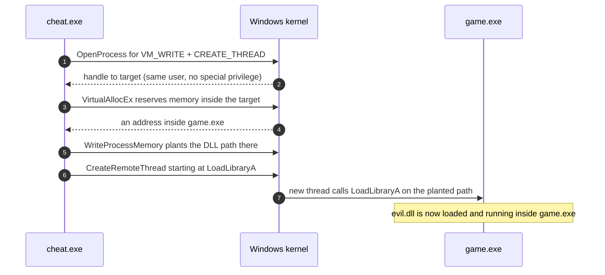
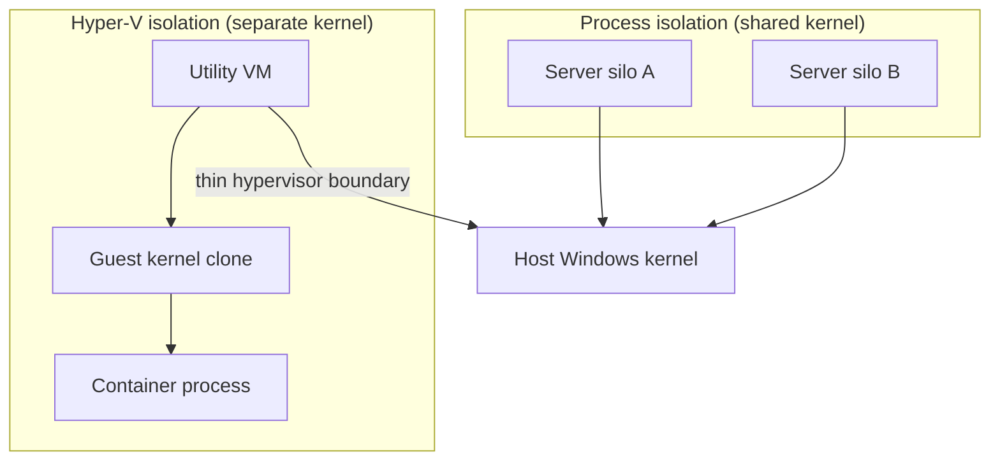

# Chapter 12 — Windows isolation

> On a Mac, a random app can't reach into your game's memory — the OS forbids it.
> On Windows, a random app *usually can*, and that single fact explains everything
> from why trainers and memory editors are a cottage industry to why your anti-cheat
> insists on installing a kernel driver. Windows *has* real isolation — job objects,
> AppContainer, silos, Hyper-V — it just doesn't force it on the decades of ordinary
> Win32 software it refuses to break.

## What you'll learn

- Why classic Win32 desktop apps have **no mandatory sandbox**, and how that makes
  the canonical `OpenProcess` → `WriteProcessMemory` → `CreateRemoteThread` DLL
  injection so easy — the exact reason anti-cheat ships **ring-0 kernel drivers**.
- What Windows *does* enforce by default: **Mandatory Integrity Control** and UIPI,
  and why they're a speed bump, not a sandbox.
- The isolation primitives Windows genuinely has — **job objects** (its cgroups),
  **AppContainer** (its App Sandbox), and **Windows Sandbox** (a disposable VM).
- **Windows containers**: process isolation via **server silos** vs. **Hyper-V
  isolation** via a utility VM — the two analogues of everything you built earlier.
- Why **WSL2** and **Docker Desktop** mean your Linux containers on Windows still
  run inside a Linux VM — the same punchline as [macOS](11-macos-isolation.md).

## The default posture: backward compatibility over sandboxing

Windows has to run software from 1998. That is not a joke — it is a design
constraint that outranks almost everything else, and it shapes the entire security
model. A classic **Win32** desktop application (a plain `.exe`, not a Store app) runs
with your full user token and, by default, is **not confined to a sandbox at all**.
It can open files anywhere your account can, spawn processes, load DLLs, and — the
part that matters here — reach into other processes running as the same user.

Compare that to the [macOS](11-macos-isolation.md) story, where the App Sandbox and
TrustedBSD MAC hooks apply a *mandatory* policy the app cannot escape even if it
wants to. Windows has the machinery to do the same (you'll see it below), but it does
not switch it on for ordinary Win32 apps, because doing so would break the very
software the platform exists to keep running. Isolation on Windows is therefore
mostly **opt-in**, tied to specific app models, rather than a universal floor.

## The canonical hack: same-user process injection

Here's the concrete consequence. On Windows, security is enforced per **securable
object**, and a process is a securable object with a security descriptor. By default,
a process's descriptor **grants the owning user full access to it**. So if `cheat.exe`
and `game.exe` run as *you*, `cheat.exe` can legitimately ask the kernel for a handle
to `game.exe` with rights like `PROCESS_VM_WRITE` and `PROCESS_CREATE_THREAD` — no
exploit, no privilege escalation, just the access-control system working as designed.

From that handle, the classic DLL-injection recipe writes itself:

```c
/* The textbook memory-editor / trainer / cheat technique. */
HANDLE h = OpenProcess(PROCESS_ALL_ACCESS, FALSE, targetPid);
void  *mem = VirtualAllocEx(h, NULL, size, MEM_COMMIT, PAGE_READWRITE);
WriteProcessMemory(h, mem, "C:\\evil.dll", size, NULL);   /* plant the path */
/* Start a thread in the *target* whose entry point is LoadLibraryA,
   with our string as its argument. LoadLibraryA lives at the same
   address in every process, so we can look it up locally. */
CreateRemoteThread(h, NULL, 0, (LPTHREAD_START_ROUTINE)LoadLibraryA, mem, 0, NULL);
```



That's it. No memory corruption, no unsigned-code trickery — just four documented
Win32 calls. Once the DLL is loaded *inside* the target, it shares the target's
address space and can read health values, patch functions, or hook rendering. The
same primitives (`ReadProcessMemory` / `WriteProcessMemory`) power every "memory
editor" and trainer without even bothering to inject a DLL.

If the target runs as a **different** user or at a higher integrity level, you can't
just open it — unless you hold **`SeDebugPrivilege`**, which lets you bypass a
process's security descriptor entirely and open essentially anything. That privilege
is normally held (and must be explicitly enabled) by administrators, which is exactly
why "run as admin" is such a powerful lever on Windows.

### Why anti-cheat lives in the kernel

Now the anti-cheat detour makes sense. On [macOS](11-macos-isolation.md), a game
gets meaningful protection *for free*: the OS won't let a same-user app read its
memory, so cheating means fighting the kernel. On Windows the OS hands that same
capability to any same-user process. If you're Riot, Epic, or BattlEye, **the
platform will not isolate the game for you** — so you appoint yourself the police and
move to where you can actually watch memory, threads, and drivers: **ring 0**, the
kernel.

That's why the big anti-cheats ship **kernel-mode drivers**: Riot **Vanguard**
(`vgk.sys`), **EasyAntiCheat**, and **BattlEye** all load code at the same privilege
level as the OS itself so they can see cheats that user-mode tools would miss —
including other kernel-mode cheats. (Vanguard historically loaded at boot and stayed
resident; in mid-2026 Riot began rolling out an "on-demand" mode that loads the
driver only when a protected game runs.) It's an arms race Windows' permissive
default makes almost unavoidable — and a large part of why kernel anti-cheat is so
controversial: a bug in that ring-0 driver is a bug with total control of your machine.

## What Windows *does* enforce: Mandatory Integrity Control

Windows isn't a free-for-all — it just isn't a sandbox. Since Windows Vista, every
process (and many objects) carries an **integrity level** under **Mandatory Integrity
Control (MIC)**. Think of it as a coarse trust ranking layered on top of normal
DACL permissions: a lower-integrity process is blocked from *writing* to a
higher-integrity object even if the DACL would otherwise allow it.

| Integrity level | Typical process | Rough meaning |
| --- | --- | --- |
| **System** | Services, kernel-adjacent processes | Highest; reserved for the OS |
| **High** | Elevated ("Run as administrator") apps | Trusted admin actions |
| **Medium** | Normal apps you launch as a standard user | The everyday default |
| **Low** | Sandboxed content (e.g. browser renderers, AppContainer) | Least trusted |

Two things ride on this. **UIPI** (User Interface Privilege Isolation) stops a
lower-integrity process from sending window messages to a higher-integrity window —
so a Medium app can't drive an elevated app's UI to click its own buttons. And
`SeDebugPrivilege` can't even be *enabled* below High integrity.

But notice what MIC does **not** do: two of *your* apps both run at **Medium**
integrity. MIC places no barrier between peers at the same level — which is precisely
the case that DLL injection exploits. MIC raises walls *between* trust tiers; it does
not sandbox apps *within* a tier. It's a real mechanism with real limits, not a
substitute for confinement.

## The real isolation primitives Windows offers

When Windows *does* want to confine something, it has good tools. They map neatly onto
the four questions this guide keeps asking — what a process can **see**, **use**, and
is **allowed to do**.

### Job objects — the "use" question (Windows' cgroups)

A **job object** groups one or more processes and imposes limits on them as a unit:
committed-memory caps (per process and per job), CPU rate and time limits, a maximum
active process count, working-set bounds, and **UI restrictions** that forbid the
job's processes from touching the clipboard, changing display settings, or reaching
the desktop. Kill the job and every process in it dies together. If that reads like
[cgroups](04-cgroups.md) with a side of confinement, that's exactly right — job
objects are the primitive Windows containers lean on for resource control, and they're
configured through structures like `JOBOBJECT_EXTENDED_LIMIT_INFORMATION`.

### AppContainer — the "allowed to do" question (Windows' App Sandbox)

**AppContainer** (introduced in Windows 8) is the real per-app sandbox. A process in
an AppContainer runs with a specially crafted **LowBox token**: **Low** integrity, a
unique **AppContainer SID** (identities beginning `S-1-15-2-…`), and a set of
**capability SIDs** that declare exactly which resources it may touch. By default it's
walled off from the filesystem, the network, and other apps; it only reaches what its
declared **capabilities** grant, and it gets a private, per-app profile and data
location. This is the mechanism behind **UWP / Microsoft Store** apps and the sandbox
in modern **Edge**.

Crucially, Microsoft has been extending AppContainer to plain desktop software as
**Win32 app isolation** (public preview from 2023), which launches a normal Win32 app
as a Low-integrity AppContainer process and treats that boundary as a genuine security
boundary. It is the closest Windows analogue to the macOS App Sandbox — capability-
declared, mandatory *for that process* — but the key phrase is **opt-in**: it applies
to specific app models and apps that adopt it, not to the whole Win32 world by fiat.

### Windows Sandbox — a disposable desktop in a VM

For "I want to run this sketchy installer and throw the whole environment away,"
there's **Windows Sandbox**: a lightweight, disposable desktop that runs as a
**Hyper-V virtual machine** on top of a read-only base image plus a differencing disk.
Every launch is a pristine Windows install, and **all state is discarded on close** —
closer to a fresh VM than to a per-app sandbox, and a hard boundary because it's a
real hypervisor guest.

## Windows containers: two isolation modes

Windows can run *containers* too — of Windows workloads — and it offers two isolation
strengths that echo the container-vs-VM tension from the [README](../README.md).



**Process isolation** is the direct analogue of what you built with
[namespaces](03-namespaces.md). Containers share the **host kernel** and are isolated
by a construct called a **server silo** — a job object extended (in Windows Server
2016 and later) with its own view of the system. Each silo gets its own root in the
**object manager namespace**, plus redirected **registry**, filesystem, and
**networking**, so named objects — even something like the meaning of `C:` — are
private to the silo. That's the Windows spelling of namespaces. The catch, just like
sharing a Linux kernel, is **version compatibility**: because the container reuses the
host's kernel, the host and container OS builds have to be compatible.

**Hyper-V isolation** trades overhead for a stronger wall. Each container runs inside
its own minimal **utility VM** with a **separate clone of the Windows kernel**, behind
the hypervisor — the same idea as Kata Containers or [macOS](11-macos-isolation.md)'s
approach of putting a VM under everything. You get a real hardware-enforced boundary
and freedom from exact host-kernel version matching, at a cost: plan for on the order
of a few hundred MB of extra memory per container plus overhead on the I/O, network,
and CPU paths.

| | Process isolation | Hyper-V isolation |
| --- | --- | --- |
| Kernel | Shared with host | Own kernel in a utility VM |
| Isolated by | Server silo (object mgr, registry, net) | Hypervisor + VM boundary |
| Linux analogue | Namespaces + cgroups | Kata-style micro-VM |
| Overhead | Minimal | Higher (extra memory + I/O) |
| Host/container OS match | Must be compatible | Relaxed |
| Boundary strength | Kernel-enforced | Hardware/hypervisor-enforced |

## WSL2 and Docker Desktop: the familiar punchline

So where do your everyday `docker run alpine` Linux containers fit? They **don't run
on the Windows kernel at all**. **WSL2** runs a genuine **Linux kernel** (built by
Microsoft) inside a lightweight, Hyper-V-managed **utility VM**. **Docker Desktop**'s
default backend uses that WSL2 Linux environment (or a Hyper-V VM), so your Linux
containers get their namespaces and [cgroups](04-cgroups.md) from a **real Linux
kernel running in a VM** — exactly the same arrangement as Docker on macOS.

The two container stories are genuinely separate: **Windows containers** (process or
Hyper-V) exist for **Windows** workloads and use silos; **Linux containers** on
Windows live in the **Linux VM**. Different kernels, different mechanisms, same lesson
you've now seen twice — *a container is a kernel feature, and it needs the matching
kernel to exist.*

## Recap

- Classic **Win32 apps have no mandatory sandbox** (backward compatibility), so a
  same-user process can `OpenProcess` → `WriteProcessMemory` → `CreateRemoteThread`
  and inject a DLL — the canonical cheat/trainer technique.
- Because the OS won't isolate the game, **anti-cheat moves into ring 0** as a
  kernel-mode driver (Vanguard's `vgk.sys`, EasyAntiCheat, BattlEye) to police memory
  itself — the mirror image of the macOS situation.
- **MIC + UIPI** rank trust between integrity tiers but don't sandbox peers at the
  same tier; the real tools are **job objects** (≈ cgroups), **AppContainer** (≈ App
  Sandbox, opt-in), and **Windows Sandbox** (a disposable Hyper-V VM).
- **Windows containers** come in **process isolation** (shared kernel, server silos)
  and **Hyper-V isolation** (utility VM with its own kernel) — the namespaces-vs-VM
  trade-off again.
- **WSL2 / Docker Desktop** run **Linux** containers inside a **Linux kernel in a VM**;
  Windows containers are a separate track for Windows workloads.

*Next → [Chapter 13: Comparison & further reading](13-comparison-and-further-reading.md)*
