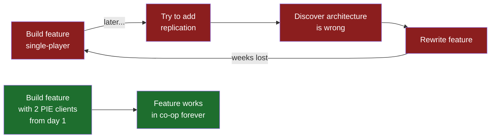
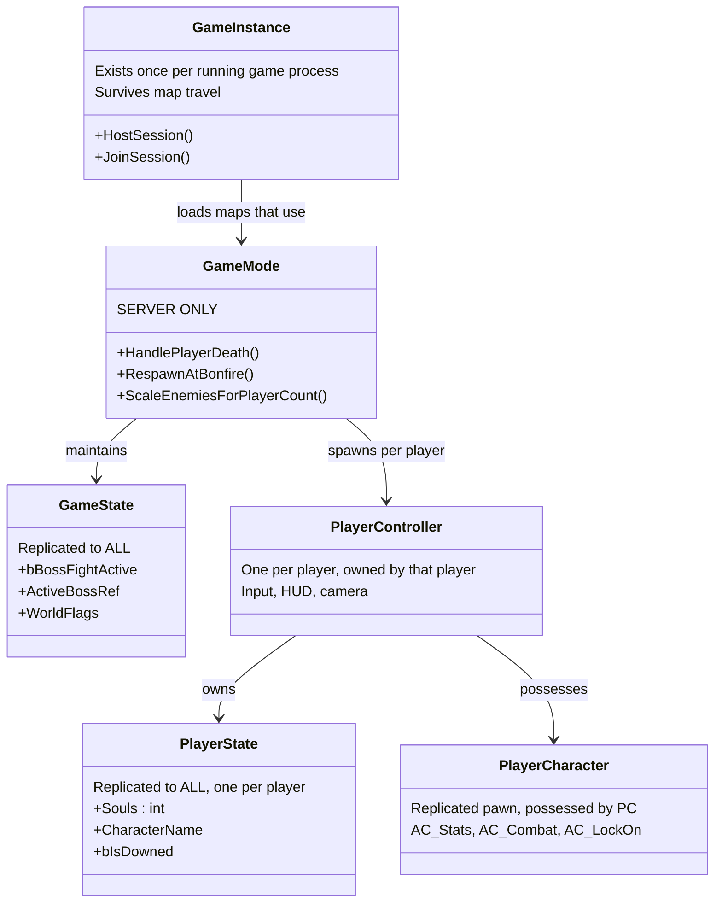
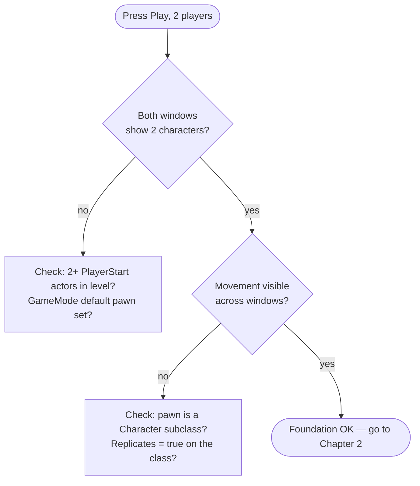

# Chapter 1 — Project Setup & Foundations

> **Goal of this chapter:** a clean UE5 project, configured for multiplayer from day one, with a folder structure and naming convention that won't collapse under its own weight in month three.

---

## 1.1 Why decisions in week 1 matter

A co-op game is not "a single-player game plus networking." Replication touches **every** system: movement, damage, animation, AI, pickups, doors, save games. The single most expensive mistake you can make is building systems single-player-first and "adding multiplayer later" — you will end up rewriting almost everything.

**Rule #0 of this entire guide: every feature is built and tested with 2+ clients from the very first day.**



## 1.2 Engine version & template

1. Install **Unreal Engine 5.4+** (5.3 works; 5.4/5.5 have better Enhanced Input and networked Chaos). Use the Epic Games Launcher → Unreal Engine → Library → `+`.
2. Create a new project:
   - Category: **Games → Third Person**
   - **Blueprint** (as agreed — C++ can be added to the same project later via *Tools → New C++ Class*, it converts the project in place)
   - Target Platform: Desktop, Quality: Maximum
   - **Starter Content: OFF** (keeps the project lean; we'll add what we need)
   - Name it something short without spaces, e.g. `Ashfall` (I'll use this name in paths throughout the guide).

> **Why the Third Person template?** It ships with a `Character` + `SpringArm` + `Camera` setup, Enhanced Input already wired, and — critically — `CharacterMovementComponent`, which has **built-in, battle-tested network prediction**. You get replicated, client-predicted movement for free. Never build a soulslike on a custom Pawn unless you enjoy writing movement netcode.

## 1.3 Project settings checklist

Open **Edit → Project Settings** and set these now:

| Setting | Location | Value | Why |
|---|---|---|---|
| Enable Multiplayer PIE | Editor Prefs → Level Editor → Play | Number of Players = **2–3** | You will always test in co-op |
| Net Mode | Same panel | **Play as Listen Server** | Matches the shipping architecture (Ch. 2) |
| Run Under One Process | Same panel | ON (dev), OFF (when testing sessions) | One process is faster to iterate |
| Default GameMode | Project → Maps & Modes | `BP_AshfallGameMode` (create in 1.5) | Central multiplayer authority |
| Enhanced Input | Project → Input | Already default in 5.1+ | All input in this guide uses it |
| Support Windowed | Project → Description | ON | Two windows side by side while testing |

## 1.4 Folder structure

Create this under `Content/` immediately. Everything in the guide references these paths.

```
Content/
└── Ashfall/
    ├── Core/                  # GameMode, GameState, PlayerState, PlayerController, GameInstance
    ├── Characters/
    │   ├── Player/            # BP_PlayerCharacter, ABP_Player, input assets
    │   └── Shared/            # Base classes shared by player & enemies
    ├── Enemies/
    │   ├── Common/            # BP_EnemyBase, shared AI assets
    │   ├── Hollow/            # First basic enemy
    │   └── Boss_Watcher/      # First boss
    ├── Combat/                # Damage types, hit reactions, weapon data
    ├── Components/            # AC_Stats, AC_Combat, AC_LockOn, AC_Interaction ...
    ├── Data/                  # DataTables, DataAssets, Curves, Enums, Structs
    ├── Items/                 # Weapons, consumables, pickups
    ├── Maps/
    │   ├── L_MainMenu
    │   ├── L_Hub              # Testing gym / hub level
    │   └── L_Dungeon01
    ├── UI/                    # Widgets: HUD, menus, health bars
    └── World/                 # Bonfires, doors, fog gates, triggers
```

**Naming convention** (used everywhere in this guide):

| Prefix | Asset type | Example |
|---|---|---|
| `BP_` | Blueprint class | `BP_PlayerCharacter` |
| `AC_` | Actor Component | `AC_Stats` |
| `ABP_` | Animation Blueprint | `ABP_Player` |
| `AM_` | Animation Montage | `AM_Attack_Light_01` |
| `BT_` / `BB_` / `BTT_` / `BTS_` | Behavior Tree / Blackboard / BT Task / BT Service | `BT_Hollow` |
| `WBP_` | Widget Blueprint | `WBP_HUD` |
| `DT_` / `DA_` | DataTable / DataAsset | `DT_Weapons` |
| `E_` / `F_` | Enum / Struct | `E_CombatState` |
| `IA_` / `IMC_` | Input Action / Mapping Context | `IA_Dodge` |
| `GE_` / `GA_` | (later, GAS) Effect / Ability | `GA_DodgeRoll` |

## 1.5 Core framework classes

Create these Blueprints in `Content/Ashfall/Core/`. Each inherits from the engine class in parentheses. Chapter 2 explains *why* each one exists and where it lives on the network — for now just create them and wire them up.

1. `BP_AshfallGameInstance` (**GameInstance**) — survives level travel; will hold session logic (Ch. 3).
2. `BP_AshfallGameMode` (**GameModeBase**) — server-only rules: spawning, death, respawn.
3. `BP_AshfallGameState` (**GameStateBase**) — replicated world state: boss fight active, world flags.
4. `BP_AshfallPlayerState` (**PlayerState**) — replicated per-player: souls count, character name, deaths.
5. `BP_AshfallPlayerController` (**PlayerController**) — input & UI owner; one per player.
6. `BP_PlayerCharacter` — **reparent the template's `BP_ThirdPersonCharacter`** (or duplicate it) into `Characters/Player/` and rename.

Then in **Project Settings → Maps & Modes**:

- Default GameMode: `BP_AshfallGameMode`
- In `BP_AshfallGameMode` (Class Defaults): set Game State Class, Player State Class, Player Controller Class, and Default Pawn Class to the classes above.
- **Project Settings → Maps & Modes → Game Instance Class**: `BP_AshfallGameInstance`.

Class relationship overview:



## 1.6 Test levels

1. Duplicate the template map into `Maps/L_Hub`. Delete the floating text. Add:
   - A large flat area (combat gym)
   - A few `Target Point` actors named `PlayerStart` replacements — actually use **Player Start** actors, place **4** of them (max party size).
2. Create an empty level `Maps/L_MainMenu` (Ch. 3 builds the menu there).
3. **World Settings** of `L_Hub`: confirm GameMode Override is empty (uses project default).

## 1.7 Source control (do not skip)

Binary `.uasset` files do not merge. Ever. Two people (or you-today and you-yesterday) editing the same Blueprint = one of you loses their work.

- Initialize **Git with Git LFS** (`git lfs track "*.uasset" "*.umap"`) or use **Perforce/Diversion** if you can.
- Commit after every working feature. Your `.gitignore` needs at minimum:

```gitignore
Binaries/
DerivedDataCache/
Intermediate/
Saved/
.vscode/
.idea/
*.VC.db
*.opensdf
*.opendb
*.sdf
*.sln
*.suo
*.xcodeproj
*.xcworkspace
```

- In-editor: **Edit → Editor Preferences → Loading & Saving → Auto Save** — set it to prompt, not silently save, so you don't commit half-finished graphs.

## 1.8 First multiplayer smoke test

1. Editor toolbar → the `⋮` next to Play → **Number of Players: 2**, Net Mode: **Play as Listen Server**.
2. Press Play. You should get two windows, each with its own third-person character.
3. Walk one character around — you should see it move in the *other* window.

If both characters move and see each other: congratulations, the engine's replication is doing its job. Everything we build from here on must keep passing this exact test.



---

## Chapter checklist

- [ ] UE 5.4+ project from Third Person template, Blueprint, no starter content
- [ ] PIE configured for 2+ players as Listen Server
- [ ] Folder structure + naming convention in place
- [ ] All six core framework classes created and assigned in Maps & Modes
- [ ] `L_Hub` with 4 Player Starts, `L_MainMenu` placeholder
- [ ] Git + LFS initialized, first commit made
- [ ] 2-player smoke test passes

**Next:** [Chapter 2 — Multiplayer Foundations: How Replication Actually Works](02-multiplayer-foundations.md)
