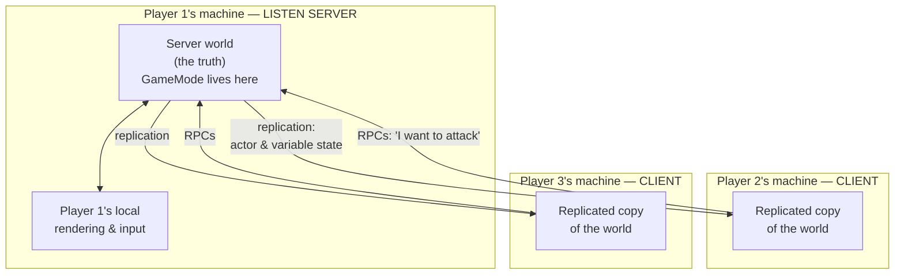
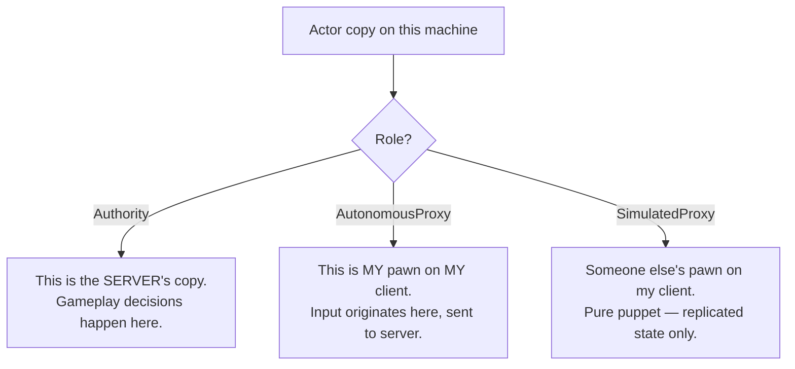
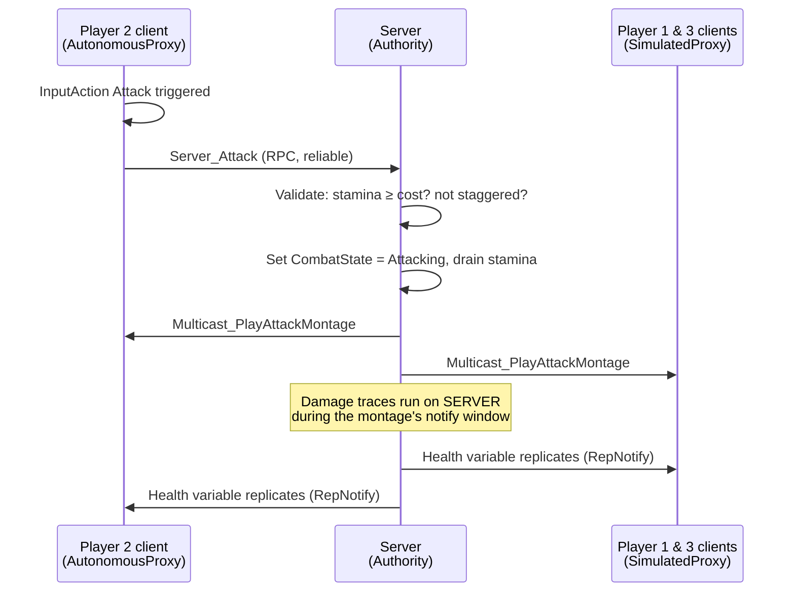

# Chapter 2 — Multiplayer Foundations: How Replication Actually Works

> **Goal of this chapter:** you understand the server-authoritative model well enough to answer, for any feature you'll ever build: *"where does this code run, and how does everyone else find out about it?"* Nothing in later chapters makes sense without this one.

---

## 2.1 The one architecture that works

Unreal multiplayer is **server-authoritative**. There is exactly one machine that owns the truth (the *server*); everyone else (*clients*) sends requests and renders whatever the server tells them.

For a 2–4 player co-op game the standard choice is a **listen server**: player 1's game *is* the server, and it also renders the game for player 1. Friends join it. No hosting costs, no server binaries, perfect for "summon a friend" soulslike co-op.



Key mental model: **clients never *do* things; clients *ask* the server to do things, and then watch the results replicate back.** The single exception is `CharacterMovementComponent`, which predicts movement locally and reconciles — that's why we build on `Character` (Ch. 1).

> **Dedicated server?** Same code, different deployment — the server is a headless process nobody plays on. Everything in this guide works on both. Start listen-server; you can revisit in Chapter 12.

## 2.2 Where each framework class lives

This table is worth printing out. "—" means the class does not exist there at all.

| Class | Server | Owning client | Other clients | Use it for |
|---|---|---|---|---|
| **GameMode** | ✅ | — | — | Rules, spawning, death handling. *Server-only = safe place for authority logic* |
| **GameState** | ✅ | ✅ (replica) | ✅ (replica) | World-wide state every player must see |
| **PlayerState** | ✅ | ✅ (replica) | ✅ (replica) | Per-player state every player must see (souls, name, downed) |
| **PlayerController** | ✅ | ✅ | — | Input, HUD, things private to one player |
| **Pawn/Character** | ✅ | ✅ (replica, *autonomous*) | ✅ (replica, *simulated*) | The body in the world |
| **HUD / Widgets** | — | ✅ | — | UI is always local-only |
| **GameInstance** | one per *process* | one per process | one per process | Sessions, data that survives map travel. **Never replicated** |

Consequences you will hit constantly:

- You cannot open a menu from the GameMode (clients don't have it). Instead: GameMode → RPC on PlayerController → PlayerController shows widget.
- You cannot read another player's PlayerController (you don't have it). Put anything others need to see in **PlayerState**.
- UI never replicates. UI *reads replicated data* and displays it locally.

## 2.3 Net roles: which copy of the actor am I?

Every replicated actor exists once per machine, and each copy knows its role. In Blueprints: **Switch Has Authority** node, or `Get Local Role`.



A soulslike example: Player 2 presses *Attack*.



## 2.4 The three tools of replication

### Tool 1 — Replicated variables (state)

Any variable on a replicated actor can be marked **Replicated** or **RepNotify** in the Details panel. Server changes it → engine pushes the new value to all clients (eventually — it's not instant).

- **Replicated**: value just updates silently.
- **RepNotify**: value updates *and* an `OnRep_VariableName` function fires on clients — use this to react (update a health bar, play a death anim).

> **Golden rule: only the server writes replicated variables.** If a client writes one, only that client sees the change, and the server will stomp it later. This is the #1 beginner bug.

**RepNotify gotcha:** in Blueprints, `OnRep` fires on *clients* when the value arrives, and on the *server* when you use the `Set w/ Notify` node. Put your reaction logic in the OnRep function and it runs everywhere. Subtlety: on clients it fires only when the value actually *changes*; on the server, `Set w/ Notify` calls it every time, changed or not.

### Tool 2 — RPCs (events)

Remote Procedure Calls = custom events with a **Replicates** setting on the event node:

| RPC type | Who calls it | Where it runs | Typical use |
|---|---|---|---|
| **Run on Server** | Owning client | Server | "I pressed dodge" — client asks server to act |
| **Run on Owning Client** | Server | That one client | "Show YOU the boss intro UI", "you got an item" |
| **Multicast** | Server ONLY | Server + every client | Cosmetic one-shots: play montage, spawn VFX, sound |

Rules that bite people:

1. **Run on Server RPCs only work from the *owning* client.** A client can call Server RPCs on its own PlayerController, its own Pawn, or components thereof. Calling one on an enemy or another player's pawn silently does nothing. (Route it: My Controller → Server RPC → server acts on the enemy.)
2. **Multicast called from a client runs only locally.** Always: client → Server RPC → server calls Multicast.
3. **Reliable vs Unreliable:** Reliable = guaranteed delivery, use for gameplay-critical calls (attack, interact). Unreliable = may drop under load, use for pure cosmetics (footstep dust). Never spam reliable RPCs every tick — you'll saturate the connection.

### Tool 3 — Replicated actor spawning

If the **server** spawns an actor whose class has `Replicates = true`, it automatically appears on all clients. If a *client* spawns one, it exists only for that client (fine for purely cosmetic local things; wrong for anything gameplay).

Actor settings that matter (Class Defaults):

- `Replicates` ✅ for anything gameplay-relevant
- `Replicate Movement` ✅ for physics/moving actors that aren't Characters
- `Net Update Frequency` — 100 for pawns is default-ish; drop to 5–10 for slow things like doors
- `Net Dormancy` — set bonfires/doors to *Dorm Awake→Dormant* patterns later for perf (Ch. 12)

## 2.5 The decision flowchart

For *every* feature you build from Chapter 4 onward, run it through this chart:

```mermaid
flowchart TD
    Q0([I need X to happen in my game]) --> Q1{Is X pure cosmetics /<br/>UI / camera / input?}
    Q1 -- yes --> L["Run it locally.<br/>No replication at all.<br/>(widgets, camera shake, lock-on camera)"]
    Q1 -- no --> Q2{Is X ongoing STATE<br/>others must see<br/>(health, stamina, door open)?}
    Q2 -- yes --> RV["Replicated variable (RepNotify).<br/>Server writes it.<br/>OnRep updates visuals/UI."]
    Q2 -- no --> Q3{Is X a one-shot EVENT<br/>others must see<br/>(montage, VFX, sound)?}
    Q3 -- yes --> MC["Server → Multicast RPC.<br/>If triggered by a client:<br/>Server RPC first."]
    Q3 -- no --> Q4{Is X a player REQUEST<br/>(attack, interact, use item)?}
    Q4 -- yes --> SV["Client → Run-on-Server RPC<br/>→ server validates & executes."]
    Q4 -- no --> Q5{Private info for<br/>ONE player<br/>(loot popup, tutorial)?}
    Q5 -- yes --> OC["Server → Run-on-Owning-Client RPC,<br/>or non-replicated var on their PC."]
```

**State vs event, the subtle one:** montages are events, health is state. If a player *joins mid-fight*, they receive current **state** (boss at 40% HP) but never receive **events** that already happened (they won't see an old montage — fine — but they also won't see anything you *only* did via multicast, like a door you "opened" by multicasting an animation. Doors need a replicated `bIsOpen` + OnRep!). Rule: **if late joiners must see it, it's state, not an event.**

## 2.6 Ownership in one minute

Every actor has an **Owner** (a connection, effectively a PlayerController chain). Ownership determines:

- whether your Run-on-Server RPCs go through (see 2.4),
- who counts as "owning client" for Run-on-Owning-Client RPCs.

Your possessed Character is owned by your PlayerController automatically. A weapon you spawn and attach on the server should get `Set Owner` = the wielding character, so the client who holds it can call Server RPCs through it. When an interaction "belongs to no one" (a bonfire), you don't call Server RPCs *on the bonfire* — you call one on *your own character/controller* and pass the bonfire as a parameter.

## 2.7 Hands-on: prove all of it in 20 minutes

Build this throwaway test in `L_Hub` — it cements everything above.

**A replicated "pressure plate + door":**

1. New Blueprint `BP_TestDoor` (Actor): a cube, `Replicates = ON`.
   - Variable `bIsOpen` (bool) — **RepNotify**.
   - In `OnRep_bIsOpen`: set the cube's relative location Z += 300 if open, back if closed. (This is the visual reaction — it runs on server *and* clients.)
2. New Blueprint `BP_TestPlate` (Actor): box collision, `Replicates = ON`.
   - `On Component Begin Overlap` →

```text
Blueprint: BP_TestPlate — Event Graph
──────────────────────────────────────
[OnComponentBeginOverlap (Box)]
 → [Switch Has Authority]
     (Authority) → [Cast to BP_PlayerCharacter (Other Actor)]
                    → [Get DoorRef] → [Set bIsOpen (w/ Notify) = true]
     (Remote)    → (do nothing — overlap also fires on clients; only the
                    server is allowed to change game state)
```

3. Place both in the level, wire the plate's `DoorRef` (Instance Editable variable) to the door.
4. Play with 2 players. Either player steps on the plate → the door rises **in both windows**.

Now break it on purpose (this teaches more than the working version):

- Remove the `Switch Has Authority`, run only the `Remote` path on a client → door opens on one screen only, then never syncs. **Lesson: clients writing state = desync.**
- Replace the RepNotify variable with a Multicast RPC that plays the move → works live, but stop and use `Open Level` mid-game or imagine a late joiner: no `bIsOpen` state exists → new player sees a closed door while everyone else sees it open. **Lesson: late joiners need state.**

## 2.8 Debugging toolkit (bookmark this)

| Tool | How | What it shows |
|---|---|---|
| Network role on screen | `Print String` of `Get Local Role` → `Enum to String` | Which copy is executing |
| Who am I? | PIE window titles show "Server" / "Client 1" | Never debug without checking which window you're in |
| `stat net` | console (\`) | Bandwidth, channels, ping |
| Network Profiler / Insights | `Tools → Session Frontend` / Unreal Insights with `-trace=net` | Deep-dive on bandwidth per actor/property |
| Simulated lag | Editor Prefs → Play → Additional Launch Params, or console `Net PktLag=120` (see also `p.NetPing`) | Your game MUST be tested with 100–150 ms lag before you ship anything |
| Two windows, always | PIE Number of Players ≥ 2 | Non-negotiable |

> **Test with lag early.** On localhost PIE everything looks instant and you'll unconsciously build things that feel awful at 120 ms ping. UE lets you simulate latency/packet loss in PIE: Editor Preferences → Level Editor → Play → Multiplayer Options → *Enable Network Emulation* (set Average Latency 100–150 ms). Turn it on at least one test session in three.

---

## Chapter checklist

- [ ] You can state, from memory: which classes exist on server/client, the 3 RPC types and their rules, replicated var vs RepNotify vs multicast
- [ ] Door/plate test built, working, and *broken on purpose* both ways
- [ ] You know the decision flowchart in 2.5 (it gets applied in every later chapter)
- [ ] Network emulation tried at 120 ms

**Next:** [Chapter 3 — Sessions: Hosting, Finding, and Joining Games](03-sessions-and-joining.md)
