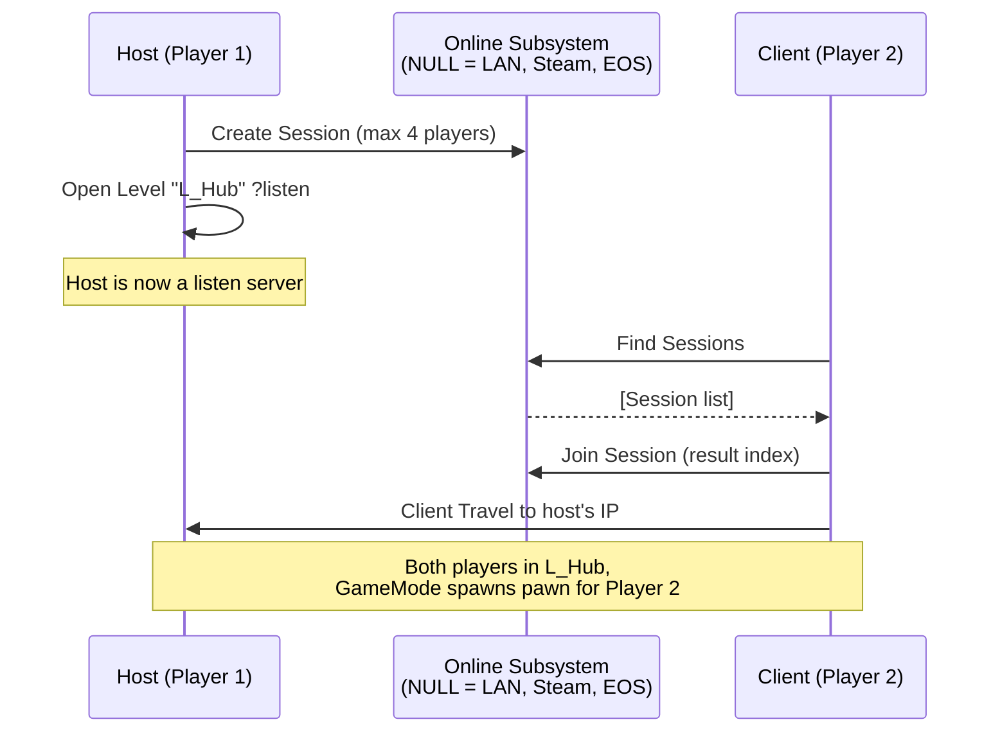
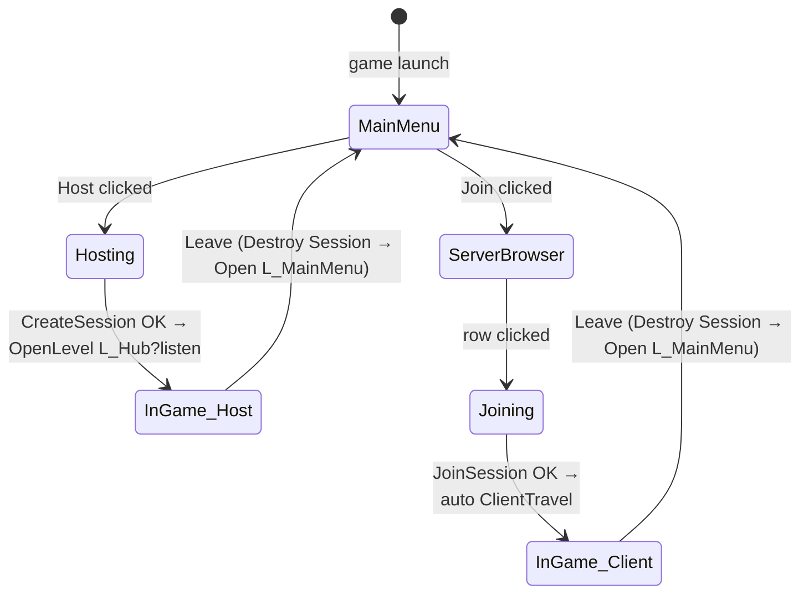

# Chapter 3 — Sessions: Hosting, Finding, and Joining Games

> **Goal of this chapter:** a main menu where one player clicks **Host**, friends click **Join**, and everyone ends up in `L_Hub` together — over LAN first, then Steam.

---

## 3.1 How joining works in Unreal

A *session* is an advertised game that others can discover. The flow:



The **Online Subsystem (OSS)** is a swappable backend. Same Blueprint nodes work over:

| Subsystem | Discovery | Use when |
|---|---|---|
| **NULL** (default) | LAN broadcast only | Development, same-network testing |
| **Steam** | Steam friends/servers, NAT punch-through | Shipping on Steam |
| **EOS** | Epic Online Services, free, crossplay | Shipping outside Steam / crossplay |

Build everything against NULL first. Switching to Steam later is config + minor node changes, not a rewrite.

## 3.2 The session Blueprints (engine-built-in nodes)

Put session logic in `BP_AshfallGameInstance` — it survives map travel, and menus can always reach it (`Get Game Instance → Cast`).

**Host:**

```text
Blueprint: BP_AshfallGameInstance — function HostGame
─────────────────────────────────────────────────────
[Custom Event HostGame]
 → [Create Session]
     Player Controller: Get Player Controller(0)
     Max Public Connections: 4
     Use LAN: true            ◄ NULL subsystem needs this true
   (On Success) → [Open Level (by Name)]
                    Level Name: L_Hub
                    Options:   "listen"        ◄ THE critical part
   (On Failure) → [Print String "Create Session failed"]
```

`?listen` (the `Options: listen`) is what makes the host a **listen server**. Forget it and joiners will connect to nothing.

**Find + Join:**

```text
Blueprint: BP_AshfallGameInstance — function FindAndJoin
────────────────────────────────────────────────────────
[Custom Event FindGames]
 → [Find Sessions]
     Max Results: 20
     Use LAN: true
   (On Success: Results) → [ForEachLoop] → build a row widget per result
                            (row shows: server name, ping, 2/4 players)
   (On Failure) → [Print String "Find failed"]

[Custom Event JoinGame (SessionResult)]
 → [Join Session (Result)]
   (On Success) → engine auto-travels this client to the host
   (On Failure) → [Print String "Join failed"]
```

> These three nodes (`Create Session`, `Find Sessions`, `Join Session`) live in the **Online** category and come from the *Online Subsystem* + *Online Subsystem Utils* plugins (enabled by default).

## 3.3 Main menu UI

1. `WBP_MainMenu` in `Content/Ashfall/UI/`: three buttons — **Host**, **Join**, **Quit** — and a vertical box `ServerList`.
2. `L_MainMenu` level: World Settings → GameMode Override → a bare `BP_MenuGameMode` whose Default Pawn = None; a `BP_MenuController` that on BeginPlay creates `WBP_MainMenu`, adds to viewport, and sets **Input Mode UI Only** + `Show Mouse Cursor`.
3. Buttons call the GameInstance functions from 3.2.
4. Project Settings → Maps & Modes → **Game Default Map = L_MainMenu**.

Menu flow:



**Leaving cleanly matters:** always call `Destroy Session` before returning to the menu (host *and* client), or the next `Create Session` will fail with a stale session. Handle it in a `LeaveGame` function on the GameInstance. Also handle `Event NetworkError` / `Event TravelError` in the GameInstance: Destroy Session → Open `L_MainMenu`.

## 3.4 Testing sessions properly

PIE's "Run Under One Process" **bypasses real session discovery**. To truly test host/join:

- Editor Prefs → Play → **Run Under One Process: OFF**, Number of Players: 2, Net Mode: *Play Standalone*. Two real processes start; use your menu to host in one, find+join in the other.
- Or package a dev build (Ch. 12) and run two copies.

Day-to-day feature work: keep One Process ON and Listen Server mode (skips the menu). Session testing: once per milestone.

## 3.5 Upgrading to Steam

When you want internet play with friends:

1. Enable the **Online Subsystem Steam** plugin (Edit → Plugins).
2. Add to `Config/DefaultEngine.ini`:

```ini
[/Script/Engine.GameEngine]
+NetDriverDefinitions=(DefName="GameNetDriver",DriverClassName="OnlineSubsystemSteam.SteamNetDriver",DriverClassNameFallback="OnlineSubsystemUtils.IpNetDriver")

[OnlineSubsystem]
DefaultPlatformService=Steam

[OnlineSubsystemSteam]
bEnabled=true
SteamDevAppId=480          ; 480 = "Spacewar", Valve's public test AppId.
                           ; Replace with your own AppId when you have one.
bInitServerOnClient=true   ; needed for listen servers to advertise on Steam

[/Script/OnlineSubsystemSteam.SteamNetDriver]
NetConnectionClassName="OnlineSubsystemSteam.SteamNetConnection"
```

3. In your Create/Find Session nodes set **Use LAN: false** for Steam.
4. Steam must be **running** on both machines; two machines need **two different Steam accounts**. AppId 480 is shared by every dev on Earth, so Find Sessions will also return strangers' test sessions — filter by a custom session setting (see Advanced Sessions below) or just test with Join-via-friends.
5. Steam does not work in-editor reliably — test Steam with **packaged builds**.

### Advanced Sessions plugin (recommended once on Steam)

The stock session nodes can't set a server name, read player Steam names/avatars, or add custom session filters. The free, long-maintained **Advanced Sessions Plugin** (by mordentral, on the Unreal forums/VRExpansion site) adds Blueprint nodes for all of that (`Create Advanced Session`, `Find Sessions Advanced` with filters, `Get Player Name`, invites). Drop the two plugin folders (`AdvancedSessions`, `AdvancedSteamSessions`) into `Ashfall/Plugins/`, restart, replace your three session nodes with the Advanced variants. Node flow is identical, so this is a 30-minute swap.

> **EOS alternative:** if you'd rather not use Steam, UE ships an EOS OnlineSubsystem — the same session nodes work; configuration goes through Project Settings → Online Services and the EOS Dev Portal. Steam is the smoother path if your audience is on Steam anyway.

## 3.6 Player identity across the session

While you're here, wire up names — you'll want them for the party HUD (Ch. 11):

- `BP_AshfallPlayerState` already replicates `Get Player Name` (Steam name arrives automatically on Steam; on NULL it's "Player").
- Add a replicated `CharacterClass`/`Loadout` variable to PlayerState later if you add character creation.

## Chapter checklist

- [ ] Host/Join/Quit menu working over LAN with Run-Under-One-Process OFF
- [ ] `?listen` in the host's Open Level; Destroy Session on leave (both sides)
- [ ] NetworkError/TravelError handled (return to menu instead of hanging)
- [ ] (When ready) Steam ini config in place, tested with packaged builds
- [ ] (Optional) Advanced Sessions plugin swapped in

**Next:** [Chapter 4 — The Player Character: Locomotion, Stamina & Dodge](04-character-locomotion.md)
