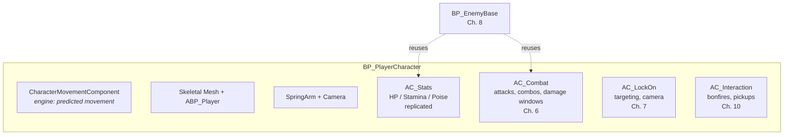
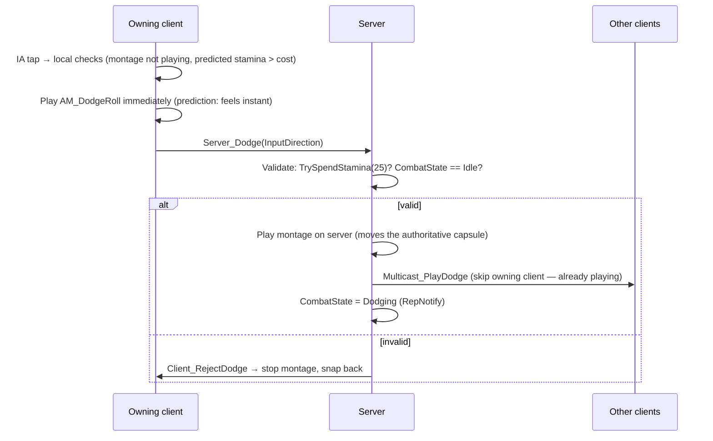
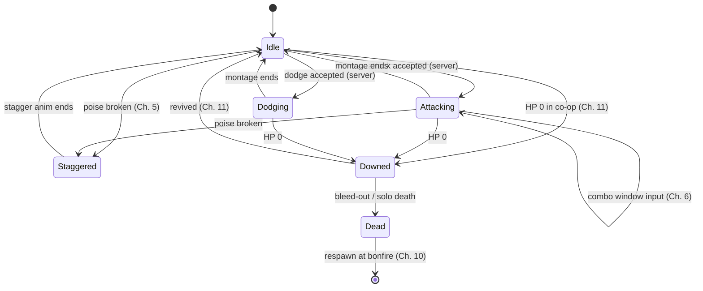

# Chapter 4 — The Player Character: Locomotion, Stamina & Dodge Roll

> **Goal of this chapter:** a networked character with walk/sprint, a replicated stamina pool, and a dodge roll with i-frames — the physical core of soulslike *feel*. Two clients, everything visible on both screens, always.

---

## 4.1 The component architecture

Resist stuffing everything into `BP_PlayerCharacter`. Split behavior into **Actor Components** — enemies will reuse them, and it keeps each Blueprint graph readable.



Create `AC_Stats` (Blueprint → Actor Component) in `Content/Ashfall/Components/`. **Class Defaults → Component Replicates = ON** (components replicate only if this is set *and* the owning actor replicates).

## 4.2 AC_Stats — stamina first

Variables on `AC_Stats`:

| Variable | Type | Replication | Notes |
|---|---|---|---|
| `MaxStamina` | float (100) | Replicated | changed rarely |
| `Stamina` | float (100) | **RepNotify** | OnRep updates UI |
| `StaminaRegenRate` | float (25/s) | none | server-only logic |
| `StaminaRegenDelay` | float (1.2 s) | none | delay after spending |
| `bStaminaExhausted` | bool | RepNotify | for the "gasping" state (optional) |
| `OnStaminaChanged` | Event Dispatcher | — | UI binds to this |

**Server-side regen** (all stat mutation happens on the server — Rule from Ch. 2):

```text
Blueprint: AC_Stats — Event Graph
─────────────────────────────────
[Event Tick]                       ◄ fine for a tutorial; see note below
 → [Switch Has Authority] (Authority only)
 → [Branch: (Now - LastStaminaSpendTime) > StaminaRegenDelay]
     True → [Set Stamina (w/ Notify) =
              Clamp(Stamina + StaminaRegenRate * DeltaSeconds, 0, MaxStamina)]

[Function TrySpendStamina (Cost) → bool]     ◄ SERVER-ONLY helper
 → [Branch: Stamina >= Cost]
     True  → [Set Stamina (w/ Notify) = Stamina - Cost]
            → [Set LastStaminaSpendTime = Game Time in Seconds]
            → Return true
     False → Return false

[OnRep_Stamina]
 → [Call OnStaminaChanged (dispatcher)]      ◄ runs on server + clients;
                                               UI (local) hears it
```

> **Bandwidth note:** a float changing every tick replicates every net update. That's acceptable for 4 players. If you ever care, quantize: replicate stamina as a byte 0–100. Don't optimize this now.
>
> **RepNotify + Set node:** always change RepNotify variables with the **Set w/ Notify** version of the node on the server, so the OnRep also runs server-side (the listen-server host is a player too — their UI needs the event!).

**Stamina bar:** in `WBP_HUD` (created by `BP_AshfallPlayerController` on BeginPlay, only when `Is Local Player Controller`), bind a ProgressBar to `Stamina / MaxStamina` of the owning pawn's `AC_Stats` via the `OnStaminaChanged` dispatcher (event-driven; avoid property bindings that poll every frame).

## 4.3 Movement states: walk / sprint

Soulslike movement = walk (default), sprint (hold, drains stamina), and later dodge (tap the same key — classic Dark Souls binding).

Enhanced Input assets in `Characters/Player/Input/`:

| Asset | Type | Bound to |
|---|---|---|
| `IA_Move` | Axis2D | WASD / left stick (template has this) |
| `IA_Look` | Axis2D | Mouse / right stick (template has this) |
| `IA_SprintDodge` | Digital | Left Shift / B (circle) |
| `IA_Attack` | Digital | LMB / RB — Ch. 6 |
| `IA_LockOn` | Digital | MMB / R3 — Ch. 7 |
| `IA_Interact` | Digital | E / A (cross) — Ch. 10 |

**Sprint, networked.** `Max Walk Speed` is *not* replicated by default, and movement is client-predicted — so the correct pattern is to change speed on **both** the owning client (for instant prediction) *and* the server (so the server simulation agrees and other clients see it):

```text
Blueprint: BP_PlayerCharacter — sprint
──────────────────────────────────────
[IA_SprintDodge Triggered(Hold ≥ 0.25s)]        ◄ Hold trigger on the IA
 → [SetSprinting true (local)] → [Server_SetSprinting true]

[IA_SprintDodge Completed]
 → [SetSprinting false (local)] → [Server_SetSprinting false]

[Function SetSprinting (bool)]
 → [Branch] true:  CharacterMovement → Set Max Walk Speed = 600
            false: CharacterMovement → Set Max Walk Speed = 350

[Custom Event Server_SetSprinting (bool)]   (Run on Server, Reliable)
 → [SetSprinting]         ◄ server sets it too → replicates pose to others
 → also: gate it — only allow if Stamina > 0
```

Sprint stamina drain: on the server (Tick, Authority): if sprinting *and actually moving* (`Velocity length > 10`), `TrySpendStamina(SprintCostPerSecond * Delta)`; on failure, `Server_SetSprinting(false)` and notify the owning client to clear its local flag (Run-on-Owning-Client RPC or a RepNotify `bIsSprinting`).

**Tap vs hold on one key:** give `IA_SprintDodge` two triggers — **Tap** (released < 0.2 s → dodge) and **Hold** (≥ 0.25 s → sprint). Enhanced Input's `Triggered`/`Completed` events + trigger types handle this cleanly without timers.

## 4.4 The dodge roll

The signature move. Requirements: costs stamina, moves you a fixed distance in the input direction, has **i-frames** (a window where you can't be hit), can't be spammed, and looks right on all machines.

### Animation setup

You need a roll animation. Options:

- Free: **Game Animation Sample Project** (Epic, free on Fab) has traversal anims; many free packs on Fab include rolls; Mixamo has rolls you can retarget to the UE5 Mannequin with the IK Retargeter.
- Create `AM_DodgeRoll` — an **Animation Montage** from the roll animation, in a dedicated `FullBody` montage slot (create the slot in the Skeleton's Anim Slot Manager, and add a `DefaultSlot`→`FullBody` slot node into `ABP_Player`'s AnimGraph after the locomotion state machine).

### Root motion — the decision

A roll animation with baked root motion moves the capsule *exactly* as animated — great feel. But root motion + networking has a long history of jank (simulated proxies extrapolating, desyncs on laggy clients).

| Approach | Feel | Network behavior | Verdict |
|---|---|---|---|
| **Root motion montage** (`Root Motion from Montages Only` in ABP) | Exact, designer-tuned | Works via montage replication; simulated proxies can drift slightly on bad connections | ✅ **Use this.** It's the standard for soulslikes; drift at 4 players is negligible |
| In-place anim + `Launch Character` | Physics-y, floaty | Perfect prediction via CMC | fallback if your anims lack root motion |
| Root Motion Source / Motion Warping | Best of both | Needs C++/careful setup | later, with C++ |

Set `ABP_Player` → Class Defaults → **Root Motion Mode = Root Motion from Montages Only**.

### The networked dodge flow



```text
Blueprint: BP_PlayerCharacter — dodge
─────────────────────────────────────
[IA_SprintDodge Triggered(Tap)]
 → [Branch: CombatState == Idle AND Stamina >= DodgeCost]   ◄ local pre-check
 → [RotateTowardInput]      ◄ set actor rotation to last Move input direction
                              (soulslike rolls go where you POINT, not where you face)
 → [Play Anim Montage: AM_DodgeRoll]                        ◄ local prediction
 → [Server_Dodge (ControlRotation-relative input dir)]

[Custom Event Server_Dodge (Dir)]        (Run on Server, Reliable)
 → [Branch: CombatState == Idle AND TrySpendStamina(DodgeCost)]
     True  → [Set Actor Rotation = Dir]
           → [Play Anim Montage: AM_DodgeRoll]              ◄ authoritative
           → [Multicast_PlayDodge]
           → [Set CombatState (w/Notify) = Dodging]
     False → [Client_RejectDodge]        (Run on Owning Client)

[Custom Event Multicast_PlayDodge]       (Multicast, Unreliable is fine)
 → [Branch: NOT Is Locally Controlled]   ◄ owner already predicted it
 → [Play Anim Montage: AM_DodgeRoll]

[On Montage Ended/Blended Out (AM_DodgeRoll)]  (server)
 → [Set CombatState (w/Notify) = Idle]
```

> **Simpler alternative you may see in tutorials:** just `Server_Dodge → Multicast_Play` with no local prediction. It works, and at LAN latencies feels fine — but at 100 ms ping your roll starts 100 ms after the button press, which in a soulslike is death. The prediction pattern above is the same amount of Blueprint and feels right; keep it.

### I-frames

I-frames are a *server* concept (the server decides hits, Ch. 5). Implement with an **AnimNotifyState** — a colored band you drag across the timeline of `AM_DodgeRoll`:

1. In `AM_DodgeRoll`, right-click the Notifies track → Add Notify State → **New Blueprint Notify State** → `ANS_Invincible`.
2. `ANS_Invincible` overrides `Received_NotifyBegin` / `Received_NotifyEnd`:

```text
Blueprint: ANS_Invincible
─────────────────────────
[Received_NotifyBegin (MeshComp, ...)]
 → [Get Owner of MeshComp] → [Get AC_Stats] → [Set bInvincible = true]
[Received_NotifyEnd]
 → ... → [Set bInvincible = false]
```

3. Place the state band over roughly frames 15–60 % of the roll (tune later!).
   **Safety net:** `NotifyEnd` is not guaranteed if the montage gets interrupted (e.g. you're hit out of the roll by an unblockable). Also clear `bInvincible` in the character's `On Montage Ended` (Interrupted = true) handler, or you'll ship an immortality bug.
4. `bInvincible` needs **no replication**: the montage also plays on the server (authoritative copy), so the notify sets the flag on the server's `AC_Stats`, which is where damage is decided. Clients' copies of the flag are irrelevant.
5. In the damage pipeline (Ch. 5), the server checks `bInvincible` before applying damage.

> Classic tuning: Dark Souls rolls are ~13 i-frames at 30 fps (~0.43 s) mid-roll, with vulnerable startup and recovery. Start there.

## 4.5 The combat state enum (you'll use it everywhere)

Create `E_CombatState` (Enum) in `Data/`: `Idle, Attacking, Dodging, Staggered, Downed, Dead`. On `BP_PlayerCharacter` (or better: `AC_Combat` next chapter), variable `CombatState`, **RepNotify**.

The rule that keeps a melee game sane: **every action first checks the state machine, and transitions are server-authoritative.**



## 4.6 Test matrix (run it now, with 2 clients + 120 ms emulated lag)

| Test | Expected |
|---|---|
| Sprint as client 2 | Speed-up visible on both windows; stamina drains on both HUDs |
| Sprint to zero stamina | Forced back to walk on both windows |
| Dodge as client 2 | Roll starts instantly on client 2, ~1 RTT later on host window |
| Dodge with no stamina | No roll (local pre-check), or starts-and-corrects under packet loss |
| Spam dodge | Only one roll; state machine blocks the rest |
| Dodge direction | Rolls toward WASD direction, not camera-forward |

---

## Chapter checklist

- [ ] `AC_Stats` with replicated, server-authoritative stamina + regen delay
- [ ] Event-driven stamina bar on the HUD
- [ ] Tap/hold on one key: dodge vs sprint via Enhanced Input triggers
- [ ] Root-motion dodge with client prediction + server validation
- [ ] `ANS_Invincible` i-frame window in the montage
- [ ] `E_CombatState` + replicated state machine gating all actions
- [ ] Full test matrix passes at 120 ms emulated lag

**Next:** [Chapter 5 — Stats & the Damage Pipeline](05-stats-and-damage.md)
