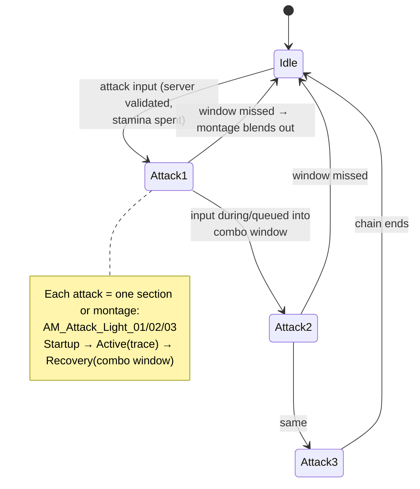
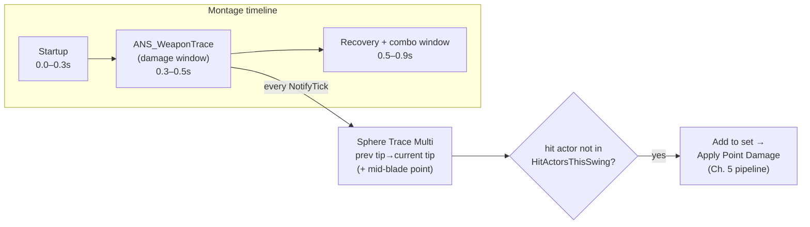

# Chapter 6 — Melee Combat: Weapons, Combos & Hit Detection

> **Goal of this chapter:** a light-attack combo chain with weapon-trace hit detection driven by animation notifies, feeding the Chapter 5 damage pipeline — fully networked. This is the heart of the game; budget real time for tuning.

---

## 6.1 Weapon architecture

Weapons are actors (they'll be pickups, they have their own data), attached to the character's hand socket.

1. Skeleton: open the player Skeletal Mesh → Skeleton → add socket on `hand_r` named `WeaponSocket`; rotate/offset until a sword mesh sits right (use *Preview Asset* on the socket).
2. `BP_WeaponBase` (Actor) in `Items/`: Static Mesh, `Replicates = ON`. Add two **Scene Components** on the blade: `TraceStart` (guard) and `TraceEnd` (tip) — our trace sockets.
3. Weapon stats in a struct `F_WeaponData` (in `Data/`): `Damage`, `PoiseDamage`, `StaminaCost`, `AttackMontages (array of Anim Montage)`, plus later: scaling, damage type.

   > *Alternative style you'll see in tutorials:* one montage with named **sections** (`Attack01/02/03`, auto-chain links removed in the Montage Sections panel) driven by `Montage Jump to Section`. Functionally equivalent; the array-of-montages version is easier to replicate (you multicast an index either way) and easier to mix weapons, so this guide uses arrays. Store rows in `DT_Weapons` (DataTable) and give `BP_WeaponBase` a `WeaponID (Name)` that looks up its row — designers tune numbers in a spreadsheet-like table instead of hunting through Blueprints.
4. Spawning (server!): in `BP_PlayerCharacter` BeginPlay:

```text
[Event BeginPlay] → [Switch Has Authority] (Authority)
 → [Spawn Actor BP_WeaponBase (WeaponID = StarterSword)]
 → [Attach to Component: Mesh, Socket = WeaponSocket, Snap to Target]
 → [Set Owner = self]          ◄ ownership: lets us route RPCs later
 → [Set CurrentWeapon = it]    ◄ CurrentWeapon: Replicated var
```

Because the weapon replicates and attachment replicates, clients see it appear in the hand automatically.

## 6.2 AC_Combat and the combo state

Create `AC_Combat` (Actor Component, **Component Replicates = ON**) — move `CombatState` (from Ch. 4) here. Add:

| Variable | Type | Replication | Purpose |
|---|---|---|---|
| `CombatState` | E_CombatState | RepNotify | the master gate |
| `ComboIndex` | int | none (server) | which attack in the chain |
| `bComboWindowOpen` | bool | none (server) | set by notify |
| `bComboQueued` | bool | none (server) | input buffering |
| `HitActorsThisSwing` | Set of Actor | none (server) | prevent multi-hit per swing |

## 6.3 The combo system

Soulslike combos = pressing attack during a window near the end of swing N chains into swing N+1. Plus **input buffering**: pressing slightly *early* still counts. Without buffering, combat feels unresponsive — this detail matters more than any damage number.



```text
Blueprint: BP_PlayerCharacter — attack input
────────────────────────────────────────────
[IA_Attack Triggered]
 → [Branch: locally-predicted OK? (state Idle-or-Attacking, stamina > 0)]
 → [Server_Attack]

Blueprint: AC_Combat — server side
──────────────────────────────────
[Custom Event Server_Attack]   (Run on Server, Reliable)
 → [Branch: CombatState == Idle]
     True  → [StartAttack(0)]
     False → [Branch: CombatState == Attacking AND bComboWindowOpen]
                True  → [StartAttack(ComboIndex + 1)]
                False → [Branch: CombatState == Attacking]   ◄ input buffer:
                          True → [Set bComboQueued = true]     early press
                                                               remembered
[Function StartAttack (Index)]        (SERVER)
 → [Branch: Index < len(Weapon.AttackMontages)] false → return
 → [Branch: Stats.TrySpendStamina(Weapon.StaminaCost)] false → return
 → [Set CombatState (w/Notify) = Attacking]
 → [Set ComboIndex = Index] ; [Set bComboWindowOpen/bComboQueued = false]
 → [Clear HitActorsThisSwing]
 → [Play Anim Montage: AttackMontages[Index]]     ◄ server copy: authoritative
                                                    (traces run off this one)
 → [Multicast_PlayAttack (Index)]

[Custom Event Multicast_PlayAttack (Index)]   (Multicast, Reliable)
 → [Branch: NOT Is Locally Controlled OR NOT predicted]  → [Play Anim Montage]
    (simplest robust version: skip prediction for attacks entirely and play
     for everyone here, including the attacker — see the latency note below)

[On Montage Ended / Blended Out]   (server, bind when playing)
 → [Branch: CombatState == Attacking] → [Set CombatState (w/Notify) = Idle]
```

> **Prediction for attacks?** In Chapter 4 we predicted the dodge locally. For attacks, start *without* prediction (client presses → server plays → multicast). At listen-server-with-friends latencies (~30–80 ms) attack startup hides the delay, because soulslike attacks have long windups by design. If it feels muddy for the joining client later, add the same predict-and-reconcile pattern as the dodge. Keep the combo/window logic server-only either way.

### Combo window + buffered input, via Anim Notifies

In each `AM_Attack_Light_XX` montage add plain **AnimNotifies** (not states): `AN_ComboWindowBegin` near the end of the active swing and `AN_ComboWindowEnd` before the montage ends. New Blueprint notifies, each calls into the owner:

```text
[AN_ComboWindowBegin → Received_Notify]
 → [Owner.AC_Combat] → [Branch: Has Authority]      ◄ notifies fire on every
                                                      machine playing the
                                                      montage; act on server
 → [Set bComboWindowOpen = true]
 → [Branch: bComboQueued] true → [StartAttack(ComboIndex+1)]  ◄ buffer pays out

[AN_ComboWindowEnd → Received_Notify]
 → (authority) [Set bComboWindowOpen = false]
```

## 6.4 Hit detection: socket-to-socket weapon traces

The standard soulslike approach: during the damage window of the swing, sweep the blade's volume each frame and damage what it passes through. Collision-overlap hitboxes are frame-rate dependent and miss fast swings; traces between *last frame's* and *this frame's* socket positions don't tunnel.



Create `ANS_WeaponTrace` (AnimNotifyState) and drag it across the active frames of every attack montage:

```text
Blueprint: ANS_WeaponTrace
──────────────────────────
[Received_NotifyBegin]
 → [Owner = MeshComp.GetOwner] → [Branch: Owner Has Authority] ◄ SERVER ONLY —
                                                                 damage is
                                                                 authoritative
 → [Weapon = Owner.AC_Combat.CurrentWeapon]
 → [Store PrevStart = Weapon.TraceStart.WorldLocation,
          PrevEnd   = Weapon.TraceEnd.WorldLocation]

[Received_NotifyTick]
 → (authority only, as above)
 → [CurStart/CurEnd = socket world locations now]
 → For sample points P in {Start, Mid, End}:            ◄ 3 points along blade
    [Sphere Trace Multi For Objects]
       Start: PrevP   End: CurP   Radius: 15
       Object Types: Pawn   Ignore: Owner
    → [ForEach Hit] → [Branch: Hit.Actor NOT in HitActorsThisSwing]
        → [Add to HitActorsThisSwing]
        → [Branch: Hit.Actor is on another team?]   ◄ 6.6, no friendly fire
        → [Apply Point Damage]
             Damaged Actor: Hit.Actor
             Base Damage:   Weapon.Damage
             Hit Info:      Hit
             Instigated By: Owner.GetController
             Damage Causer: Weapon
             DamageType:    DMG_Physical
        → [Owner.Client_HitConfirmed]     ◄ Run-on-Owning-Client RPC →
                                            hitstop + shake (Ch. 5.4)
 → [PrevStart/PrevEnd = CurStart/CurEnd]

[Received_NotifyEnd] → clear stored positions
```

Why this works in multiplayer with zero extra code: the montage plays on the **server** (6.3), so the notify state ticks on the server, so traces and `Apply Point Damage` run with authority, so Chapter 5's pipeline replicates the results. The same notify ticking on clients exits early at the authority branch.

> **Free plugin alternative:** the open-source **MeleeTrace** plugin (github.com/rlewicki/MeleeTrace) implements exactly this (multi-socket interpolated traces) with a few Blueprint nodes, if you'd rather not maintain your own. Building it from source needs a C++ project; fine to adopt when you add C++ later. Your hand-rolled version above is ~30 nodes and teaches you the guts.

**Debug it:** Sphere Trace nodes have `Draw Debug Type = For Duration` — turn it on and watch red/green capsules paint the swing arc. Tune the ANS band until the trace covers exactly the frames where the blade visually sweeps.

## 6.5 Heavy attacks, charged attacks

Once lights work, heavies are data + input plumbing, not new systems:

- `IA_Attack` with a **Hold** trigger (or a separate `IA_HeavyAttack` on RMB/RT).
- `F_WeaponData` gets `HeavyMontages`, `HeavyDamage`, `HeavyPoiseDamage` (poise damage is what makes heavies matter — they stagger through poise, Ch. 5).
- `Server_Attack` takes an `E_AttackType` param and indexes the right montage array.
- Hyper armor on heavies: an `ANS_HyperArmor` notify state that sets a server-side `bHyperArmor` flag checked in `ReceiveDamage`'s poise branch (take the damage, skip the stagger).

## 6.6 Teams / no friendly fire

Simplest robust scheme: add a `TeamID (int)` to `AC_Stats` (0 = players, 1 = enemies). In `ANS_WeaponTrace` (and every damage source), compare attacker vs victim `TeamID` before applying damage. Souls games ignore ally-hits in co-op — copy that; friendly fire in a melee game with 4 players in a corridor is misery.

## 6.7 Enemy attacks use the same machinery

`BP_EnemyBase` (Ch. 8) gets `AC_Combat` + weapon (or `TraceStart`/`TraceEnd` sockets on its own limbs for claws/bites) and the same `ANS_WeaponTrace` in its attack montages. One combat system, every attacker. This is the payoff of the component architecture.

## 6.8 Test matrix (2 clients, 120 ms emulation, training dummies)

| Test | Expected |
|---|---|
| Single light attack (client 2) | montage on both screens; dummy HP drops on both; hitstop only on client 2 |
| Mash attack ×3 | full 3-hit chain, no skipped/doubled swings, stamina −3× |
| Press attack once during swing | buffered — next swing comes out exactly at the window |
| Attack with 0 stamina | nothing (or whiff-then-correct under loss) |
| Swing through 2 dummies | both damaged once each; neither hit twice |
| Ally in the arc | no damage (TeamID) |
| Attack + get poise-broken mid-swing | montage interrupted by stagger everywhere; `HitActorsThisSwing`/window flags reset; can act after stagger |

That last row is where combat systems rot: **every** flag set during an attack must be cleaned up in `On Montage Ended (Interrupted)`. Audit `bComboWindowOpen`, `bComboQueued`, i-frames, hyper armor.

---

## Chapter checklist

- [ ] Weapon actor with data-table stats, server-spawned, socket-attached
- [ ] 3-hit combo with server-side windows + input buffering
- [ ] `ANS_WeaponTrace` socket-sweep hit detection, server-only, no double-hits
- [ ] Heavy attack + hyper armor
- [ ] TeamID gate (no friendly fire)
- [ ] Interrupt-cleanup audit done; full test matrix passes

**Next:** [Chapter 7 — Lock-On Targeting](07-lock-on.md)
