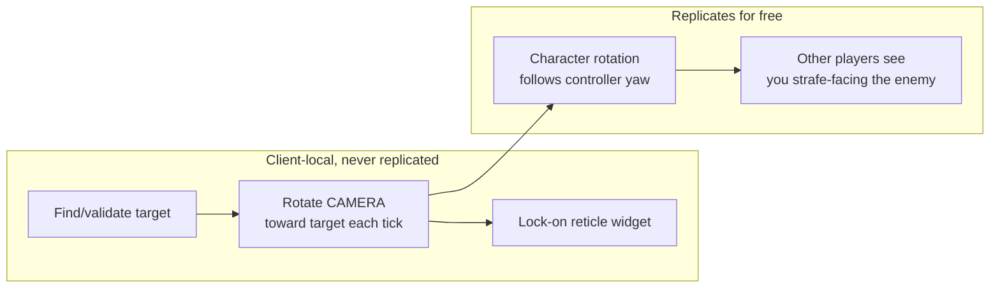

# Chapter 7 — Lock-On Targeting

> **Goal of this chapter:** classic souls lock-on: press a button, camera hard-locks to the nearest valid enemy, movement becomes strafing, flick the stick/mouse to switch targets, auto-release on death or distance. Almost everything here is **client-local** — a rare networking break.

---

## 7.1 Why lock-on is (mostly) not replicated

The camera never replicates (Ch. 2 table: UI/camera are local). Lock-on is a *camera and input* behavior. The only part of lock-on that other players see is your character's **rotation** — and rotation already replicates through normal movement replication.



So: no RPCs in this chapter. Build it all in `AC_LockOn` (Actor Component on the player, **no** replication), and only run its logic when `Is Locally Controlled`.

## 7.2 Finding a target

```text
Blueprint: AC_LockOn — function FindTarget → Actor
──────────────────────────────────────────────────
[Sphere Overlap Actors]
   Sphere Pos:    owner location
   Sphere Radius: 1500 (LockOnRange)
   Object Types:  Pawn
   Class Filter:  BP_EnemyBase (or better: actors implementing BPI_Targetable)
 → [ForEach] filter candidates:
     ├─ [Branch: candidate.AC_Stats.bIsDead == false]
     ├─ [Line Trace By Channel (Visibility): camera loc → candidate chest]
     │    hit something else first? → skip (no lock through walls)
     ├─ [Compute angle from camera forward:
     │     Dot(CameraForward, Normalize(CandidateLoc - CameraLoc))]
     │    < cos(35°)? → skip (only things roughly on screen)
     └─ [Score = Angle*Weight + Distance*Weight]   ◄ souls games prefer
                                                     screen-center over closest
 → return best-scoring candidate
```

Two implementation notes:

- **`BPI_Targetable` interface** (Blueprint Interface in `Data/`): functions `CanBeTargeted() → bool` and `GetLockOnLocation() → vector` (a socket on the enemy's chest/head — big bosses need a specific bone, or even multiple targetable points; an interface makes that swappable per enemy without casts).
- The line-of-sight trace uses the **camera** as origin, not the character — lock-on is about what *you can see*.

## 7.3 Engaging, holding, releasing

State on `AC_LockOn`: `CurrentTarget (Actor)`, local only.

```text
[IA_LockOn Triggered]
 → [Branch: CurrentTarget valid?]
     No  → [FindTarget] → valid? → [EngageLockOn(target)]
     Yes → [ReleaseLockOn]                       ◄ toggle behavior

[Function EngageLockOn (Target)]
 → [Set CurrentTarget]
 → CharacterMovement → [Set Orient Rotation to Movement = false]
 → Character         → [Set Use Controller Rotation Yaw = true]
 → [Show WBP_LockOnReticle]   ◄ WidgetComponent on the enemy, or a HUD widget
                                projected via "Project World to Screen"

[Function ReleaseLockOn]
 → [Clear CurrentTarget] ; restore both rotation flags ; hide reticle

[Event Tick]  (only when CurrentTarget valid AND Is Locally Controlled)
 ├─ Auto-release checks:
 │    [Branch: target dead OR Distance > 2000 OR LOS lost for > 1.5s]
 │      true → [ReleaseLockOn] (souls behavior: try FindTarget once first —
 │              retarget to next enemy when your target dies mid-swarm)
 ├─ Camera:
 │    [LookAt = Find Look at Rotation (camera loc → target.GetLockOnLocation)]
 │    [New = RInterp To (Get Control Rotation, LookAt, DeltaTime, Speed=8)]
 │    [Set Control Rotation (clamp pitch ~ -35..+15, keep roll 0)]
 └─ (Use Controller Rotation Yaw makes the character face the target,
     which replicates to everyone — free co-op correctness)
```

**Movement while locked:** with `Orient Rotation to Movement` off and controller-yaw on, WASD now strafes around the target automatically. For animation, your `ABP_Player` locomotion needs a **strafe blendspace** (forward/right speed in a 2D blendspace) selected when locked — pass `bIsLockedOn` from the character into the AnimBP via `Property Access`/Event Graph. If your anim set lacks strafes, it looks skate-y but plays fine; add a strafe pack from Fab later.

> `bIsLockedOn` for the AnimBP is needed on **all** machines (others see you strafe). Cheapest: make it a Replicated bool set via a Server RPC on engage/release — the one tiny replicated piece in this system. (Rotation itself still replicates regardless.)

## 7.4 Switching targets

Flick the right stick / move the mouse sideways past a threshold while locked:

```text
[IA_Look (while CurrentTarget valid)]
 → [Branch: |X| > SwitchThreshold (e.g. 3.0) AND cooldown elapsed (0.4s)]
 → [FindTarget variant: candidates scored by signed screen-space X offset
     relative to current target; pick nearest candidate on the flick side]
 → [EngageLockOn(new target)] ; start cooldown
```

Implementation trick for "which side": `Project World to Screen` each candidate and the current target; compare screen X. Screen space matches player intuition better than world angles.

## 7.5 Lock-on health bar

Souls-style: the locked enemy shows a boss-style bottom bar or an overhead bar only while targeted.

- On `EngageLockOn`: create/show `WBP_TargetInfo` (name + HP bar), bind to the target's `AC_Stats.OnHealthChanged` dispatcher (Ch. 5 — fires on every machine, so your local UI updates even though damage happens on the server).
- On `ReleaseLockOn`: unbind + hide. Don't forget unbind — dangling widget bindings to dead actors are a classic crash.

## 7.6 Test matrix

| Test | Expected |
|---|---|
| Lock with 3 dummies at angles | picks the most screen-centered one |
| Enemy behind a wall | never targeted |
| Flick right | switches to next enemy on the right, 0.4 s cooldown respected |
| Kill locked target mid-combo | auto-retargets to next enemy (or releases if none) |
| Walk 25 m away | auto-release |
| Other window (co-op) | your character visibly strafe-faces the target; no reticle on their screen |
| Both players lock the same enemy | works — targets are not exclusive |

---

## Chapter checklist

- [ ] `AC_LockOn` fully client-local, `BPI_Targetable` interface on enemies
- [ ] Screen-center-weighted target scoring, wall + death + range validation
- [ ] Camera RInterp with pitch clamp; strafe movement while locked
- [ ] Flick-to-switch in screen space with cooldown
- [ ] Replicated `bIsLockedOn` for strafe anims on other clients
- [ ] Target HP widget binds/unbinds cleanly

**Next:** [Chapter 8 — Enemy AI: Behavior Trees & Group Combat](08-enemy-ai.md)
