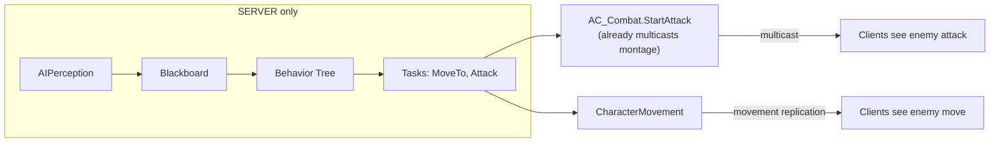
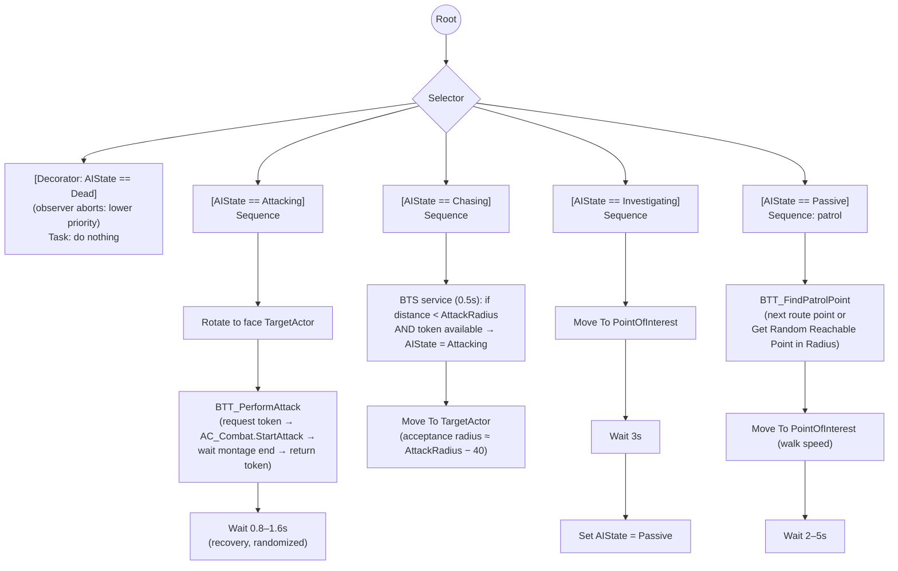

# Chapter 8 — Enemy AI: Behavior Trees & Group Combat

> **Goal of this chapter:** a basic "Hollow" enemy that patrols, spots a player, closes distance, and attacks using the Chapter 6 combat machinery — plus the *attack token* system that makes fighting groups feel like Dark Souls instead of a mosh pit. In co-op, AI also has to *pick which player* to fight.

---

## 8.1 AI runs on the server. Full stop.

`AIController`, Behavior Trees, Blackboards, EQS, and AI Perception exist **only on the server**. Clients just see the enemy pawn's replicated movement and multicast montages. This is great news: AI is the one system where you can mostly forget networking — as long as you remember that any AI-driven *action* must go through the already-networked systems (montages via multicast, damage via the Ch. 5 pipeline).



## 8.2 The enemy pawn

`BP_EnemyBase` (Character) in `Enemies/Common/`:

- `Replicates = ON` (Characters default to this), `AC_Stats` (TeamID = 1), `AC_Combat`, implements `BPI_Targetable` (Ch. 7).
- Class Defaults → **AI Controller Class** = `AIC_EnemyBase` (create below); **Auto Possess AI = Placed in World or Spawned**.
- A `PatrolRoute` (array of Target Points, Instance Editable) or just wander-radius.
- Child it: `BP_Hollow` with mesh, anims, weapon.
- The level needs a **Nav Mesh Bounds Volume** covering walkable areas (press `P` to visualize the green navmesh).

`AIC_EnemyBase` (AIController):

- Add **AIPerception** component → Senses Config → **AI Sight**: Sight Radius 1500, Lose Sight Radius 2000, Peripheral Vision Half Angle 70°, Detection by Affiliation: tick all three (proper team affiliation needs C++; we filter manually).
- `Event On Possess` → `Run Behavior Tree (BT_EnemyBase)`.

## 8.3 Blackboard & the state enum

`BB_EnemyBase` keys:

| Key | Type | Meaning |
|---|---|---|
| `AIState` | Enum `E_AIState` (Passive, Investigating, Chasing, Attacking, Dead) | master switch |
| `TargetActor` | Object (Actor) | current victim (a *player* — co-op!) |
| `PointOfInterest` | Vector | last seen location / patrol point |
| `AttackRadius` | Float (180) | melee range |

Perception wiring in `AIC_EnemyBase`:

```text
[AIPerception → On Target Perception Updated (Actor, Stimulus)]
 → [Branch: Actor implements BPI_Targetable? / is BP_PlayerCharacter? and not dead]
 → [Break AIStimulus]
     Successfully Sensed = true:
        → [SetValueAsObject TargetActor = Actor]
        → [SetValueAsEnum  AIState = Chasing]
     Successfully Sensed = false (lost sight):
        → [SetValueAsVector PointOfInterest = Stimulus.StimulusLocation]
        → [SetValueAsEnum  AIState = Investigating]
        → [Set Timer 8s → if still Investigating: clear target, AIState = Passive]
```

## 8.4 The behavior tree



Key mechanics of the tree:

- **Decorators**: each branch is gated by a `Blackboard` decorator on `AIState`, with **Observer Aborts = Lower Priority** — when perception flips the enum, the running branch is interrupted immediately.
- **Custom tasks** are Blueprints of `BTTask_BlueprintBase`: implement `Event Receive Execute AI` (gives you Owner Controller + Controlled Pawn) and *always* call `Finish Execute` (this is the #1 "my tree is stuck" bug). Handle `Event Receive Abort AI` → `Finish Abort` and clean up (return tokens! see 8.5).
- **Attack speed** comes from your montages; **chase speed** vs **patrol speed**: set `Max Walk Speed` in tasks/services (server-side is enough for AI — it drives the authoritative movement).
- `BTT_PerformAttack` calls the same `AC_Combat.StartAttack` players use — enemies automatically get trace-based damage, poise, multicast montages, TeamID filtering. Nothing new to network.

## 8.5 Attack tokens: the soulslike crowd-control secret

If five enemies aggro and all attack at once, melee is unplayable. Souls games (and DOOM, and Assassin's Creed) limit *simultaneous attackers* with a token pool: an enemy may only attack while holding a token; everyone else circles and menaces.

**The pool lives on the victim** — that's what makes it scale to co-op automatically: each *player* has their own pool, so 4 enemies can split across 2 players (2 tokens each) instead of queueing on one global pool.

`AC_AttackTokens` (Actor Component on `BP_PlayerCharacter`, server-only logic, no replication needed):

```text
Variables: MaxTokens (int, default 2), TokensAvailable (int, init to Max)

[Function RequestToken → bool]     (SERVER — called by AI, AI is server-side)
 → [Branch: TokensAvailable > 0]
     true  → [TokensAvailable -= 1] → return true
     false → return false

[Function ReturnToken]
 → [TokensAvailable = Min(TokensAvailable + 1, MaxTokens)]
```

Enemy side, inside `BTT_PerformAttack`:

```text
[Receive Execute AI]
 → [Target = BB.TargetActor → AC_AttackTokens.RequestToken]
     false → [Finish Execute (Success = false)]   ◄ selector falls through to
                                                    strafe/pressure behavior
     true  → [Set HeldTokenFrom = Target]
           → [AC_Combat.StartAttack] → [Bind On Montage Ended]
[On Montage Ended]  → [ReturnToken] → [Clear HeldTokenFrom] → [Finish Execute (true)]
[Receive Abort AI]  → [Branch: HeldTokenFrom valid] → [ReturnToken] → [Finish Abort]
[Enemy death (AC_Stats.OnDeath)] → same token cleanup
```

> **Token leaks are the classic bug:** any path where an attack is interrupted (stagger, death, target died) must return the token, or your enemies gradually go passive and the game feels "broken but not crashing". If you see enemies circling forever, audit token returns first. Difficulty knob for free: bosses/harder areas raise `MaxTokens` to 3; a passive-heavy area lowers it to 1.

**"Pressure" behavior when no token:** add a branch after `Chasing` in the selector: if in range but `RequestToken` failed → strafe around the target. Simple version: `Move To` a point offset 90° around the player at attack radius (recompute every 2 s). Fancy version: an **EQS** query (`Points: Donut` generator around TargetActor, tests: Distance band + Trace line-of-sight + prefer flanking Dot) — EQS is worth learning once basic AI works.

## 8.6 Picking a target in co-op: simple threat

With 2–4 players, "nearest player" AI gets exploited (one player kites while others wail). Add a threat table — 20 nodes, big payoff:

```text
AC_Stats.OnDamaged (already exists, Ch. 5)   (server)
 → enemy's AIC: [ThreatMap (Map: Actor → float)] [Add Damage * 1.0]
Healing/taunts later: add threat to healer, taunt = huge threat spike.

BTS_SelectTarget (Service on the Selector root, every 1.0s):
 → [Highest = argmax(ThreatMap, decayed 5%/s)]
 → [Branch: Highest != current BB.TargetActor AND
            Highest.Threat > current.Threat * 1.3]   ◄ 30% hysteresis:
     → [SetValueAsObject TargetActor = Highest]        no rapid flip-flop
 → [Branch: current target dead/downed] → retarget immediately
```

Enemies now naturally spread across the party, switch to the player who's actually fighting them, and drop aggro on downed players (who they should ignore — Ch. 11).

## 8.7 Enemy death, cleanup, and respawn hooks

On `AC_Stats.OnDeath` (server), in `BP_EnemyBase`:

1. BB `AIState = Dead`; `Stop Movement`; unpossess or stop the BT (`Stop Logic`).
2. Return any held token; clear this enemy from all players' threat maps.
3. Award souls: `GameMode.AwardSouls(KillerController, SoulValue)` → PlayerState (Ch. 10).
4. Multicast death montage / ragdoll; after 10 s, `Destroy Actor` (corpse cleanup) — or keep corpses until bonfire rest (Ch. 10 spawner pattern handles respawning).

**Spawner pattern (build it now, Ch. 10 depends on it):** never place `BP_Hollow` directly in levels. Place `BP_EnemySpawner` (an Actor storing `EnemyClass`, spawn transform, patrol route). On BeginPlay (server) it spawns its enemy. On bonfire rest: every spawner destroys its live enemy (if any) and respawns fresh. Defeated bosses set a flag the spawner checks.

## 8.8 Test matrix (2 players)

| Test | Expected |
|---|---|
| Walk past patrol at distance | no aggro outside sight cone |
| Enter sight cone | chase → attack when close, visible identically on both windows |
| 4 enemies vs 1 player | max 2 attack simultaneously, others strafe |
| 4 enemies vs 2 players | enemies split; each player faces ≤2 attackers |
| P1 kites, P2 deals damage | enemy switches target to P2 (threat) |
| Kill enemy mid-attack-windup | token returned; other enemies keep attacking normally |
| Break line of sight | enemy investigates last seen spot, gives up after ~8 s |

---

## Chapter checklist

- [ ] `BP_EnemyBase` + `AIC_EnemyBase` + BT/BB with state-enum branches & observer aborts
- [ ] Perception → blackboard wiring with lost-sight investigation
- [ ] Enemy attacks reuse `AC_Combat` (traces, poise, multicast — free)
- [ ] Attack tokens on the *player*, leak-proof returns audited
- [ ] Threat-based target selection with hysteresis
- [ ] Spawner pattern in place; death awards souls hook stubbed
- [ ] Full test matrix passes with 2 players

**Next:** [Chapter 9 — The Boss Fight](09-boss.md)
