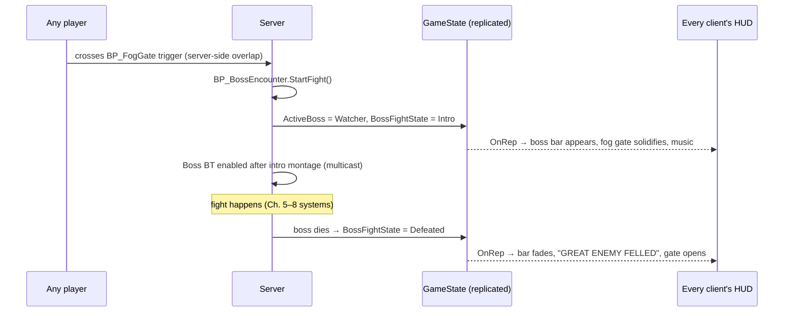
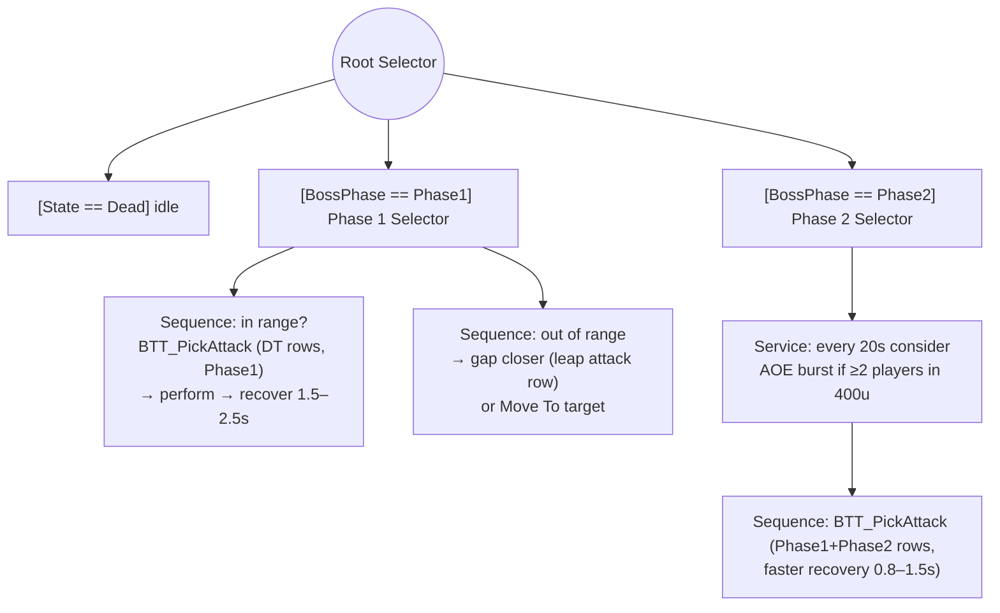

# Chapter 9 — The Boss Fight

> **Goal of this chapter:** a two-phase boss behind a fog gate, with telegraphed attacks, a phase transition at 50% HP, a bottom-of-screen boss health bar on every player's HUD, and co-op-aware behavior. Bosses are 90% reuse of Chapters 5–8 — the new work is *choreography and state*.

---

## 9.1 What's actually new in a boss

| Boss feature | Built on | New work |
|---|---|---|
| Big HP, multiple attacks | `AC_Stats`, `AC_Combat`, BT | data + montages |
| Phases | BT + Blackboard enum | health-threshold trigger |
| Boss HP bar for all players | `GameState` + dispatchers | replicated encounter state |
| Fog gate / arena | Ch. 2 door pattern | encounter manager |
| Telegraphs | AnimMontages + AnimNotify | Niagara decals, timing |
| Co-op awareness | threat (8.6), tokens | target-swap rules, HP scaling (Ch. 11) |

## 9.2 Encounter state lives in GameState

Every player needs to see the boss bar, hear the music change, and see the fog gate — including someone who joins mid-fight. Ch. 2 rule: *late joiners need state, not events* → the encounter is **replicated state on `BP_AshfallGameState`**:

| Variable | Type | Replication |
|---|---|---|
| `ActiveBoss` | Actor ref | RepNotify → all HUDs show/hide the boss bar |
| `BossFightState` | Enum (None, Intro, Active, Defeated) | RepNotify → music, fog gate visuals |



`BP_BossEncounter` (Actor placed in the level, server logic only): references the fog gates, the boss spawner, and the trigger volume. It's the choreographer:

```text
[Trigger overlap]  (authority) → [Branch: State == None]
 → [Close fog gates (replicated bool on the gate actors, Ch. 2 door pattern)]
 → [Spawn / activate boss]
 → [GameState: set ActiveBoss + BossFightState = Intro (w/ Notify)]
 → [Multicast_PlayIntro] → on finish (server timer = intro length):
 → [BossFightState = Active] → [Boss AIC: Run Behavior Tree]

[Boss AC_Stats.OnDeath]  (server)
 → [BossFightState = Defeated] ; [Open gates] ; [Set bDefeated flag on spawner]
 → [GameMode.AwardSouls to EVERY player controller]   ◄ co-op: everyone paid
```

**Co-op detail — the fog gate:** in souls games, players *outside* the gate when the fight starts can walk through it (one-way membrane) to join, and dead players spectate. Simplest version: the gate blocks only the Pawn channel *from inside*; easiest robust version: gate is solid, but players overlapping the gate get a "Traverse the fog" interact prompt (Ch. 10 interaction) that teleports them in — server-side, no edge cases.

## 9.3 The boss Blueprint

`BP_Boss_Watcher` child of `BP_EnemyBase` — everything inherits. Differences:

- `AC_Stats`: MaxHealth 2500, MaxPoise 300 (bosses barely flinch — but a poise *break* is your "posture broken, big punish" moment), heavy hitstop feel via bigger `PoiseDamage` on its own attacks.
- **Attack data table** `DT_WatcherAttacks`: rows = `Montage, Damage, PoiseDamage, MinRange, MaxRange, Cooldown, Phase, Weight`. The BT task picks a row instead of hardcoding montages — adding attacks becomes data entry.
- Implements `GetLockOnLocation` with a chest socket (Ch. 7); huge bosses may expose several lock points.
- **Doesn't use attack tokens** (a boss is always allowed to attack) but **does use threat** (8.6) with an extra co-op rule below.

## 9.4 The boss behavior tree

`BT_Boss_Watcher`, structured by phase:



`BTT_PickAttack` (server):

```text
[Receive Execute AI]
 → [Rows = DT_WatcherAttacks filtered by: Phase ≤ current, MinRange ≤ dist ≤ MaxRange,
    cooldown elapsed (keep a Map<RowName, LastUsedTime> on the AIC)]
 → [Weighted random pick]        ◄ weights stop it spamming one move;
                                   cooldowns force variety
 → [AC_Combat.StartAttack(row)] → wait montage end → [Finish Execute]
```

### Phase transition

In `BP_Boss_Watcher`, bound to its own `AC_Stats.OnHealthChanged` (server):

```text
[Branch: Health/MaxHealth <= 0.5 AND BossPhase == Phase1]
 → [Set BossPhase = Phase2 on Blackboard (SetValueAsEnum)]  ◄ observer aborts
                                                              interrupt Phase1 branch
 → [BT pauses via a bTransitioning BB bool decorator]
 → [Multicast_PlayMontage(AM_Watcher_PhaseRoar)]  + arena VFX
 → [Server timer (roar length) → clear bTransitioning]
 → optional: refill poise, new weapon glow (RepNotify bool → material swap in OnRep)
```

## 9.5 Telegraphs — the difference between hard and unfair

Souls bosses are readable: every attack has a **windup pose**, often a ground decal for AOEs. Concretely:

- Author montages with 0.4–0.9 s of distinct windup before `ANS_WeaponTrace` opens. Slower = more punishable = fairer for melee.
- AOE attacks: an `AN_Telegraph` AnimNotify at windup start → since montages play on all machines (multicast), the notify fires client-side too → spawn the warning decal/Niagara **locally** on each client (cosmetic, no replication needed). Damage still only happens on the server when the trace window opens.
- Give attacks *recovery* you can punish. The attack data table's `Cooldown`+recovery `Wait` is your difficulty dial.

**Camera at giant scale:** lock-on to a huge boss pointing the camera up is the classic pain. Mitigations: lower the lock-on pitch clamp for boss targets, lengthen the spring arm while locked onto anything flagged `bIsLargeTarget`, and consider soft-lock (camera bias, not hard track) for the largest bosses.

## 9.6 Co-op boss rules

- **Target swapping:** pure threat makes a boss tunnel one player. Add to the boss's `BTS_SelectTarget`: after 15–25 s on the same target, or after a big damage spike from another player, force a swap. Both players should get "turns" tanking.
- **Off-target punishes:** phase 2 AOE (9.4) and at least one attack that targets the *second*-highest threat player keep non-tanking players honest.
- **Downed players** (Ch. 11): remove them from the threat map; boss ignores bodies (souls-accurate and prevents corpse-camping).
- **HP scaling:** done globally in Ch. 11 — bosses just inherit it. For reference, Elden Ring scales boss HP roughly ×1.6 with one extra player and ×2.3 with two.

## 9.7 Boss health bar

`WBP_BossBar` in the HUD (bottom, name + big bar):

```text
WBP_HUD:
[GameState.OnRep_ActiveBoss → dispatcher → HUD]
 → valid?   → [Show WBP_BossBar] → [Bind to ActiveBoss.AC_Stats.OnHealthChanged]
 → invalid? → [Unbind] → [Collapse]
```

Add a delayed "white damage chip" second bar later (pure UI polish: lerp a second progress bar toward the real value after 0.8 s).

## 9.8 Test matrix (the important ones)

| Test | Expected |
|---|---|
| P1 triggers gate while P2 outside | gate closes, P2 can traverse-in via prompt; boss bar on both HUDs |
| Join a session mid-fight *(test with One-Process OFF)* | late joiner sees boss bar, correct HP, closed gate |
| Burst boss 55%→45% | exactly one roar, phase 2 attacks begin, no double transition |
| P1 tanks 30 s | boss swaps to P2 within the swap window |
| P1 dies mid-fight | boss ignores body, retargets P2 instantly |
| Kill boss | bar fades + banner on both; gates open; souls to both; spawner flag set (no respawn after rest) |

---

## Chapter checklist

- [ ] Encounter state (ActiveBoss, BossFightState) replicated via GameState; late-join safe
- [ ] `BP_BossEncounter` choreographer: gates, intro, defeat, rewards for all
- [ ] Attack data table + weighted/cooldown pick task
- [ ] Phase 2 at 50% with transition montage & interrupt-safe BT
- [ ] Telegraph notifies (client-side VFX), punishable recoveries
- [ ] Co-op target-swap + downed-player rules
- [ ] Boss bar bound through GameState dispatcher

**Next:** [Chapter 10 — Bonfires, Death & Souls](10-bonfires-death-souls.md)
