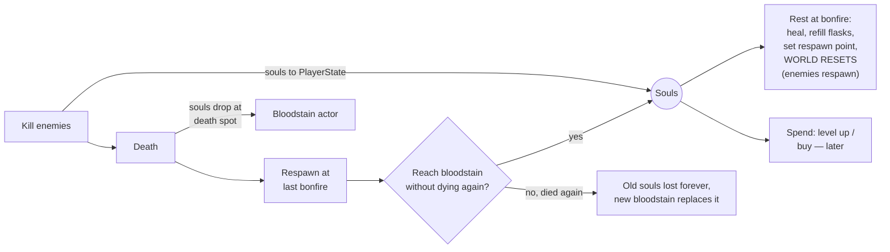

# Chapter 10 — Bonfires, Death & Souls

> **Goal of this chapter:** the soulslike loop — earn souls, rest at bonfires (heal + world reset), die and drop your souls, run back to recover them — working for every player in the session, and surviving a save/reload.

---

## 10.1 The loop



## 10.2 Where the data lives (co-op changes everything here)

Single-player tutorials put souls on the character and reload the level on death. **Neither works in co-op**: pawns are destroyed/respawned (souls would vanish), and you cannot reload the level because *the other players are still playing in it*.

| Data | Home | Why |
|---|---|---|
| `Souls` (int) | **PlayerState** (RepNotify) | survives pawn death; visible to party UI |
| `LastBonfireID` (Name) | PlayerState (replicated) | per-player respawn point (souls-accurate) |
| Bloodstain (location + amount) | **a replicated actor** in the world | everyone can see it; survives your respawn |
| World flags (boss defeated, gates open, bonfires lit) | **GameState** (replicated arrays) + SaveGame | shared world truth |
| Save file | **host's** SaveGame object | the host *is* the world (see 10.7) |

**Death in co-op = respawn, not reload.** The Elden Ring "Seamless Co-op" mod uses exactly this model (die → respawn at your grace, session continues), and it's the right architecture for a built-for-co-op game. Chapter 11 adds the downed/revive layer *in front* of death for bosses.

## 10.3 Interaction system (needed by bonfires, bloodstains, gates)

`AC_Interaction` on `BP_PlayerCharacter` + interface `BPI_Interactable` (`GetPrompt() → text`, `CanInteract(Character) → bool`, `Interact(Character)` — Interact runs on the **server**).

```text
[AC_Interaction, local player only, Timer 0.15s]
 → [Sphere Overlap (r=180) → nearest BPI_Interactable where CanInteract]
 → [Show/Hide WBP_Prompt ("E — Rest at bonfire")]      ◄ purely local UI

[IA_Interact Triggered]
 → [Branch: FocusedInteractable valid]
 → [Server_Interact(FocusedInteractable)]     (Run on Server, Reliable —
                                               on the CHARACTER: we own it)
[Server_Interact (Target)]
 → [Branch: Target.CanInteract(me)]           ◄ server re-validates (range too!)
 → [Target.Interact(me)]
```

This is the Ch. 2 ownership lesson in practice: the RPC goes through *your own character*, with the bonfire passed as a parameter.

## 10.4 The bonfire

`BP_Bonfire` (Actor, `Replicates = ON`) in `World/`: mesh, Niagara fire, `BonfireID (Name)`, `bIsLit (RepNotify)` → OnRep toggles the fire VFX (late joiners see lit bonfires correctly — state, not event!).

`Interact(Character)` — server:

```text
1. [Branch: bIsLit == false] → [Set bIsLit (w/Notify) = true]   ◄ first touch lights it
2. [Character.PlayerState.LastBonfireID = BonfireID]
3. [GameMode.RestAtBonfire(instigating Character)]:
     a. FOR EACH player character (alive ones):        ◄ souls rule: rest heals
        heal to full, refill flasks                      the whole party
     b. FOR EACH BP_EnemySpawner: ResetSpawner()       ◄ destroy live enemy,
                                                         respawn fresh (skips
                                                         bDefeated bosses)
     c. [SaveWorld] (10.7)
4. [Multicast_BonfireRest] → local: sit montage per resting player, screen fade,
                              "Bonfire lit" banner if newly lit
```

> Design choice to make now: does resting **teleport the whole party** to the bonfire (prevents "one player rests while others fight" exploits — enemies respawn on their heads)? Simplest co-op-safe rule: resting requires no enemies aggro'd on any player (`all threat maps empty`), heals everyone in place. Ship that; revisit later.

## 10.5 Souls: earning and spending

From Ch. 8, enemies call `GameMode.AwardSouls(KillerController, Value)`:

```text
[GameMode.AwardSouls]   (server — GameMode is server-only, always safe)
 → in co-op, award to ALL players (full to killer, or 100%/100% like
   Seamless Co-op — recommended: everyone gets full value; shared-progress
   co-op dies when friends compete for kills)
 → [PlayerState.Souls (w/Notify) += Value]

[PlayerState.OnRep_Souls] → dispatcher → HUD souls counter ticks up
```

Spending (level-up at bonfire, vendors) is the same pattern in reverse with a server-side `TrySpendSouls(Cost) → bool`. A minimal level-up: bonfire menu (local UI) → `Server_LevelUp(StatChoice)` → validate cost `= f(Level)` → increment stat in PlayerState, apply to `AC_Stats` (`MaxHealth`, etc. — replicated, so everyone sees your fatter HP bar).

## 10.6 Death, bloodstains, recovery

`BP_Bloodstain` (Actor, `Replicates = ON`): Niagara glow, `Amount (int)`, `OwnerPlayerID (replicated)` — **only the owner can recover it** (souls rule), but everyone sees it.

In `GameMode.NotifyPlayerDied(Controller)` (hooked in Ch. 5):

```text
(server)
1. [PS = Controller.PlayerState]
2. [Branch: PS.Souls > 0]
   → [Destroy PS.CurrentBloodstain if valid]     ◄ died again: old souls GONE
   → [Spawn BP_Bloodstain at death location (trace down to floor)]
       Amount = PS.Souls, OwnerPlayerID = PS.PlayerId
   → [PS.CurrentBloodstain = it] ; [PS.Souls (w/Notify) = 0]
3. [Start respawn timer 4s]  → [RespawnPlayer(Controller)]:
   → [Find BP_Bonfire with BonfireID == PS.LastBonfireID]
     (fallback: PlayerStart)
   → [Spawn new BP_PlayerCharacter at bonfire + offset] → [Possess]
   → HUD rebinds dispatchers on possess (Ch. 5 warning pays off here)
```

Bloodstain `Interact` (via `CanInteract`: `Character.PlayerState.PlayerId == OwnerPlayerID`):

```text
(server) [PS.Souls += Amount] → [PS.CurrentBloodstain = null] → [Destroy Actor]
 → [Client_RecoveredSouls]  → local chime + VFX
```

> **"YOU DIED":** in `OnRep_bIsDead` (Ch. 5), if locally controlled → the fade-in banner widget. Client-side, free, and every player gets their own private doom screen while the others keep fighting.

## 10.7 Saving (host-authoritative)

Co-op save rule (copy Lords of the Fallen / Seamless Co-op): **the host's world is the world.** The save file records world + host progress; joiners keep their own PlayerState-level progress (souls, level) in their own save, synced into PlayerState on join.

`BP_SG_World` (SaveGame class): `LitBonfireIDs (Name array)`, `DefeatedBossIDs`, `OpenedDoorIDs`, and per-player map `PlayerId → (Souls, Level, LastBonfireID, BloodstainTransform/Amount)`.

```text
[GameMode.SaveWorld]  (server; call on bonfire rest + on player leave + on shutdown)
 → [Create Save Game Object (BP_SG_World)] (or reuse cached one in GameInstance)
 → fill from GameState / actors / PlayerStates
 → [Async Save Game to Slot "World_" + SlotName, UserIndex 0]

[GameMode.LoadWorld]  (server, on map BeginPlay)
 → [Does Save Game Exist] → [Load Game from Slot] → apply:
     bonfires: set bIsLit (w/Notify) — RepNotify repaints them everywhere
     bosses:   spawners with saved IDs set bDefeated (no spawn)
     bloodstains: respawn saved ones
```

Everything applied on load is *replicated state*, so clients (who never load anything) still see the correct world. This is why the guide kept insisting on state over events.

## 10.8 Test matrix (2 players, One-Process OFF for the join test)

| Test | Expected |
|---|---|
| P2 kills enemy | both souls counters update (shared full award) |
| P2 dies with 500 souls | bloodstain visible to both; P2 respawns at their last bonfire; P2 souls = 0 |
| P1 tries to loot P2's stain | prompt doesn't appear (CanInteract false) |
| P2 recovers own stain | +500, stain gone on both screens |
| P2 dies twice | first stain vanished, only newest exists |
| Rest at bonfire | both healed; enemies respawn on both screens; defeated boss doesn't |
| Host quits to menu, re-hosts, P2 rejoins | lit bonfires, dead boss, bloodstains all restored |

---

## Chapter checklist

- [ ] Interaction system (interface + server validation through own character)
- [ ] Bonfire: lit state (RepNotify), party heal, spawner reset, save
- [ ] Souls on PlayerState; award/spend server-side; HUD counter
- [ ] Death → owner-locked replicated bloodstain → respawn at own bonfire (no level reload!)
- [ ] Die-again rule destroys the old stain
- [ ] Host-authoritative world save/load; late joiners see restored state
- [ ] Test matrix passes

**Next:** [Chapter 11 — Co-op Systems: Revive, Scaling & Party UX](11-coop-polish.md)
