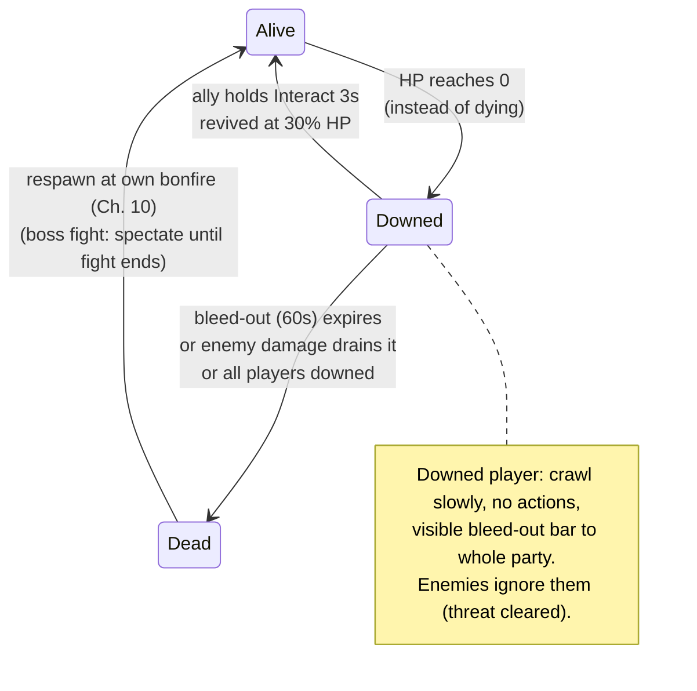

# Chapter 11 — Co-op Systems: Revive, Scaling & Party UX

> **Goal of this chapter:** the systems that make it a *co-op* soulslike rather than a soulslike that tolerates guests: downed/revive, enemy scaling by player count, party HUD, and the drop-in/drop-out rules. This is also where you make the design calls — reference numbers from shipped games included.

---

## 11.1 Design decisions (make them explicitly)

| Question | Souls-classic (ER vanilla) | Built-for-co-op (recommended) |
|---|---|---|
| Session model | summon per boss area, ends on boss/host death | persistent drop-in/out session (our Ch. 3 already does this) |
| Player death | phantom leaves / session ends | **downed → revive window → respawn at own bonfire** |
| During boss | host death = wipe | dead player spectates; wipe only when ALL players down (Seamless Co-op / Nioh 2 model) |
| Loot & souls | host-favored | everyone gets 100% (LotF 2.0 moved to this after launch backlash — learn from them) |
| Enemy HP | +60%/+130% (boss, per phantom) | +35–50% per extra player, bosses more |
| World progress | host only | host-authoritative save (Ch. 10), joiners keep character progress |

The recommended column is what this chapter builds.

## 11.2 Downed & revive

The flow (mirrors Remnant 2's bleed-out, the best-in-class version):



### Implementation

`AC_Stats` changes (server): in `ReceiveDamage`, when `Health` would hit 0 and `bCanBeDowned` (true in multi-player sessions, false solo — solo goes straight to Ch. 10 death):

```text
[Set CombatState (w/Notify) = Downed] ; [Set Health = 1]
[Set BleedOut (RepNotify float) = 60.0]     ◄ party UI shows it
[Clear this player from all enemy threat maps]  (Ch. 8.6)
[Server timer 1s loop: BleedOut -= 1 (further hits: -5 extra);
   at 0 → GameMode.NotifyPlayerDied (Ch. 10 death: bloodstain etc.)]
```

`OnRep_CombatState == Downed`, locally controlled → crawl mode: `Max Walk Speed = 80`, disable attack/dodge inputs (gate them on CombatState — you already do), downed camera + desaturation post-process. Simulated proxies → crawl anim via the AnimBP reading CombatState.

**Revive** is just an interactable: the downed character's `BPI_Interactable.CanInteract` returns true for *other living players*; prompt "Hold E — Revive". Hold-to-interact: `IA_Interact` with a **Hold (3 s)** trigger, or a server-side channel (start on press RPC, cancel on release RPC, complete on 3 s timer — server-side channel is cheat-proof and lag-honest; use it):

```text
[Server: ReviveComplete]
 → [Downed.AC_Stats: Health = MaxHealth * 0.3 (w/Notify)]
 → [CombatState (w/Notify) = Idle] ; [stop bleed-out timer]
 → [1s of bInvincible]              ◄ Remnant 2 added post-revive i-frames
                                      in a patch for a reason: revive-camping
 → [Multicast: revive VFX/anim]
```

**Wipe rule** (server, checked whenever someone goes down): if **all** connected players are Downed or Dead → everyone gets Ch. 10 death treatment (bloodstains at their spots, respawn at bonfires), world does a bonfire-style reset, boss (if active) resets to full and `BossFightState = None`. During a boss fight, dead players **spectate** (set view target to a living ally: `Set View Target with Blend`, owning-client RPC) instead of respawning — respawn-running back into a boss arena mid-fight breaks the fight's tension and its gate logic.

## 11.3 Enemy scaling by player count

One function on the GameMode, called when spawning any enemy *and* when player count changes (for already-alive enemies, scale MaxHealth but keep Health fraction):

```text
[GameMode.GetEnemyScalars → (HPMult, DmgMult)]
 N = alive connected players
 HPMult  = 1.0 + 0.5 * (N - 1)        ◄ regular enemies: +50%/extra player
 BossHP  = 1.0 + 0.65 * (N - 1)       ◄ Elden Ring: ×1.6 @2p, ×2.3 @3p
 DmgMult = 1.0 + 0.15 * (N - 1)       ◄ damage scales gently (Remnant 2
                                         nerfed 25%→15% per player; spikes
                                         feel unfair in melee)
```

Apply in `BP_EnemySpawner` / boss spawn: `AC_Stats.MaxHealth *= HPMult`, weapon damage `*= DmgMult`. Also scale **attack tokens**: `MaxTokens` on each player stays 2, which already means more total simultaneous attacks with more players — usually enough; don't double-scale.

**Mid-session join/leave:** hook `GameMode → Event OnPostLogin` and `Event OnLogout`. On join: spawn their pawn at the *host's* last bonfire, sync their PlayerState from their own save, rescale living enemies. On leave: rescale, and if they were mid-fight, remove from threat maps; save the world (their bloodstain persists in the host's save — they can recover it next session).

## 11.4 Party HUD

`WBP_PartyList` in the HUD: one row per *other* player — name, HP bar, downed state/bleed-out, distance arrow.

Data source pattern (no polling, no RPCs — everything is already replicated):

```text
[GameState.PlayerArray]           ◄ engine-maintained, replicated list of
                                    every PlayerState
 → on change (poll 1s or bind to PostLogin/Logout via GameState dispatchers
   you fire from GameMode → replicated event): rebuild rows
Each row:
 → [PS.GetPawn → AC_Stats.OnHealthChanged]  → HP bar
 → [PS.OnRep_Souls dispatcher]              → souls (optional)
 → [CombatState == Downed]                  → row flashes red + bleed-out bar
                                              + on-screen marker ("go revive!")
```

Off-screen ally/downed markers: `Project World to Screen` on the ally each frame; if off-screen, clamp to screen edge and rotate an arrow — this is a self-contained widget, grab any "off-screen indicator" tutorial.

**Ping system (strongly recommended, ~1 hour):** `IA_Ping` → line trace from camera → `Server_Ping(Location)` → multicast → everyone spawns a temporary marker widget/Niagara at the spot. In a game without voice chat, ping IS your communication system.

## 11.5 Trivial-but-important co-op details

- **Player collision:** players should *not* block each other (body-blocking in corridors = grief). Capsule → Pawn channel = **Ignore** between players (custom object channel `PlayerPawn`), but keep blocking enemies.
- **Shared pickups:** items in the world (flask upgrades, key items) → give to **everyone** on pickup (Remnant 2 model: one player picks up, all receive). Consumable world drops can be per-player: replicate the pickup actor with a `TakenBy (PlayerId array)`; `CanInteract` false if your ID is in it; visually hide via OnRep for those who took it. Instanced loot without duplication drama.
- **Flask (Estus):** per-player consumable on PlayerState (`FlasksRemaining`, RepNotify), refilled by bonfire rest; drinking = a montage with an `AN_Heal` notify → server heals — interruptible by damage, exactly like the dodge/attack patterns you already have.
- **Friendly VFX readability:** tint ally attack VFX blue/green so players can parse a 4-body melee. Local-only cosmetic choice in the multicast handlers.

## 11.6 Test matrix (this one earns its keep — 2–3 players, One-Process OFF, 120 ms)

| Test | Expected |
|---|---|
| P2 HP to 0 in a mob fight | P2 downed, crawling; enemies switch to P1; party row flashes on P1's HUD |
| P1 revives P2 (hold 3 s) | interrupted if P1 releases early or gets hit; success → P2 at 30% + 1 s i-frames |
| P2 bleeds out | normal death: bloodstain, respawn at P2's bonfire |
| All players down | wipe: world reset, boss reset, everyone at bonfires |
| P2 downed during boss, bleeds out | P2 spectates P1; if P1 wins, P2 respawns; if P1 wipes, both respawn |
| 3rd player joins mid-session | spawns at host bonfire; enemy HP rescales; party list updates everywhere |
| Player leaves mid-fight | enemies rescale + retarget; no dangling threat/tokens (watch for the circling-forever bug) |
| Pickup a key item | everyone gets it; per-player consumable hides only for the taker |

---

## Chapter checklist

- [ ] Downed/bleed-out/revive with server-side hold channel + post-revive i-frames
- [ ] Wipe rule + boss spectating
- [ ] Player-count scaling (HP heavy, damage light) incl. mid-session join/leave
- [ ] Party HUD rows off replicated state only; downed markers; ping
- [ ] Player-player collision off, shared key items, per-player flasks
- [ ] Full matrix with 3 real processes

**Next:** [Chapter 12 — Packaging, Performance & the Road to C++](12-packaging-and-beyond.md)
