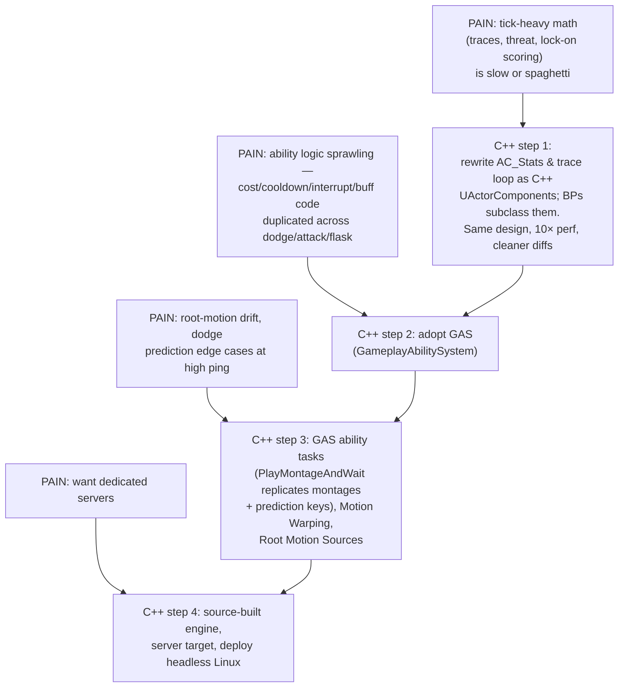

# Chapter 12 — Packaging, Performance & the Road to C++

> **Goal of this chapter:** shippable builds your friends can actually playtest, the network/perf tuning pass, and a concrete map of *which* systems to migrate to C++ (and GAS) when you're ready — in priority order, not all at once.

---

## 12.1 Packaging a build

1. **Project Settings → Packaging**: Build Configuration = *Development* for playtests (*Shipping* hides logs/console — save it for release), tick *Use Pak File*.
2. **Project Settings → Maps & Modes**: confirm Game Default Map = `L_MainMenu`; **Packaging → List of maps to include** — include all your maps (missing-map crashes on travel are a classic).
3. Platforms → Windows → **Package Project**. First build takes ages (shader compile); later ones are incremental.
4. Test the *packaged* build with two machines (or two copies on one machine with `-windowed`): host, join, play 15 minutes. PIE hides packaged-only bugs: missing maps, case-sensitive paths, plugin not packaged, Steam-only behavior.

**Playtest distribution:** zip the `Windows/` output folder; or Steam Playtest if you have an AppId. Remember Ch. 3: Steam features need Steam running and a packaged build.

## 12.2 Network performance pass

At 4 players your bandwidth is almost certainly fine, but do this once before wide playtesting:

| Action | How | Payoff |
|---|---|---|
| Watch the numbers | `stat net` in a packaged build while 4p fighting | know your baseline (aim well under 100 KB/s per client) |
| Slow down quiet actors | `Net Update Frequency` = 5–10 on doors, bonfires, pickups (default 100) | most replication cost is pawns; keep it that way |
| Dormancy for set-and-forget state | `Net Dormancy = Dormant All` on bonfires/doors; call `Flush Net Dormancy` before changing their replicated vars | near-zero cost when idle |
| Relevancy distance | pawns/enemies: default relevancy is fine; big levels → consider `Net Cull Distance Squared` on enemies (e.g. 15000²) | joins/leaves of far actors handled by engine |
| Don't replicate cosmetics | audit: VFX, widgets, camera vars marked Replicated by accident | free wins |
| Unreliable where possible | hit-react/dodge multicasts unreliable; only state-critical RPCs reliable | avoids reliable-buffer overflow kicks |
| Test the worst case | 4 players + 6 enemies + boss, 150 ms + 1% loss emulation | if this is playable, you're done |

**The listen-server host advantage** (host has 0 ping) is fine in co-op — nobody's competing. The host's machine does pay for server + rendering; your minimum-spec machine should host in at least one playtest.

## 12.3 General performance quick hits

- `stat unit` (is it Game, Draw, or GPU bound?), `stat scenerendering`, Unreal Insights for deep dives.
- Animation: enable **Update Rate Optimization** on enemy skeletal meshes + `Visibility Based Anim Tick Option = Only Tick Poses when Rendered` (careful: keep montage-driven *damage windows* server-ticking — server has no rendering; use `Always Tick Pose and Refresh Bones` on the server if traces misbehave — gate with `Is Dedicated Server`/has-authority checks).
- AI: Behavior Tree services at 0.5–1 s intervals, not Tick; perception dominant sense only Sight until you need more.
- Niagara: pool impact effects (spawn-once systems, user-param reuse), cap simultaneous blood systems.
- UI: no `Bind` property bindings that poll per frame (you built everything event-driven — keep it that way).

## 12.4 The road to C++ — what, why, and in what order

Blueprints will carry this project a long way (everything in this guide ships fine as BP). Add C++ **surgically**, when you feel a specific pain. Enabling it is non-destructive: *Tools → New C++ Class* converts the project; Blueprints then *inherit from* your C++ classes and keep working.

### About GAS (read before you're tempted)

The **Gameplay Ability System** is Epic's networked ability framework (Lyra, Fortnite): abilities with built-in replication, prediction, costs, cooldowns, gameplay tags, and attribute sets. It would replace the hand-rolled parts of Ch. 4–6 (`Server_Dodge` RPCs, stamina checks, montage multicasts) with `GA_Dodge`, `GA_LightAttack`, a `GE_StaminaCost`…

Facts to plan around (from the community-standard GASDocumentation):

- **GAS cannot be set up in pure Blueprint.** The AbilitySystemComponent and **AttributeSets are C++-only**; abilities and effects can then be authored in BP. Expect a thin C++ layer (~a few hundred lines) or a bridge plugin (*GAS Companion* (paid), *GAS Associate* (free), *Blueprint Attributes*) if you want it earlier.
- Its killer feature for this genre: `PlayMontageAndWait` ability tasks replicate montages **with prediction** — the exact thing we hand-built for the dodge — plus tag-based interrupt rules (`State.Staggered` blocks `Ability.Attack`) that replace the CombatState enum with something far more composable.
- Migration path that works: keep `AC_Stats`/`AC_Combat` interfaces (dispatchers, function names) and reimplement their guts on GAS — UI and AI don't need to know.

**Recommendation:** ship your vertical slice on this guide's architecture first. You'll then understand *exactly* what GAS is solving, and the migration is a refactor, not a leap of faith.

### What should stay Blueprint forever

UI, level scripting (`BP_BossEncounter`), data assets, AnimBPs/montage notifies wiring, VFX/audio hookup, one-off interactables. C++ is for hot loops, framework classes, and things needing engine features BP can't reach.

## 12.5 Content roadmap after the systems are done

You now have every *system* a co-op soulslike needs. What remains is content and iteration:

```mermaid
gantt
    dateFormat X
    axisFormat %s
    title From systems-complete to vertical slice (relative effort, not weeks)
    section Content
    Blockout dungeon L_Dungeon01 (shortcuts! loops!)  :a1, 0, 3
    3 enemy types from BP_EnemyBase                    :a2, 1, 3
    Boss 1 polish (anims, arena, music)                :a3, 2, 3
    section Feel
    Anim set upgrade (Fab packs / GASP retarget)       :b1, 2, 2
    SFX + hit VFX pass                                 :b2, 3, 2
    Camera polish (lock-on tuning at scale)            :b3, 3, 1
    section Meta
    Level-up + weapon upgrade loop                     :c1, 3, 2
    4-player playtests, weekly                         :c2, 0, 6
```

Level design notes specific to the genre: design around **loops and shortcuts** (bonfire → route → unlockable shortcut back), place bonfires so a death costs 2–4 minutes of run-back, and playtest widths — co-op melee needs corridors ~1.5× wider than solo would.

## 12.6 Where to go deeper

The [Resources appendix](resources.md) collects every doc, tutorial series, sample repo, and plugin referenced across the guide, with notes on what each is good for.

---

## Chapter checklist

- [ ] Development-config packaged build; 2-machine host/join test passed
- [ ] `stat net` baseline recorded; quiet actors dormant/slowed
- [ ] Worst-case fight tested at 150 ms + loss
- [ ] You know your C++ trigger points (and are ignoring GAS until the slice ships)
- [ ] Content roadmap drafted; weekly playtests scheduled

**You made it.** Systems-complete is the hard half of a soulslike. Now go build a dungeon worth dying in — repeatedly, with friends.
