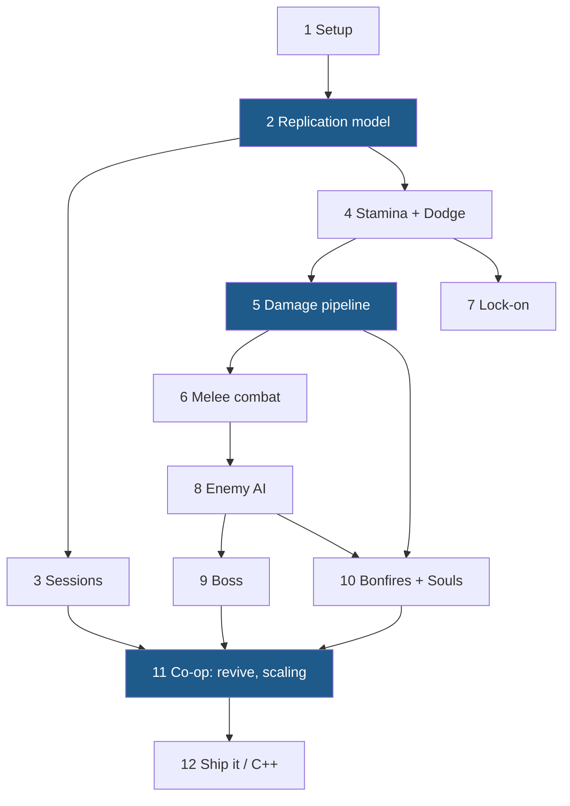

# Building a Co-op Soulslike in Unreal Engine 5 — A Step-by-Step Guide

A 12-chapter, Blueprint-first implementation guide for a 2–4 player online co-op soulslike (listen server, drop-in sessions, souls-style combat/death loop), written to be followed in order. C++ is deliberately deferred — [Chapter 12](12-packaging-and-beyond.md) maps the migration path when you're ready.

> **The one rule the whole guide is built on:** every feature is designed server-authoritative and tested with 2+ clients *from day one*. Multiplayer is not a layer you add later.

---

## What you'll have at the end

- Host / find / join sessions (LAN → Steam), drop-in/drop-out
- A networked player character: sprint & stamina, root-motion dodge with i-frames, lock-on targeting
- Melee combat: combo chains, input buffering, animation-driven weapon traces, poise & stagger, hit reactions, hitstop
- Enemies on Behavior Trees with perception, threat tables, and soulslike **attack tokens**; a two-phase boss behind a fog gate
- The full souls loop: bonfires (heal + world reset), souls currency, death → bloodstain → corpse-run recovery
- Co-op systems: downed/bleed-out/revive, wipes, spectating, enemy scaling by player count, party HUD, shared loot rules
- Packaged builds, a network performance pass, and a prioritized C++/GAS adoption plan

## Chapters

| # | Chapter | You build |
|---|---|---|
| 1 | [Project Setup & Foundations](01-project-setup.md) | Project, framework classes, folders, source control, 2-player PIE |
| 2 | [Multiplayer Foundations](02-multiplayer-foundations.md) | The mental model: authority, roles, RPCs, RepNotify — plus a hands-on test |
| 3 | [Sessions: Hosting & Joining](03-sessions-and-joining.md) | Main menu, Create/Find/Join, Steam config, Advanced Sessions |
| 4 | [Locomotion, Stamina & Dodge](04-character-locomotion.md) | AC_Stats, sprint, predicted root-motion dodge, i-frames, combat state machine |
| 5 | [Stats & the Damage Pipeline](05-stats-and-damage.md) | Health/poise, one server-side damage pipeline, hit reactions, death, HP bars |
| 6 | [Melee Combat](06-melee-combat.md) | Weapons + data tables, combos, input buffering, notify-driven weapon traces |
| 7 | [Lock-On Targeting](07-lock-on.md) | Client-local targeting, camera, switching, strafe mode |
| 8 | [Enemy AI & Group Combat](08-enemy-ai.md) | BT/perception, attack tokens, co-op threat tables, spawners |
| 9 | [The Boss Fight](09-boss.md) | Encounter state, fog gate, phases, telegraphs, boss bar |
| 10 | [Bonfires, Death & Souls](10-bonfires-death-souls.md) | Interaction system, bonfire rest/reset, bloodstains, host-authoritative saves |
| 11 | [Co-op Systems](11-coop-polish.md) | Downed/revive, wipe rules, player-count scaling, party HUD, ping |
| 12 | [Packaging & the Road to C++](12-packaging-and-beyond.md) | Builds, net perf pass, C++/GAS migration map |
| A | [Resources appendix](resources.md) | Every doc, tutorial, sample repo, plugin & book, annotated |

## System dependency map

Chapters are ordered so each system stands on finished ones:



The blue nodes are the load-bearing ones: the replication model (Ch. 2), the single damage pipeline (Ch. 5), and the co-op layer (Ch. 11). Skimp anywhere but there.

## Suggested pacing

Working evenings/weekends, each chapter is roughly a week; Chapters 6 and 11 are closer to two. A dedicated month gets you through Chapter 8. Don't rush Chapter 2 — it's an hour of reading that saves a month of rewrites.

```mermaid
gantt
    dateFormat X
    axisFormat wk %s
    title Rough relative effort (1 unit ≈ a hobby week)
    section Foundations
    Ch 1-2 Setup + netcode model      :0, 2
    Ch 3 Sessions                     :2, 1
    section Combat core
    Ch 4 Movement/stamina/dodge       :3, 1
    Ch 5 Damage pipeline              :4, 1
    Ch 6 Melee combat                 :5, 2
    Ch 7 Lock-on                      :7, 1
    section World
    Ch 8 Enemy AI                     :8, 2
    Ch 9 Boss                         :10, 1
    Ch 10 Bonfires/souls              :11, 1
    section Co-op & ship
    Ch 11 Revive/scaling/party        :12, 2
    Ch 12 Package + perf              :14, 1
```



## How to read the code examples

Blueprints don't paste into Markdown, so graphs are written as structured pseudocode. `[Square brackets]` are nodes (using exact node names from the palette — e.g. `Multi Sphere Trace For Objects`, `RInterp To`, `Montage Jump to Section`), indentation is execution flow, and `◄` comments explain the *why*:

```text
[IA_SprintDodge Triggered(Tap)]              ◄ Enhanced Input action event
 → [Branch: CombatState == Idle]             ◄ the state machine gates everything
     True → [Play Anim Montage: AM_DodgeRoll]
          → [Server_Dodge]                   ◄ custom event, Replicates = Run on Server
```

Every replicated variable, RPC direction, and reliability flag is spelled out — those details *are* the tutorial.

Diagrams are [Mermaid](https://mermaid.js.org/) and render directly on GitHub.

## Prerequisites

- UE5 installed and basic editor literacy (place actors, open Blueprints). If Blueprints are brand new to you, do Epic's free "Your First Hour in Unreal Engine 5" course first — this guide assumes you can wire nodes.
- No C++, no networking background required — Chapter 2 teaches the networking from zero.
- A friend (or a second monitor) to playtest with. Non-negotiable, and the fun part.

---

*Written July 2026 against UE 5.4–5.6; current stable at time of writing is 5.8, and everything here uses core 5.x systems that are unchanged in it. UE6 is announced (May 2026) but years from usable — build on UE5. Sources and further reading: [resources.md](resources.md).*
