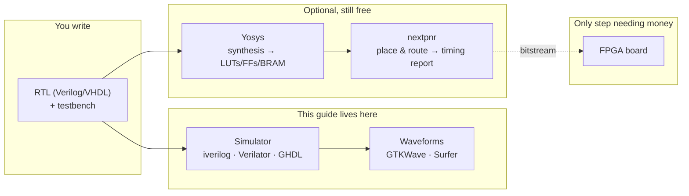
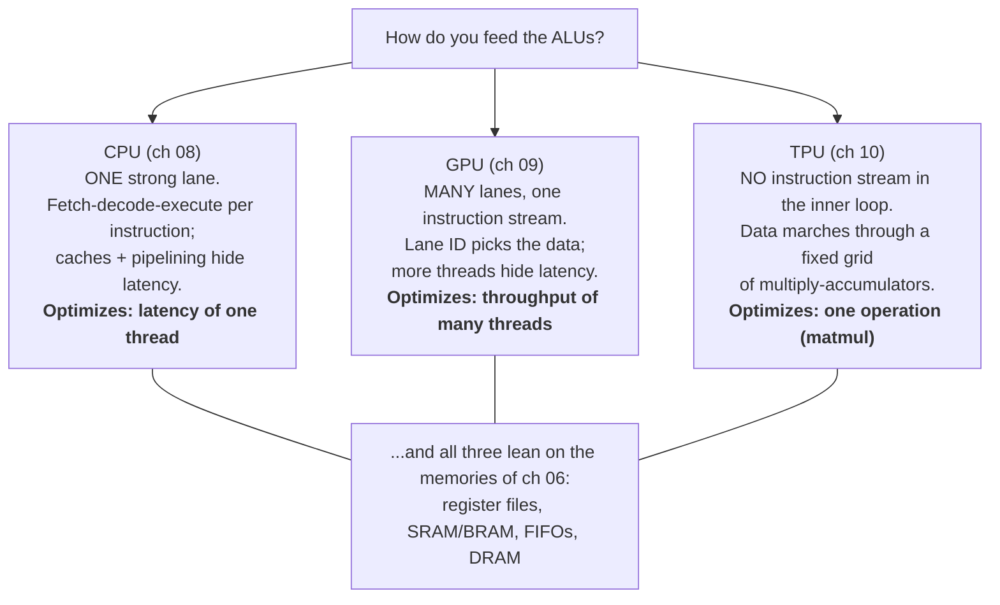

# FPGA Design Without the FPGA — from Blinky to CPU, GPU & TPU, all in simulation

> A hands-on guide to digital hardware design that runs entirely on your
> laptop (macOS or Linux) with **free, open-source simulators** — no FPGA
> board, no vendor licenses, no purchases. You write Verilog, prove it
> correct with self-checking testbenches, watch it execute in a waveform
> viewer, and build up from a counter to a working **RISC-V CPU**, a
> **SIMT GPU core**, and a **systolic-array TPU** — with real **RAMs,
> FIFOs and register files** along the way.

<p align="center">
  <em>"Hardware design is not programming — but a simulator is the best
  place to learn why."</em>
</p>

---

## Why this guide exists

Learning FPGA design looks expensive from the outside: boards, vendor tool
suites, license servers, Windows-only installers. But here is the open
secret of the industry: **hardware engineers spend most of their time in a
simulator, not on hardware.** Chips are designed, debugged, and verified in
simulation for months before anyone touches silicon; the FPGA (or tape-out)
is the last step, not the first.

That means the interesting 90% of the discipline — RTL design, testbenches,
waveform debugging, pipelining, memory architecture, verification — is
learnable **today, on a Mac, for free**:

- **[Icarus Verilog](https://steveicarus.github.io/iverilog/)** simulates your Verilog,
- **[GTKWave](https://gtkwave.sourceforge.net/)** / **[Surfer](https://surfer-project.org/)** show you every signal on every cycle,
- **[Verilator](https://www.veripool.org/verilator/)** compiles RTL to C++ when you need speed,
- **[GHDL](https://ghdl.github.io/ghdl/)** does the same for VHDL,
- **[Yosys](https://yosyshq.net/yosys/)** + **[nextpnr](https://github.com/YosysHQ/nextpnr)** synthesize and place-and-route for real FPGA parts — giving you honest area and timing numbers **without owning the part**.

The destination is deliberately ambitious: by the end you will have built,
tested and understood working (simulated) versions of the three great
compute architectures of our time — the **CPU** (latency machine), the
**GPU** (throughput machine), and the **TPU** (dataflow machine) — plus the
memory structures they all depend on.

---

## Mental model (read this first)

An FPGA is a chip full of small programmable pieces — look-up tables
(logic), flip-flops (state), block RAMs (memory), DSP slices (multipliers) —
floating in a sea of programmable wiring. "Programming" an FPGA means
describing hardware in an HDL and letting tools map it onto those pieces:



Four ideas carry the whole guide:

| Idea | One-liner | Chapter |
| --- | --- | --- |
| **Hardware is parallel** | Every `always` block, every gate, runs *at once*; code order ≠ execution order | [03](docs/03-verilog-crash-course.md) |
| **State lives in flip-flops** | Clock edges are the only moments anything changes; everything between edges is combinational settling | [05](docs/05-sequential-logic-and-fsms.md) |
| **Testbenches are the real work** | A design without a self-checking test is a rumor | [04](docs/04-simulation-and-testbenches.md) |
| **Architecture = moving data** | CPU, GPU and TPU differ mainly in *how data reaches the arithmetic* | [08](docs/08-build-a-cpu.md)–[10](docs/10-build-a-tpu.md) |

---

## What you'll build

Everything under [`src/`](src/) compiles and passes its tests with free
tools — each step is a working design you can run, probe, and break:

```console
$ cd src && make
==== 01-counter ====      ALL TESTS PASSED
==== 02-alu ====          ALL TESTS PASSED
==== 03-uart-tx ====      ALL TESTS PASSED
==== 04-memory ====       ALL TESTS PASSED
==== 05-cpu-rv32i ====    CPU halted after 98 cycles ... ALL TESTS PASSED
==== 06-gpu-simt ====     kernel finished in 48 cycles ... ALL TESTS PASSED
==== 07-tpu-systolic ==== ALL TESTS PASSED
==== 08-vhdl-counter ==== ALL TESTS PASSED
```

- a **single-cycle RV32I CPU** (~250 lines) that executes real RISC-V
  machine code assembled by a ~200-line Python assembler included in the repo,
- a **4-lane SIMT GPU core** that runs a CUDA-style grid-stride vector-add
  kernel — one instruction stream, four lanes, lane-ID addressing,
- a **4×4 weight-stationary systolic array** (the TPU's core trick) doing
  int8 matrix multiplies checked against a golden model,
- the supporting cast every architecture needs: **ALU**, **register file**,
  **BRAM-pattern RAM**, **FIFO**, **UART**.

---

## Prerequisites

- **A Mac or Linux machine.** Everything installs through Homebrew / apt;
  chapter [02](docs/02-the-toolbox.md) is the setup walkthrough. (Windows
  works too via WSL2 — noted where relevant.)
- **No FPGA board.** That is the premise. Chapter
  [11](docs/11-synthesis-without-hardware.md) shows how to get real
  synthesis and timing feedback anyway, and chapter
  [13](docs/13-hardware-and-beyond.md) tells you what to buy *if* you
  eventually want blinking lights.
- **Some programming experience** in any language. No prior hardware
  knowledge assumed — chapter 01 starts from "what is a gate array".
- **Comfort with a terminal** and `make`.

---

## Repository layout

```
fpga-without-the-fpga/
├── README.md                    ← you are here (the map)
├── docs/                        ← the guide, one chapter per file
│   ├── 01-what-is-an-fpga.md
│   ├── 02-the-toolbox.md
│   ├── 03-verilog-crash-course.md
│   ├── 04-simulation-and-testbenches.md
│   ├── 05-sequential-logic-and-fsms.md
│   ├── 06-memory.md
│   ├── 07-building-blocks.md
│   ├── 08-build-a-cpu.md
│   ├── 09-build-a-gpu.md
│   ├── 10-build-a-tpu.md
│   ├── 11-synthesis-without-hardware.md
│   ├── 12-the-vhdl-track.md
│   └── 13-hardware-and-beyond.md
└── src/                         ← working code, one directory per milestone
    ├── Makefile                 ← `make` runs every testbench
    ├── README.md                ← per-step instructions
    ├── 01-counter/              ← hello-world counter + testbench conventions
    ├── 02-alu/                  ← 32-bit ALU, randomized self-checking tests
    ├── 03-uart-tx/              ← first real FSM
    ├── 04-memory/               ← register file · sync RAM · FIFO
    ├── 05-cpu-rv32i/            ← single-cycle RISC-V CPU + mini-assembler
    ├── 06-gpu-simt/             ← 4-lane SIMT core + vector-add kernel
    ├── 07-tpu-systolic/         ← 4×4 systolic matmul array
    └── 08-vhdl-counter/         ← the VHDL taste test (GHDL)
```

---

## The learning path

Concept chapters (🧠) build understanding; build chapters (🛠️) produce
working, tested hardware in `src/`. Read in order — the CPU/GPU/TPU trio
([08](docs/08-build-a-cpu.md)–[10](docs/10-build-a-tpu.md)) can be taken in
any order once you've done 01–07, and each of those chapters says so
explicitly.

| # | Chapter | What you'll learn |
| --- | --- | --- |
| 01 | 🧠 [What is an FPGA (and why you don't need one yet)](docs/01-what-is-an-fpga.md) | LUTs, flip-flops, BRAM, DSPs, routing; FPGA vs CPU/GPU/ASIC; why simulation-first is how the pros work anyway. |
| 02 | 🛠️ [The toolbox: your Mac as an EDA workstation](docs/02-the-toolbox.md) | Installing iverilog, GTKWave/Surfer, Verilator, GHDL, Yosys via Homebrew (or the all-in-one OSS CAD Suite); first simulation; editor setup; online fallbacks. |
| 03 | 🧠 [A Verilog crash course](docs/03-verilog-crash-course.md) | Modules, wires vs regs, `always` blocks, blocking vs non-blocking, the "it's not a program, it's a circuit" mindset, and the classic beginner traps (latch inference, incomplete sensitivity). |
| 04 | 🛠️ [Simulation & testbenches: your real superpower](docs/04-simulation-and-testbenches.md) | Testbench anatomy, waveform dumping and reading, self-checking style, golden models, randomized testing; iverilog vs Verilator vs cocotb. |
| 05 | 🛠️ [Sequential logic & state machines](docs/05-sequential-logic-and-fsms.md) | Clocks, resets, FSM patterns — culminating in the UART transmitter and its "act like the other device" testbench. |
| 06 | 🛠️ [Memory: registers, RAM, FIFOs](docs/06-memory.md) | Register files, the BRAM inference pattern and its one-cycle read latency, FIFO pointer tricks, why DRAM is a different beast, and what caches are for. |
| 07 | 🛠️ [Building blocks of compute](docs/07-building-blocks.md) | The ALU, adders and multipliers as physical objects, pipelining as the fundamental speed trick, valid/ready handshakes. |
| 08 | 🛠️ [Build a CPU: single-cycle RISC-V](docs/08-build-a-cpu.md) | The full RV32I datapath in ~250 lines; fetch/decode/execute as combinational flow; running real machine code; then *why* real CPUs pipeline, and what picorv32 does differently. |
| 09 | 🛠️ [Build a GPU: the SIMT core](docs/09-build-a-gpu.md) | What a GPU actually is (one instruction, many lanes); lane IDs and grid-stride loops; divergence, coalescing and latency-hiding; the graphics pipeline in one section; where tiny-gpu and real GPUs go further. |
| 10 | 🛠️ [Build a TPU: the systolic array](docs/10-build-a-tpu.md) | Why matmul deserves its own machine; weight-stationary dataflow, skewed operands, int8 quantization; scaling from 4×4 to Google-TPU-sized; roofline thinking. |
| 11 | 🛠️ [Synthesis without hardware](docs/11-synthesis-without-hardware.md) | Yosys turns your CPU into LUTs and FFs; nextpnr places it on a real iCE40/ECP5 and reports the *actual* Fmax — area/timing feedback with zero hardware. Plus a taste of formal verification. |
| 12 | 🧠 [The VHDL track](docs/12-the-vhdl-track.md) | The same concepts in the other HDL: GHDL workflow, entity/architecture, the type system, a Verilog↔VHDL phrasebook, and how to choose. |
| 13 | 🧠 [Hardware at last, and where to go next](docs/13-hardware-and-beyond.md) | If/when you buy: iCEBreaker, ULX3S, Tang Nano and friends; porting the guide's designs to a board; books, courses, communities, and project ideas that keep the ramp going. |

---

## The big picture — three machines, one family tree

The guide's thesis in one diagram: all three architectures are answers to
the same question — *how do you keep arithmetic units fed with data?*



---

## How to use this guide

- **Do, don't just read.** Every build chapter maps to a `src/` step whose
  testbench passes. Run it, open the `.vcd` in a waveform viewer, and only
  then read the walkthrough.
- **Break things.** The fastest way to learn hardware: flip a `<=` to `=`,
  delete a `default:`, watch the testbench (or the waveform) catch it.
  Each step's README suggests specific sabotage.
- **Type the code yourself** for at least chapters 03–06. Muscle memory
  matters in HDL more than in software — the patterns (sync process, FSM
  skeleton, testbench harness) are few and they repeat forever.
- **The CPU/GPU/TPU order is yours.** They share prerequisites (01–07) but
  not each other. Curious about AI hardware? Jump 07 → 10. Classic
  computer-architecture route? 08 → 09 → 10.

---

## Credits & lineage

This guide walks a path many good teachers have paved: Sarah Harris & David
Harris's *Digital Design and Computer Architecture* (the single best book
companion to chapters 03–08), [HDLBits](https://hdlbits.01xz.net/)' exercise
style, Bruno Levy's [learn-fpga / "From Blinker to
RISC-V"](https://github.com/BrunoLevy/learn-fpga), Claire Wolf's
picorv32 and Yosys, adam-maj's [tiny-gpu](https://github.com/adam-maj/tiny-gpu)
(the inspiration for chapter 09's teaching approach), and Google's TPU
papers for chapter 10. Full references live in each chapter and in chapter
[13](docs/13-hardware-and-beyond.md).

---

*Start here → [Chapter 01: What is an FPGA (and why you don't need one yet)](docs/01-what-is-an-fpga.md)*
