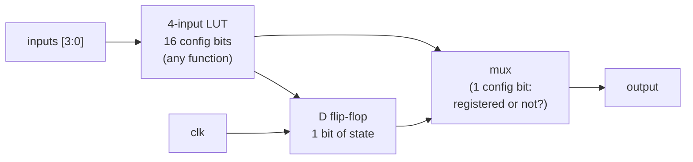
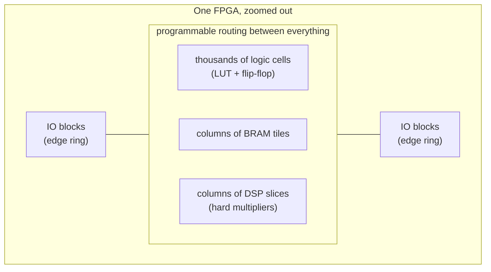
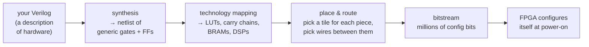
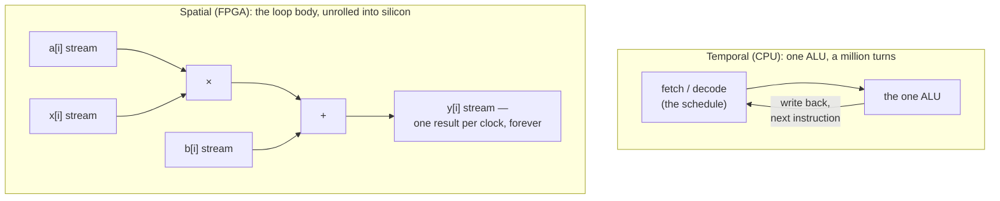

# 01 — What is an FPGA (and why you don't need one yet)

> An FPGA ships from the factory as a blank grid: thousands of tiny
> truth-table memories, a flip-flop beside each one, blocks of RAM, hard
> multipliers, and a sea of programmable wiring. A toolchain turns your
> Verilog into the millions of configuration bits that wire that grid into
> *your* circuit. This chapter is about understanding the grid — owning one
> can wait until [chapter 13](13-hardware-and-beyond.md).

Take the name apart, because for once the name is the spec.
**Field-Programmable Gate Array**: an *array* of logic resources (the
marketing says "gates"; the truth is more interesting), *programmable in the
field* — meaning after it leaves the factory, on your desk, as many times as
you like. That last part is the entire reason FPGAs exist. A custom chip (an
ASIC) is fixed forever the day it's fabricated; an FPGA is a chip that keeps
an open mind.

But "programmable" is a trap word, and most of this chapter is about
defusing it. An FPGA does not run your code. There is no processor inside
waiting to execute your Verilog line by line. Instead, your description of a
circuit gets compiled into a configuration that physically wires the chip's
resources into that circuit. To see why that distinction changes everything,
you need to know what the resources actually are — so let's open the box.

## The look-up table: a truth table you can write to

Here is the trick at the bottom of every FPGA, and it's almost
disappointingly simple.

Any boolean function of *N* inputs is completely described by its truth
table: for each of the 2^N input combinations, one output bit. So don't
build the function out of gates at all. **Store the truth table in a tiny
2^N × 1-bit memory, and use the inputs as the address.** The memory *is* the
function. That's a look-up table — a LUT — and it is the FPGA's universal
logic element.

A 2-input LUT makes the idea concrete. It holds four configuration bits,
one per input combination:

| `b` | `a` | address | stored bit → `out` |
| --- | --- | ------- | ------------------ |
| 0   | 0   | `00`    | 0                  |
| 0   | 1   | `01`    | 1                  |
| 1   | 0   | `10`    | 1                  |
| 1   | 1   | `11`    | 0                  |

Load the pattern `0110` (reading addresses `11` down to `00`) and this LUT
computes XOR. Load `1000` and the same physical silicon computes AND. Load
`1110`: OR. Load `0111`: NAND. Four bits of configuration memory give you
any of the 2^4 = 16 possible two-input functions, with no rewiring and no
gates in sight — changing the function is just writing different bits.

Real FPGAs scale this up. The Lattice iCE40 and ECP5 parts you'll target in
[chapter 11](11-synthesis-without-hardware.md) use 4-input LUTs: 16
configuration bits each, so any of 2^16 = 65,536 possible functions of four
variables. Larger AMD/Xilinx parts use 6-input LUTs (64 bits). Need a
function of more inputs? The tools cascade LUTs — the output of one becomes
an input of the next, at the cost of a little extra delay per level.

Hold onto this, because it explains half of what the tools do: **synthesis
is, at bottom, the art of chopping your design into 4-input chunks.** When
chapter 11 reports that your CPU costs "2,000 LUTs", it is literally
counting how many of these little truth-table memories your design consumed.

## A flip-flop next to every LUT

LUTs alone can only compute; they cannot *remember*. A circuit built purely
from LUTs is combinational — outputs are a function of current inputs, full
stop. To hold state — a counter's count, a CPU's program counter, the
"which bit am I sending" of a UART — you need storage that updates at
defined moments.

So next to every LUT sits a **D flip-flop**: one bit of storage that
captures the LUT's output on the rising edge of a clock and holds it steady
until the next edge. A configuration bit selects whether the logic cell's
output comes straight from the LUT (combinational) or from the flip-flop
(registered):

This LUT + flip-flop pair is the **logic cell**, the atom of the FPGA
(vendors group a handful of them into "slices" or "logic blocks", but the
atom is what matters). A small part like the iCE40 UP5K has on the order of
five thousand of them; big datacenter FPGAs have millions. Everything you
build in this guide — the counter in
[`../src/01-counter/counter.v`](../src/01-counter/counter.v), the RISC-V
CPU, the systolic array — reduces to a swarm of these cells.

The pairing also previews the guide's most important rhythm, the one
[chapter 05](05-sequential-logic-and-fsms.md) drills: **state lives in
flip-flops and changes only on clock edges; between edges, LUTs settle.**
That's not a coding convention. It's the physical structure of the chip.

## The rest of the tiles: BRAM, DSP, IO, and the wiring between

If LUTs can implement *any* function, why does the fabric contain anything
else? Because some functions are so common and so expensive in LUTs that it
pays to harden them into dedicated silicon:

- **Block RAM (BRAM).** You *can* build memory from logic cells — one bit
  per flip-flop — but a mere kilobyte would devour thousands of cells. So
  the fabric includes columns of dedicated SRAM tiles, each a few kilobits
  to a few tens of kilobits, usually dual-ported. BRAM comes with a quirk
  that will shape your code in [chapter 06](06-memory.md): reads are
  *synchronous* — you present an address on one clock edge and get data on
  the next. Write your Verilog to match that pattern and the tools map it
  to BRAM for free; fight it and you burn logic cells.
- **DSP slices.** Multiplication is brutally expensive in LUTs — a single
  16×16 multiplier can cost hundreds of them. Since multiply-accumulate is
  the beating heart of signal processing and machine learning, FPGAs
  include columns of hard multipliers (typically around 18×18 bits, often
  with a built-in accumulator). [Chapter 07](07-building-blocks.md) treats
  multipliers as physical objects for exactly this reason, and the TPU of
  [chapter 10](10-build-a-tpu.md) is essentially a marching formation of
  multiply-accumulators.
- **IO blocks.** Around the edge sits a ring of configurable pin drivers:
  each pin can be input, output, or bidirectional, at a configurable
  voltage standard, often with registers right at the pin. Bigger parts add
  hard transceivers for serial links. IO is the one resource this guide
  genuinely cannot exercise in simulation — more on that honesty below.
- **Programmable routing.** The unglamorous majority of the chip. Between
  all the tiles runs a dense mesh of wire segments joined by configurable
  switches; most of an FPGA's silicon area and most of its configuration
  bits exist just to get signals from one tile to another. Routing is also
  where most of a design's *delay* lives — a fact that will matter when
  chapter 11 shows you real timing reports.

Zoomed all the way out, the floorplan looks like this:

And in table form — this is the cast of characters for the whole guide:

| Resource | What it physically is | What you'll build with it |
| --- | --- | --- |
| LUT | 16–64 bit memory acting as a truth table | All combinational logic: the ALU ([ch 07](07-building-blocks.md)), instruction decode ([ch 08](08-build-a-cpu.md)) |
| Flip-flop | 1 bit of clock-edge-triggered storage | Counters, FSMs ([ch 05](05-sequential-logic-and-fsms.md)), pipeline registers, the PC |
| BRAM | Dedicated SRAM tile, synchronous read | RAM, FIFOs ([ch 06](06-memory.md)), CPU/GPU memories |
| DSP slice | Hard multiplier (+ accumulator) | The multipliers in the GPU and TPU ([ch 09](09-build-a-gpu.md)–[10](10-build-a-tpu.md)) |
| Routing | Wire segments + config switches | Nothing directly — but it dominates area and timing |
| IO block | Configurable pin driver | Blinking actual LEDs, someday ([ch 13](13-hardware-and-beyond.md)) |

For scale: a small hobbyist part like the iCE40 UP5K offers roughly five
thousand LUT/flip-flop pairs, a few dozen BRAM tiles, and a handful of hard
multipliers. That sounds tiny — and it comfortably fits the RISC-V CPU you
will build in [chapter 08](08-build-a-cpu.md), with room to spare.

## "Programming" an FPGA is not programming

Now the trap word. When you "program" an FPGA, no instructions are
generated, nothing is executed, and nothing runs "on" the chip in the
software sense. What actually happens is a compilation pipeline whose output
is a **bitstream**: the complete set of configuration bits — every LUT's
truth table, every registered-or-not mux, every routing switch, every IO
standard — that turns the blank fabric into your circuit.

Each stage has a software-world cousin, but the analogy is loose.
**Synthesis** turns your HDL into a netlist of abstract gates and
flip-flops. **Technology mapping** re-expresses that netlist in the target
chip's vocabulary — this is where your logic gets chopped into 4-input
chunks and your memories get matched to BRAM tiles. **Place & route** then
solves a gigantic constrained-optimization puzzle: assign every mapped
element to a physical tile and every connection to physical wire segments,
such that the slowest path still fits within one clock period. Finally the
**bitstream** serializes the result. Most mainstream FPGAs hold their
configuration in SRAM, so they forget everything at power-off and reload
the bitstream from a little flash chip at every boot — which is also why
reprogramming them is instant and infinitely repeatable.

Two things to bank for later. First, place & route is *slow* — minutes for
small designs, hours for large ones — and that has consequences for how you
should learn (below). Second, none of this requires owning the chip:
[chapter 11](11-synthesis-without-hardware.md) runs this exact flow with
[Yosys](https://yosyshq.net/yosys/) and
[nextpnr](https://github.com/YosysHQ/nextpnr) against a real iCE40 part and
gets back the real area numbers and the real maximum clock frequency. The
only step that needs hardware is the very last arrow.

## Spatial vs temporal computing — the mental shift that matters

Everything above is mechanism. Here is the meaning, and it is the single
most important idea in this guide.

A CPU is a **temporal** computer. It owns a small amount of very good
hardware — one ALU (or a few) — and *reuses it over time*. Your program is
a schedule: fetch an instruction, decode it, steer this cycle's operands
through the shared ALU, store the result, repeat, a billion times a second.
The algorithm exists in *time*, as a sequence of visits to the same silicon.

An FPGA is a **spatial** computer. There is no schedule and no instruction
stream. Instead, you lay the algorithm out in *space*: this LUT computes
that condition, this multiplier handles that product, this wire carries the
result onward — permanently, all of it, at once. The program doesn't run on
the hardware; the program *becomes* the hardware.

Make it concrete. Suppose you must compute `y[i] = a[i]*x[i] + b[i]` for a
million elements. The CPU loops: load, load, multiply, load, add, store —
a handful of instructions per element, each taking its turn through the
shared datapath. On an FPGA you instead *instantiate* one multiplier wired
into one adder, stream the arrays through, and collect one finished `y`
every single clock cycle. Need more speed? Instantiate the pipeline four
times and process four elements per cycle. You are not optimizing a
program; you are buying parallelism with area, and the exchange rate is
yours to choose.

This inversion explains nearly every "weird" thing you'll meet in Verilog.
Why does code order not imply execution order? Because every `always` block
is a separate patch of always-active silicon ([chapter
03](03-verilog-crash-course.md)). Why is sequencing something you must
*build* — with FSMs — rather than something you get for free? Because in
space, "do this, then that" requires actual state to remember where you are
([chapter 05](05-sequential-logic-and-fsms.md)). Why is performance about
clock frequency times parallelism, not instruction count? Because there are
no instructions.

And it frames the guide's destination: the CPU, GPU and TPU you'll build in
chapters [08](08-build-a-cpu.md)–[10](10-build-a-tpu.md) are three points on
the temporal↔spatial spectrum. The CPU is fully temporal. The GPU keeps the
instruction stream but multiplies the space — one decoder, many lanes. The
TPU goes almost fully spatial: in its inner loop there are no instructions
at all, just data marching through a fixed grid of multiply-accumulators.
You will build all three out of the same Verilog primitives, which is the
best argument that the spectrum is real.

## FPGA vs CPU vs GPU vs ASIC

With the spatial/temporal lens, the classic comparison table almost writes
itself. Every column is a different answer to "how much flexibility do you
trade for how much efficiency?"

| Dimension | CPU | GPU | FPGA | ASIC |
| --- | --- | --- | --- | --- |
| What's fixed at the factory | Everything (ISA, datapath) | Everything (SIMT machine) | Only the fabric — the *circuit* is yours | Everything, forever |
| How you change the design | Recompile: seconds | Recompile: seconds–minutes | Re-run synthesis + P&R: minutes–hours, then reconfigure in seconds | You don't — new chip, new mask set, months |
| Flexibility | Total, for anything expressible as instructions | High, within the data-parallel model | High — arbitrary *hardware*, any bit width, any pipeline | None after tape-out |
| Performance per watt (for a task that fits) | Baseline | Good for wide data parallelism | Often one to two orders of magnitude past a CPU for streaming/bit-twiddling work | Best possible — this is why ASICs exist |
| Clock speed | GHz-class | GHz-class | Typically hundreds of MHz — routing overhead taxes every path | GHz-class possible |
| Up-front (NRE) cost | ~zero | ~zero | Low: a board and free tools (or, in this guide, no board) | Enormous — mask sets and verification run to millions of dollars, more at advanced nodes |

The FPGA's niche follows directly: it wins wherever you need
hardware-shaped performance (deterministic latency, wide parallelism, odd
bit widths, direct wire-speed IO) but can't justify — or can't wait for —
an ASIC. In practice, as of 2025, that means:

- **Low-latency networking and finance.** Trading firms parse market data
  and fire orders in FPGA logic wired straight to the network PHY, with
  deterministic latency well under a microsecond — no OS, no interrupts, no
  jitter. SmartNICs use the same trick for packet processing.
- **ASIC prototyping and emulation.** Before a chip company spends millions
  on masks, the design runs for months on racks of FPGAs. Your simulator
  workflow in this guide is a miniature of that industrial reality.
- **Aerospace and defense.** Low volumes, long service lives, and the need
  to update logic in devices you can no longer touch make
  field-reprogrammability priceless.
- **Video and broadcast.** Real-time pixel pipelines at guaranteed frame
  rates are exactly the streaming workload spatial computing loves.
- **Retro-gaming and preservation.** The [MiSTer
  project](https://github.com/MiSTer-devel) re-implements vintage consoles
  and arcade boards *as circuits* on an FPGA — not software emulation but
  cycle-accurate hardware recreation, which is why it feels exact.
- **ML experimentation.** Microsoft famously deployed FPGAs across its
  datacenters (Project Catapult, then Brainwave) to accelerate search and
  neural-network inference — flexible enough to track fast-moving models,
  efficient enough to beat CPUs. When an architecture stabilizes, it
  graduates to an ASIC; that trajectory is [chapter
  10](10-build-a-tpu.md)'s TPU story.

## Why simulation-first is not a compromise

Here is the claim this whole guide rests on, so let's make it carefully:
**learning without a board is not the budget option; for the design half of
the discipline, it's the better option.**

First, it's how the professionals actually work. A hardware team spends the
overwhelming majority of the design cycle in simulators — writing RTL,
writing testbenches, staring at waveforms — and touches real silicon or a
lab FPGA comparatively rarely. The FPGA is where a *finished* design gets
deployed; the simulator is where the design *happens*. Learning
simulation-first means learning the actual daily workflow, not a substitute
for it.

Second, simulation gives you something no physical setup can: **total
visibility**. On a board, observing an internal signal costs you — you route
it to a pin, or you instantiate a logic-analyzer core that eats BRAM and
shows you a handful of signals for a few thousand cycles. In simulation,
*every wire, every register, every cycle* is recorded in the waveform file.
When your CPU misbehaves at cycle 87, you open the trace in GTKWave, look at
cycle 87, and see everything — the instruction bits, the decoder outputs,
the register file ports, all of it. A debugging superpower first, a
learning superpower always. [Chapter 04](04-simulation-and-testbenches.md)
is devoted to wielding it.

Third, iteration speed. The edit-compile-test loop with
[Icarus Verilog](https://steveicarus.github.io/iverilog/) is a few seconds.
The edit-synthesize-place-route-flash loop on a real board is minutes even
for small designs. When you're learning — which means making mistakes at
maximum rate — the difference between a five-second loop and a five-minute
loop is the difference between staying in flow and checking your phone.

So the guide's promise, stated plainly: **everything through [chapter
12](12-the-vhdl-track.md) requires zero hardware.** Every design in
[`../src/`](../src/) compiles, runs, and passes self-checking tests with
free tools on a stock Mac or Linux box. Even the synthesis chapter needs no
board — Yosys and nextpnr will happily target a chip you don't own.

## What you genuinely can't learn without a board

Fairness demands the other side of the ledger. Some things only hardware
teaches, and pretending otherwise would set you up for surprises:

- **Real IO and peripherals.** Driving an HDMI monitor, negotiating with a
  USB device, meeting a DDR memory chip's timing diagram — the electrical
  world of voltage levels, pull-ups, and signal integrity has no simulator
  stand-in at this guide's level.
- **Board bring-up.** The distinctive misery-then-joy of "is the bug in my
  RTL, my constraints file, my power supply, or my solder joint?" is a real
  skill, and it only grows in the lab.
- **Timing closure under pressure.** Chapter 11 gives you honest timing
  reports, but reading a report about a small clean design is different
  from wrestling a 90%-full chip to meet a hard frequency target,
  floorplanning and rewriting logic until the last path closes.
- **Real clock-domain crossings.** In simulation your clocks are ideal and
  metastability politely never happens unless you model it. On a board,
  two genuinely asynchronous clocks *will* eventually violate a flip-flop's
  setup window, and the failure is probabilistic and horrible. You'll learn
  the defensive patterns (synchronizers, the async FIFO) in [chapter
  06](06-memory.md), but the visceral fear comes only from hardware.

Where the guide compensates: [chapter
11](11-synthesis-without-hardware.md) closes most of the "but is it real
hardware?" gap by running your designs through actual synthesis and place &
route for a real part, so you get true LUT counts and a true Fmax rather
than vibes. And when you decide you want blinking lights after all,
[chapter 13](13-hardware-and-beyond.md) covers which board to buy and how to
port everything you've built. The right time to spend that money is *after*
this guide, when a board is a deployment target instead of a mystery box.

## The road from here

The path is deliberately incremental. [Chapter 02](02-the-toolbox.md) turns
your machine into an EDA workstation; chapters
[03](03-verilog-crash-course.md)–[05](05-sequential-logic-and-fsms.md)
teach Verilog, testbenches, and state machines against small designs (a
counter, an ALU, a UART — all under [`../src/`](../src/)). [Chapter
06](06-memory.md) builds the memory structures every architecture leans on
— register file, BRAM-pattern RAM, and FIFO, in
[`../src/04-memory/`](../src/04-memory/) — and [chapter
07](07-building-blocks.md) adds the compute blocks and handshakes. Then the
summit ridge: a single-cycle RISC-V **CPU**
([chapter 08](08-build-a-cpu.md),
[`../src/05-cpu-rv32i/cpu.v`](../src/05-cpu-rv32i/cpu.v)), a 4-lane SIMT
**GPU** ([chapter 09](09-build-a-gpu.md),
[`../src/06-gpu-simt/gpu.v`](../src/06-gpu-simt/gpu.v)), and a 4×4 systolic
**TPU** ([chapter 10](10-build-a-tpu.md),
[`../src/07-tpu-systolic/systolic.v`](../src/07-tpu-systolic/systolic.v)) —
three machines, one question ("how do you keep the arithmetic fed?"),
takeable in any order once you've done 01–07. Chapters
[11](11-synthesis-without-hardware.md)–[13](13-hardware-and-beyond.md) then
map your designs onto real FPGA resources, show you the VHDL dialect of the
same ideas, and finally talk hardware.

You now know what the grid is. Time to get the tools that let you build
things for it.

## Further reading

- [FPGA](https://en.wikipedia.org/wiki/Field-programmable_gate_array) and
  [Lookup table](https://en.wikipedia.org/wiki/Lookup_table) on Wikipedia —
  solid overviews with history the chapter skipped.
- *Digital Design and Computer Architecture* by Sarah Harris & David Harris
  — the book companion for chapters 03–08; its early chapters cover
  combinational and sequential building blocks in depth.
- [Project IceStorm](https://github.com/YosysHQ/icestorm) — the
  reverse-engineered iCE40 bitstream documentation that made the fully
  open-source FPGA flow (and chapter 11) possible.
- [Bruno Levy's learn-fpga](https://github.com/BrunoLevy/learn-fpga) —
  "From Blinker to RISC-V", a kindred journey that does use a board.
- [The ZipCPU blog](https://zipcpu.com) — opinionated, deep articles on
  RTL design and verification; especially good on FIFOs and timing.
- [MiSTer](https://github.com/MiSTer-devel) — FPGA re-implementation of
  classic hardware; browse a console core to see real-world spatial design.

---

*Next: [Chapter 02 — The toolbox](02-the-toolbox.md)*
