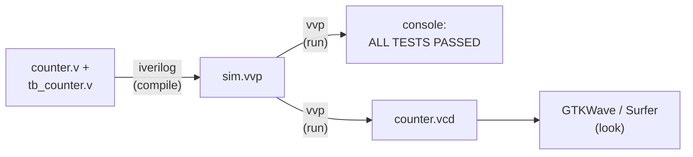

# 02 — The toolbox: your Mac as an EDA workstation

> Two Homebrew commands, one compile, one waveform — by the end of this
> chapter your laptop is a working (and entirely free) hardware lab.

[Chapter 01](01-what-is-an-fpga.md) made the argument that simulation-first
is how professionals work anyway. This chapter cashes that argument in.
You'll install a Verilog simulator and a waveform viewer, run the guide's
first real design — the counter from [`src/01-counter/`](../src/01-counter/counter.v) —
watch it print `ALL TESTS PASSED`, and then open its waveform and see the
thing *run*, cycle by cycle. That last part is the hello-world moment of
this whole guide.

Everything here is free and open source. Nothing needs a license server,
an account (with one browser-based exception, clearly marked), or more
than a few hundred megabytes of disk. If you have ever set up a C or
Python toolchain, this is easier.

## How the pieces fit

The whole workflow is a three-stage pipeline, and it never gets more
complicated than this:



`iverilog` compiles your Verilog into an intermediate file; `vvp` executes
it; the testbench prints its verdict and dumps every signal transition
into a `.vcd` file; the waveform viewer turns that file into a picture.
Compile, run, look. You will do this loop a thousand times, which is why
the guide wraps it in a Makefile — but you should do it by hand at least
once, below, so the Makefile never feels like magic.

## The minimum kit (macOS)

Two installs get you through chapters 03–10 — the crash course, the
testbench chapter, the FSMs, the memories, and all three of the big
builds (CPU, GPU, TPU):

```console
$ brew install icarus-verilog
$ brew install gtkwave
```

**Icarus Verilog** is the simulator. The package is called
`icarus-verilog`; the commands it installs are `iverilog` (the compiler)
and `vvp` (the runtime). It's been the standard open-source Verilog
simulator for over two decades: not the fastest (that's Verilator's job,
[chapter 04](04-simulation-and-testbenches.md)), but wonderfully
straightforward — no build step beyond the compile, good error messages,
excellent standards coverage for the plain-Verilog style this guide uses.

**GTKWave** is the classic waveform viewer, and the one you'll see in
every tutorial and forum post ever written. One honest caveat: its macOS
packaging has been rocky over the years — the Homebrew recipe has
flip-flopped between formula and cask, and Mac builds have sometimes
lagged far behind (as of 2025 things are in reasonable shape, but your
mileage may vary). If `brew install gtkwave` fails, or the app launches
and then misbehaves, don't burn an evening fighting it. Use
**[Surfer](https://surfer-project.org/)** instead: a modern, fast,
natively cross-platform waveform viewer that opens the same `.vcd` files,
and even has a web version (linked from its homepage) if you'd rather not
install anything. Surfer is a first-class citizen in this guide — every
"open the waveform" instruction works identically in either tool.

**Python 3** is the only other requirement, and you almost certainly have
it: it ships with the Xcode Command Line Tools (which Homebrew installs
anyway). The guide uses it once, for the ~200-line mini-assembler in
[`src/05-cpu-rv32i/`](../src/05-cpu-rv32i/) that turns RISC-V assembly
into machine code for [chapter 08](08-build-a-cpu.md)'s CPU. Check with
`python3 --version`; anything remotely modern is fine.

That's the whole minimum kit. Two brew packages and an interpreter you
already had.

## The fuller kit, when the chapters ask for it

Three more tools appear later in the guide. There is no need to install
them now — each chapter tells you when — but here they are so you know
what's coming:

| Tool | Install | Needed from | What it does |
| --- | --- | --- | --- |
| [Verilator](https://www.veripool.org/verilator/) | `brew install verilator` | [chapter 04](04-simulation-and-testbenches.md) (optional) | Compiles Verilog to C++ for simulations 10–100× faster than iverilog; the industry's open-source workhorse. Chapter 04 explains when it's worth the extra ceremony. |
| [GHDL](https://ghdl.github.io/ghdl/) | `brew install ghdl` | [chapter 12](12-the-vhdl-track.md) | Simulates VHDL, the other hardware description language. Runs the guide's one VHDL step, [`src/08-vhdl-counter/`](../src/08-vhdl-counter/). |
| [Yosys](https://yosyshq.net/yosys/) | `brew install yosys` | [chapter 11](11-synthesis-without-hardware.md) | Synthesis: turns your RTL into actual LUTs and flip-flops, so you get real area numbers without owning a chip. |

There is also a fourth tool chapter 11 wants — **nextpnr**, the
place-and-route engine that gives you honest timing numbers for real FPGA
parts — and it is *not* in Homebrew. Which brings us to the one-download
alternative:

### The one-download alternative: OSS CAD Suite

YosysHQ publishes the
[OSS CAD Suite](https://github.com/YosysHQ/oss-cad-suite-build): nightly
tarballs for macOS (Intel and Apple Silicon), Linux, and Windows that
bundle essentially the entire open-source EDA world in one directory —
iverilog, Verilator, GHDL, Yosys, nextpnr, the SymbiYosys formal
verification front-end, GTKWave, and more. Download the tarball for your
platform from the releases page, untar it somewhere sensible, and add it
to your PATH for the current shell:

```console
$ source oss-cad-suite/environment
```

(or add its `bin/` to your PATH permanently). No compilation, no
dependency chasing, uninstall by deleting the directory.

You can happily run this whole guide on the suite alone instead of the
Homebrew packages. The pragmatic recommendation: start with Homebrew —
it's two commands and updates itself — and grab the suite when you reach
[chapter 11](11-synthesis-without-hardware.md) and need nextpnr. Just
avoid mixing halves of the two installs in one shell; pick one PATH and
stick to it per terminal session.

## Linux, and Windows via WSL2

On Debian or Ubuntu, the whole toolbox is in the standard repositories:

```console
$ sudo apt install iverilog gtkwave
$ sudo apt install verilator ghdl yosys   # later chapters, as above
```

Fedora (`dnf`) and Arch (`pacman`) carry the same tools under the same
names or close to them. One caution: distribution packages can lag years
behind upstream, and an ancient Yosys or Verilator will occasionally
gripe at constructs a current release handles fine. Everything in this
guide's `src/` is deliberately conservative Verilog and passes on stock
Ubuntu packages — but if a later chapter's tool acts up, the OSS CAD
Suite's nightly Linux tarball is the fix, exactly as on macOS.

On Windows: use WSL2, install Ubuntu from the Microsoft Store, and follow
the Linux instructions inside it verbatim. GTKWave and Surfer both work
under WSL2's GUI support (WSLg), or use Surfer's web version and never
think about it again.

## Smoke test: run step 01 for real

Time to prove the kit works — on the guide's actual code, not a toy.
Clone the repo if you haven't, then:

```console
$ cd guides/fpga-without-the-fpga/src/01-counter
$ iverilog -g2012 -o sim.vvp tb_counter.v counter.v
$ vvp sim.vvp
VCD info: dumpfile counter.vcd opened for output.
ALL TESTS PASSED
tb_counter.v:79: $finish called at 2676000 (1ps)
```

That output is the real thing, verbatim. Three lines worth decoding:

- **`iverilog -g2012 -o sim.vvp tb_counter.v counter.v`** — compile both
  files (the testbench *and* the design; the simulator needs the whole
  circuit plus the code that pokes it) into `sim.vvp`. The `-g2012` flag
  selects the language standard — the 2012 edition, i.e. SystemVerilog
  2012. The guide's code is conservative enough not to need it, but the
  flag costs nothing, the guide's Makefile uses it everywhere, and it
  means any modern construct you experiment with later will just work.
- **`vvp sim.vvp`** — run it. `vvp` is Icarus's runtime: `iverilog`
  compiles to a kind of bytecode, `vvp` is the virtual machine that
  executes it. (Compile once, run many times — handy when you're
  re-running the same simulation while staring at waveforms.)
- **`ALL TESTS PASSED`** — printed by the testbench itself, not the
  tools. [`tb_counter.v`](../src/01-counter/tb_counter.v) counts every
  mismatch between the counter's output and the expected value, and only
  prints this line if there were zero. Self-checking testbenches are the
  spine of this guide; [chapter 04](04-simulation-and-testbenches.md)
  dissects this one line by line.

The odd-looking `$finish called at 2676000 (1ps)` is just the end time in
the simulation's precision units: 2,676,000 picoseconds = 2676 ns ≈ 268
ticks of the testbench's 100 MHz clock. Simulated time, not wall-clock —
the whole run took your machine a few milliseconds.

You should also see a new file, `counter.vcd` — hold that thought for one
section.

The repo wraps this dance in a Makefile, so from [`src/`](../src/) you
can run *every* step's tests with one command:

```console
$ cd guides/fpga-without-the-fpga/src
$ make
```

Each step compiles, runs, and greps its own log for the magic words; the
run ends with `==== every step passed ====`. If that works, your
environment is fully validated through chapter 10. (`make 01-counter`
runs a single step; `make clean` sweeps up the build products.)

## Your first waveform

The console told you the counter works. The waveform shows you *how* —
and this is the moment hardware design stops being an abstract idea.
Still in `src/01-counter/`:

```console
$ gtkwave counter.vcd
```

— or, if you're on team Surfer, launch Surfer and open `counter.vcd`
(dragging the file onto the window works too, as does the web version).

A `.vcd` (Value Change Dump) file records every transition of every
signal the testbench asked for — the `$dumpvars` line in
[`tb_counter.v`](../src/01-counter/tb_counter.v) requested all of them.
The viewer opens showing an empty wave pane; you choose what to look at:

1. **Add the signals.** In the tree/scope panel, select the `tb_counter`
   scope, then add `clk`, `rst`, `en`, and `count` to the wave pane
   (double-click or drag, in either tool).
2. **Make `count` readable.** By default it displays in hex or binary.
   Switch its radix to unsigned decimal (GTKWave: right-click the signal
   → Data Format → Decimal; Surfer has the same option on the signal's
   context menu).
3. **Zoom to fit** so the whole 2676 ns run is on screen (GTKWave: the
   zoom-fit toolbar button or Time → Zoom → Zoom Best Fit).

Now read the story, left to right — it's exactly the script the testbench
follows:

- `clk` is a relentless square wave, one rising edge every 10 ns. Nothing
  in the design happens *except* at those edges — watch `count` and
  you'll see every change lines up with one.
- For the first two cycles `rst` is high and `count` sits at 0. Reset
  drops, but `en` is still low — and `count` *stays* at 0. Enables gate
  change; this is your first proof.
- `en` rises, and `count` becomes a staircase: 1, 2, 3 … one step per
  clock edge, up to 10, where `en` drops for three cycles and the
  staircase goes flat. State holds unless told otherwise.
- Then the long climb. Zoom into the region around 2600 ns and find the
  cliff: `count` reaches 255 and on the next edge falls to 0. That's the
  8-bit wrap — 255 is `11111111`, add one, the carry falls off the top.
  Nobody wrote "wrap around" in [`counter.v`](../src/01-counter/counter.v);
  it's what `count + 1'b1` *is* in 8 bits of hardware.
- Finally, with the counter at 5, `rst` pulses high and `count` snaps to
  0 on the next rising edge — not instantly. That one-edge delay is what
  *synchronous* reset means, and you can see it.

That's the hello-world moment: you didn't print a value, you watched
state evolve on a clock. Every debugging session for the rest of this
guide — the CPU's program counter jumping on a branch, the GPU's four
lanes marching in lockstep, the systolic array's diagonal wavefront — is
this same activity with more signals. [Chapter 04](04-simulation-and-testbenches.md)
builds the full skill.

## Editor setup (five minutes, not fifty)

Any editor works; Verilog is just text. If you use VS Code, two
extensions are worth knowing:

- **Verilog-HDL/SystemVerilog** (by mshr-h) — syntax highlighting plus
  on-save linting that can use the iverilog you just installed. Light
  and unfussy; a fine default.
- **TerosHDL** — a heavier, IDE-like experience: project view, schematic
  viewer, documentation generation. Worth a look once you're deep in the
  build chapters; overkill for chapter 03.

Independent of any editor, remember that the compiler itself is a fast
syntax checker:

```console
$ iverilog -g2012 -t null counter.v
```

`-t null` selects the "null" output target — compile, report errors,
generate nothing, run nothing. It's the quickest possible "did I close
that `begin`?" check and it needs no configuration at all.

## No install at all: the browser fallbacks

Three tools deserve a bookmark even though this guide doesn't depend on
them:

- **[EDA Playground](https://www.edaplayground.com/)** — write HDL and a
  testbench in the browser and run them on a menu of simulators,
  including several commercial ones you'll never install locally. Needs a
  free account to run code. Perfect for sharing a 20-line repro when
  asking for help online, or for a locked-down work laptop.
- **[HDLBits](https://hdlbits.01xz.net/)** — a graded gauntlet of small
  Verilog exercises, auto-checked in the browser. This is the exercise
  gym the guide leans on alongside chapters
  [03](03-verilog-crash-course.md)–[05](05-sequential-logic-and-fsms.md):
  the chapters teach the concept, HDLBits makes your fingers learn it.
- **[Digital](https://github.com/hneemann/Digital)** (hneemann/Digital) —
  not a browser tool but a one-file Java app: a visual logic simulator
  where you wire up gates and flip-flops on a canvas and watch signals
  propagate as glowing wires. Zero relevance to your Verilog workflow,
  enormous relevance to your intuition — ten minutes wiring a counter out
  of flip-flops in Digital is the best possible companion to
  [chapter 05](05-sequential-logic-and-fsms.md).

## What's deliberately not on the list

No Vivado, no Quartus. The vendor suites are multi-gigabyte downloads
(tens of gigabytes, in Vivado's case) whose real job is generating
bitstreams for the vendor's own chips — which you don't own, which is the
premise of the guide. Everything they'd teach you about design and
verification, the tools above teach with less friction; the honest
synthesis and timing feedback they'd give you, [chapter
11](11-synthesis-without-hardware.md) gets from Yosys and nextpnr. If you
eventually buy a board, [chapter 13](13-hardware-and-beyond.md) covers
what to install then — and if you choose your board well, the answer can
remain "nothing new".

Also absent: anything costing money. No paid simulators, no license
files, no "free trial". If you find yourself on a pricing page while
following this guide, you've taken a wrong turn.

## Further reading

- [Icarus Verilog documentation](https://steveicarus.github.io/iverilog/) —
  the official user guide, including the full `iverilog`/`vvp` flag
  reference.
- [GTKWave homepage](https://gtkwave.sourceforge.net/) — includes the
  (large) user manual; the first two chapters cover everything this guide
  needs.
- [Surfer](https://surfer-project.org/) — homepage with downloads, the
  web version, and a short tour.
- [OSS CAD Suite](https://github.com/YosysHQ/oss-cad-suite-build) —
  nightly all-in-one builds; the README covers PATH setup per platform.
- [Verilator](https://www.veripool.org/verilator/) and
  [GHDL](https://ghdl.github.io/ghdl/) — for when chapters
  [04](04-simulation-and-testbenches.md) and [12](12-the-vhdl-track.md)
  send you here.
- [EDA Playground](https://www.edaplayground.com/) and
  [HDLBits](https://hdlbits.01xz.net/) — the browser-based practice pair.

---

*Next: [Chapter 03 — A Verilog crash course](03-verilog-crash-course.md)*
