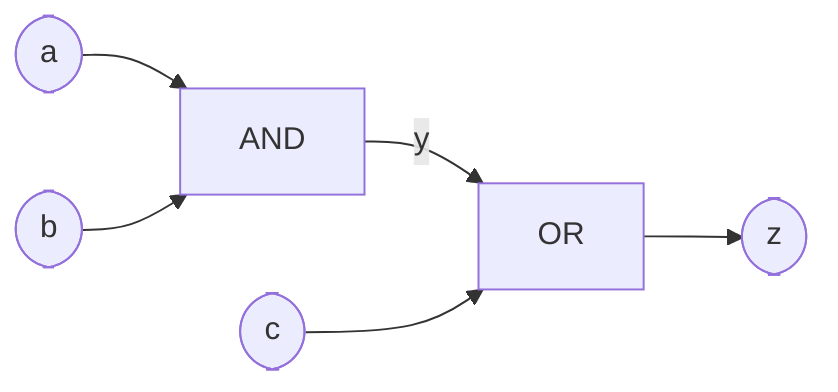
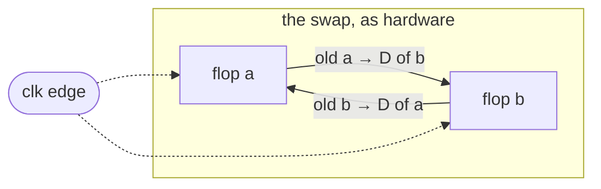

# 03 — A Verilog crash course

> Verilog looks like C. That resemblance is the single biggest obstacle to
> learning it — you are not writing instructions, you are describing a
> machine in which everything happens at once.

You have the tools from [chapter 02](02-the-toolbox.md). Before the
testbenches of [chapter 04](04-simulation-and-testbenches.md) and the state
machines of [chapter 05](05-sequential-logic-and-fsms.md), you need the
language — and, more importantly, the mental model behind it. This chapter
is the working subset of Verilog the entire guide is written in: a small
language, once you stop reading it as software.

## The mindset shift: you are describing a circuit

A C program is a *sequence*: the CPU executes line 1, then line 2. A
Verilog module is a *parts list with wiring instructions*: every `assign`
statement and every `always` block describes a physical chunk of hardware
that exists simultaneously and forever, all running in parallel. There is
no program counter walking through your source file.

Concretely — these two files describe **exactly the same circuit**:

```verilog
// version A
assign y = a & b;
assign z = y | c;
```

```verilog
// version B — statements reversed
assign z = y | c;
assign y = a & b;
```

In C, version B would read an uninitialized `y`. In Verilog both versions
elaborate to the same two gates, permanently wired together:



The AND gate doesn't run "before" the OR gate. Both exist, both are always
computing; when `a` wiggles, the change ripples through the wires. Code
order is documentation order, nothing more. Hold on to this: **whenever
Verilog confuses you, ask "what hardware does this describe?"** — the
answer resolves almost every mystery in this chapter.

## Anatomy of a module

The unit of hardware in Verilog is the **module**: a named box with ports.
Here is the guide's first real design, the counter from
[`src/01-counter/counter.v`](../src/01-counter/counter.v), in full:

```verilog
module counter #(
    parameter WIDTH = 8
) (
    input  wire             clk,
    input  wire             rst,   // synchronous, active-high
    input  wire             en,
    output reg [WIDTH-1:0]  count
);

    always @(posedge clk) begin
        if (rst)
            count <= {WIDTH{1'b0}};
        else if (en)
            count <= count + 1'b1;
    end

endmodule
```

Piece by piece:

- **`module counter ... endmodule`** — the box. One module per file, file
  named after the module; that's the convention everywhere in this repo.
- **`#(parameter WIDTH = 8)`** — a compile-time knob, resolved before any
  simulation happens; think "C++ template argument", not "variable".
  Instantiate with `counter #(.WIDTH(16)) ...` and you get a genuinely
  different, wider circuit.
- **Ports** — the pins. `input wire clk` is a wire coming in;
  `output reg [WIDTH-1:0] count` is a `WIDTH`-bit bus going out. Why is
  one output `reg` and the inputs `wire`? Patience — next section.
- **The `always` block** — the actual hardware, here a bank of flip-flops;
  previewed below, dissected in [chapter 05](05-sequential-logic-and-fsms.md).

Modules become useful when you **instantiate** them inside other modules —
that's how hierarchy works, counter to CPU. Here is the real instantiation
from the counter's testbench,
[`src/01-counter/tb_counter.v`](../src/01-counter/tb_counter.v):

```verilog
    // device under test
    counter dut (
        .clk  (clk),
        .rst  (rst),
        .en   (en),
        .count(count)
    );
```

The `.port(signal)` syntax is a **named port connection**: `.clk(clk)`
means "wire my local signal `clk` to the instance's `clk` port". Verilog
also allows positional connections — `counter dut (clk, rst, en, count);`
— and you should never use them: one reordered port declaration and every
connection silently shifts by one. Named connections turn that bug into a
compile error. This guide uses them always.

## The type system that isn't: `wire` vs `reg`

The most mis-taught fact in Verilog: **`reg` does not mean "register".**
It is a naming accident that has confused every beginner since 1984. The
actual rule is purely grammatical:

| Declared as | Can be assigned by | Describes |
| --- | --- | --- |
| `wire` | `assign` statements, outputs of instantiated modules | a physical wire — always driven, holds nothing |
| `reg`  | statements inside `always` (or `initial`) blocks | *whatever the always block describes* — maybe a flip-flop, maybe pure gates |

That's it. `reg` means "this signal is assigned inside an `always` block".
The ALU below declares its output `y` as `reg`, yet contains **zero
storage** — pure combinational logic. Conversely, nothing about the word
`reg` created the counter's flip-flops. **What actually makes a flip-flop
is `always @(posedge clk)`** — sensitivity to a clock edge is the storage.
Burn that in and half the language stops being mysterious. (SystemVerilog
fixed the naming with `logic`; see the note near the end.)

### Vectors, literals, and bit surgery

Signals are single bits unless you give them a range: `[31:0]` declares 32
bits, bit 31 the MSB — the near-universal convention, and this repo's.

Literals carry an explicit width and base, because in hardware "how many
bits" is never an afterthought:

| Literal | Meaning |
| --- | --- |
| `8'd10` | 8-bit decimal 10 |
| `32'hDEAD_BEEF` | 32-bit hex; underscores are ignored, use them freely |
| `4'b1010` | 4-bit binary |
| `1'b1` | a single 1 bit |
| `42` | unsized — defaults to at least 32 bits; fine for parameters, sloppy in expressions |

And the bit-surgery operators you'll use constantly:

| Syntax | Name | Example |
| --- | --- | --- |
| `{a, b}` | concatenation | `{4'hA, 4'h5}` is `8'hA5` |
| `{4{x}}` | replication | `{WIDTH{1'b0}}` — a bus of zeros of any width (the counter's reset value) |
| `a[7:0]` | part-select | low byte of `a` |
| `a[i]` | bit-select | one bit, index can be a signal |

Replication plus concatenation gives you sign extension in one line —
`{{16{x[15]}}, x}` widens a 16-bit value to 32 by repeating its top bit.
You'll meet that exact idiom in the CPU's immediate decoder in
[chapter 08](08-build-a-cpu.md).

## Combinational logic: `assign`, `always @*`, and the completeness rule

For simple wiring and small expressions, use `assign` on a `wire`:

```verilog
assign zero = (y == 32'd0);
```

For anything with real decision structure — muxes, decoders, ALUs — an
`always @*` block with `case` or `if` reads far better. The `@*` means
"recompute whenever any input changes", which is exactly what combinational
logic does. (Old code spells out sensitivity lists by hand —
`always @(a or b or op)` — and forgetting one signal there makes simulation
disagree with synthesis. `@*` made that bug class obsolete; never write a
manual list for combinational logic.)

Here is the guide's canonical example, the operation mux from
[`src/02-alu/alu.v`](../src/02-alu/alu.v):

```verilog
    always @* begin
        case (op)
            ALU_ADD:  y = a + b;
            ALU_SUB:  y = a - b;
            ALU_AND:  y = a & b;
            ALU_OR:   y = a | b;
            ALU_XOR:  y = a ^ b;
            ALU_SLL:  y = a << shamt;
            ALU_SRL:  y = a >> shamt;
            ALU_SRA:  y = $signed(a) >>> shamt;
            ALU_SLT:  y = ($signed(a) < $signed(b)) ? 32'd1 : 32'd0;
            ALU_SLTU: y = (a < b) ? 32'd1 : 32'd0;
            default:  y = 32'd0;
        endcase
    end
```

Read it as hardware: a 32-bit-wide multiplexer selecting among ten
always-running arithmetic units. All ten computations happen *every
moment* — the `case` doesn't skip the subtractor when `op` is `ALU_ADD`;
it merely selects which result reaches `y`.

Now the rule that matters — the **completeness rule**:

> In a combinational `always` block, every output must be assigned on
> **every possible path** through the block.

Note the `default:` arm above. `op` is 4 bits — 16 possible values, only
ten named. Without the default, values 10–15 hit no assignment, and here
is the crucial *why*: an unassigned path means "under that condition, `y`
keeps its old value". Keeping an old value requires **storage**. The tools
obediently build that storage — a level-sensitive latch — which is almost
never what you wanted, is glitch-prone, and wrecks timing analysis. The
simulator won't complain; synthesis buries a warning in a thousand lines
of log. Cover every branch, every time.

## Sequential logic, previewed

The counter's `always` block is the other half of the language:

```verilog
    always @(posedge clk) begin
        if (rst)
            count <= {WIDTH{1'b0}};
        else if (en)
            count <= count + 1'b1;
    end
```

`always @(posedge clk)` means: this hardware is a row of flip-flops that
capture a new value only at the rising edge of `clk` and hold it the rest
of the time. Between edges, the `count + 1'b1` adder is combinationally
computing the *next* value; the edge is when it gets latched in. Notice
that the incompleteness that was fatal above is fine here — when neither
`rst` nor `en` is true, `count` holds, and holding is precisely what a
flip-flop is *for*. Clocks, resets, and state machines get the full
treatment in [chapter 05](05-sequential-logic-and-fsms.md); for now,
recognize the shape.

## The two golden rules

Tattoo these somewhere convenient; they prevent most beginner Verilog bugs:

| Kind of logic | Block header | Assignment operator | What you get |
| --- | --- | --- | --- |
| Combinational | `always @*` | `=` (blocking) | gates and muxes |
| Sequential | `always @(posedge clk)` | `<=` (non-blocking) | flip-flops |

1. **Never mix `=` and `<=` in one block.** A block is either
   combinational or sequential; pick the pattern and use it whole.
2. **Every signal is assigned from exactly one place** — one `always`
   block *or* one `assign`, never two.

Why the operator distinction matters is best shown by the classic swap.
Two registers exchange values every cycle:

```verilog
always @(posedge clk) begin
    a <= b;
    b <= a;    // with <= this WORKS: a genuine swap
end
```

Flip the operators to blocking and it silently breaks:

```verilog
// BROKEN — invented example, do not ship
always @(posedge clk) begin
    a = b;     // a becomes b's value immediately...
    b = a;     // ...so this copies the NEW a — i.e. b into b. No swap.
end
```

Cycle by cycle, starting from `a = 1`, `b = 2`:

| Moment | `a` | `b` |
| --- | --- | --- |
| before the clock edge | 1 | 2 |
| after the edge, `<=` version | **2** | **1** |
| after the edge, `=` version | **2** | **2** — the old `a` is lost |

With `<=`, both right-hand sides are sampled *before* anything updates, so
each register captures the other's old value. With `=`, the statements
execute in sequence like software, and the second one reads a value that
has already changed. Worse: put the two blocking assignments in *separate*
`always` blocks and the result depends on which block the simulator runs
first — a race that can flip between simulators, between runs, and between
simulation and synthesis.

## What `<=` actually does — and why real flip-flops work the same way

The non-blocking assignment has a precise two-phase semantics. At the
clock edge:

1. **Sample phase** — every `<=` right-hand side in the entire design is
   evaluated using the *old* (pre-edge) values of everything.
2. **Update phase** — all left-hand sides take their new values together.

No update is visible to any sample. That is not a simulator quirk to
memorize — it is exactly what physical flip-flops do. At the clock edge,
every flop captures whatever was on its D input just before the edge; its
Q output changes only *after*. So a flop fed by another flop's output
always captures its neighbor's *old* value:



Cross-wire two flops and you get a swap; chain them, a shift register.
`<=` is Verilog telling the simulator to behave like the silicon. `=` in
a clocked block is Verilog letting you accidentally describe something
the silicon can't do.

## Classic traps

Each of these has claimed hours from every hardware engineer alive. All
snippets here are **invented bad examples** — nothing like them ships in `src/`.

### 1. The inferred latch

```verilog
always @* begin
    if (sel)
        y = a;        // ...and when sel is 0? y "remembers" → latch.
end
```

Incomplete `if` in a combinational block. Fix: add the `else`, or assign a
safe default at the top of the block before any branching.

### 2. The missing `default`

Same disease, `case` variant — and it bites even when you *think* you
covered everything, because a 4-bit selector has 16 values no matter how
many you named. The ALU's `default: y = 32'd0;` is latch repellent, not
decoration.

### 3. Width mismatch, silently

```verilog
wire [3:0] a, b;
wire [3:0] sum = a + b;    // the carry-out silently falls off the end
wire [7:0] x   = 8'd300;   // 300 needs 9 bits; x is quietly 44
```

Verilog truncates or zero-extends without a peep to make widths match.
Icarus mostly stays quiet; `verilator --lint-only` flags these loudly and
is worth running on everything — [chapter 04](04-simulation-and-testbenches.md)
makes it part of the flow.

### 4. Signedness: unsigned until proven otherwise

Every net and literal is **unsigned by default**. `$signed()` casts, and
the ALU uses it for its arithmetic shift and signed compare (`ALU_SRA`,
`ALU_SLT` above). The trap is the mixing rule: **if any operand in an
expression is unsigned, the entire expression is evaluated as unsigned.**

```verilog
wire signed [7:0] s = -8'sd1;   // bit pattern 8'hFF
wire        [7:0] u =  8'd1;
// (s < u) is evaluated UNSIGNED: 255 < 1 → FALSE. Surprise.
```

One unsigned literal or signal poisons the whole comparison. This exact
trap bit this guide's CPU during development — a signed branch comparison
that quietly went unsigned; war story and fix in [chapter 08](08-build-a-cpu.md).

### 5. `=` in a clocked block

The swap example showed the mechanism. The nasty part: small designs often
*appear* to work with `=` in clocked blocks — until you split a block in
two, or a different simulator picks a different event order. Use `<=` in
every `always @(posedge clk)`, no exceptions.

### 6. Multiple drivers

```verilog
always @(posedge clk) y <= a;
always @(posedge clk) y <= b;   // who wins? nobody. don't do this.
```

Two `always` blocks (or two `assign`s) driving one signal is two physical
outputs shorted together. Simulators resolve it arbitrarily or produce `x`;
synthesis errors out. One signal, one driver — golden rule 2.

## Verilog, SystemVerilog, and what this guide writes

Verilog froze as IEEE 1364-2005; its successor **SystemVerilog** (IEEE
1800) absorbed it and added, among much else: a `logic` type that replaces
the `wire`/`reg` confusion, `always_ff` and `always_comb` blocks that make
the tools *enforce* the two golden rules, packed structs, and interfaces.
Good stuff — and the concepts here transfer to it unchanged.

This guide deliberately writes **conservative Verilog-2005**: every tool
in [chapter 02](02-the-toolbox.md)'s free toolbox accepts it without
ceremony, keeping the focus on hardware rather than language features.
When you want the newer syntax, `iverilog -g2012` accepts a useful
SystemVerilog subset alongside plain Verilog, and Verilator speaks
SystemVerilog natively. (As for the *other* HDL — VHDL never had the
`wire`/`reg` problem, at the price of considerably more typing.
[Chapter 12](12-the-vhdl-track.md) is the taste test.)

## House style

Conventions used by every design in [`src/`](../src/):

| Convention | Example |
| --- | --- |
| One module per file, file named after it | `counter.v` contains `counter` |
| Testbenches prefixed `tb_` | `tb_counter.v` |
| Reset is synchronous, active-high, named `rst` | `if (rst) count <= ...` inside the clocked block |
| Signals lowercase `snake_case`; parameters/localparams UPPERCASE | `count`, `WIDTH`, `ALU_ADD` |
| Named port connections, always | `.clk(clk)` |
| Every `case` in combinational logic has a `default` | see the ALU |
| Comments explain **intent**, not syntax | "synchronous, active-high", not "if rst then..." |

None of these are laws of physics — async resets are common in ASIC work,
for one — but consistency is what lets you read a 250-line CPU without
re-deriving the author's habits per line.

## Further reading

- [HDLBits](https://hdlbits.01xz.net/) — the practice gym. Small
  in-browser Verilog exercises with instant feedback; the "Verilog
  Language" and "Circuits" tracks alongside chapters 03–05 teach your
  fingers what this chapter told your brain.
- Harris & Harris, *Digital Design and Computer Architecture* (RISC-V
  edition) — chapter 4 is the best print treatment of HDL-as-hardware,
  and the whole book shadows this guide through chapter 08.
- Clifford Cummings' conference papers on
  [sunburst-design.com](http://www.sunburst-design.com/papers/) —
  especially the classic on non-blocking assignments ("Coding Styles That
  Kill"). Written for professionals, readable after this chapter.
- The [Icarus Verilog documentation](https://steveicarus.github.io/iverilog/)
  — for what the simulator actually supports, including the `-g` language
  generation flags.

---

*Next: [Chapter 04 — Simulation & testbenches](04-simulation-and-testbenches.md)*
