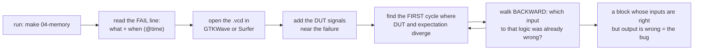

# 04 — Simulation & testbenches: your real superpower

> In hardware, the design is the easy half. The testbench is the engineering.

Here is a number that surprises every software person who wanders into chip design: on a typical ASIC
project, the people *verifying* the design are at least as numerous as the people writing it — industry
surveys (the long-running Wilson Research / Siemens functional-verification studies) have reported that
split for years, with verification eating more than half the schedule. That ratio isn't bureaucracy; it's
physics. You cannot patch silicon on Tuesday. A bug that ships in software is a hotfix; a bug that ships in
a mask set is a multi-million-dollar respin. So the industry's center of gravity sits exactly where you're
sitting right now — in a simulator.

This guide takes the same stance in miniature. Every design under [`src/`](../src/) ships with a testbench
that decides, by itself, whether the design works. **A design without a self-checking test is a rumor.**
You may believe your counter counts; until something mechanically checks all 256 values including the wrap,
you have a vibe, not a fact.

And simulation hands you a superpower no lab bench ever will: **every signal, every cycle, replayable.** On
a real board you get the pins you remembered to route to a header, sampled by a logic analyzer you probably
don't own. In simulation you get the design's entire internal state, saved to a file you can scrub through
like video. Debugging hardware in a simulator is the closest thing engineering has to time travel. This
chapter teaches you to use it.

## Anatomy of a testbench

Open [`../src/01-counter/tb_counter.v`](../src/01-counter/tb_counter.v). It tests the eight-bit counter
from chapter [03](03-verilog-crash-course.md), and it contains — in 80 lines — every structural element
you'll reuse for the rest of the guide, up to and including the CPU. Walk it top to bottom. First, the
header and the harness:

```verilog
`timescale 1ns/1ps

module tb_counter;

    reg        clk = 1'b0;
    reg        rst = 1'b1;
    reg        en  = 1'b0;
    wire [7:0] count;

    // device under test
    counter dut (
        .clk  (clk),
        .rst  (rst),
        .en   (en),
        .count(count)
    );

    // 100 MHz clock: 10 ns period
    always #5 clk = ~clk;
```

Four things to notice:

- **`` `timescale 1ns/1ps ``** sets the units: `#5` means "wait 5 ns". Testbenches get to use delays
  because testbenches are not hardware — they're simulation-only programs that happen to be in Verilog.
- **The testbench module has no ports.** Nothing connects to it from outside; it *is* the outside. DUT
  inputs are `reg` (the testbench assigns them), outputs are `wire` (the DUT drives them).
- **The DUT is instantiated by name** (`.clk(clk)` and friends) — the same syntax that composes modules
  into a CPU in chapter [08](08-build-a-cpu.md). A testbench is a module whose only submodule is on trial.
- **`always #5 clk = ~clk;`** is the entire clock generator: toggle every 5 ns, forever. In simulation the
  frequency is pure convention, but a round period keeps timestamps readable.

Next, the checking machinery:

```verilog
    integer errors = 0;

    task check(input [7:0] expected);
        begin
            if (count !== expected) begin
                $display("FAIL @%0t: count = %0d, expected %0d",
                         $time, count, expected);
                errors = errors + 1;
            end
        end
    endtask
```

An error *counter*, not an error *flag* — the test keeps going after a failure and reports the total, which
matters when one root cause produces twelve symptoms. Note the comparison is `!==` (case inequality), not
`!=`. Verilog signals have four states — `0`, `1`, `X` (unknown), `Z` (undriven) — and ordinary `!=`
returns X when either side contains X, which as an `if` condition counts as false, silently *passing* your
test. `!==` means "not bit-for-bit identical, X's included", so an uninitialized register fails loudly
instead of sneaking through. In testbenches, use `===`/`!==` always.

Then the test itself, inside `initial` — a block that runs once from time zero, top to bottom, like the
script it is:

```verilog
    initial begin
        // dump every signal for the waveform viewer (GTKWave / Surfer)
        $dumpfile("counter.vcd");
        $dumpvars(0, tb_counter);

        // two cycles of reset
        @(posedge clk); #1;
        @(posedge clk); #1;
        rst = 1'b0;

        // enable low: counter must hold at 0
        @(posedge clk); #1 check(8'd0);

        // count 10 ticks
        en = 1'b1;
        @(posedge clk); #1 check(8'd1);
        repeat (9) @(posedge clk);
        #1 check(8'd10);
```

`$dumpfile`/`$dumpvars` record every signal in the hierarchy under `tb_counter` (the `0` means "all levels
down") into a VCD file — the time-travel log; we'll come back to it. Then: hold reset through two edges,
release, start making claims. Enable low? Must read 0. Ten enabled edges? Must read 10. Further down, the
file checks the wrap at 256 and a synchronous reset mid-count — exactly the corners a human eyeballing
waveforms skips on a Friday. And the verdict:

```verilog
        if (errors == 0) $display("ALL TESTS PASSED");
        else             $display("TEST FAILED: %0d errors", errors);
        $finish;
    end
```

`$finish` matters — the clock generator runs forever, so without it the simulation never ends. And the
exact string `ALL TESTS PASSED` is a contract; more on that in a moment.

## The `#1` convention, and why it never races the clock

Every testbench in this repo follows one timing rule, stated in `tb_counter.v`'s header comment:

> drive inputs a little after the rising edge (`#1`),
> check outputs a little after the following rising edge.

```text
          edge A                          edge B
            |                               |
  clk   ____/‾‾‾‾‾‾‾‾\_____________________/‾‾‾‾‾‾‾‾\______
            |   |                           |   |
            |   +-- t = A+1ns: DRIVE        |   +-- t = B+1ns: CHECK
            |       edge A already sampled  |       edge B's results are final
            |       the OLD inputs; new     |       and stable — you read exactly
            |       values aim at edge B    |       what edge-A stimulus produced
```

Why not drive and check *at* the edge? Because then you'd be gambling on event ordering: does the flip-flop
see the old input value or the new one when both change "at the same time"? Simulators have well-defined
rules for this (that's what non-blocking assignment is about — chapter [03](03-verilog-crash-course.md)),
but a testbench that leans on those rules is fragile and miserable to read. The `#1` sidesteps the whole
question: inputs change unambiguously *after* the flops sampled and unambiguously *before* the next edge
9 ns later; checks land after everything downstream has settled.

This mirrors how real flip-flops behave. Physical flops demand that data be stable for a small window
*before* the clock edge (setup time) and *after* it (hold time); violate the window and the flop can go
metastable — genuinely undecided — for a while. The `#1` convention is the simulation cartoon of respecting
setup and hold: change inputs far from any edge, never ask a question mid-transition. (Real setup/hold
numbers are chapter [11](11-synthesis-without-hardware.md)'s territory.) You'll see the idiom
`@(posedge clk); #1 check(...)` hundreds of times across `src/`. It's the heartbeat of the whole guide.

## Self-checking or it didn't happen

The seductive beginner failure mode: run the simulation, open the waveform, squint, decide it "looks
right", move on. Don't. Waveform inspection is a *debugging* tool, not an *acceptance* tool. Eyes don't
scale (you will not visually verify 2000 random ALU operations), eyes don't regress (you will not re-squint
after every edit), and eyes are generous (they see what you expect to see). The acceptance criterion must
be encoded in the testbench, where it runs identically every time and cannot be charmed.

Two habits make self-checking work. First, **fail loudly and specifically**:

```verilog
$display("FAIL");                                    // useless
$display("FAIL: op=%0d a=%h b=%h -> y=%h, expected %h",
         top, ta, tb, y, exp);                       // tb_alu.v — a repro case
```

The second line, from [`tb_alu.v`](../src/02-alu/tb_alu.v), *is* a bug report: exact operation, exact
operands, observed and expected values. `tb_counter.v`'s version adds `@%0t` — the simulation time — which
tells you where to jump in the waveform.

Second, **make pass/fail machine-readable**. Every testbench prints the exact string `ALL TESTS PASSED` on
success, and the top-level [`Makefile`](../src/Makefile) turns that into an exit code:

```make
define run_step
	@echo ""
	@echo "==== $(1) ===="
	cd $(1) && $(IVERILOG) -o sim.vvp $(2) && $(VVP) sim.vvp | tee sim.log \
		&& grep -q "ALL TESTS PASSED" sim.log
endef
```

The `grep -q` does real work: `vvp` exits 0 even when your testbench printed twelve FAIL lines — as far as
the simulator is concerned, the simulation *ran fine*. Grepping the log converts "the test passed" into a
shell truth-value, so `make` stops at the first broken step, so this Makefile works unmodified in GitHub
Actions or any other CI. One string convention plus one `grep`: a poor man's CI, and an entirely
respectable one.

## Golden models: the most important idea in this chapter

A testbench that hardcodes expected values (`check(8'd10)`) works for a counter, where the interesting
cases are enumerable by hand. It stops working the moment the output space gets big. What's the expected
result of `SRA 32'h8E37_C1A4 >> 19`? You could work it out on paper, once, for one vector. You cannot do it
for two thousand.

The fix is a **golden model** (or reference model): a second implementation of the same behavior, written
in the most simple, obvious, boring way possible — and then you check the clever implementation against the
boring one, automatically, on as many inputs as you have patience for. For a bug to slip through, both
implementations would have to share it; since they're written in completely different styles, they rarely
do.

### Directed + random: the ALU

[`tb_alu.v`](../src/02-alu/tb_alu.v) carries its golden model as a plain Verilog function — each operation
as one line of "obviously what the spec says":

```verilog
    // golden model: what the ALU *should* compute
    function [31:0] golden(input [3:0] fop, input [31:0] fa, fb);
        begin
            case (fop)
                ALU_ADD:  golden = fa + fb;
                ALU_SUB:  golden = fa - fb;
                ALU_AND:  golden = fa & fb;
                ALU_OR:   golden = fa | fb;
                ALU_XOR:  golden = fa ^ fb;
                ALU_SLL:  golden = fa << fb[4:0];
                ALU_SRL:  golden = fa >> fb[4:0];
                ALU_SRA:  golden = $signed(fa) >>> fb[4:0];
                ALU_SLT:  golden = ($signed(fa) < $signed(fb)) ? 1 : 0;
                ALU_SLTU: golden = (fa < fb) ? 1 : 0;
                default:  golden = 0;
            endcase
        end
    endfunction
```

(The ALU is pure combinational logic, so this testbench has no clock at all — it drives `op`/`a`/`b`, waits
`#1` for the logic to settle, and compares. Same convention, degenerate case.)

Then it attacks on two fronts. First, **directed tests** — corner cases a human can name in advance:

```verilog
        check(ALU_ADD,  32'hFFFF_FFFF, 32'd1);          // unsigned wrap
        check(ALU_ADD,  32'h7FFF_FFFF, 32'd1);          // signed overflow
        check(ALU_SLT,  32'h8000_0000, 32'd0);          // INT_MIN < 0 (signed)
        check(ALU_SLTU, 32'h8000_0000, 32'd0);          // but not unsigned
        check(ALU_SRA,  32'h8000_0000, 32'd31);         // all sign bits
        check(ALU_SLL,  32'hDEAD_BEEF, 32'd0);          // shift by zero
```

Second, **random tests** — two thousand draws for the cases nobody named:

```verilog
        for (i = 0; i < 2000; i = i + 1) begin
            ra = $random;
            rb = $random;
            check(i % 10, ra, rb);
        end
```

`$random` is Verilog's built-in 32-bit pseudo-random generator — deterministic per seed, so a failure today
reproduces identically tomorrow, which is exactly what you want from a regression.

You need both layers. Directed tests encode your *theory* of where bugs live — boundaries, sign flips, the
zero case — and hit those with certainty. Random tests are for bugs outside your theory: with 2⁶⁸ possible
`(op, a, b)` inputs, the failing region of a subtle signed-comparison bug may be somewhere you'd never
think to aim. Directed testing is a sniper; random testing is weather. Industry runs this combo at
monstrous scale as *constrained-random verification* — server farms rolling dice against golden models
around the clock.

### Checking against a simpler machine: the FIFO

The golden-model idea gets more interesting when the DUT has *state*.
[`tb_memory.v`](../src/04-memory/tb_memory.v) tests the FIFO from chapter [06](06-memory.md) — genuinely
tricky hardware, with wrapping pointers and full/empty flag logic that is a classic nest of off-by-one
bugs. The testbench's answer: keep its own FIFO in software, as a big array and two integers.

```verilog
    // golden model for the FIFO
    reg [7:0] model_q [0:1023];
    integer   model_head, model_tail;
```

No wrap-around cleverness, no flags — indices count up forever, occupancy is `model_tail - model_head`. It
is *obviously* correct in a way the hardware isn't, and that asymmetry is the whole point. Then, two
thousand cycles of coin-flip traffic, mirroring every accepted operation into the model:

```verilog
        for (i = 0; i < 2000; i = i + 1) begin
            // decide this cycle's actions
            f_wr    = $random;               // 50% push attempt
            f_rd    = $random;               // 50% pop attempt
            f_wdata = $random;

            // mirror into the golden model using the DUT's own full/empty
            #1;
            if (f_wr && !f_full) begin
                model_q[model_tail % 1024] = f_wdata;
                model_tail = model_tail + 1;
                pushes = pushes + 1;
            end
            if (f_rd && !f_empty) begin
                if (f_rdata !== model_q[model_head % 1024])
                    fail("fifo: data mismatch vs golden model");
                model_head = model_head + 1;
                pops = pops + 1;
            end
            @(posedge clk); #1;

            // occupancy implied by the model must match full/empty flags
            if ((model_tail - model_head == 0)  && !f_empty) fail("fifo: empty flag wrong");
            if ((model_tail - model_head == 16) && !f_full)  fail("fifo: full flag wrong");
        end
```

Read what's checked: every popped byte must match the model's head, *and* the DUT's full/empty flags must
agree with the model's occupancy, on every one of two thousand randomly-mixed cycles — simultaneous
push+pop, push-at-full, pop-at-empty, every interleaving the dice produce. Try writing that as directed
cases; you'd quit at thirty and miss the one sequence that matters. This pattern — *random stimulus, simple
stateful model, continuous comparison* — scales astonishingly far: chapter [10](10-build-a-tpu.md)'s
systolic array is verified the same way with a three-nested-loop matmul as the golden model, and real GPU
teams do the same thing with a C simulator standing in for the chip.

## Debugging is time travel

So a test fails: `FAIL @145000: count = 12, expected 10`. Now the VCD file earns its keep.



The discipline is in the loop. The cycle where the test *failed* is almost never the cycle where the design
went *wrong* — a corrupted FIFO pointer may not produce a visibly wrong byte until forty pops later. So
find the first divergence, then interrogate its causes: this output is wrong at cycle N, so which of its
inputs was wrong at N−1? Follow the wrongness upstream and backward in time until you reach a block whose
inputs are all correct but whose output isn't. That block is the bug — and unlike every heisenbug you've
chased in software, it will sit there, frozen at cycle N−17, for as long as you care to stare. Nothing
races, nothing times out, nothing changes between runs.

```console
$ cd src && make 04-memory        # produces 04-memory/memory.vcd
$ gtkwave 04-memory/memory.vcd    # or: surfer 04-memory/memory.vcd
```

In the viewer: pull in `clk`, the DUT's inputs and outputs, *and its internal registers* —
`$dumpvars(0, ...)` recorded everything. Set the radix to hex or decimal so you're not decoding binary by
hand, and hop between edges with edge-search instead of scrolling.

A note in defense of the unfashionable: **`$display` debugging is legitimate.** A well-placed
`$display("t=%0t head=%0d tail=%0d", $time, head, tail)` inside the DUT gives a searchable text trace of
exactly the state you care about, and for "when does this first go weird" questions, grep beats scrubbing.
Waveforms for breadth, `$display` for depth; professionals use both without embarrassment.

## The simulator landscape, honestly

Everything so far ran on Icarus Verilog, and at this guide's scale Icarus is genuinely the right tool, not
a compromise. But you should know the map:

| Simulator | How it runs your code | Testbench language | Speed | When you'd reach for it |
| --- | --- | --- | --- | --- |
| [Icarus Verilog](https://steveicarus.github.io/iverilog/) | interprets event-driven bytecode | Verilog | fine for 10³–10⁶ cycles | learning, small/medium designs — everything in this guide |
| [Verilator](https://www.veripool.org/verilator/) | **compiles** Verilog into C++ you link into a program | C++ (or Python via cocotb) | often 10–100× Icarus | long runs: booting Linux on a simulated RISC-V SoC is the canonical party trick |
| [GHDL](https://ghdl.github.io/ghdl/) | compiles/interprets VHDL | VHDL | comparable to Icarus | the VHDL track, chapter [12](12-the-vhdl-track.md) |
| Questa, VCS, Xcelium — the commercial "big three" | compiled, heavily optimized | SystemVerilog + UVM | fast | industry ASIC work; licenses cost more than your car |

The Verilator trade-offs deserve one honest paragraph, because "100× faster" always has a price. Verilator
is a *two-state* simulator: signals are 0 or 1, and the `X` values Icarus propagates — the ones our `!==`
checks are designed to catch — are largely replaced by defined values. Some bug classes (reading an
uninitialized register) are therefore easier to spot in Icarus. And historically Verilator didn't simulate
testbench-style timing (`#5`, procedural `@(posedge clk)`), so testbenches were C++ programs that toggle
the clock and call `eval()` themselves; recent versions have grown support for much of this, but the native
idiom remains "your testbench is a program that drives the model". Practical takeaway: develop and debug on
Icarus, reach for Verilator when runs are measured in minutes.

To taste the commercial tools without a license, [EDA Playground](https://www.edaplayground.com/) runs
several of them — plus Icarus and Verilator — in your browser for free, with waveforms. Good for trying
SystemVerilog features Icarus doesn't support; not a place to live.

## cocotb: testbenches in Python

There's a fourth option that changes the game for the later chapters: [cocotb](https://www.cocotb.org/), a
library that lets you write the *testbench* in Python while the *DUT* stays in Verilog (or VHDL), running
on a simulator you already have — Icarus, Verilator, GHDL and the commercial ones all work. Your Python
coroutines drive signals and await clock edges; the simulator simulates.

Here's the counter test redone in cocotb. **This file is not in the repo** — it's an illustration, but a
runnable one if you want to try it (`pip install cocotb`, then put both files next to `counter.v`):

```python
# test_counter.py — illustrative, not in src/. Same DUT, Python harness.
import cocotb
from cocotb.clock import Clock
from cocotb.triggers import RisingEdge, Timer

@cocotb.test()
async def counts_when_enabled(dut):
    cocotb.start_soon(Clock(dut.clk, 10, units="ns").start())

    dut.rst.value = 1
    dut.en.value  = 0
    for _ in range(2):
        await RisingEdge(dut.clk)
    dut.rst.value = 0
    dut.en.value  = 1

    for expected in range(1, 11):
        await RisingEdge(dut.clk)
        await Timer(1, units="ns")        # the same #1 convention!
        assert dut.count.value == expected, \
            f"count={int(dut.count.value)}, expected {expected}"
```

```make
# Makefile — cocotb's standard harness (illustrative)
SIM             ?= icarus
TOPLEVEL_LANG   ?= verilog
VERILOG_SOURCES  = $(PWD)/counter.v
TOPLEVEL         = counter        # the DUT module name
MODULE           = test_counter   # the Python module with the tests
include $(shell cocotb-config --makefiles)/Makefile.sim
```

Run `make` and cocotb builds the simulation, loads your Python, and prints a pytest-style pass/fail table.
(One hedge: cocotb's 2.x releases renamed some of these Makefile variables — e.g. `COCOTB_TOPLEVEL` — so if
the snippet errors, check [cocotb.org](https://www.cocotb.org/)'s docs for your installed version.)

Why bother, when Verilog testbenches served us fine all chapter? Two reasons that sharpen as the guide
proceeds:

1. **Golden models want a real language.** The ALU's golden model was ten one-liners; fine in Verilog. The
   golden model for chapter [10](10-build-a-tpu.md)'s TPU is a *matrix multiplication* — in Python that's
   `A @ B` with numpy, plus free random test matrices, quantization math, and readable diffs. Writing rich
   reference models in Verilog is carving soap with a spoon.
2. **It's language-neutral.** The same Python testbench drives a Verilog DUT under Icarus and a VHDL DUT
   under GHDL — write the verification once, swap the implementation. When you rebuild the counter in VHDL
   in chapter [12](12-the-vhdl-track.md), the test above would work on it unmodified.

The guide's own testbenches stay in plain Verilog so you learn the fundamentals without a framework in the
way — but for your own projects beyond chapter 07, cocotb is the strong default.

## Tests show presence; proofs show absence

One teaser before moving on. Everything in this chapter — directed, random, golden-model — shares a limit
Dijkstra pinned down half a century ago: testing shows the *presence* of bugs, never their *absence*. Two
thousand random FIFO cycles didn't visit every reachable state; they visited two thousand of them.

There is a stronger tool. **Formal verification** asks a solver to prove a property — "`full` and `empty`
are never both high", "the FIFO never overwrites unread data" — for *all* reachable states within some
bound, or hand you a concrete waveform that violates it. The open-source flow
([SymbiYosys](https://symbiyosys.readthedocs.io/), built on the same Yosys you'll meet at synthesis time)
makes this practical for exactly the kind of blocks in this guide; FIFOs and handshakes are its home turf.
Chapter [11](11-synthesis-without-hardware.md) gives it a proper treatment. For now, hold the distinction:
tests are experiments, formal is mathematics, and serious hardware teams use both.

## Further reading

- [cocotb documentation](https://docs.cocotb.org/) — the quickstart gets you from zero to a passing Python
  test in minutes.
- [Verilator](https://www.veripool.org/verilator/) — docs and the rationale for compiled simulation.
- [Icarus Verilog documentation](https://steveicarus.github.io/iverilog/) — including the system tasks
  (`$display`, `$dumpvars`, `$random`) used throughout this chapter.
- [GTKWave](https://gtkwave.sourceforge.net/) and [Surfer](https://surfer-project.org/) — the two waveform
  viewers this guide assumes; Surfer also runs in the browser.
- [EDA Playground](https://www.edaplayground.com/) — free browser access to commercial and open-source
  simulators; handy for comparing tools on one snippet.
- [ZipCPU blog](https://zipcpu.com/) — Dan Gisselquist's essays on testbenches and formal verification of
  FIFOs and buses; opinionated, excellent, and a preview of chapter 11.

---

*Next: [Chapter 05 — Sequential logic & state machines](05-sequential-logic-and-fsms.md)*
