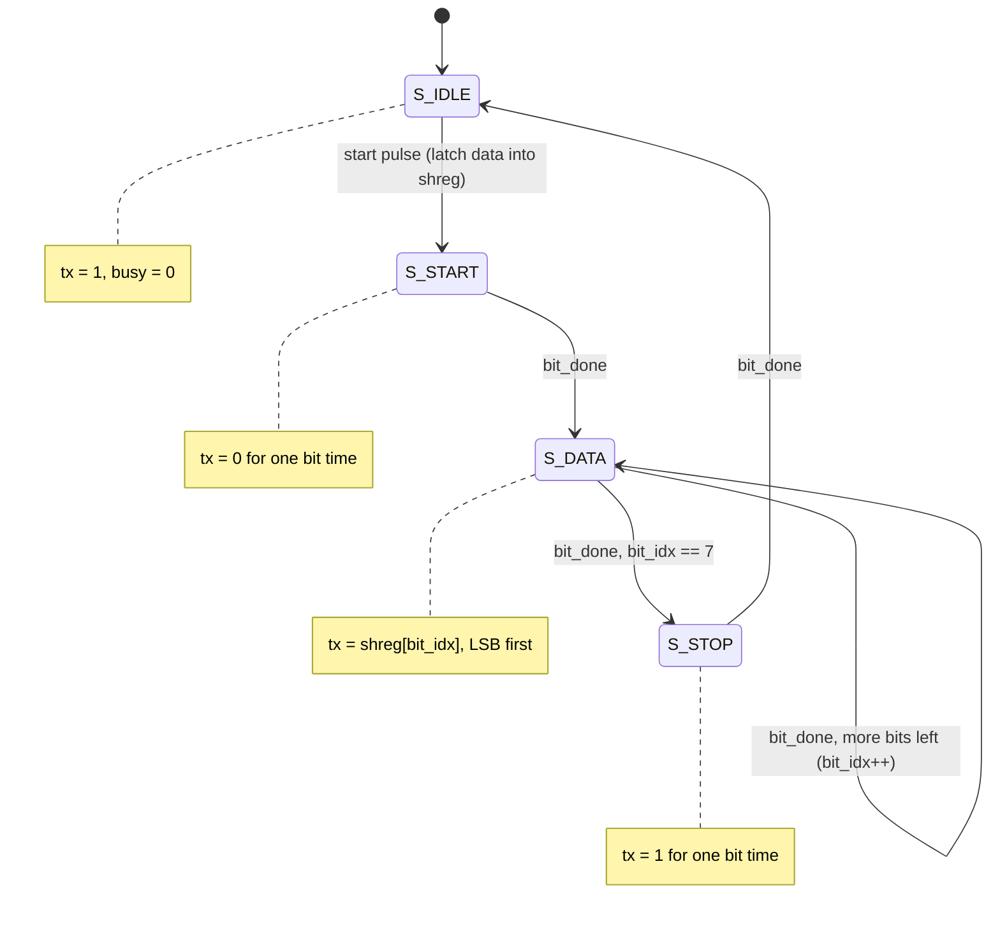

# 05 — Sequential logic & state machines

> Combinational logic computes; flip-flops *remember*. Put a state register
> in a loop with some next-state logic and you get the most important
> pattern in all of digital design — and your first real peripheral, a UART.

Chapters [03](03-verilog-crash-course.md) and
[04](04-simulation-and-testbenches.md) gave you the language and the lab
bench. This chapter gives you the pattern behind every remaining design in
this guide — state register, counters, `case` — and puts it to work in
[`uart_tx.v`](../src/03-uart-tx/uart_tx.v), a serial transmitter verified
by a testbench that *pretends to be the other device on the cable*.

## The flip-flop: the atom of state

A D flip-flop does exactly one thing: at the rising edge of the clock it
samples its input `D`, and it holds that value on its output `Q` until the
next rising edge. That's it. In Verilog:

```verilog
always @(posedge clk)
    q <= d;        // one flip-flop per bit of q
```

Everything else follows. Between two clock edges, nothing "happens" to
state — the combinational logic (your `+`, `case`, comparisons) is busy
settling toward its final values, but no register changes. At the edge,
every flip-flop in the design samples simultaneously, and the settling
starts over from the new state. The clock is the metronome that lets
billions of gates agree on what "now" means: a design computes in
discrete snapshots, one per cycle. This is also why non-blocking `<=` is
the law in clocked blocks — it models "all flops update together from the
*old* values" ([chapter 03](03-verilog-crash-course.md) has the details).

The obvious follow-up — how *fast* can you clock it? — has a real answer:
the longest settling path between two flops sets your maximum frequency.
That story waits for [chapter 11](11-synthesis-without-hardware.md), where
Yosys and nextpnr report your designs' actual Fmax on a real FPGA part. In
simulation, the clock is as fast as we say it is.

## Reset: agreeing on the beginning

Flip-flops power up holding garbage (in simulation: `x`, the unknown
value), and a state machine that starts in an unknown state may never find
its way to a known one. So every sequential design needs a reset — a
signal that forces the registers to a defined starting value. There are
two schools:

| | Synchronous reset | Asynchronous reset |
| --- | --- | --- |
| Sensitivity list | `always @(posedge clk)` | `always @(posedge clk or posedge rst)` |
| Takes effect | at the next rising clock edge | immediately, even with no clock |
| Needs a running clock to reset? | yes | no |
| Timing analysis | reset is just another data input — nothing special to check | asserting is easy; *releasing* near a clock edge can leave flops metastable, so release must be synchronized |
| FPGA fit | maps cleanly onto FPGA flip-flops and LUT logic | supported, but mixing styles fights the fabric |
| Typical home | FPGA designs — and this guide | ASICs and power-on logic, usually as "assert async, release sync" |

Both are legitimate; whole conference papers exist about the trade-offs
(see Further reading). This guide uses **synchronous, active-high reset
everywhere**: simplest to reason about, FPGA-friendly, and every clocked
block in the repo gets the same shape — quoted here in its entirety from
[`counter.v`](../src/01-counter/counter.v):

```verilog
always @(posedge clk) begin
    if (rst)
        count <= {WIDTH{1'b0}};
    else if (en)
        count <= count + 1'b1;
end
```

Memorize this ladder: **reset first, then enables, and if nothing fires,
the register holds** (no final `else` needed — a flip-flop that isn't
assigned keeps its value; that's the whole point of a flip-flop). Every
sequential module in this guide, up to and including the CPU, is built
from blocks of exactly this shape.

## Slow events from fast clocks

Your clock ticks millions of times per second; almost nothing you want to
*do* happens that often. The universal trick: count cycles, and when the
count hits N−1, do the thing and start over. A counter plus a compare is a
programmable metronome. The classic example — and the first thing you'll
port to real hardware in [chapter 13](13-hardware-and-beyond.md) — is
blinking an LED at 1 Hz from a 100 MHz clock (illustrative, not in repo):

```verilog
reg [25:0] tick_cnt;
reg        led;

always @(posedge clk) begin
    if (rst) begin
        tick_cnt <= 0;
        led      <= 1'b0;
    end else if (tick_cnt == 50_000_000 - 1) begin
        tick_cnt <= 0;
        led      <= ~led;      // toggle every half second = 1 Hz blink
    end else
        tick_cnt <= tick_cnt + 1;
end
```

The UART times its bits with exactly the same trick. At 115200 baud from a
100 MHz clock, each bit lasts 100 000 000 / 115200 ≈ 868 cycles (the 0.006%
rounding error is harmless — UARTs tolerate a few percent). In
[`uart_tx.v`](../src/03-uart-tx/uart_tx.v) that magic number is the
`CLKS_PER_BIT` parameter, and the metronome is one line:

```verilog
wire bit_done = (clk_cnt == CLKS_PER_BIT - 1);
```

In simulation we set `CLKS_PER_BIT = 10` so the tests run in microseconds
instead of milliseconds. The logic neither knows nor cares.

## State machines, properly

A counter is already a state machine — its state is the count, its
next-state logic is "+1". But most control problems have states with
*names*: idle, sending, waiting-for-ack. The finite state machine (FSM)
recipe has three ingredients: **named states** as `localparam` constants
(so waveforms and `case` arms stay readable), **a state register** updated
only in a clocked block, and **next-state logic** — a `case (state)`
saying, for each state, where to go and what to drive. The skeleton
(illustrative):

```verilog
localparam [1:0] S_A = 2'd0, S_B = 2'd1, S_C = 2'd2;
reg [1:0] state;

always @(posedge clk) begin
    if (rst)
        state <= S_A;
    else case (state)
        S_A:     if (go)         state <= S_B;
        S_B:     if (timer_done) state <= S_C;
        S_C:                     state <= S_A;
        default:                 state <= S_A;   // never wedge
    endcase
end
```

One piece of theory is worth knowing. In a **Moore** machine, outputs are
a function of the state alone — they change only on clock edges,
glitch-free and easy to reason about. In a **Mealy** machine, outputs also
depend on the current inputs — they can react a cycle earlier, but they
can glitch when inputs wiggle, and they stretch combinational paths into
the next module. Default to Moore-ish clarity — register your outputs
inside the clocked block — and reach for Mealy only when you've measured a
reason to. Everything in this guide is Moore-flavored.

## The serial frame: 8N1

Now for a state machine with a job. A UART sends bytes over a single wire
with no clock — both ends simply agree on the bit rate ahead of time
(that's the out-of-band contract; nothing is negotiated on the wire). The
classic format is **8N1**: 8 data bits, No parity, 1 stop bit. The line
idles high. To send a byte: a **start bit** (drive low for one bit time —
the falling edge tells the receiver to start its bit clock), then **8 data
bits, LSB first**, then a **stop bit** (drive high for one bit time, which
guarantees the next start bit has a falling edge to make). Here's the byte
`0xA5` (`1010_0101`, so LSB-first the wire carries `1,0,1,0,0,1,0,1`):

```text
    idle  start  d0    d1    d2    d3   d4    d5    d6    d7   stop idle…
tx  ─────┐     ┌─────┐     ┌─────┐          ┌─────┐     ┌───────────────
         └─────┘     └─────┘     └──────────┘     └─────┘
      1     0     1     0     1     0    0     1     0     1     1    1
```

Ten bit times per byte, every bit lasting exactly `CLKS_PER_BIT` clocks.
One frame is one lap through a four-state machine.

## Walking the transmitter

Open [`uart_tx.v`](../src/03-uart-tx/uart_tx.v). The declarations tell you
the whole story before you read a single `case` arm:

```verilog
localparam [1:0]
    S_IDLE  = 2'd0,
    S_START = 2'd1,
    S_DATA  = 2'd2,
    S_STOP  = 2'd3;

reg [1:0]  state;
reg [15:0] clk_cnt;   // counts clocks within one bit period
reg [2:0]  bit_idx;   // which of the 8 data bits we are sending
reg [7:0]  shreg;     // latched copy of `data`
```

One state register, two counters, one data register — all living in a
*single* clocked `always` block, updated together on every edge. The state
machine is exactly the frame diagram:



The `S_IDLE` arm contains the most important two lines in the file:

```verilog
S_IDLE: begin
    tx      <= 1'b1;
    clk_cnt <= 0;
    bit_idx <= 0;
    if (start) begin
        shreg <= data;   // latch NOW; caller may change `data` later
        state <= S_START;
    end
end
```

Why copy `data` into `shreg` instead of reading `data` during
transmission? Because a frame takes 10 × `CLKS_PER_BIT` cycles, and the
caller made no promise to hold `data` steady that long. The interface
contract is "pulse `start` for one cycle with `data` valid" — so we grab
the byte at that instant and own our copy. The tempting shortcut is a bug:

```verilog
// ILLUSTRATIVE ANTI-PATTERN — do not do this:
S_DATA: tx <= data[bit_idx];   // reads `data` live, mid-frame; if the
                               // caller reuses the bus, you serialize
                               // a chimera of two bytes
```

The workhorse arm is `S_DATA`, where the bit-period counter, the bit
index, and the shift-register indexing all cooperate:

```verilog
S_DATA: begin
    tx <= shreg[bit_idx];  // LSB first
    if (bit_done) begin
        clk_cnt <= 0;
        if (bit_idx == 3'd7) begin
            bit_idx <= 0;
            state   <= S_STOP;
        end else
            bit_idx <= bit_idx + 1;
    end else
        clk_cnt <= clk_cnt + 1;
end
```

Read it as three nested clocks: `clk_cnt` ticks every cycle, `bit_idx`
every `bit_done`, `state` every eighth `bit_done`. `S_START` and `S_STOP`
are the same pattern with `tx` pinned to 0 and 1, and the `case` ends with
`default: state <= S_IDLE;` — unreachable with four arms on a 2-bit state,
but the habit saves you the day the enum grows to five states in 3 bits.

Two more details. `busy` is a pure Moore output, one line outside the
clocked block: `assign busy = (state != S_IDLE);`. And because `tx` is
registered, the waveform on the wire lags `state` by exactly one clock —
each bit still lasts exactly `CLKS_PER_BIT` cycles, the whole frame is
just shifted one clock late relative to the state register. At 868 — or
even 10 — clocks per bit, a receiver sampling mid-bit will never notice.
Which brings us to the receiver.

## The testbench is the other device on the cable

How do you test a transmitter? You *receive* from it. The testbench
[`tb_uart_tx.v`](../src/03-uart-tx/tb_uart_tx.v) plays the device at the
far end of the cable, doing what real UART receiver silicon does: wait for
the falling edge of the start bit, then sample the line mid-bit, where the
signal is farthest from its transitions:

```verilog
// Act like a UART receiver: wait for start edge, sample mid-bit.
task recv_and_check(input [7:0] expected);
    reg [7:0] rx;
    integer   i;
    begin
        @(negedge tx);            // falling edge = start bit begins
        #(BIT_NS / 2);            // middle of the start bit
        if (tx !== 1'b0) begin
            $display("FAIL: start bit not low");
            errors = errors + 1;
        end
        for (i = 0; i < 8; i = i + 1) begin
            #(BIT_NS);            // middle of data bit i
            rx[i] = tx;           // LSB first
        end
        #(BIT_NS);                // middle of the stop bit
        if (tx !== 1'b1) begin
            $display("FAIL: stop bit not high");
            errors = errors + 1;
        end
        if (rx !== expected) begin
            $display("FAIL: received %h, expected %h", rx, expected);
            errors = errors + 1;
        end
    end
endtask
```

Note what this task *doesn't* know: nothing about `state`, `clk_cnt`, or
any internal register. It judges the design purely by its behavior on the
wire, against the 8N1 contract. This **act-like-the-counterpart pattern**
is how protocol hardware gets verified everywhere — SPI testbenches act
like flash chips, AXI testbenches act like memories, and in
[chapter 08](08-build-a-cpu.md) the CPU testbench acts like memory.

Sender and receiver must run *at the same time* — that's `fork/join`
([chapter 04](04-simulation-and-testbenches.md) introduced it):

```verilog
fork
    begin
        send(8'hA5);
        wait (!busy);
        send(8'h3C);
        wait (!busy);
        send(8'h00);   // all zeros: stop bit still must be 1
        wait (!busy);
    end
    begin
        recv_and_check(8'hA5);
        recv_and_check(8'h3C);
        recv_and_check(8'h00);
    end
join
```

One branch drives `start`/`data` like a client; the other listens to `tx`
like the far end of the cable. The `8'h00` case earns its place: all-zero
data makes the stop bit the *only* high in the frame, so a transmitter
that forgot it fails loudly instead of accidentally passing.

## Run it

```console
$ cd ../src/03-uart-tx
$ iverilog -g2012 -o sim.vvp tb_uart_tx.v uart_tx.v
$ vvp sim.vvp
VCD info: dumpfile uart_tx.vcd opened for output.
ALL TESTS PASSED
```

(Or `make 03-uart-tx` from `src/`.) Now open `uart_tx.vcd` in GTKWave or
Surfer and add `clk`, `tx`, `busy`, plus the DUT internals `state`,
`clk_cnt`, `bit_idx`. Worth finding:

- **The 0xA5 frame on `tx`** — with `CLKS_PER_BIT = 10` and a 10 ns clock
  each bit lasts 100 ns: start, `1,0,1,0,0,1,0,1`, stop. Match it against
  the frame diagram above.
- **`state` stepping `0 → 1 → 2 → 3 → 0`** while `busy` envelopes the
  frame and `bit_idx` climbs a staircase 0 through 7 inside `S_DATA`.
- **`clk_cnt`'s sawtooth** — the baud metronome, resetting on `bit_done`.
- **The one-clock lag** between `state` and `tx` — registered outputs,
  exactly as promised.

## One signal, two clocks: a warning

Everything here assumed a single clock, and every design in this guide
keeps that assumption. Real systems often can't: a signal generated in one
clock domain and sampled in another (a button, another chip's data line)
can violate the flip-flop's sampling window and leave it briefly
*metastable* — genuinely neither 0 nor 1. The standard first-aid is the
**two-flop synchronizer**: two back-to-back flip-flops in the destination
domain before anything else looks at the signal. Clock-domain crossing is
a deep, real-hardware topic; we flag the term here and park it until
[chapter 13](13-hardware-and-beyond.md)'s further reading.

## Debugging FSMs

When (not if) a state machine misbehaves, in rough order of firepower:

1. **Dump the state register and read it against the localparams.** You
   declared `S_DATA = 2'd2` precisely so "state stuck at 2" means
   something. GTKWave's *translate filters* can even display the names.
2. **Print state transitions during bring-up.** The testbench can spy on
   DUT internals by hierarchical name — no ports needed:

   ```verilog
   reg [1:0] prev_state;
   always @(posedge clk) begin
       if (dut.state !== prev_state)
           $display("[%0t] state %0d -> %0d", $time, prev_state, dut.state);
       prev_state <= dut.state;
   end
   ```

   A transition log answers "did it ever leave IDLE?" faster than any
   waveform. Delete it once the design works.
3. **Check the counters, not just the state.** Most FSM bugs are
   off-by-one bugs in a companion counter (`==` vs `>=`, `N` vs `N-1`).
   Sabotage `bit_done` to `(clk_cnt == CLKS_PER_BIT)` and watch the
   testbench catch the slightly slow bits.
4. **Suspect the reset ladder.** A register missing from the `if (rst)`
   branch starts as `x`, and `x` poisons everything it touches.

## Exercises

Ordered easiest to hardest. Each is a module plus a self-checking
testbench — the standard set in [chapter 04](04-simulation-and-testbenches.md).

1. **Button debouncer.** Real buttons bounce: one press, a burst of edges.
   Output changes only after the input holds a new value for N consecutive
   cycles — a counter that resets on every input change. Testbench: drive
   a noisy press, assert the output changes exactly once.
2. **Traffic-light FSM with timers.** GREEN, YELLOW, RED with different
   dwell times from one down-counter that reloads on each transition. Draw
   the mermaid state diagram *first*, then write the code to match.
   Testbench: check the sequence and the cycles spent in each state.
3. **Add a parity option.** Give `uart_tx` a `PARITY` parameter (`"NONE"`,
   `"EVEN"`, `"ODD"`) and an `S_PARITY` state between `S_DATA` and
   `S_STOP` that sends `^shreg` (or its inverse). Extend `recv_and_check`
   to verify the parity bit — the receiver task is the protocol spec, so
   it must change in lockstep.
4. **Runtime-configurable baud rate.** Replace the `CLKS_PER_BIT`
   parameter with a 16-bit input port, latched alongside `data` when
   `start` fires (the `shreg` lesson, applied twice). Testbench: send
   bytes at two different rates in one simulation and check both.
5. **The boss fight: a UART receiver, tested back-to-back.** Write
   `uart_rx.v`: wait in IDLE for the falling edge, count `CLKS_PER_BIT/2`
   to land mid-start-bit, verify it's still low, then sample every
   `CLKS_PER_BIT` cycles into a shift register, check the stop bit, and
   pulse `valid` with the byte. You already have the spec —
   `recv_and_check` is this receiver written as testbench code. Then wire
   `uart_tx`'s output to `uart_rx`'s input, stream a few hundred random
   bytes through, and check every one: the best testbench in this repo.

## Further reading

- **Harris & Harris, *Digital Design and Computer Architecture*, ch. 3** —
  sequential logic and FSMs rigorously: timing, metastability, Moore/Mealy.
- **Cummings & Mills, "Synchronous Resets? Asynchronous Resets? I am so
  confused!"** (SNUG) — the exhaustive version of this chapter's reset table.
- **Cummings' FSM papers** (SNUG, various years) — coding-style trade-offs:
  one, two, or three `always` blocks per state machine.
- **[HDLBits](https://hdlbits.01xz.net/)** — the FSM problem sets are the
  best drill available; do ten and the `case (state)` pattern is yours.
- **[Nandland's UART tutorial](https://nandland.com/uart-serial-port-module/)**
  (Russell Merrick) — a second angle on UART TX *and* RX before exercise 5.

---

*Next: [Chapter 06 — Memory](06-memory.md)*
