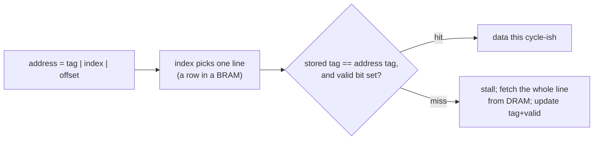

# 06 — Memory: registers, RAM, FIFOs (and why DRAM is different)

> Arithmetic is cheap; feeding it is the whole game. Every machine in this
> guide — CPU, GPU, TPU — is mostly an answer to one question: *where does
> the data wait, and how many cycles does it take to fetch?*

This is a build chapter. The code lives in
[`src/04-memory/`](../src/04-memory/): a register file
([`regfile.v`](../src/04-memory/regfile.v)), a synchronous RAM in the exact
shape FPGA tools turn into block RAM
([`ram_sync.v`](../src/04-memory/ram_sync.v)), and a FIFO
([`fifo_sync.v`](../src/04-memory/fifo_sync.v)), all exercised by one
self-checking testbench, [`tb_memory.v`](../src/04-memory/tb_memory.v).
Every one of them is just the clocked `always` block from
[Chapter 05](05-sequential-logic-and-fsms.md), pointed at an array — the
interesting part is which physical resource each shape becomes, and why the
memories you *can't* build in an afternoon (DRAM, caches) dominate
real-system design anyway.

## Where can bits live? The on-FPGA memory hierarchy

An FPGA gives you four places to put state, and they trade capacity against
latency against ports:

| Resource | Typical capacity | Read latency | Ports | What it physically is |
| --- | --- | --- | --- | --- |
| Flip-flops | thousands to ~100K bits | 0 cycles — `Q` is just a wire | as many as you can route | one FF next to every LUT, everywhere |
| Distributed / LUT RAM | tens of KB | 0 cycles (combinational read) | typically 1 write + 1–2 reads | the LUTs themselves, reused as tiny RAMs |
| Block RAM (BRAM) | ~16 KB on an iCE40, up to MBs on big parts | 1 cycle (registered read) | usually 2, fixed shapes | dedicated SRAM tiles in columns |
| External DRAM | GBs | tens to hundreds of cycles, *variable* | 1, shared and arbitrated | a separate chip plus a controller you must provide |


Capacity grows left to right; so does latency, and port count collapses.
(The numbers are per-part, and not every family has every rung — the iCE40
has no LUT RAM, so small async-read memories there become flip-flops.)

*Where should this data live?* is **the** architecture question, and
chapters [08](08-build-a-cpu.md)–[10](10-build-a-tpu.md) are three different
answers: the CPU keeps 32 words in a register file and pretends main memory
is fast; the GPU gives every lane its own registers and hides memory latency
behind other threads' work; the TPU pins the weights *inside* the arithmetic
array so they never travel at all.

## The register file: memory you can touch every cycle

A CPU executing `add rd, rs1, rs2` needs to read two operands and write one
result *in the same cycle*. That fixed shape — two read ports, one write
port, "2R1W" — is what a register file is. Here is ours, complete
([`regfile.v`](../src/04-memory/regfile.v)):

```verilog
module regfile (
    input  wire        clk,
    input  wire        we,
    input  wire [4:0]  waddr,
    input  wire [31:0] wdata,
    input  wire [4:0]  raddr1,
    output wire [31:0] rdata1,
    input  wire [4:0]  raddr2,
    output wire [31:0] rdata2
);

    reg [31:0] regs [0:31];

    assign rdata1 = (raddr1 == 5'd0) ? 32'd0 : regs[raddr1];
    assign rdata2 = (raddr2 == 5'd0) ? 32'd0 : regs[raddr2];

    always @(posedge clk)
        if (we && waddr != 5'd0)
            regs[waddr] <= wdata;

    // Simulation nicety: start from a known state instead of X.
    // (FPGAs honour initial values too; ASICs need an explicit reset.)
    integer i;
    initial for (i = 0; i < 32; i = i + 1) regs[i] = 32'd0;

endmodule
```

Four things to notice:

- **Reads are combinational.** `rdata1` is an `assign`, not a clocked
  register: change `raddr1` and data appears within the same cycle, after
  mere gate delays. [Chapter 08](08-build-a-cpu.md)'s single-cycle CPU
  depends on this — operands must be readable in the cycle the instruction
  executes — and it instantiates exactly this 2R1W shape.
- **`x0` is hardwired to zero**, belt and braces: reads of address 0 are
  forced to `32'd0`, *and* writes to address 0 are dropped. That's the
  RV32I contract, and a swathe of the assembler's pseudo-instructions lean
  on it (`nop` is `addi x0, x0, 0`, `j` is `jal x0, …`, `neg rd, rs` is
  `sub rd, x0, rs`, `ret` is `jalr x0, 0(ra)`).
- **It cannot be a block RAM.** BRAM reads are registered — data arrives a
  cycle after the address — so combinational-read memories map to LUT RAM
  or plain flip-flops instead. At 32 × 32 = 1024 bits that's cheap; it
  would not be at 32 KB. You're paying for ports here, not capacity.
- **The `initial` block is legal on FPGAs.** The bitstream can set initial
  FF and RAM contents, so simulation and hardware agree. An ASIC has no
  bitstream — there you'd need an explicit reset, which for a 1024-bit
  array is genuinely annoying. A small luxury of FPGA-land.

## The BRAM pattern: one address in, data out a cycle later

Now the workhorse. This exact coding pattern is what synthesis tools
pattern-match into block RAM
([`ram_sync.v`](../src/04-memory/ram_sync.v)):

```verilog
module ram_sync #(
    parameter ADDR_W = 8,
    parameter DATA_W = 32
) (
    input  wire              clk,
    input  wire              we,
    input  wire [ADDR_W-1:0] addr,
    input  wire [DATA_W-1:0] wdata,
    output reg  [DATA_W-1:0] rdata
);

    reg [DATA_W-1:0] mem [0:(1 << ADDR_W) - 1];

    always @(posedge clk) begin
        if (we)
            mem[addr] <= wdata;
        rdata <= mem[addr];
    end

endmodule
```

The defining feature is the last line: `rdata` is assigned *inside* the
clocked block, so the read is registered. You present an address on one
edge and get data after the *next* edge — one cycle of read latency,
always. That latency is the price of dense on-chip SRAM, and it is
non-negotiable: no FPGA's BRAM does combinational reads. In
[Chapter 11](11-synthesis-without-hardware.md) you'll run Yosys on this
file and watch it report an actual BRAM primitive — the claim is checkable,
so we'll check it.

### Read-during-write: which value do you get?

Write address 42 and read address 42 in the same cycle — what comes out?
Hardware forces you to pick a policy:

| Policy | Same-cycle read returns | Notes |
| --- | --- | --- |
| **Read-first** ("read old data") | the value *before* the write | what the code above does; a common BRAM default |
| **Write-first** ("write-through") | the value being written | needs bypass logic or a different BRAM mode |
| **No-change** | read port holds its previous output | a mode on some BRAM primitives |

Our RAM is read-first, and the testbench doesn't take the comment's word for
it — it proves it
([`tb_memory.v`](../src/04-memory/tb_memory.v)):

```verilog
        // read-during-write to the same address returns the OLD data
        ram_we = 1; ram_addr = 8'd42; ram_wdata = 32'h1234_5678;
        @(posedge clk); #1;
        ram_we = 0;
        if (ram_rdata !== 32'hCAFE_002A) fail("ram: expected read-first (old data)");
        @(posedge clk); #1;
        if (ram_rdata !== 32'h1234_5678) fail("ram: new data after second read");
```

Address 42 held `CAFE_002A`; the cycle that writes `1234_5678` still reads
back the old coffee, and only the following read sees the new value. Pin
behaviour like this down in a directed test *before* building on top of it —
read-during-write bugs are exactly the kind that simulate fine in one tool
and explode on hardware with a different BRAM default.

The one-cycle latency has an architectural consequence: a single-cycle CPU
must read an instruction *and* a data word in the same cycle it executes.
Put its memories in BRAM and every load arrives a cycle late — you'd have
to stall, and then it isn't single-cycle anymore. That is why `cpu.v` in
step 05 explicitly demands combinational-read memories, and why its
testbench models them as plain arrays. It's a fiction with a price tag;
chapters [08](08-build-a-cpu.md) and
[11](11-synthesis-without-hardware.md) present the bill.

## Byte enables: real memories write bytes, not words

`ram_sync.v` writes whole 32-bit words. But RISC-V has `SB` and `SH` —
store one byte, store a halfword — so a real data memory needs to update
*part* of a word while leaving the rest alone. The standard answer is a
write strobe: one enable bit per byte lane. Here is how step 05's testbench
implements its data memory, driven by the CPU's 4-bit `dmem_wstrb`
([`tb_cpu.v`](../src/05-cpu-rv32i/tb_cpu.v)):

```verilog
    // byte-lane writes, exactly what dmem_wstrb encodes
    always @(posedge clk) begin
        if (dmem_wstrb[0]) dmem[dmem_addr[13:2]][7:0]   <= dmem_wdata[7:0];
        if (dmem_wstrb[1]) dmem[dmem_addr[13:2]][15:8]  <= dmem_wdata[15:8];
        if (dmem_wstrb[2]) dmem[dmem_addr[13:2]][23:16] <= dmem_wdata[23:16];
        if (dmem_wstrb[3]) dmem[dmem_addr[13:2]][31:24] <= dmem_wdata[31:24];
    end
```

`SW` asserts all four strobes; `SH` two; `SB` one, with the CPU shifting
the data into the right lane. This isn't a simulation convenience — real
BRAM primitives provide byte-enable (or write-mask) inputs for precisely
this, because the alternative is a read-modify-write: read the word, merge
the byte, write it back, burning an extra cycle and a port. The same
`wstrb` idea appears in every memory-mapped bus you'll ever meet (AXI,
Wishbone, TileLink — all of them).

## FIFOs: the duct tape of digital design

Two blocks rarely run in lockstep. A CPU dumps a message in nanoseconds;
the UART from [Chapter 05](05-sequential-logic-and-fsms.md) drains it at
115200 baud. A pixel pipeline bursts a scanline; the memory controller
absorbs it when the DRAM feels like it. Between any such producer and
consumer goes a FIFO: an elastic queue saying "full — stop pushing"
upstream and "empty — nothing yet" downstream. Learn this one structure and
you'll bolt it between mismatched things for the rest of your career.

The interesting part of [`fifo_sync.v`](../src/04-memory/fifo_sync.v) is
how it tells *full* from *empty* — the classic trick is pointers with **one
extra bit**:

```verilog
    reg [DEPTH_LOG2:0] wptr;   // one extra bit on purpose
    reg [DEPTH_LOG2:0] rptr;

    assign empty = (wptr == rptr);
    assign full  = (wptr[DEPTH_LOG2]     != rptr[DEPTH_LOG2]) &&
                   (wptr[DEPTH_LOG2-1:0] == rptr[DEPTH_LOG2-1:0]);

    assign rd_data = mem[rptr[DEPTH_LOG2-1:0]];
```

With `DEPTH_LOG2 = 4` the FIFO holds 16 entries but the pointers are 5 bits
wide. The low 4 bits index the storage ring; the extra top bit flips each
time a pointer wraps — it counts *laps*. Naive equal-width pointers can't
work: after 16 pushes and 0 pops they'd be equal, exactly as when empty.
The lap bit breaks the tie:

- pointers fully equal → same slot, same lap → **empty**;
- low bits equal, lap bits differ → the writer is exactly one full lap
  ahead of the reader → **full**.

No element counter, no special cases, two comparators. Note `rd_data` too:
it's a plain `assign` from the head slot, so whenever the FIFO is non-empty
the head element is *already* on the output — `rd_en` just pops it. That's
**first-word fall-through**; the alternative style registers the output so
you request data a cycle before you get it. Both are common, and mixing
them up is a rite of passage.

The update logic sets the overflow/underflow policy:

```verilog
    always @(posedge clk) begin
        if (rst) begin
            wptr <= 0;
            rptr <= 0;
        end else begin
            if (wr_en && !full) begin
                mem[wptr[DEPTH_LOG2-1:0]] <= wr_data;
                wptr <= wptr + 1;
            end
            if (rd_en && !empty)
                rptr <= rptr + 1;
        end
    end
```

A write while full and a read while empty are silently ignored — the guards
make misuse safe, but *silent*. The testbench checks both cases explicitly
(push `8'hEE` into a full FIFO, pop from an empty one, verify nothing
moved), because "safe but silent" is exactly the behaviour that hides bugs
until you assert it.

### Testing a FIFO the right way: the golden model

Directed tests (fill, drain, check order) catch the easy bugs. The
randomized test is where confidence comes from, and it uses the
golden-model doctrine from [Chapter 04](04-simulation-and-testbenches.md):
keep a trivially-correct software queue next to the hardware, hit both with
the same random traffic, demand they agree
([`tb_memory.v`](../src/04-memory/tb_memory.v)):

```verilog
        for (i = 0; i < 2000; i = i + 1) begin
            // decide this cycle's actions
            f_wr    = $random;               // 50% push attempt
            f_rd    = $random;               // 50% pop attempt
            f_wdata = $random;

            // mirror into the golden model using the DUT's own full/empty
            #1;
            if (f_wr && !f_full) begin
                model_q[model_tail % 1024] = f_wdata;
                model_tail = model_tail + 1;
                pushes = pushes + 1;
            end
            if (f_rd && !f_empty) begin
                if (f_rdata !== model_q[model_head % 1024])
                    fail("fifo: data mismatch vs golden model");
                model_head = model_head + 1;
                pops = pops + 1;
            end
            @(posedge clk); #1;

            // occupancy implied by the model must match full/empty flags
            if ((model_tail - model_head == 0)  && !f_empty) fail("fifo: empty flag wrong");
            if ((model_tail - model_head == 16) && !f_full)  fail("fifo: full flag wrong");
        end
```

Two thousand cycles of simultaneous random pushes and pops — wraps, races,
full-while-draining, empty-while-filling — all checked. Note the subtlety:
the model gates its updates on the DUT's own `full`/`empty` flags, so a
lying flag could drag the model along with it. The occupancy cross-check at
the bottom closes that loophole: the model knows how many elements *should*
be inside and calls out a flag that disagrees. (An exercise below asks you
to prove this check earns its keep.)

One flavour we deliberately don't build: the **asynchronous FIFO**, where
producer and consumer live on *different clocks*. Same ring, same extra-bit
pointers — but each pointer must cross into the other clock domain through
synchronizer flip-flops, and a multi-bit binary pointer can be sampled
mid-change with half its bits updated. The fix is passing pointers in
**Gray code**, where exactly one bit changes per increment, so a torn
sample is off by at most one — stale but safe. The async FIFO is *the*
canonical clock-domain-crossing structure; Cummings' paper in Further
reading is the definitive treatment.

## DRAM is a different beast

Everything above is SRAM at heart: six transistors per bit, holding state
as long as power is on, fast and happy — and expensive in area, which is why
your FPGA has kilobytes-to-megabytes of it, not gigabytes. DRAM gets its
density from a brutal simplification: **one transistor and one capacitor
per bit**. A charged capacitor is a 1, discharged is a 0. Consequences
cascade from there:

- **The charge leaks.** Every row must be rewritten (*refreshed*) within a
  window of roughly 64 ms, forever. The controller schedules refresh
  commands and your traffic waits while they run — "Dynamic" is a polite
  word for "forgets constantly."
- **Reads are destructive and two-dimensional.** Bits sit in a grid of rows
  and columns, in multiple banks. To read anything you *activate* a row —
  dumping its entire contents into a row buffer of sense amplifiers — then
  read or write *columns* of that buffer, then *precharge* to close the row
  before opening another. Hitting an open row is fast; a different row
  costs precharge + activate first. DRAM latency is therefore not a
  number but a distribution — tens to hundreds of controller-clock cycles
  depending on row hits, bank conflicts, and refresh timing.
- **Data moves in bursts.** DDR transfers a burst of consecutive words on
  both clock edges. You don't fetch 4 bytes; you fetch a burst and had
  better want its neighbours. (Caches do — see below.)
- **A DDR controller is serious hardware.** It juggles a datasheet's worth
  of timing parameters (tRCD, tRP, tCAS, ...), issues refresh on schedule,
  and — the really hairy part — calibrates per-pin signal delays at startup
  so data lands in the right capture window at gigahertz rates. This is
  why on real boards DRAM is driven by a vendor IP block or an open-source
  controller like LiteDRAM, not by an afternoon's Verilog. Writing a
  simpler *SDRAM* (single-data-rate) controller by hand is a classic
  rite-of-passage FPGA project — boards suited to it show up in
  [Chapter 13](13-hardware-and-beyond.md).

The practical guidance for this guide is simpler than all of that. In
simulation, "big memory" can be a plain Verilog array — `tb_cpu.v` declares
16 KiB as `reg [31:0] dmem [0:4095];` and nobody complains. On real
hardware, staying inside BRAM keeps life simple; the day your data doesn't
fit is the day you learn a memory controller.

## Caches, briefly (the bridge to Chapter 08)

Put the two previous sections side by side and a canyon opens: a register
read is free, BRAM costs one cycle, DRAM costs a variable tens-to-hundreds.
A CPU that touched DRAM on every load would spend its life waiting. The
answer is a **cache**: a small BRAM-speed memory holding recently-used
chunks of DRAM, exploiting the fact that programs reuse data (temporal
locality) and use neighbours of what they just used (spatial locality —
those DRAM bursts again).

The simplest useful shape is the **direct-mapped cache**. Split the
address into three fields; each memory block can live in exactly one cache
line, chosen by the index bits:



A line stores a data block plus the *tag* (the address bits that
distinguish which of the many blocks mapping to this line is present) and a
*valid* bit. Lookup is: index into the BRAM, compare tags, check valid —
hit or miss. That's genuinely it for the basic idea; everything else
(associativity, replacement, write-back vs write-through) is refinement,
and Harris & Harris chapter 8 covers it properly.

Our CPU in [Chapter 08](08-build-a-cpu.md) has **no cache**, because its
memory answers combinationally in zero cycles — a fiction only a testbench
can sustain. That fiction is the honest cost of keeping the CPU
single-cycle and ~250 lines, and chapters [08](08-build-a-cpu.md) and
[11](11-synthesis-without-hardware.md) both return to what it hides.

## Run it

```console
$ cd src && make 04-memory

==== 04-memory ====
cd 04-memory && iverilog -g2012 -o sim.vvp tb_memory.v regfile.v ram_sync.v fifo_sync.v && vvp sim.vvp | tee sim.log && grep -q "ALL TESTS PASSED" sim.log
VCD info: dumpfile memory.vcd opened for output.
fifo random test: 981 pushes, 979 pops
ALL TESTS PASSED
```

Then open the waveform and go looking for the good moments:

```console
$ gtkwave 04-memory/memory.vcd     # or: surfer 04-memory/memory.vcd
```

- Add `u_fifo.wptr`, `u_fifo.rptr`, `full`, `empty` (display the pointers
  as binary). During the directed fill, watch `wptr` count 0→16 while
  `rptr` sits at 0 — `full` snaps high at the exact edge where the low four
  bits match and the lap bits differ (`10000` vs `00000`).
- Find the write-while-full: `f_wdata` shows `EE` for a cycle, `wr_en` is
  high, and `wptr` doesn't budge. The guard at work.
- On the RAM signals, see `ram_rdata` trailing `ram_addr` by one cycle —
  the BRAM latency you just read about, drawn for you — and catch the
  read-first moment at address 42.
- In the randomized phase, watch the pointers chase each other around the
  ring and pick out a wrap: the low bits roll over while the lap bit flips.

## Exercises

Ordered by effort. Each one extends `src/04-memory/` — keep
`tb_memory.v`'s pass/fail discipline: every new feature gets a check that
can actually fail.

1. **Warm-up — asynchronous-read ROM.** Write `rom_async.v`: combinational
   read, no write port, contents loaded with `$readmemh` in an `initial`
   block. This is exactly the instruction-memory shape step 05 uses. Add a
   readback check to the testbench.
2. **Easy — dual-port RAM.** Extend `ram_sync.v` to two ports (one
   read/write, one read-only, both clocked). BRAMs are physically
   dual-ported, so this still maps to one primitive. Test that both ports
   work in the same cycle on different addresses.
3. **Easy — FIFO occupancy outputs.** Add a `count` output
   (`wptr - rptr` — the extra pointer bit makes this a one-liner) plus
   `almost_full`/`almost_empty` with parameterized thresholds. Extend the
   golden-model loop to check `count` on every cycle.
4. **Medium — write-first RAM variant.** Make `ram_wf.v` that returns the
   *new* data on a same-address read-during-write (bypass `wdata` to
   `rdata` when addresses match). Then write the test that *proves* the two
   variants differ: the same stimulus from the read-first directed test
   must produce a different, checked result.
5. **Medium — break the full flag, catch it.** Sabotage `fifo_sync.v` —
   for instance, make `full` compare only the low bits, or off-by-one the
   comparison — and confirm the randomized test actually fails. If any
   sabotage survives 2000 cycles, strengthen the test (more cycles, biased
   push-heavy traffic, occupancy checks after every edge) until it doesn't.
   This is mutation testing by hand, and it's how you learn to trust a test.
6. **Stretch — direct-mapped cache model.** In a new testbench, model a
   small direct-mapped cache in behavioral Verilog (arrays for data, tag,
   valid) in front of a big "DRAM" array with an artificial N-cycle delay.
   Drive random reads, check every result against the backing array, and
   report the hit rate. No RTL needed — the point is to feel the
   index/tag/valid mechanics before Chapter 08 makes you want them.

## Further reading

- **Harris & Harris, *Digital Design and Computer Architecture*, chapter 8**
  — memory systems done properly: SRAM/DRAM internals, caches with worked
  examples, virtual memory. The natural companion to this chapter and the
  next two.
- **Clifford E. Cummings, "Simulation and Synthesis Techniques for
  Asynchronous FIFO Design" (SNUG 2002)** — the definitive async-FIFO paper:
  Gray-code pointers, synchronizers, and every way to get it wrong.
- **Ulrich Drepper, "What Every Programmer Should Know About Memory"
  (2007)** — a free, deep tour of DRAM cells, rows, banks, and why your
  software's memory behaviour looks the way it does. Sections 1–2 pair
  well with the DRAM section above.
- **Your FPGA family's memory app note** — e.g. Xilinx UG473 (*7 Series
  FPGAs Memory Resources*) or the Lattice ECP5 memory usage guide: BRAM
  modes, read-during-write behaviour, byte enables, real port shapes.
- **[LiteDRAM](https://github.com/enjoy-digital/litedram)** — an
  open-source DRAM controller; skim its docs to calibrate how much work
  "just add DRAM" really is.

---

*Next: [Chapter 07 — Building blocks of compute](07-building-blocks.md)*
