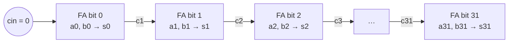
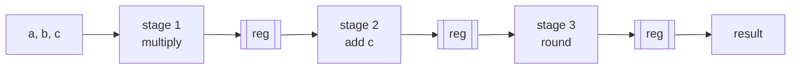

# 07 — Building blocks of compute

> Chapters 08–10 assemble three famous machines. This chapter stocks the
> shelves they get assembled from.

A CPU, a GPU and a TPU sound like three different universes. They are not.
Open any of them up and you find the same short list of parts, wired
together in different shapes: an ALU, some adders and multipliers, a lot of
muxes, pipeline registers to keep the clock fast, and handshakes to keep
data from falling on the floor. Add the memories of
[chapter 06](06-memory.md) — register files, RAMs, FIFOs — and the parts
bin is complete.

This chapter walks the bin shelf by shelf. You have already built the star
exhibit: the 32-bit ALU from [`../src/02-alu/alu.v`](../src/02-alu/alu.v),
tested against a golden model in
[`../src/02-alu/tb_alu.v`](../src/02-alu/tb_alu.v). We'll use it as the
running example, then zoom in on what `+`, `<<` and `*` actually cost as
physical objects, and finish with the two ideas that turn parts into
machines: **pipelining** and the **valid/ready handshake**.

| Part | What it is | Who uses it |
| --- | --- | --- |
| ALU | every operation computed at once, one selected | CPU datapath ([08](08-build-a-cpu.md)), one per GPU lane ([09](09-build-a-gpu.md)) |
| Adder | carry propagation made of silicon | everything, everywhere |
| Barrel shifter | log₂(W) layers of muxes | the biggest chunk of your ALU |
| Multiplier / MAC | hard DSP silicon on real FPGAs | the TPU is nothing else ([10](10-build-a-tpu.md)) |
| Mux | data steering | the answer to "how does the CPU choose?" is always "a mux" |
| Pipeline register | cuts a long path into short ones | the fundamental speed trick |
| valid/ready | flow control between blocks | the universal glue; AXI-Stream's core |
| Memories | state at scale | [chapter 06](06-memory.md), used by all three machines |

## The ALU is a mux over answers

In software, a `case` statement chooses which code *runs*. In hardware
there is no "runs" — everything is built, so everything computes, always.
Here is the heart of the ALU:

```verilog
    always @* begin
        case (op)
            ALU_ADD:  y = a + b;
            ALU_SUB:  y = a - b;
            ALU_AND:  y = a & b;
            ALU_OR:   y = a | b;
            ALU_XOR:  y = a ^ b;
            ALU_SLL:  y = a << shamt;
            ALU_SRL:  y = a >> shamt;
            ALU_SRA:  y = $signed(a) >>> shamt;
            ALU_SLT:  y = ($signed(a) < $signed(b)) ? 32'd1 : 32'd0;
            ALU_SLTU: y = (a < b) ? 32'd1 : 32'd0;
            default:  y = 32'd0;
        endcase
    end
```

Read this the hardware way: there is an adder, a subtractor, an AND array,
an OR array, a shifter and two comparators sitting on the chip *at the same
time*, and at every moment all of them are chewing on `a` and `b` and
producing their answers. The `case` synthesizes to a wide mux whose select
lines are `op`, and all it does is decide *which of the ten answers reaches
`y`*. Change `op` and a different, already-computed result appears — after
a mux delay, not after a computation. This is
[chapter 01](01-what-is-an-fpga.md)'s spatial-computing idea in
miniature: you don't schedule work over time, you lay it out over area.

That is also why the `default:` arm matters (as the header comment in
`alu.v` warns): a combinational `always` block that doesn't assign `y` on
every path tells the synthesizer "remember the old value here" — a latch,
which is a piece of state you never asked for.

One more output deserves attention now, because
[chapter 08](08-build-a-cpu.md) will lean on it hard:

```verilog
    assign zero = (y == 32'd0);
```

A 32-input NOR gate hanging off the result. It looks like an afterthought;
it is actually the CPU's entire conditional-branch mechanism. `beq x1, x2,
label` will be implemented as "run the ALU in SUB mode, look at `zero`" —
subtraction as a question rather than an answer.

## Addition is a physical thing

`a + b` looks atomic in Verilog. Physically it is 32 one-bit **full
adders** — each computing `sum = a ^ b ^ cin` and a carry-out — and the
catch is the carry. In the simplest arrangement, the **ripple-carry
adder**, bit *i*'s carry-in is bit *i−1*'s carry-out:



Bit 31 cannot finish until the carry has rippled through all 31 bits below
it. Delay grows linearly with width — a 64-bit add is twice as slow as a
32-bit add. ASIC designers fight this with **carry-lookahead** and
**prefix adders** (Kogge–Stone, Brent–Kung — trees of generate/propagate
logic that get the delay down to O(log W) at the cost of a lot more area).
They're beautiful and worth a Wikipedia detour, and you will almost never
build one.

Because the FPGA answer is different: every mainstream FPGA family runs
**dedicated fast-carry chains** — hardwired, ultra-short carry paths
between vertically adjacent logic cells, separate from the general routing
fabric. A ripple-carry adder mapped onto the carry chain is *faster* than
a clever prefix adder forced through general-purpose routing. The design
guidance is therefore refreshingly lazy: **write `a + b` and let the tools
do their job.** When you synthesize the CPU in
[chapter 11](11-synthesis-without-hardware.md) you'll see the carry
primitives show up by name in the Yosys report.

The adder is also more of the ALU than it first appears:

- **Subtraction** is addition in disguise: `a - b = a + ~b + 1` (two's
  complement). Invert `b`, set carry-in to 1, same adder.
- **Comparison** is subtraction in disguise: for unsigned `a < b`, compute
  `a - b` and look at the borrow (the inverted carry-out); for signed,
  look at the sign of the difference, corrected for overflow. `ALU_SLT`
  and `ALU_SLTU` are a subtractor wearing a trench coat — a hand-optimized
  ALU shares one adder for ADD, SUB, SLT and SLTU; we wrote each op
  separately and let synthesis discover the sharing.
- **Equality** doesn't need an adder at all: `a == b` is `~|(a ^ b)` —
  XOR each bit pair, NOR-reduce. Which is exactly what SUB-then-`zero`
  computes, and exactly how the CPU's `beq` will work.

## Shifts: free until they aren't

Here is a pleasant surprise: a shift **by a constant** costs nothing.
`x << 2` is just wiring — bit 0 of the input connects to bit 2 of the
output, and there is no gate anywhere. Multiplying by a power of two is
literally free.

A shift **by a variable amount** — `a << shamt` where `shamt` arrives at
runtime, as in the ALU — is a different animal: the **barrel shifter**.
The trick is to decompose the shift amount into its binary digits and
apply them as successive optional shifts:

| Layer | Controlled by | Question it answers | Hardware |
| --- | --- | --- | --- |
| 1 | `shamt[4]` | shift by 16, or pass through? | 32 two-way muxes |
| 2 | `shamt[3]` | shift by 8, or pass through? | 32 two-way muxes |
| 3 | `shamt[2]` | shift by 4, or pass through? | 32 two-way muxes |
| 4 | `shamt[1]` | shift by 2, or pass through? | 32 two-way muxes |
| 5 | `shamt[0]` | shift by 1, or pass through? | 32 two-way muxes |

Any shift from 0 to 31 falls out of five yes/no decisions — log₂(W)
layers, ~160 mux bits total for one 32-bit shifter. Compare that with
`a & b`: 32 lonely LUTs. And the ALU wants *three* shift flavors (SLL,
SRL, SRA), though synthesis shares most of the structure between them.
This is why the shifter is among the biggest single pieces of your ALU —
a claim you don't have to take on faith, because
[chapter 11](11-synthesis-without-hardware.md) will let you run `yosys
stat` on `alu.v` and count the cells yourself.

## Multiplication (and why division is a trap)

The pencil-and-paper algorithm you learned in school works in binary too,
only better: multiplying by a binary digit is multiplying by 0 or 1. So
`a * b` is "for each set bit *i* of `b`, add `a << i` into a running sum"
— **shift-and-add**. Done combinationally all at once, that becomes an
**array multiplier**: W rows of W AND gates feeding an adder tree, roughly
O(W²) area and a long, slow critical path. A 32×32 multiplier built from
plain LUTs is a monster.

Which is why FPGAs don't build it from LUTs. Real parts ship **hard DSP
slices**: dedicated silicon multipliers (anywhere from ~16×16 on small
parts up to ~27×18 on larger ones) with built-in accumulators, pre-adders
and pipeline registers. The
names vary by family — DSP48 on AMD/Xilinx parts, `SB_MAC16` on the Lattice
iCE40, `MULT18X18`-style blocks on the ECP5, and the exact widths and
features differ — but the deal is the same everywhere: write `a * b` and
the tools map it onto silicon designed for exactly that. One line of
Verilog, one hard block, full speed.

This single fact is why [chapter 10](10-build-a-tpu.md)'s TPU is viable at
all. The systolic array's processing element
([`../src/07-tpu-systolic/pe.v`](../src/07-tpu-systolic/pe.v)) is built
around one multiply-accumulate:

```verilog
            psum_out <= psum_in + a_in * w;   // MAC, forward south
```

On a real FPGA, that line *is* a DSP slice — multiplier and accumulator in
one hard block, one result per cycle. A 4×4 array is sixteen of them; a
Google-scale 256×256 array is 65,536, which is the entire architecture.

**Division** is the opposite story. There is no divide array, no hard
divide block; division is inherently iterative — each quotient bit depends
on a subtraction involving all the previous ones. A hardware divider is
either huge, slow (one bit per cycle for W cycles), or both. So treat this
as design guidance rather than trivia:

- `x / 2**k` is `x >> k` and `x % 2**k` is `x & (2**k - 1)` — free.
  Compilers call this *strength reduction*; in hardware you do it by hand.
- Division rarely belongs in a hot path. Restructure: multiply by a
  precomputed reciprocal, redesign the algorithm, or accept a many-cycle
  iterative divider off to the side.
- Even ISAs agree: RV32I — the base instruction set your chapter 08 CPU
  implements — ships without multiply *or* divide. They live in the
  optional M extension, because the base integer core shouldn't pay for
  them.

## Pipelining — the fundamental speed trick

Everything so far has been combinational: change the inputs, wait for
gates to settle, read the answer. That "wait for gates to settle" is not a
metaphor — it is a physical delay along the longest path from any input to
any output, and it sets your clock speed. Informally:

> **Fmax ≈ 1 / (longest combinational path between two registers)**

([Chapter 11](11-synthesis-without-hardware.md) turns this into real
picoseconds from nextpnr; for now the shape of the idea is enough.) If
your multiply-add-round chain takes 15 ns to settle, you cannot clock it
faster than about 66 MHz, because a clock edge must not arrive before the
answer does.

The fix is not to make the logic faster. It is to make the *distance
between registers* shorter: chop the long path into stages and drop a
register between each pair. Say the chain is multiply, then add, then
round:



Each stage is now ~5 ns of logic, so the clock can run at ~200 MHz — three
times faster (minus some register overhead; chapter 11 again). The price:
a result now takes three clock edges to emerge instead of one. The prize:
the stages work on *different* data simultaneously, so once the pipeline
fills, a new result drops out **every cycle**:

| Cycle | stage 1 (×) | stage 2 (+) | stage 3 (round) | output |
| --- | --- | --- | --- | --- |
| 1 | A | — | — | — |
| 2 | B | A | — | — |
| 3 | C | B | A | — |
| 4 | D | C | B | **A** |
| 5 | E | D | C | **B** |

Two words to keep crisply separate from here on:

- **Latency** — how long *one* item takes, input to output. Here: 3
  cycles. Pipelining made it *worse* (three short cycles ≈ one long one,
  plus overhead).
- **Throughput** — how many items finish per unit time. Here: one per
  cycle at 3× the clock rate. Pipelining made it much better.

A laundry room makes the trade-off obvious: one load still takes the full
wash-plus-dry time, but you'd never let the washer sit idle while the
dryer runs. Pipelining is starting the next wash while this load dries.

In Verilog, a pipeline stage is just non-blocking assignments in a clocked
block, with a `valid` bit riding shotgun so downstream logic knows which
cycles carry real data. An illustrative sketch (not in `src/` — building a
tested version is exercise 4):

```verilog
    // Illustrative 3-stage pipeline: multiply, add, round.
    // Every signal assigned here is a pipeline register.
    always @(posedge clk) begin
        // stage 1: multiply
        prod <= a * b;
        v1   <= in_valid;
        // stage 2: add the offset
        sum  <= prod + c;
        v2   <= v1;
        // stage 3: round and narrow (see fixed-point, below)
        result    <= (sum + 32'sd128) >>> 8;
        out_valid <= v2;
    end
```

Note what non-blocking assignment buys you: all three stages update
simultaneously on the clock edge, each reading its upstream neighbor's
*old* value — which is exactly a bucket brigade. Written with blocking
`=`, the same code would collapse into one long combinational chain and
the pipeline would evaporate. This is the trap
[chapter 03](03-verilog-crash-course.md) warned you about, now with
consequences measured in MHz.

Where this goes next: [chapter 08](08-build-a-cpu.md) builds a
*single-cycle* CPU — one instruction, one long combinational path, one
slow clock — precisely so you can then see that fetch/decode/execute are
begging to become pipeline stages, which is what every real CPU does. The
GPU of [chapter 09](09-build-a-gpu.md) and the TPU of
[chapter 10](10-build-a-tpu.md) are pipelining taken to extremes: the
systolic array is nothing but pipeline registers with a MAC between each
pair — latency to fill, then a torrent of throughput.

## Hazards: a one-paragraph preview

Pipelining has a catch, and it's worth naming before you meet it in
anger. The moment a machine is pipelined, its stages hold *different
items in flight that share state*: instruction 1 is still three stages
away from writing its result to the register file when instruction 2
reads its operands — possibly the very register instruction 1 hasn't
written yet. Stale reads, branches whose outcomes arrive after the next
instructions were already fetched, two stages wanting the same port in
the same cycle: these are **hazards**, and the fixes (stalling,
forwarding, flushing) are a zoo we tour properly in
[chapter 08](08-build-a-cpu.md). For now, just remember: registers cut
timing paths, but they also spread one computation across time — and
shared state plus spread-across-time is where the trouble lives.

## valid/ready — the universal glue

Pipelines, FIFOs, ALUs, memories: eventually you must bolt blocks
together, and the blocks won't always be ready for each other. The
industry's answer is a two-wire handshake so common it's practically
punctuation:

- The **producer** drives `data` and asserts `valid` when the data is
  real.
- The **consumer** asserts `ready` when it can accept.
- A transfer happens on each rising clock edge where **`valid && ready`**
  — both true, same cycle. Either side may stall the other by deasserting
  its wire.

Here's a producer trying to send A, B, C to a consumer that stalls for
two cycles:

| Cycle | 1 | 2 | 3 | 4 | 5 | 6 |
| --- | --- | --- | --- | --- | --- | --- |
| `valid` | 1 | 1 | 1 | 1 | 0 | 1 |
| `ready` | 1 | 0 | 0 | 1 | 1 | 1 |
| `data` | A | B | B | B | — | C |
| transfer? | **A** | — | — | **B** | — | **C** |

Cycle 2–3 is the whole discipline in miniature: the consumer said "not
now", so the producer *holds `B` and `valid` steady* until the handshake
completes. Nothing is lost, nothing is duplicated, and neither side needed
to know anything about the other's internals.

Two rules keep this deadlock-free and lossless, and they are not optional:

| Rule | Why |
| --- | --- |
| `valid` must not wait for `ready` (no combinational path from `ready` to `valid`) | If the producer waits for `ready` and the consumer waits for `valid`, both wait forever. The consumer *may* wait for `valid`; the producer may not wait for `ready`. |
| Once asserted, hold `valid` and `data` stable until the transfer happens | Dropping or changing data mid-offer is how bytes vanish. The stall table above is only correct because `B` was held. |

If this looks familiar, it should — you built it in
[chapter 06](06-memory.md). The FIFO in
[`../src/04-memory/fifo_sync.v`](../src/04-memory/fifo_sync.v) speaks
valid/ready with the labels filed off:

| FIFO signal | Handshake role |
| --- | --- |
| `wr_en` | producer's `valid` |
| `!full` | FIFO's `ready` (as consumer) |
| `!empty` | FIFO's `valid` (as producer — first-word fall-through: `rd_data` already shows the head) |
| `rd_en` | consumer's `ready` |

And that pairing is the standard architecture: when two valid/ready
endpoints have mismatched rhythms — bursty producer, steady consumer, or
vice versa — you put a FIFO between them and let its depth absorb the
difference. This exact handshake, plus a few optional sidecar signals, is
the core of **AXI-Stream**, the ARM-specified protocol that most FPGA IP
blocks use to talk to each other. Learn the two-wire version and you've
learned the lingua franca.

## Fixed-point: how hardware does fractions

One last shelf in the bin. Hardware *can* do IEEE floating point, but a
floating-point adder is a shockingly large pile of shifters, priority
encoders and special cases, so most real-time and ML hardware sidesteps it:
pick where the binary point lives and use plain integers. In **Qm.n**
notation, a number has m integer bits and n fraction bits — Q4.4 in 8 bits
stores value×16, so `8'b0001_1000` means 1.5. Adds and subtracts are
ordinary integer ops; only your *interpretation* of the bits changed. The
multiplier in the pipeline sketch above ends with `(sum + 128) >>> 8` —
that's a Q-format product being rounded (add half, i.e. 2⁷) and shifted
back to the input format.

The one rule that bites: **multiplication grows bit-width**. int8 × int8
needs int16 to hold every possible product; Qa.b × Qc.d yields
Q(a+c).(b+d). And *accumulating* products grows it further — summing 256
int16 products needs 8 more bits to be overflow-proof, which is why
`pe.v` multiplies 8-bit operands into a **32-bit accumulator**
(`input wire signed [7:0] a_in` ... `output reg signed [31:0] psum_out`).
That int8-multiply/int32-accumulate choice is the same one the original
Google TPU made, and [chapter 10](10-build-a-tpu.md) turns it into a whole
conversation about quantization. When you get there, you'll already know
why the accumulator is four times wider than the data.

## Exercises

Ordered by difficulty. All of them extend `src/` designs — keep the
testbenches self-checking, golden models and all.

1. **Priority encoder.** Build `prio_enc`: 8-bit request input, 3-bit
   index of the *highest* set bit, plus a `found` output for "no bits
   set". Pure combinational. The testbench is easy mode: loop all 256
   inputs against a golden function. (You've just built the arbiter core
   every shared bus needs.)
2. **Grow the ALU.** Add four ops to `alu.v`: rotate-left, rotate-right,
   `POPCNT` (count set bits), and `MIN`/`MAX` (signed — pick two of the
   four codes still free in `op`). Extend the `golden` function in
   `tb_alu.v` to match — the popcount golden model wants a `for` loop —
   and add directed corner cases before trusting the random ones.
3. **The `$signed` lab.** In a throwaway testbench, predict then print:
   `-1 > 8'd0`, `$signed(4'b1000) >>> 1`, `$signed(a) < b` for unsigned
   `b`, and `(a - b)` compared with `$signed(a - b)` for a few values.
   Verilog's rule — one unsigned operand makes the whole expression
   unsigned — is responsible for real bugs; find where `alu.v` and
   `tb_alu.v` had to defend against it.
4. **Pipelined multiplier.** Build `mul_pipe2`: 16×16→32, two stages,
   `in_valid`/`out_valid` riding along. The testbench must check both
   properties from this chapter: latency is exactly 2 cycles, and
   back-to-back inputs produce back-to-back outputs (throughput 1). Feed
   it bubbles (`in_valid` low) and confirm `out_valid` tracks.
5. **ALU with a handshake.** Wrap the ALU in valid/ready on both sides
   and drive it from a testbench whose consumer deasserts `ready`
   randomly (a "bursty consumer"). Score with a queue-based golden model:
   every accepted input must produce exactly one correct output, in
   order, no drops, no duplicates. If your wrapper violates either rule
   from the handshake table, this test will find it — that's the point.

## Further reading

- **Harris & Harris, *Digital Design and Computer Architecture*, ch. 5** —
  the canonical treatment of adders, shifters, multipliers and fixed-point,
  with the carry-lookahead math this chapter waved at.
- **Charles Eric LaForest, [FPGA Design Elements](https://fpgacpu.ca/fpga/)**
  — a literate, battle-tested catalog of exactly this chapter's parts bin,
  including pipeline and handshake components.
- **The ZipCPU blog, ["Building a skid buffer"](https://zipcpu.com/blog/2019/05/22/skidbuffer.html)**
  — what it really takes to insert a register into a valid/ready path
  without breaking the rules; the natural next step after exercise 5.
- **ARM, *AMBA AXI-Stream Protocol Specification* (IHI 0051)** — short as
  specs go, and the formal version of this chapter's handshake rules.
- **[HDLBits](https://hdlbits.01xz.net/), "Circuits" track** — bite-sized
  practice on adders, multiplexers and shifters with instant feedback.

---

*Next: [Chapter 08 — Build a CPU](08-build-a-cpu.md)*
