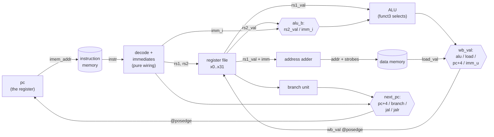
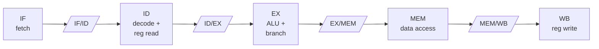

# 08 — Build a CPU: single-cycle RISC-V

> The fetch–decode–execute loop, made of wires: a complete RV32I processor
> in ~250 lines of Verilog that runs real RISC-V machine code — assembled,
> executed, and checked entirely in your simulator.

A CPU has a reputation problem. It sits at the top of the computing food
chain, it has "central" in its name, and whole textbooks approach it the
way climbers approach a mountain. Here is the demystifying truth: a CPU is
the fetch–decode–execute loop you learned as a diagram, implemented as a
circuit. Fetch is a memory read addressed by a register called `pc`.
Decode is wire slicing. Execute is the ALU you built in chapter
[07](07-building-blocks.md). Write-back is the register file from chapter
[06](06-memory.md). The "loop" is just the clock.

You already own every organ this machine needs. You can read and write
Verilog ([03](03-verilog-crash-course.md)), you trust nothing without a
self-checking testbench ([04](04-simulation-and-testbenches.md)), you know
state lives in flip-flops and changes only on clock edges
([05](05-sequential-logic-and-fsms.md)), you've built register files and
RAMs ([06](06-memory.md)) and ALUs ([07](07-building-blocks.md)). This
chapter stitches them together. If you skipped any of 03–07, go back;
if you've done them all, chapters 08, 09 and 10 are deliberately
independent — you can read the CPU, [GPU](09-build-a-gpu.md) and
[TPU](10-build-a-tpu.md) chapters in any order.

The working design lives in [`src/05-cpu-rv32i/`](../src/05-cpu-rv32i/):
the CPU ([`cpu.v`](../src/05-cpu-rv32i/cpu.v)), a testbench that wraps it
in a tiny system ([`tb_cpu.v`](../src/05-cpu-rv32i/tb_cpu.v)), a test
program ([`test.s`](../src/05-cpu-rv32i/test.s)), and a ~200-line Python
assembler ([`asm.py`](../src/05-cpu-rv32i/asm.py)) so that no toolchain
installation stands between you and running machine code.

## Why RISC-V

Building a CPU means picking an instruction set, and the choice matters
more than it looks:

- **RISC-V is an open standard.** The ISA specification is freely
  published and anyone may implement it — no license to negotiate, no NDA,
  no vendor to ask. Implementing x86 or Arm from the manuals is, to put it
  gently, a legal adventure. Implementing RISC-V is a weekend.
- **The encodings were designed for cheap decoders.** RISC-V is a young
  ISA designed by people who had watched forty years of instruction sets
  accumulate barnacles. Register fields never move between formats, the
  immediate's sign bit is always in the same place, and there are exactly
  six formats. You will see below that our entire decoder is wires —
  literally zero gates of decode logic before the control mux.
- **A real toolchain exists.** GCC, LLVM, GDB, Linux — all upstream. The
  same ISA your 250-line core runs is the one a datacenter core runs, so
  everything you learn transfers, and one day you can feed your core
  compiler output (end of this chapter).
- **Industry momentum.** RISC-V cores ship in real silicon today — from
  microcontrollers to accelerator control processors — which means the
  documentation, cores, and community you can learn from keep growing.

Within RISC-V we implement **RV32I**: the 32-bit base integer ISA. It has
about 40 instructions — the exact count depends on how you tally FENCE and
ECALL/EBREAK — and it is complete in the way that matters: integer
arithmetic, logic, shifts, comparisons, loads and stores of three widths,
conditional branches, and function calls. Everything a working computer
needs; everything else (multiply, atomics, floating point, compressed
encodings) is an optional extension letter you can add later. Our core
implements all of RV32I except FENCE (a no-op here) and the CSR
instructions; ECALL/EBREAK halt the machine, which is exactly the exit
contract our testbench wants.

## RV32I in one sitting

**Registers.** 32 general-purpose registers, `x0`–`x31`, each 32 bits.
`x0` is hardwired to zero: writes to it vanish, reads always return 0.
That one weird rule buys a surprising amount — `mv rd, rs` is
`addi rd, rs, 0`, `nop` is `addi x0, x0, 0`, "compare with zero" needs no
special instruction. You built exactly this register file in chapter
[06](06-memory.md); `cpu.v` inlines the same pattern:

```verilog
    reg [31:0] regs [0:31];

    wire [31:0] rs1_val = (rs1 == 5'd0) ? 32'd0 : regs[rs1];
    wire [31:0] rs2_val = (rs2 == 5'd0) ? 32'd0 : regs[rs2];
```

The assembler also accepts the standard ABI names (`zero`, `ra`, `sp`,
`t0`, `a0`, ...) — they are pure convention, aliases the hardware never
sees.

**Formats.** Every RV32I instruction is one 32-bit word in one of six
formats. Read this table top to bottom and notice what *doesn't* change:
`opcode` is always bits 6–0, `rd` always 11–7, `funct3` always 14–12,
`rs1` always 19–15, `rs2` always 24–20.

| Format | 31–25 | 24–20 | 19–15 | 14–12 | 11–7 | 6–0 | Example |
| --- | --- | --- | --- | --- | --- | --- | --- |
| **R** | funct7 | rs2 | rs1 | funct3 | rd | opcode | `add rd, rs1, rs2` |
| **I** | imm[11:5] | imm[4:0] | rs1 | funct3 | rd | opcode | `addi rd, rs1, imm` |
| **S** | imm[11:5] | rs2 | rs1 | funct3 | imm[4:0] | opcode | `sw rs2, imm(rs1)` |
| **B** | imm[12\|10:5] | rs2 | rs1 | funct3 | imm[4:1\|11] | opcode | `beq rs1, rs2, offset` |
| **U** | imm[31:12] *(spans 31–12)* | — | — | — | rd | opcode | `lui rd, imm` |
| **J** | imm[20\|10:1\|11\|19:12] *(spans 31–12)* | — | — | — | rd | opcode | `jal rd, offset` |

(The I-format immediate is one contiguous field, `instr[31:20]`; the table
splits it across two columns only because the columns exist.)

**Instruction classes**, and which format carries each:

| Class | Format | Instructions | Notes |
| --- | --- | --- | --- |
| Register–register | R | ADD SUB SLL SLT SLTU XOR SRL SRA OR AND | funct3 picks the op; funct7 bit 5 splits ADD/SUB and SRL/SRA |
| Register–immediate | I | ADDI SLTI SLTIU XORI ORI ANDI SLLI SRLI SRAI | same ALU, immediate as operand B |
| Loads | I | LB LH LW LBU LHU | funct3 encodes width + sign/zero extension |
| Stores | S | SB SH SW | byte, halfword, word |
| Branches | B | BEQ BNE BLT BGE BLTU BGEU | PC-relative, ±4 KiB reach |
| Jumps | J / I | JAL, JALR | write `pc+4` to rd (the return address) |
| Upper immediate | U | LUI, AUIPC | build 32-bit constants / PC-relative addresses |
| System | I | ECALL, EBREAK, FENCE | on this core: halt, halt, no-op |

Two conventions worth internalizing: loads and stores are the *only*
instructions that touch data memory (this is the "load–store architecture"
part of RISC), and there is no dedicated call/return — `jal ra, target`
is a call because it saves `pc+4` into `ra`, and `ret` is just
`jalr x0, 0(ra)`.

## The immediate bit-scramble, and why it is brilliant

Look at the B-format immediate in the table above: `imm[12|10:5]` in one
field, `imm[4:1|11]` in another. First reaction: who hurt these people?
Second reaction, after you write the decoder: oh. *Oh.* This is the single
best design lesson in the ISA.

Here is our entire immediate generator — all five formats, sign-extension
included:

```verilog
    // one immediate per instruction format, all sign-extended
    wire [31:0] imm_i = {{20{instr[31]}}, instr[31:20]};
    wire [31:0] imm_s = {{20{instr[31]}}, instr[31:25], instr[11:7]};
    wire [31:0] imm_b = {{19{instr[31]}}, instr[31], instr[7],
                         instr[30:25], instr[11:8], 1'b0};
    wire [31:0] imm_u = {instr[31:12], 12'b0};
    wire [31:0] imm_j = {{11{instr[31]}}, instr[31], instr[19:12],
                         instr[20], instr[30:21], 1'b0};
```

Count the gates: **zero**. Concatenation is routing. Replication
(`{{20{instr[31]}}}`) is one wire fanned out to twenty loads. These five
"computations" cost literally nothing but metal — and that is not luck,
it is the whole point of the scramble:

- **The sign bit is always `instr[31]`.** Every immediate, every format.
  Sign extension — the widest fan-out in the immediate path — never waits
  on a mux to figure out which bit is the sign. It's always the same wire.
- **Fields stay put across formats.** S-format exists (instead of stores
  reusing I-format) precisely so `rs2` never moves from bits 24–20 —
  the immediate splits in half instead. B-format then reuses S-format's
  two immediate fields nearly bit-for-bit: it needs no `imm[0]` (branch
  targets are always even), so the spec keeps `imm[10:5]` and `imm[4:1]`
  exactly where S puts them and repurposes the two leftover end positions
  for `imm[12]` and `imm[11]`. J-format plays the same trick on U-format.
  The result: each bit of the assembled immediate comes from one of at
  most two instruction bits, so even the *mux* that picks between these
  five words is nearly free.

Software people pay this cost once, in the assembler (you'll see the
mirror-image scramble in `asm.py` below). Hardware pays it never, on every
instruction, forever. That trade is the RISC philosophy in one anecdote.

## The single-cycle datapath

Now the machine itself. In a **single-cycle** CPU, each instruction
completes in exactly one clock cycle. On the rising edge the PC takes a
new value; the instruction word falls out of instruction memory; decode,
register read, ALU, data memory access and the write-back mux all settle
as one long combinational wave; and at the *next* rising edge the results
— next PC, one register write, at most one memory write — are captured.
Repeat forever.



This is the "Patterson & Hennessy chapter 4" machine, the one every
computer architecture course starts from — because once you can point at
every wire in it, pipelines, superscalar issue, and out-of-order execution
are all refinements of *this*.

The single-cycle contract deserves stating precisely, because everything
in `cpu.v` follows from it: **between clock edges, the design is one
combinational expression of `pc`, the register file, and memory.** No
intermediate state, no FSM, no "phase 2". The final `always` block in
`cpu.v` is the whole proof:

```verilog
    // ------------------------------------------------- the state update
    // The ONLY things that change on a clock edge: pc, one register,
    // (and, over in the memory, the stored word).
    always @(posedge clk) begin
        if (rst) begin
            pc     <= 32'd0;
            halted <= 1'b0;
        end else if (!halted) begin
            if (is_halt)
                halted <= 1'b1;
            else begin
                pc <= next_pc;
                if (wb_en && rd != 5'd0)
                    regs[rd] <= wb_val;
            end
        end
    end
```

Everything above this block in the file — some 170 lines — is
combinational. Everything. If you take one structural idea away from this
chapter, take that one: *a CPU is a small amount of state and a large
pure function from state to next-state.*

## Walking the machine, block by block

### Decode: zero gates, all wires

Fetch is two lines (`assign imem_addr = pc;` and
`wire [31:0] instr = imem_rdata;`), and decode is barely more:

```verilog
    wire [6:0] opcode = instr[6:0];
    wire [4:0] rd     = instr[11:7];
    wire [2:0] funct3 = instr[14:12];
    wire [4:0] rs1    = instr[19:15];
    wire [4:0] rs2    = instr[24:20];
    wire [6:0] funct7 = instr[31:25];
```

Pure slicing — this is the payoff of the format regularity in the table
above. `rs1` and `rs2` feed the register file's read ports directly, with
no logic in between, for every instruction, even ones that don't use them
(reading a register you ignore costs nothing). The eleven opcodes get
named `localparam`s (`OPC_LUI`, `OPC_BRANCH`, ...) and that's the entire
front end.

### The ALU, embedded

Chapter [07](07-building-blocks.md)'s standalone `alu.v` invented its own
4-bit op encoding and promised that chapter 08 would show the real
mapping. Here it is — and it turns out RISC-V's `funct3` *is* the op
select, almost directly:

```verilog
    wire [31:0] alu_a = rs1_val;
    wire [31:0] alu_b = is_op ? rs2_val : imm_i;
    wire [4:0]  shamt = alu_b[4:0];
```

One mux decides whether operand B is a register (R-type, `OPC_OP`) or the
I-immediate (`OPC_OPIMM`) — that single wire is why ADD and ADDI, XOR and
XORI, and every other pair cost one ALU, not two. Then:

```verilog
    reg [31:0] alu_out;
    always @* begin
        case (funct3)
            3'b000: alu_out = (is_op && funct7[5]) ? alu_a - alu_b
                                                   : alu_a + alu_b;
            3'b001: alu_out = alu_a << shamt;                          // SLL(I)
            3'b010: alu_out = ($signed(alu_a) < $signed(alu_b)) ? 32'd1 : 32'd0;
            3'b011: alu_out = (alu_a < alu_b) ? 32'd1 : 32'd0;         // SLTU
            3'b100: alu_out = alu_a ^ alu_b;
            3'b101: alu_out = funct7[5] ? sra_result                   // SRA(I)
                                        : (alu_a >> shamt);            // SRL(I)
            3'b110: alu_out = alu_a | alu_b;
            3'b111: alu_out = alu_a & alu_b;
        endcase
    end
```

The subtle line is the first one. `funct3 == 000` is both ADD and SUB,
distinguished by `funct7[5]` (which is `instr[30]`) — but **only for
R-type**. For ADDI, bit 30 isn't a function code at all: it is bit 10 of
the immediate. `addi x15, x0, -64` has that bit set; a decoder that
checked `funct7[5]` without the `is_op` guard would silently turn
negative-immediate ADDIs into subtractions. There is no SUBI in RISC-V
(you write `addi` with a negative immediate — that's the point).

And yet three lines down, `funct7[5]` is checked *without* the `is_op`
guard for the shifts. Also correct: SLLI/SRLI/SRAI only need 5 bits of
immediate for the shift amount, so the spec defines the upper immediate
bits as a real funct7 field even in the I-format encoding. Same bit,
`instr[30]`; three different meanings depending on opcode and funct3.
Decoders are where ISAs confess their sins — RV32I's confession is
mercifully short.

(That `sra_result` wire instead of an inline expression? That's a story.
It gets its own section below.)

### The branch unit

Branches don't reuse the ALU here; six comparators evaluate in parallel
and `funct3` picks one:

```verilog
    reg branch_taken;
    always @* begin
        case (funct3)
            3'b000:  branch_taken = (rs1_val == rs2_val);                        // BEQ
            3'b001:  branch_taken = (rs1_val != rs2_val);                        // BNE
            3'b100:  branch_taken = ($signed(rs1_val) <  $signed(rs2_val));      // BLT
            3'b101:  branch_taken = ($signed(rs1_val) >= $signed(rs2_val));      // BGE
            3'b110:  branch_taken = (rs1_val <  rs2_val);                        // BLTU
            3'b111:  branch_taken = (rs1_val >= rs2_val);                        // BGEU
            default: branch_taken = 1'b0;
        endcase
    end
```

Note the signed/unsigned pairs — BLT vs BLTU is exactly the SLT vs SLTU
distinction from the ALU, and getting them confused is a classic CPU bug
(the test program's "branch gauntlet" exists to catch it). Note also the
`default:` arm: `funct3` values `010`/`011` are illegal for branches, and
covering them keeps the mux a mux instead of an accidental latch — chapter
[03](03-verilog-crash-course.md)'s oldest trap.

### Loads and stores: the alignment machinery

The memory bus is word-wide with **byte strobes**: `dmem_wstrb` has one
bit per byte lane, and the memory writes only the lanes whose strobe is
high. This is the standard idiom (you'll meet it again in every SoC bus
from Wishbone to AXI), and it's how a 32-bit memory supports `sb` and
`sh` without read-modify-write.

The address comes from a dedicated adder — this teaching core spends a
second 32-bit adder rather than muxing the job onto the ALU, one small
honesty about how cheap adders are:

```verilog
    wire [31:0] mem_addr = rs1_val + (is_store ? imm_s : imm_i);
```

Stores replicate the data across the word so that whichever lanes the
address selects are already carrying the right bytes, then raise only
those strobes:

```verilog
    reg [31:0] st_data;
    reg [3:0]  st_strb;
    always @* begin
        case (funct3[1:0])
            2'b00: begin                                   // SB
                st_data = {4{rs2_val[7:0]}};
                st_strb = 4'b0001 << mem_addr[1:0];
            end
            2'b01: begin                                   // SH
                st_data = {2{rs2_val[15:0]}};
                st_strb = mem_addr[1] ? 4'b1100 : 4'b0011;
            end
            default: begin                                 // SW
                st_data = rs2_val;
                st_strb = 4'b1111;
            end
        endcase
    end
```

Trace `sb x6, 4(x5)` with `x5 = 0x100`: address `0x104`, so
`mem_addr[1:0] = 00`, strobe `0001`, and lane 0 of the replicated word
carries `x6[7:0]`. Now trace an `sb` to `0x105` — strobe `0010`, and the
replication means lane 1 *also* already holds the byte. No shifter needed.

Loads run the machinery in reverse: pick the addressed byte or halfword
out of the returned word, then sign- or zero-extend according to `funct3`
(bit 2 of funct3 is the "unsigned" flag: LB vs LBU, LH vs LHU). Here is
the LB quarter of it:

```verilog
            3'b000: case (mem_addr[1:0])                   // LB
                2'b00: load_val = {{24{dmem_rdata[7]}},  dmem_rdata[7:0]};
                2'b01: load_val = {{24{dmem_rdata[15]}}, dmem_rdata[15:8]};
                2'b10: load_val = {{24{dmem_rdata[23]}}, dmem_rdata[23:16]};
                2'b11: load_val = {{24{dmem_rdata[31]}}, dmem_rdata[31:24]};
            endcase
```

Same replication trick as the immediates: `{{24{dmem_rdata[7]}}, ...}` is
sign extension as pure wiring. The full `load_val` block in
[`cpu.v`](../src/05-cpu-rv32i/cpu.v) handles all five load flavors in
~20 lines.

### Next PC and write-back: every opcode in one place

If the ALU is the muscle, this mux is the personality. One combinational
block decides, per opcode, what gets written back and where the PC goes
next — read it and you have read the instruction set:

```verilog
    reg [31:0] next_pc;
    reg [31:0] wb_val;
    reg        wb_en;
    always @* begin
        next_pc = pc_plus4;
        wb_val  = 32'd0;
        wb_en   = 1'b0;
        case (opcode)
            OPC_LUI:    begin wb_val = imm_u;         wb_en = 1'b1; end
            OPC_AUIPC:  begin wb_val = pc + imm_u;    wb_en = 1'b1; end
            OPC_JAL:    begin wb_val = pc_plus4;      wb_en = 1'b1;
                              next_pc = pc + imm_j;                 end
            OPC_JALR:   begin wb_val = pc_plus4;      wb_en = 1'b1;
                              next_pc = (rs1_val + imm_i) & ~32'd1; end
            OPC_BRANCH: if (branch_taken) next_pc = pc + imm_b;
            OPC_LOAD:   begin wb_val = load_val;      wb_en = 1'b1; end
            OPC_OPIMM,
            OPC_OP:     begin wb_val = alu_out;       wb_en = 1'b1; end
            OPC_FENCE:  ;                     // no-op on this machine
            default:    ;
        endcase
    end
```

Everything you know about calling conventions is visible here in
hardware: JAL and JALR write `pc_plus4` to `rd` — that *is* the return
address, and `ret` works because JALR then reads it back through `rs1`.
The `& ~32'd1` on the JALR target is straight from the spec: the computed
address gets its lowest bit cleared, so a return address with a stray
bit 0 can't ever produce a misaligned PC. Branches write back nothing
(`wb_en` stays 0). The defaults at the top make "do nothing special" the
fall-through behavior — and make it impossible for a forgotten case to
infer a latch.

## The bug the testbench caught

> **War story.** The first version of this CPU computed SRAI wrong, and it
> is worth a whole section because the *kind* of wrongness is one you will
> meet again.
>
> The ALU's shift-right line was originally written the obvious way,
> inline:
>
> ```verilog
> 3'b101: alu_out = funct7[5] ? ($signed(alu_a) >>> shamt)   // looks right
>                             : (alu_a >> shamt);            // is wrong
> ```
>
> It compiles. It simulates. It even shifts. And the very first run of the
> test program said:
>
> ```text
> FAIL: mem[0x00000118] = 0x0fffffbc, expected 0xfffffffc
> ```
>
> — well, close to that; the failing value was `0x0FFFFFFC`. The program
> computes `-64 >>> 4` with `srai x16, x15, 4` and expects `-4`
> (`0xFFFFFFFC`). It got `0x0FFFFFFC`: the *logical* shift of `0xFFFFFFC0`.
> The `$signed` was sitting right there, the `>>>` was sitting right there,
> and the shift came out unsigned anyway.
>
> The cause is Verilog's expression-signedness rule, the one chapter
> [03](03-verilog-crash-course.md) warned you about in the abstract: in a
> context-determined expression, **if any operand is unsigned, the whole
> expression is evaluated as unsigned** — and that determination flows back
> *down* into the operands. The two arms of a ternary are context-determined
> operands of the ternary. `alu_a >> shamt` is unsigned, so the entire
> conditional expression is unsigned, so the `$signed(alu_a) >>> shamt` arm
> is *re-interpreted* as unsigned before it evaluates, and `>>>` on an
> unsigned value is just `>>`. Your explicit `$signed()` cast is silently
> overruled by an operand you thought was on the other side of a mux.
>
> The fix that's in [`cpu.v`](../src/05-cpu-rv32i/cpu.v) today: give the
> arithmetic shift its own signed wire, so the signed evaluation happens in
> its own assignment context, finished, before any unsigned neighbor can
> contaminate it:
>
> ```verilog
>     // Verilog gotcha: if $signed(alu_a) >>> shamt is written inline in the
>     // ternary below, the unsigned other arm makes the WHOLE expression
>     // unsigned and the shift silently becomes logical. Computing it on its
>     // own signed wire sidesteps that. (Found by the testbench — see the
>     // guide's chapter 08 war-story box.)
>     wire signed [31:0] sra_result = $signed(alu_a) >>> shamt;
> ```
>
> Once `sra_result` holds the correct bits, the ternary can reinterpret
> them as unsigned all it likes — reinterpretation doesn't change bits,
> only arithmetic done *within* the expression.
>
> Two morals. First: Verilog's signedness rules are genuinely treacherous —
> not "be careful" treacherous, but "the cast you can see loses to a rule
> you can't" treacherous. When you need signed arithmetic, compute it in a
> dedicated `wire signed` and let nothing else into that expression.
> Second, and bigger: **a code review would probably have blessed the inline
> version.** It reads correctly. The self-checking testbench caught it on
> the first run, because `test.s` happens to shift a negative number and
> `tb_cpu.v` checks the answer. That is chapter
> [04](04-simulation-and-testbenches.md)'s sermon paying off: tests don't
> check that your code looks right, they check that it *is* right, and the
> gap between those two is where real bugs live.

## Running real machine code

A CPU with no program is a space heater. The usual way to get RISC-V
machine code is the GNU toolchain — but this guide promised zero
installs beyond a simulator, so the repo includes
[`asm.py`](../src/05-cpu-rv32i/asm.py): a ~200-line, zero-dependency,
two-pass RV32I assembler. Pass one collects labels and assigns addresses;
pass two encodes. It knows the instructions our CPU implements, `x0`–`x31`
plus ABI register names, decimal/hex immediates, comments, and five
pseudo-instructions (`nop`, `li`, `mv`, `j`, `ret`). It is deliberately
*not* a real assembler — no sections, no relocations, blunt errors — 
because its job is to be small enough to read. The encoders are the
immediate scramble from the hardware's mirror universe; here is B-format,
software's half of the bargain:

```python
def enc_b(v, rs2, rs1, f3, opc):
    v = fit(v, 13)
    return (((v >> 12) & 1) << 31) | (((v >> 5) & 0x3F) << 25) | \
           (rs2 << 20) | (rs1 << 15) | (f3 << 12) | \
           (((v >> 1) & 0xF) << 8) | (((v >> 11) & 1) << 7) | opc
```

Compare it bit for bit with the `imm_b` wire earlier — same scramble,
opposite direction, and only one of the two runs on every instruction.

The program it assembles, [`test.s`](../src/05-cpu-rv32i/test.s), is both
a demo and the CPU's acceptance test. It opens with its own contract:

```asm
# Expected memory contents when the CPU halts:
#   0x100 = 55          (fib(10))
#   0x104 = 0x0000007A  (byte store)
#   0x108 = 0x0000FFFE  (halfword store)
#   0x10C = 0x00000078  (lbu + lh arithmetic)
#   0x110 = 99          (value set inside a called function)
#   0x114 = 32          (slti + sll)
#   0x118 = 0xFFFFFFFC  (arithmetic shift right of -64 by 4)
#   0x11C = 0x000ABCDE  (lui + srli)
#   0x120 = 1           (branch gauntlet survived)
```

and then earns each line: an iterative Fibonacci loop (real control flow —
a backward branch taken ten times):

```asm
fib_loop:
    beq  x1, x0, fib_done
    add  x4, x2, x3         # t = a + b
    mv   x2, x3             # a = b
    mv   x3, x4             # b = t
    addi x1, x1, -1
    j    fib_loop
fib_done:
    sw   x2, 0(x5)          # mem[0x100] = 55
```

then every store width and both load extensions (`sb`/`sh`/`lbu`/`lh`,
proving the strobe and sign-extension machinery), a function call and
return through JAL/JALR, shifts and comparisons (including the SRAI that
caught the war-story bug), and the **branch gauntlet** — five branches
chosen so that exactly one signed/unsigned confusion, anywhere, changes
the result:

```asm
    addi x21, x0, 0
    addi x20, x0, -1        # 0xFFFFFFFF
    bltu x0, x20, g1        # unsigned: 0 < 0xFFFFFFFF, taken
    addi x21, x0, 111       # must be skipped
g1: blt  x20, x0, g2        # signed: -1 < 0, taken
    addi x21, x0, 222       # must be skipped
g2: bge  x0, x20, g3        # signed: 0 >= -1, taken
    addi x21, x0, 333       # must be skipped
g3: bgeu x0, x20, g4        # unsigned: 0 >= 0xFFFFFFFF is FALSE, not taken
    addi x21, x21, 1        # runs once (the fall-through is the right path)
g4: bne  x21, x0, g5        # x21 = 1 != 0, taken
    addi x21, x0, 444       # must be skipped
g5: sw   x21, 32(x5)        # mem[0x120] = 1
```

`x21` must end up exactly 1: every wrongly-taken branch plants a poison
value, and the one branch that must *fall through* (`bgeu 0, -1` is false
unsigned) is the only path to the `+1`. Then `ebreak` halts the machine
and hands control to the testbench, which checks every promised word.

Run it:

```console
$ cd src && make 05-cpu-rv32i
cd 05-cpu-rv32i && python3 asm.py test.s program.hex
assembled 47 instructions -> program.hex

==== 05-cpu-rv32i ====
CPU halted after 98 cycles
  ok: mem[0x00000100] = 0x00000037
  ok: mem[0x00000104] = 0x0000007a
  ok: mem[0x00000108] = 0x0000fffe
  ok: mem[0x0000010c] = 0x00000078
  ok: mem[0x00000110] = 0x00000063
  ok: mem[0x00000114] = 0x00000020
  ok: mem[0x00000118] = 0xfffffffc
  ok: mem[0x0000011c] = 0x000abcde
  ok: mem[0x00000120] = 0x00000001
ALL TESTS PASSED
```

47 instructions, 98 cycles — one instruction per cycle, with the loop
iterations doing the multiplication. (`0x37` is 55, `0x63` is 99; the
`$readmemh` "not enough words" warning you'll also see is expected — the
program is much shorter than the memory it loads into.) Then open
`cpu.vcd` in GTKWave or Surfer, put `pc`, `instr`, `x21` and
`branch_taken` on screen, and *watch the gauntlet run*. Single-cycle CPUs
are glorious in a waveform viewer: every instruction is one vertical
slice.

Then write your own program. Edit `test.s` (or start fresh), keep the
convention of storing results from `0x100` and ending with `ebreak`,
adjust the `check_word` calls in `tb_cpu.v` to match your program's
promises, and `make 05-cpu-rv32i` again. You now have a full
edit-assemble-execute-verify loop for a computer you built.

## The testbench is a tiny SoC (and a small lie)

[`tb_cpu.v`](../src/05-cpu-rv32i/tb_cpu.v) is more than a test harness —
it is the *system* around the processor: instruction ROM, data RAM, and a
power button. That makes it a single-file preview of what "SoC" means.

The memories are plain Verilog arrays with combinational reads, and the
data RAM implements exactly the byte-strobe contract the CPU emits:

```verilog
    // 16 KiB each, word-organised
    reg [31:0] imem [0:4095];
    reg [31:0] dmem [0:4095];

    wire [31:0] imem_rdata = imem[imem_addr[13:2]];
    wire [31:0] dmem_rdata = dmem[dmem_addr[13:2]];

    // byte-lane writes, exactly what dmem_wstrb encodes
    always @(posedge clk) begin
        if (dmem_wstrb[0]) dmem[dmem_addr[13:2]][7:0]   <= dmem_wdata[7:0];
        if (dmem_wstrb[1]) dmem[dmem_addr[13:2]][15:8]  <= dmem_wdata[15:8];
        if (dmem_wstrb[2]) dmem[dmem_addr[13:2]][23:16] <= dmem_wdata[23:16];
        if (dmem_wstrb[3]) dmem[dmem_addr[13:2]][31:24] <= dmem_wdata[31:24];
    end
```

The run protocol is the pattern from chapter
[04](04-simulation-and-testbenches.md) grown up: load `program.hex` with
`$readmemh`, hold reset two cycles, then spin until the CPU raises
`halted` — with a watchdog, because a CPU bug that eats the PC must fail
the test, not hang your terminal:

```verilog
        // run until EBREAK, with a watchdog so a broken CPU can't hang us
        cycles = 0;
        while (!halted && cycles < 10000) begin
            @(posedge clk); #1;
            cycles = cycles + 1;
        end
```

`EBREAK → halted` is the exit contract: the program signals completion in
architecture (a latched output), not in some simulator back-channel, which
is exactly how you'd detect completion on real hardware too.

Now the confession. Those combinational-read memories — address in,
data out, same cycle — are a **teaching fiction**. Chapter
[06](06-memory.md) was emphatic about this: real block RAM has a
*registered* read port; you get your data the cycle *after* you present
the address, full stop. Small distributed-LUT memories can read
combinationally (that's why the register file is fine), but a 16 KiB
instruction memory cannot, not at any clock speed worth having. Which
means a single-cycle CPU with memories like these is a machine that can
exist in simulation and on paper, but not at speed in silicon. The fix
for that is not a footnote — it is the entire next section.

## Why real CPUs pipeline

Look at what must happen, in series, inside one clock period of our
machine: instruction memory read → decode (cheap) → register file read →
ALU (a 32-bit subtract or a shifter — not cheap) → data memory read → 
write-back mux → setup time at the register file. The clock can tick no
faster than the *sum* of all of that. That sum is the **critical path**,
and its reciprocal is your Fmax. Chapter
[11](11-synthesis-without-hardware.md) will push this exact CPU through
Yosys and nextpnr and put a real number on it — the point here is the
shape of the problem: in a single-cycle machine, the slowest instruction's
full journey sets the pace for *every* instruction, and most of the
hardware sits idle most of the time (the ALU is done long before the
write-back edge; the fetch logic finished ages ago).

The classic answer: cut the journey into stages with registers between
them, and keep every stage busy with a *different* instruction:



Five instructions in flight at once; the clock period shrinks to the
slowest *stage* instead of the whole path; and — the beautiful accident —
the BRAM read latency that made single-cycle impossible becomes *free*,
because IF and MEM are now allowed a full cycle for their memory access.
Pipelining and synchronous memory aren't just compatible, they're made
for each other. This is chapter [07](07-building-blocks.md)'s pipelining
trick applied to the whole processor.

Nothing is free, of course. Overlapping instructions creates **hazards**,
and pipelined CPU design is mostly hazard plumbing:

- **Data hazards.** `add x3, x1, x2` followed by `sub x5, x3, x4`: the
  `sub` reads `x3` in ID while the `add`'s result is still two stages from
  the register file. Waiting works but wastes the whole point;
  the real fix is **forwarding** — wires from the EX/MEM and MEM/WB
  registers straight back into the ALU inputs, plus comparators that
  notice "the value you want is right here." One case can't be forwarded
  away: a load followed immediately by a use of its result (the
  **load-use hazard**) must stall one cycle, because the data doesn't
  exist until MEM ends.
- **Control hazards.** A taken branch is resolved in EX, but by then two
  younger instructions are already in IF and ID. Either **flush** them
  (turn them into bubbles — the branch now effectively costs three
  cycles) or **predict** the branch and flush only when wrong. Real cores
  bet heavily on prediction; modern predictors are right well over 90% of
  the time, which is why deep pipelines are survivable at all.
- **Structural hazards.** Two stages want the same resource at once — the
  classic being IF and MEM both wanting a single memory port every cycle.
  Answer: separate instruction and data ports or caches (notice our CPU's
  interface *already* has separate imem/dmem buses — that wasn't an
  accident, it was pipeline foreshadowing).

This chapter explains pipelining but deliberately doesn't implement it —
that is the capstone exercise, and the best one in the guide. Also worth
knowing: pipelining is not the only escape from the single-cycle trap.
A **multi-cycle** core takes several cycles per instruction with a small
FSM and *one* memory port, trading speed for size —
[picorv32](https://github.com/YosysHQ/picorv32) is the famous example,
averaging a few cycles per instruction yet tiny and very Fmax-friendly,
which is why it turns up inside so many FPGA projects. At the other end,
[VexRiscv](https://github.com/SpinalHDL/VexRiscv) is a genuinely pipelined
open RV32 core with its pipeline assembled from plugins — readable proof
that everything in this section is real, shipping engineering. And Bruno
Levy's [learn-fpga](https://github.com/BrunoLevy/learn-fpga) ("From
Blinker to RISC-V") builds a RISC-V core step by tiny step, and is the
single best companion to this chapter if you want a second walkthrough at
a gentler gradient.

## Going further

**Run compiled C.** Your CPU speaks RV32I; so does GCC. Install a RISC-V
cross-compiler — the xPack `riscv-none-elf-gcc` binary releases are the
least-friction route, and Homebrew/apt have RISC-V GCC packages under
names that shift around (search for `riscv-gnu-toolchain` or
`riscv64-elf-gcc`; the 64-bit-named ones can target 32-bit with flags).
Then the pipeline is, in outline:

1. compile freestanding: `-march=rv32i -mabi=ilp32 -nostdlib
   -nostartfiles`, with a linker script (or `-Ttext=0`) that puts code at
   address 0 where our PC resets to;
2. a tiny `crt0.s` that sets up `sp` and calls `main`, with `ebreak` on
   return;
3. `objcopy -O binary` to flatten the ELF, then a ten-line Python script
   to turn the binary into one 32-bit little-endian hex word per line for
   `$readmemh` — the same format `asm.py` emits.

Details vary by toolchain version, so treat that as a map rather than a
script — but everything on the path is standard, and the day `printf`
(well, a `putchar` you memory-mapped yourself) runs on your own CPU is a
very good day.

**Validate seriously.** `test.s` is a smoke test with good instincts, not
a compliance suite. The official
[riscv-tests](https://github.com/riscv-software-src/riscv-tests)
repository holds per-instruction test programs used to check real
implementations; porting your testbench to run them (they signal
pass/fail through a memory location, much like our contract at `0x100`)
is the difference between "my tests pass" and "the ISA's tests pass."

**The missing 20%.** What separates this core from one that boots an OS
is not more arithmetic — it's the privileged architecture: **CSRs**
(control and status registers — cycle counters, trap configuration),
**exceptions** (an illegal instruction or misaligned access must trap to
a handler, not silently do *something*, which is what ours does), and
**interrupts** (a timer that can yank the PC away is the seed of every
scheduler). Our core's ECALL-means-halt is a placeholder for precisely
this machinery. The specifications for all of it are on the
[RISC-V specifications page](https://riscv.org/technical/specifications/)
— the unprivileged spec you've been implementing, and the privileged spec
waiting for you.

## Exercises

1. **Retired-instruction counter.** Add a 32-bit `instret` register that
   increments on every executed instruction, and have the testbench
   `$display` it at halt alongside the cycle count. On this machine
   cycles ≈ instructions + reset overhead — confirm it, then keep the
   counter: after exercise 6 the two numbers diverge, and their ratio
   (CPI) is *the* pipeline scorecard.
2. **Branch statistics.** Count taken and not-taken branches (a
   `$display` at halt, or two counters like exercise 1). Check the
   numbers against a hand-count of `test.s` — the fib loop alone should
   contribute 10 not-taken `beq`s, one taken, and 10 taken `j`s.
3. **Implement MUL.** The M-extension's MUL is R-type, opcode `OP`,
   `funct7 = 0000001`, `funct3 = 000`. Decode it, add `alu_a * alu_b`,
   extend `asm.py` with the mnemonic, and rewrite `test.s`'s Fibonacci as
   a factorial. Then recall chapter [07](07-building-blocks.md): that `*`
   is the one operator in this whole CPU that would claim a DSP slice.
4. **Memory-map the UART.** Take chapter [05](05-sequential-logic-and-fsms.md)'s
   `uart_tx`, instantiate it in the testbench, and decode stores to some
   address (say `0x400`) as "write this byte to the UART" instead of to
   RAM. Print `hi` from assembly. Congratulations: you have invented
   memory-mapped I/O, which is how *every* peripheral you've ever used is
   attached.
5. **Make the data memory honest.** Convert `dmem` to the registered-read
   BRAM pattern from chapter [06](06-memory.md) and make loads take two
   cycles: the CPU must hold the PC (a one-cycle stall) whenever a load
   is in flight. You are implementing your first hazard by hand — and
   deleting half of the teaching fiction.
6. **Capstone: pipeline it.** Split the core into 3 stages
   (fetch / execute / write-back) or the full 5, with forwarding and a
   load-use stall — or, gentler, start by predicting branches
   not-taken and flushing on taken. The acceptance criterion is
   beautiful: `test.s` and `tb_cpu.v` don't change. Same program, same
   checks, same `ALL TESTS PASSED` — different machine underneath. That
   invariance is exactly what an ISA is *for*.

## Further reading

- [RISC-V specifications](https://riscv.org/technical/specifications/) —
  the unprivileged ISA spec is genuinely readable; chapter 2 (RV32I) plus
  the instruction-listing tables cover everything this CPU does.
- Harris & Harris, *Digital Design and Computer Architecture* (RISC-V
  edition) — the single-cycle → multi-cycle → pipelined progression in
  full detail; the best book companion to this chapter. Patterson &
  Hennessy's *Computer Organization and Design* (RISC-V edition) is the
  classic alternative.
- [learn-fpga — "From Blinker to RISC-V"](https://github.com/BrunoLevy/learn-fpga)
  — builds a RISC-V core in tiny, well-explained increments; the
  recommended second pass over this material.
- [picorv32](https://github.com/YosysHQ/picorv32) — Claire Wolf's
  size-optimized multi-cycle RV32 core; read it to see the *other* corner
  of the design space.
- [VexRiscv](https://github.com/SpinalHDL/VexRiscv) — a plugin-composed,
  genuinely pipelined open RV32 core; read it to see the corner this
  chapter only described.
- [riscv-tests](https://github.com/riscv-software-src/riscv-tests) — the
  official per-instruction test programs, when you want validation beyond
  `test.s`.

---

*Next: [Chapter 09 — Build a GPU](09-build-a-gpu.md)*
