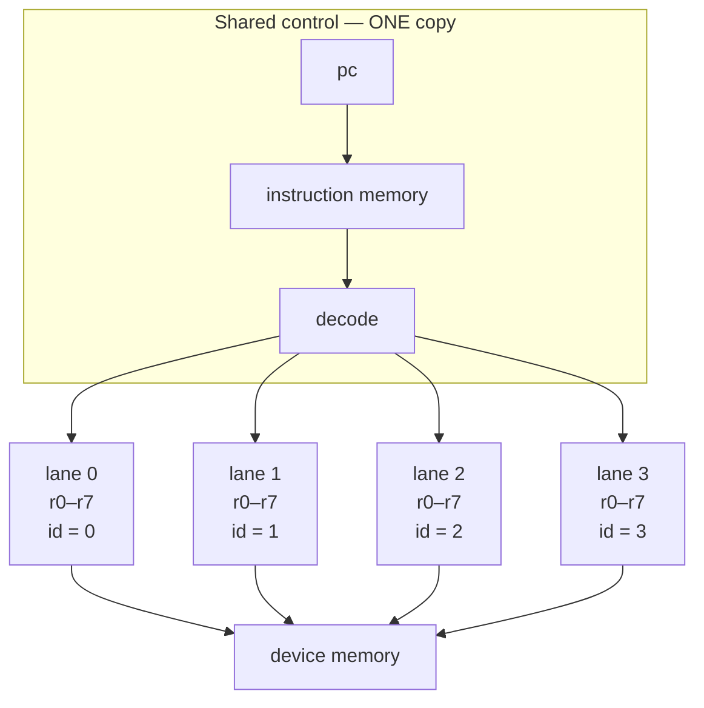

# 09 — Build a GPU: the SIMT core

> A GPU is not a fast CPU. It is a machine that refuses to pay for control
> logic more than once — one instruction fetched, decoded, and then executed
> by many lanes at the same time.

This chapter needs chapters [03](03-verilog-crash-course.md)–[07](07-building-blocks.md)
(the language, testbenches, memories, and building blocks). It does *not*
require [chapter 08](08-build-a-cpu.md) — the CPU/GPU/TPU trio is
order-free — but it lands harder if you've just built the CPU, because the
GPU is best understood as a pointed criticism of it.

## What "GPU" even means

The name is historical. A *Graphics* Processing Unit was, for its first
decade, a fixed-function pipeline machine: triangles in, transformed
vertices, rasterized fragments, textured pixels out. Around the mid-2000s
the fixed stages dissolved into programmable "shader" processors, people
noticed those processors were general-purpose throughput engines wearing a
trench coat, and GPGPU was born. Today the same silicon that draws your
games trains neural networks, and "GPU" effectively names an architecture:
the **massively parallel throughput machine**.

This chapter builds the compute essence of that machine — **SIMT**, single
instruction, multiple threads — because that's the architecturally novel
part, the thing that makes a GPU *not* a CPU. The graphics half (which is a
genuinely great FPGA hobby in its own right) gets an honest section near
the end.

## The SIMT insight: duplicate the datapath, share the control

Open [`src/05-cpu-rv32i/cpu.v`](../src/05-cpu-rv32i/cpu.v) and squint at
where the lines go. The immediate decoders, the opcode `localparam` block,
the branch unit, the load alignment mux, the write-back selector — nearly
all of the ~230 lines are **control**: machinery for deciding *what to do
next*. The actual arithmetic is a handful of expressions. All that
apparatus serves exactly one add (or shift, or compare) per cycle.

That's the right trade when your problem is one twisty thread of
dependent decisions — the CPU is a *latency* machine. But suppose the job
is: do the **same** operation on 10,000 independent items. Vector add.
Pixel shading. A neural-network layer. Fetching and decoding the same
`ADD` 10,000 times is pure waste. So don't. Duplicate only the cheap part
— the **datapath** — and share everything else:

- **one** program counter, **one** instruction memory, **one** decoder,
- **N execution lanes**, each with its own register file,
- and one crucial extra ingredient: each lane knows its own **lane ID**,
  so the same instruction stream makes each lane compute
  "which element is *mine*".



A group of lanes marching in lockstep like this is what NVIDIA calls a
**warp** (AMD says *wavefront*). Our core is one four-lane warp. That's
the whole idea; everything else in a real GPU is scaffolding to keep this
idea fed with data — as we'll see.

## Speaking CUDA

If you've ever read CUDA code, our toy maps onto its vocabulary almost
word for word:

| CUDA concept | In our core |
| --- | --- |
| thread | a lane |
| warp (32 threads in lockstep) | our 4 lanes in lockstep |
| `threadIdx.x` | the `LDID` instruction |
| `blockDim.x` + grid-stride loop | `LDI r7, 4` + the loop back-edge |
| kernel launch `<<<1, 4>>>` | the `start` pulse |
| `cudaMemcpy` | host-port reads/writes |
| `cudaDeviceSynchronize` | waiting for `done` |
| `__syncthreads()` / shared memory | **absent** — our lanes never talk to each other |

And to be plain about scale: a real NVIDIA *streaming multiprocessor*
(SM) is this exact idea, plus **many warps resident at once**, plus warp
schedulers choosing which one issues each cycle, plus register files with
tens of thousands of entries, plus special memories. Same skeleton,
vastly more meat. We'll inventory the differences honestly in a later
section.

## The host–device contract

A GPU is an *accelerator*: it does nothing until a host asks. That
relationship is a hardware interface, and ours is the top of
[`src/06-gpu-simt/gpu.v`](../src/06-gpu-simt/gpu.v):

```verilog
    // kernel launch handshake
    input  wire        start,      // pulse to launch at pc = 0
    output reg         done,

    // host port into device memory (use while the kernel is not running)
    input  wire        host_we,
    input  wire [31:0] host_addr,  // word address
    input  wire [31:0] host_wdata,
    output wire [31:0] host_rdata
```

The testbench [`src/06-gpu-simt/tb_gpu.v`](../src/06-gpu-simt/tb_gpu.v)
plays the host, and its header comment is the punchline — it is a CUDA
program with the API calls stripped off:

```verilog
// tb_gpu.v — plays the role of the HOST, exactly like a CUDA program:
//
//   1. copy inputs to device memory   (cudaMemcpy host->device)
//   2. launch the kernel              (<<<1, 4>>> ... start pulse)
//   3. wait for completion            (cudaDeviceSynchronize ... done)
//   4. copy results back and check    (cudaMemcpy device->host)
```

The four phases in the code read exactly like that:

```verilog
        // 1. host -> device: A at words 0..15, B at words 16..31
        for (i = 0; i < N; i = i + 1) begin
            a_arr[i] = 3 * i + 1;
            b_arr[i] = 1000 - 7 * i;
            host_write(i,      a_arr[i]);
            host_write(N + i,  b_arr[i]);
        end

        // 2. launch
        @(posedge clk); #1;
        start = 1'b1;
        @(posedge clk); #1;
        start = 1'b0;

        // 3. wait for the kernel, with a watchdog
        cycles = 0;
        while (!done && cycles < 1000) begin
            @(posedge clk);
            cycles = cycles + 1;
        end
```

```verilog
        // 4. device -> host: C at words 32..47
        for (i = 0; i < N; i = i + 1)
            host_check(32 + i, a_arr[i] + b_arr[i]);
```

This is accelerator programming in miniature, and the shape never changes:
when you talk to a real GPU through a driver, to a TPU
([chapter 10](10-build-a-tpu.md)), or to any FPGA accelerator you might
build someday, it's always *move data in → kick off → wait → move data
out*. Learn the handshake once, reuse it forever. (The `start`/`done`
pair is the valid/ready idea from [chapter 07](07-building-blocks.md) at
its most minimal.)

## The ISA and the kernel: machine code you can read by eye

The core executes 32-bit instructions with four byte-aligned fields,
`{op[31:24], a[23:16], b[15:8], c[7:0]}` — deliberately chosen so a hex
dump is legible without a disassembler:

| Op | Code | Syntax | Effect (per lane) |
| --- | --- | --- | --- |
| NOP | `00` | `NOP` | nothing |
| LDID | `01` | `LDID Ra` | `Ra = lane id` |
| LDI | `02` | `LDI Ra, imm8` | `Ra = imm8` (zero-extended) |
| ADD | `03` | `ADD Ra, Rb, Rc` | `Ra = Rb + Rc` |
| SUB | `04` | `SUB Ra, Rb, Rc` | `Ra = Rb - Rc` |
| MUL | `05` | `MUL Ra, Rb, Rc` | `Ra = Rb * Rc` |
| LD | `06` | `LD Ra, Rb` | `Ra = mem[Rb]` |
| ST | `07` | `ST Ra, Rb` | `mem[Rb] = Ra` |
| SLT | `08` | `SLT Ra, Rb, Rc` | `Ra = (Rb < Rc) ? 1 : 0` (unsigned) |
| BNZ | `09` | `BNZ Ra, target` | if `Ra != 0`: `pc = target` — **must be uniform** |
| HALT | `ff` | `HALT` | stop, raise `done` |

Eight registers per lane, loaded straight from
[`src/06-gpu-simt/kernel.hex`](../src/06-gpu-simt/kernel.hex) by
`$readmemh` (the [chapter 06](06-memory.md) trick). There is no assembler
because you don't need one — the kernel *is* its own listing. Here is the
program our GPU runs, next to the CUDA kernel it transliterates:

```c
__global__ void vadd(const int *a, const int *b, int *c, int n) {
    int i = threadIdx.x;                    // LDID
    while (i < n) {                         // SLT + BNZ
        c[i] = a[i] + b[i];                 // LD, LD, ADD, ST
        i += blockDim.x;                    // ADD (stride = 4 lanes)
    }
}
```

```
01010000  // LDID r1          ; i = lane_id (0,1,2,3)
02020010  // LDI  r2, 16      ; N
02070004  // LDI  r7, 4       ; stride = number of lanes
02030000  // LDI  r3, 0       ; base of A
02040010  // LDI  r4, 16      ; base of B
02050020  // LDI  r5, 32      ; base of C
03060301  // ADD  r6, r3, r1  ; loop: r6 = &A[i]
06060600  // LD   r6, r6      ;       r6 = A[i]
03000401  // ADD  r0, r4, r1  ;       r0 = &B[i]
06000000  // LD   r0, r0      ;       r0 = B[i]
03060600  // ADD  r6, r6, r0  ;       r6 = A[i] + B[i]
03000501  // ADD  r0, r5, r1  ;       r0 = &C[i]
07060000  // ST   r6, r0      ;       C[i] = r6
03010107  // ADD  r1, r1, r7  ;       i += stride
08000102  // SLT  r0, r1, r2  ;       r0 = (i < N)
09000006  // BNZ  r0, 6       ;       loop while r0 != 0 (uniform!)
ff000000  // HALT
```

This is the **grid-stride loop**, the single most idiomatic pattern in GPU
programming. `LDID` puts a *different* value in each lane's `r1` — 0, 1,
2, 3 — so when every lane executes the identical `ADD r6, r3, r1`, the
four lanes compute four *different* addresses: `&A[0]`, `&A[1]`, `&A[2]`,
`&A[3]`. One instruction, four useful and distinct results. Each trip
around the loop handles four consecutive elements, then everyone strides
forward by 4; four trips cover all sixteen. (Real CUDA grid-stride loops
start at `blockIdx.x * blockDim.x + threadIdx.x` and stride by
`gridDim.x * blockDim.x` — ours is the one-block special case. Exercise 4
adds the blocks.)

Notice what the lane ID buys you: the *program* contains no per-thread
code whatsoever. The only source of divergence between lanes is that one
register, seeded once at the top. That's SIMT's whole contract with the
programmer.

## The SIMT heart

Here is the execute stage of `gpu.v` — the part that makes it a GPU:

```verilog
                default: begin
                    // the SIMT heart: every lane executes this instruction
                    for (l = 0; l < LANES; l = l + 1) begin
                        case (op)
                            OP_LDID: rf[l][fa] <= l;
                            OP_LDI:  rf[l][fa] <= {24'd0, fc};
                            OP_ADD:  rf[l][fa] <= rf[l][fb] + rf[l][fc[2:0]];
                            OP_SUB:  rf[l][fa] <= rf[l][fb] - rf[l][fc[2:0]];
                            OP_MUL:  rf[l][fa] <= rf[l][fb] * rf[l][fc[2:0]];
                            OP_SLT:  rf[l][fa] <= (rf[l][fb] < rf[l][fc[2:0]])
                                                  ? 32'd1 : 32'd0;
                            OP_LD:   rf[l][fa] <= mem[rf[l][fb]];
                            // on a write conflict the highest lane wins;
                            // real GPUs serialise these (chapter 09)
                            OP_ST:   mem[rf[l][fb]] <= rf[l][fa];
                            default: ;
                        endcase
                    end
                    pc <= pc + 8'd1;
                end
```

Remember the [chapter 03](03-verilog-crash-course.md) mindset: this `for`
loop is **not** a loop that runs at runtime. It unrolls at elaboration
into `LANES` parallel copies of the datapath — four adders, four
multipliers, four register-file write ports, all firing on the same clock
edge. The register file is declared per-lane, `rf[0:LANES-1][0:7]`, and
`LD`/`ST` index memory with `rf[l][fb]` — *each lane's own address
register*. One instruction in, four register files updated. Change the
`LANES` parameter to 8 and you buy four more datapaths without touching a
line of control logic. Try doing that to `cpu.v`.

Run it:

```console
$ cd src && make 06-gpu-simt
WARNING: gpu.v:67: $readmemh(kernel.hex): Not enough words in the file for the requested range [0:255].
kernel finished in 48 cycles (16 adds on 4 lanes)
ALL TESTS PASSED
```

That `$readmemh` warning is expected and harmless: the kernel is 17 words
but the instruction memory is 256, so the rest stays zero (`NOP`). The 48
is worth auditing by hand: a 6-instruction prologue, then 4 loop
iterations of 10 instructions, then `HALT` — 6 + 40 + 1 = 47 instructions
at one per cycle, plus one edge for the testbench to observe the
registered `done` flag. And the throughput claim checks out: 16 correct
sums delivered by a machine that only ever fetched one instruction stream.

Open `gpu.vcd` in your waveform viewer and watch `pc` and `instr` step
through the kernel. One catch: Icarus doesn't dump register *arrays* like
`rf` by default, so to watch the lanes themselves, add tap wires to the
testbench —

```verilog
    wire [31:0] lane0_i = dut.rf[0][1];
    wire [31:0] lane1_i = dut.rf[1][1];
    wire [31:0] lane2_i = dut.rf[2][1];
    wire [31:0] lane3_i = dut.rf[3][1];
```

— re-run, and you'll see the SIMT signature: four staircases climbing in
lockstep, permanently offset by the lane ID. That picture *is* this
chapter.

## What we simplified — and how real GPUs solve it

The toy is honest about its three big lies, right in its header comment.
Each one is a pillar of real GPU architecture, so let's give each its due.

### Branch divergence

Our `BNZ` has one brutal rule: all lanes must agree, because there is only
one `pc`. The decision comes from lane 0 —

```verilog
    // branch decision comes from lane 0; simulation-only check below
    // verifies the other lanes agree (the "uniform branch" rule)
    wire branch_taken = (rf[0][fa] != 32'd0);
```

— and a simulation-only checker (a non-synthesizable watchdog, in the
spirit of [chapter 04](04-simulation-and-testbenches.md)) tattles if the
program ever breaks the rule:

```verilog
    always @(posedge clk) begin
        if (running && op == OP_BNZ)
            for (l = 1; l < LANES; l = l + 1)
                if ((rf[l][fa] != 32'd0) != branch_taken)
                    $display("WARNING @%0t: divergent branch at pc=%0d (lane %0d disagrees with lane 0)",
                             $time, pc, l);
    end
```

Real GPUs can't demand uniformity — shader code is full of `if (x > 0)`
where `x` differs per pixel. The classic solution: give every lane an
**active mask** bit. On a divergent branch, the hardware runs *both*
sides serially — first the "then" path with the disagreeing lanes masked
off (they execute the instructions but write nothing), then the "else"
path with the masks flipped — and reconverges afterward, traditionally
managed with a hardware **reconvergence stack**. (NVIDIA's Volta
generation and later loosened the lockstep with per-thread program
counters and "independent thread scheduling" — the masking cost remains,
the deadlock hazards shrink. Details vary by vendor and generation; the
high-level picture here is the stable part.)

The performance consequence is the part every CUDA programmer memorizes:
a warp whose lanes split 50/50 across an `if`/`else` takes roughly the
time of *both* paths. Divergence doesn't break correctness; it silently
halves (or worse) your throughput. That's why GPU code is full of
branchless tricks and why "keep control flow warp-uniform" is performance
advice, not style advice. Exercise 6 has you build the mask machinery
yourself.

### Memory coalescing

Look again at `OP_LD: rf[l][fa] <= mem[rf[l][fb]];`. Four lanes, four
independent addresses, all served in the same cycle — our simulated memory
is effectively a 4-port RAM, free of charge. [Chapter 06](06-memory.md)
already told you why that's fiction: real memories give you one or two
ports, and off-chip DRAM wants long sequential bursts.

Real GPUs bridge the gap with a **coalescer**: hardware that inspects the
32 addresses a warp just issued, and — if they fall in one aligned,
contiguous block — merges them into a single wide transaction. Lane *i*
touching element *i* coalesces perfectly: one memory transaction serves
the whole warp. Strided or random per-lane addresses shatter into many
serialized transactions, and effective bandwidth falls off a cliff.

This is why the grid-stride layout isn't just a cute idiom — it is *the*
memory-friendly access pattern. Adjacent lanes touch adjacent words on
every single `LD` and `ST` in our kernel. The toy's magic memory hides the
penalty, but the kernel is already written the way the real machine wants.

### Latency hiding: the actual superpower

Here's the deepest difference, and our toy models none of it. A DRAM
access takes hundreds of clock cycles. A CPU's answer is to *avoid* the
latency: giant caches, prefetchers, out-of-order execution — acres of
silicon spent so one thread rarely waits. The GPU's answer is to *not
care*: keep **many warps resident** on the SM at once, and when warp A
issues a load, a hardware scheduler switches to warp B **on the next
cycle, for free** — every resident warp keeps its registers permanently
in the (huge) register file, so there's no context-switch cost. By the
time the scheduler rotates back to warp A, its data has arrived. The
ALUs never notice DRAM latency because they're always doing *someone's*
work; latency is hidden, not eliminated.

How many warps you can keep resident — limited by how much register file
and shared memory each thread consumes — is called **occupancy**, and
it's the first number a CUDA profiler shows you: too few resident warps
and the scheduler runs out of ready work, the pipeline drains, and your
expensive ALUs idle while memory crawls.

Our core has one warp and stalls on nothing, because simulated memory
answers in the same cycle. Be clear-eyed about that fiction: it hides
exactly the problem whose solution — massive multithreading — is the
GPU's defining trick.

### The rest of a real SM

| We have | A real SM has | Why |
| --- | --- | --- |
| 1 warp of 4 lanes | dozens of resident warps, issued by warp schedulers | latency hiding (above) |
| 8 registers × 4 lanes | a banked register file on the order of tens of thousands of 32-bit registers | every resident warp's state stays live |
| nothing | shared memory + L1 (a programmer-managed on-chip scratchpad) with `__syncthreads()` barriers | fast inter-thread cooperation within a block |
| a `MUL` per lane | **tensor cores**: small matrix-multiply units inside the SM | matmul dominates ML — see below |
| magic 4-port memory | load/store units, coalescers, L2, GDDR/HBM controllers | feeding thousands of lanes is most of the chip |

That fourth row is where this chapter and the next shake hands: a tensor
core is a little systolic-flavored matmul engine embedded *inside* the
SIMT machine. [Chapter 10](10-build-a-tpu.md) builds that idea at full
size, as its own chip.

## SIMD vs SIMT, in one paragraph

Your CPU already does data parallelism: AVX on x86, NEON on ARM. That
style is **SIMD** — *one* thread holding explicitly wide registers, with
the lane count baked into the instruction (`vaddps` adds 8 floats, period)
and the programmer (or compiler) responsible for shuffling data into
vector shape. **SIMT** presents the same wide silicon differently: you
write thousands of scalar-looking threads, and the *hardware* grinds them
into lockstep groups, handles their divergence with masks, and coalesces
their memory traffic. Same transistors underneath — a wide ALU is a wide
ALU — but SIMT moves the vectorization burden from the programmer to the
machine, which is a big part of why CUDA won so many converts.

## The graphics half, honestly

We built the compute essence, but the name still says graphics, so here is
the pipeline in one breath: **vertex processing** (transform 3D triangle
corners into screen space) → **rasterization** (figure out which pixels
each triangle covers) → **fragment shading** (compute each covered pixel's
color — texture lookups, lighting) → **blend/ROP** (depth-test and write
to the framebuffer). Why did this workload birth the throughput machine?
Because it's embarrassingly parallel: every vertex is independent, and
above all every *fragment* is independent — a million pixels needing the
same lighting math is precisely "same instruction, different data". A
fragment is a lane. Since the mid-2000s, GPUs have run vertex and fragment
shaders on the *same* unified SIMT cores you just built a miniature of;
the remaining fixed-function hardware (rasterizers, ROPs, texture units)
rides alongside.

Graphics is also the best-served corner of the FPGA hobby world. Video
signal generation, framebuffers, sprites, and software-free rasterizers
are classic projects with visible, joyful output — and the standout
learning resource is **[Project F](https://projectf.io/)**, whose
"FPGA Graphics" series walks from a first video signal to shapes,
animation, and 3D-adjacent tricks with open-source-friendly Verilog. For
inspiration at the far end of the difficulty curve, look up **FuryGPU** —
a famous 2024 hobbyist project implementing a complete graphics GPU
(pipeline, host interface, drivers) on an FPGA. When this guide's
simulation-only premise finally chafes, that's the direction the door
opens.

## Where to go deeper

- **[adam-maj/tiny-gpu](https://github.com/adam-maj/tiny-gpu)** — the
  natural next step, and the inspiration for this chapter's approach. A
  documented, minimal GPU in Verilog that adds what we skipped: multiple
  compute cores, per-core schedulers, memory controllers that arbitrate
  and serialize lane requests, and an excellent README-level architecture
  walkthrough. Read our 150 lines first, then theirs.
- **[hughperkins/VeriGPU](https://github.com/hughperkins/VeriGPU)** — a
  more ambitious open-source GPU effort (RISC-V-flavored, ML-oriented);
  bigger and rougher, interesting as a contrast in scope.
- **GPGPU-Sim** and its academic kin — cycle-level simulators of real GPU
  microarchitectures; the associated papers and manuals are dense but
  authoritative on warp scheduling and memory-system detail.
- The **[NVIDIA CUDA C++ Programming Guide](https://docs.nvidia.com/cuda/cuda-c-programming-guide/)**
  — the "Hardware Implementation" chapter describes SIMT, warps, and
  divergence in the vendor's own words, and maps one-to-one onto what you
  built here.

## Exercises

1. **SAXPY (warm-up).** Write a new `kernel.hex` computing
   `C[i] = a*X[i] + Y[i]` with the scalar `a` loaded by `LDI` — `MUL` is
   already in the ISA. Update the testbench's phase-4 check to match. You
   have now written the canonical BLAS level-1 GPU benchmark by hand.
2. **Eight lanes (warm-up).** Instantiate `gpu #(.LANES(8), ...)` in the
   testbench and change the kernel's stride (`LDI r7, 4`) to 8. *Predict*
   the new cycle count from the instruction arithmetic in this chapter
   before running. Then try 16 lanes.
3. **Ragged N (medium).** Set N = 14 (`LDI r2, 14`, and the testbench's
   `N`). Run it and watch the uniform-branch checker fire — after the
   third iteration, lanes disagree about `i < N`. Fix it with
   *predication*: add a `STP Ra, Rb, Rc` opcode that stores only when the
   lane's `Rc` is nonzero, compute a per-lane `SLT` mask, and let every
   lane run the full loop while only in-bounds lanes commit their store.
4. **Blocks (medium).** Emulate a grid: reserve a device-memory word for
   `blockIdx`, have the kernel `LD` it and start `i` at
   `blockIdx*LANES + lane_id`, striding by `blocks*LANES`. The host then
   launches the kernel once per block, rewriting the word between
   launches. You've reinvented the real grid-stride formula.
5. **Matrix add (medium).** Compute `C = A + B` for a 4×4 matrix using
   two nested loops — rows in an outer loop with a uniform counter, lanes
   covering the columns of each row. The 2D-index bookkeeping (row base +
   lane ID) is the same address arithmetic every CUDA matrix kernel does.
6. **Divergence for real (hard).** Give each lane an active-mask bit and
   make every write in the SIMT heart conditional on it. Add two opcodes:
   `BRMASK Ra` (mask off lanes where `Ra == 0`, push the old mask) and
   `POPMASK` (restore it). Now run a genuinely divergent kernel —
   `C[i] = A[i] > B[i] ? A[i]-B[i] : B[i]-A[i]` — by executing both arms
   with complementary masks. Count the cycles you paid for the arm each
   lane didn't take: congratulations, you've measured branch divergence.

## Further reading

- [tiny-gpu](https://github.com/adam-maj/tiny-gpu) — start here after
  this chapter; its docs double as a gentle computer-architecture text.
- [NVIDIA CUDA C++ Programming Guide](https://docs.nvidia.com/cuda/cuda-c-programming-guide/)
  — especially the SIMT architecture and performance-guidelines chapters
  (divergence, coalescing, occupancy — our three confessions, from the
  people who sell the cure).
- [Project F](https://projectf.io/) — the graphics-side curriculum:
  video signals, framebuffers, racing the beam, all in open-source
  Verilog.
- [VeriGPU](https://github.com/hughperkins/VeriGPU) — an open-source GPU
  design with larger ambitions, worth skimming for contrast.
- Any recent computer-architecture textbook's GPU chapter (Hennessy &
  Patterson's *Computer Architecture: A Quantitative Approach* has a
  thorough one) for the quantitative version of this chapter's story.

---

*Next: [Chapter 10 — Build a TPU](10-build-a-tpu.md)*
