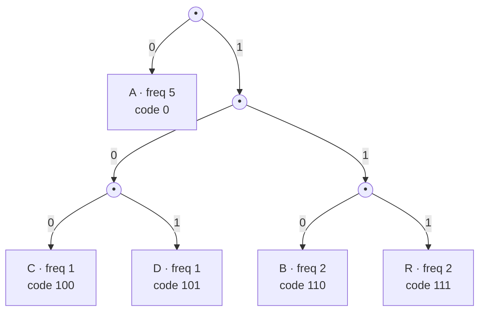

# Huffman Coding — Build a Compressor From Scratch, Four Times

> A hands-on guide to **Huffman coding**: the greedy algorithm at the heart of
> ZIP, gzip, PNG, JPEG, MP3 and HTTP/2. We start from *why* variable-length codes
> save space, prove *why* Huffman's are optimal, and work all the way up to a
> real, byte-level file format — then you implement the codec yourself in
> **Python, Java, C, and Rust**, with a test harness that tells you the moment
> you get it right.

<p align="center">
  <em>"The most-frequent symbol should cost the fewest bits. Everything else is
  bookkeeping."</em>
</p>

---

## What this guide is (and isn't)

This is a **learning guide**, not a code drop. It explains the theory in depth
and hands you a **workbench** — starter skeletons, a spec, and a test suite — but
the codec itself is **yours to write**. That's the whole point: you'll understand
Huffman coding because you built it, in four languages, and watched the tests go
green.

- The [`docs/`](docs/) chapters teach the ideas, with worked examples and
  pseudocode.
- The [`src/`](src/) directory is where you build: CLI + file I/O are wired up,
  `encode()`/`decode()` are yours, and `make test-<lang>` checks your work.

> **Note:** this guide is for learning. Cross-check the linked primary sources
> (Huffman's 1952 paper, RFC 1951, Cover & Thomas) before relying on a detail.

---

## Mental model (read this first)

Huffman coding answers one question: *given how often each symbol appears, what
binary code makes the message shortest?* The answer is a **binary tree**. Every
symbol is a leaf; the path from the root spells its code (`0` = go left, `1` = go
right); frequent symbols sit near the top and get short codes.



That tree (built for `ABRACADABRA`) turns the most common letter `A` into a
single bit while rare letters cost three. Two ideas make it work and make it
*optimal*:

| Idea | One-liner | Chapter |
| --- | --- | --- |
| **Prefix-free codes** | No code is a prefix of another, so a bitstream decodes with no separators | [02](docs/02-prefix-codes-and-entropy.md) |
| **Greedy merging** | Repeatedly join the two rarest nodes; the tree that falls out is provably optimal | [03](docs/03-the-algorithm.md)–[04](docs/04-why-it-is-optimal.md) |
| **Bits ≠ bytes** | Codes are bits; files are bytes — packing and padding is where real bugs live | [05](docs/05-encoding-and-bit-io.md) |
| **Canonical codes** | Store only the code *lengths*; both sides rebuild identical codes | [07](docs/07-canonical-huffman.md) |

---

## What you'll build

A command-line codec that round-trips any file:

```console
$ huffman encode moby-dick.txt moby-dick.huff
$ huffman decode moby-dick.huff out.txt
$ cmp moby-dick.txt out.txt      # identical
$ ls -l moby-dick.txt moby-dick.huff
-rw-r--r-- 1.2M moby-dick.txt
-rw-r--r-- 0.7M moby-dick.huff   # ~57% of the original
```

You'll build it four times. Because all four implement the same **`HUF1`**
format, a file compressed by your Python tool decompresses with your Rust tool —
and the test harness proves it.

---

## Prerequisites

- **Some programming experience** in at least one of Python, Java, C, or Rust.
  No prior compression or information-theory knowledge assumed.
- **Comfort with a terminal** and `make`.
- The toolchains for whichever languages you attempt: `python3`, a C compiler,
  a JDK, and/or Rust. `bash` runs the tests.
- A little patience with **bit twiddling**. Shifting and masking bits is the one
  genuinely fiddly part; the guide walks through it slowly.

---

## Repository layout

```
huffman-coding/
├── README.md                 ← you are here (the map)
├── docs/                     ← the guide, one chapter per file
│   ├── 01-what-is-huffman.md
│   ├── 02-prefix-codes-and-entropy.md
│   ├── 03-the-algorithm.md
│   ├── 04-why-it-is-optimal.md
│   ├── 05-encoding-and-bit-io.md
│   ├── 06-decoding.md
│   ├── 07-canonical-huffman.md
│   ├── 08-the-file-format.md
│   ├── 09-implementing-it.md
│   ├── 10-testing-your-implementation.md
│   └── 11-beyond-huffman.md
└── src/                      ← your workbench
    ├── README.md             ← how to build & test
    ├── Makefile              ← `make test-python`, `make conformance-rust`, …
    ├── python/  java/  c/  rust/   ← starter skeletons you fill in
    └── tests/                ← round-trip corpus + golden vectors + harness
```

---

## The learning path

Concept chapters (🧠) build understanding; build chapters (🛠️) move you toward
working code. Read 01–08 in order — they're a single argument. Then 09–10 are
your build-and-test loop, and 11 is the horizon.

| # | Chapter | What you'll learn |
| --- | --- | --- |
| 01 | 🧠 [What is Huffman coding?](docs/01-what-is-huffman.md) | The problem it solves, where it lives (DEFLATE, JPEG, MP3, HPACK), and the term-paper origin story. What it does — and what it deliberately doesn't. |
| 02 | 🧠 [Prefix codes & entropy](docs/02-prefix-codes-and-entropy.md) | Why variable-length codes need the prefix-free property; codes as binary trees; the Kraft inequality; Shannon entropy as the hard floor, and how close Huffman gets to it. |
| 03 | 🛠️ [The algorithm](docs/03-the-algorithm.md) | The greedy build with a priority queue, traced by hand on `ABRACADABRA`; complexity; and why the codes aren't unique. |
| 04 | 🧠 [Why it's optimal](docs/04-why-it-is-optimal.md) | The proof — an exchange argument plus induction — in full but readable. The one piece of theory worth doing slowly. |
| 05 | 🛠️ [Encoding & bit I/O](docs/05-encoding-and-bit-io.md) | Turning codes into a packed bitstream, MSB-first; the final-byte padding trap and how storing the length fixes it; the `BitWriter`/`BitReader` you'll need. |
| 06 | 🛠️ [Decoding](docs/06-decoding.md) | Two ways back: walking the tree bit-by-bit, and the faster table-driven canonical decode. Where each is used. |
| 07 | 🧠 [Canonical Huffman](docs/07-canonical-huffman.md) | The trick real formats use: codes fixed entirely by their lengths, so the header stores just 256 bytes. The RFC 1951 construction, length-limiting, and determinism across languages. |
| 08 | 🛠️ [The file format](docs/08-the-file-format.md) | The exact `HUF1` container the tests check against, byte by byte — magic, length, code-length table, payload — plus every edge case. This is the spec you implement to. |
| 09 | 🛠️ [Implementing it](docs/09-implementing-it.md) | How to structure the codec in **Python, Java, C, and Rust**: which data structures to reach for, the language-specific gotchas, and a milestone checklist. |
| 10 | 🛠️ [Testing your implementation](docs/10-testing-your-implementation.md) | Using the harness; round-trip vs. conformance; why a *correct* codec can still fail conformance; the edge cases that catch real bugs; debugging tactics. |
| 11 | 🧠 [Beyond Huffman](docs/11-beyond-huffman.md) | Huffman's one weakness (whole-bit codes), and what fixes it: adaptive Huffman, arithmetic/range coding, and modern ANS (zstd, LZFSE). Where to read next. |

---

## How to use this guide

- **Read the theory, then build.** Chapters 01–08 are a single argument that ends
  at a format spec. Don't skip to the keyboard — the payoff of 04 and 07 is code
  that's short *and* correct.
- **Let the tests lead.** `make test-<lang>` round-trips a nasty corpus (empty
  file, one repeated byte, all 256 values, random binary). Get it green before
  you chase byte-for-byte `conformance`.
- **Do it in a second language.** The algorithm is identical; re-expressing it in
  a language with different rules (signed bytes, manual memory, ownership) is
  where the understanding sets in.
- **Break things on purpose.** Flip a `<` to `<=` in the tree merge, forget to
  store the length, pad the last byte on the wrong side — then watch which test
  catches you. Chapter 10 suggests specific sabotage.

---

## Credits & lineage

This guide follows a path many have paved: David A. Huffman's original 1952
paper *"A Method for the Construction of Minimum-Redundancy Codes"*; Claude
Shannon's *"A Mathematical Theory of Communication"* (1948) for the entropy
floor; the DEFLATE spec [RFC 1951](https://www.rfc-editor.org/rfc/rfc1951) for
canonical codes; and the textbook treatments in Cover & Thomas's *Elements of
Information Theory* and Khalid Sayood's *Introduction to Data Compression*. Full
references live in chapter [11](docs/11-beyond-huffman.md).

---

*Start here → [Chapter 01: What is Huffman coding?](docs/01-what-is-huffman.md)*
