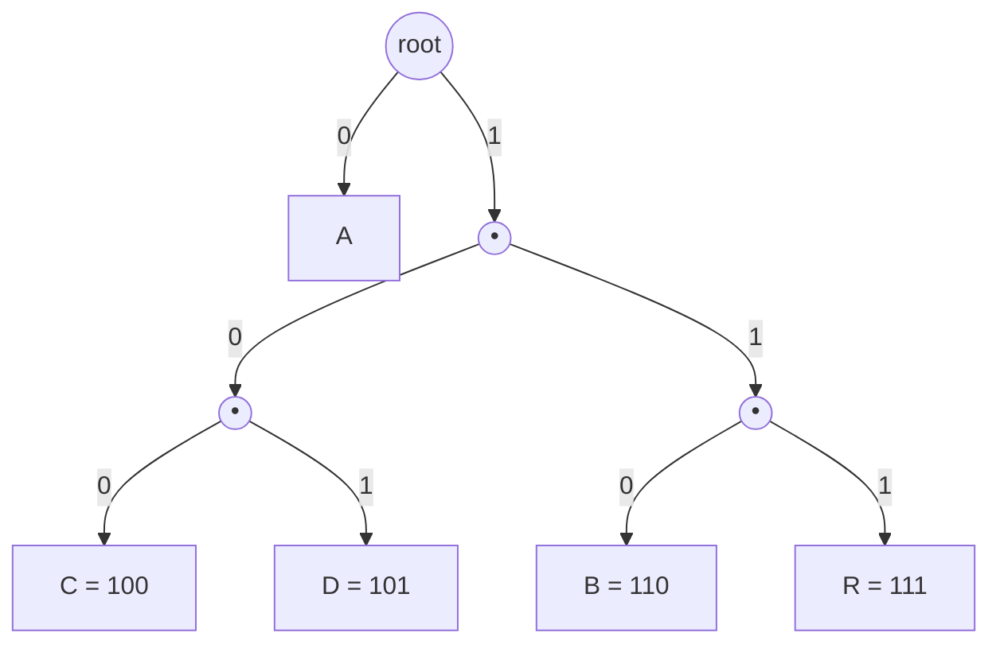

# Chapter 02 — Prefix codes & entropy

> Two questions stand between "short codes for frequent symbols" and a working
> compressor. First: if codes have different lengths and there are no separators,
> how is the stream decodable *at all*? Second: how short can it possibly get —
> is there a floor? The answers are **prefix-free codes** (a property with a
> beautiful tree structure) and **Shannon entropy** (a hard lower bound Huffman
> gets within one bit of).

## What you'll learn

- Why naïve variable-length codes are ambiguous, and what "uniquely decodable"
  means.
- The **prefix-free** property, and why every prefix code *is* a binary tree.
- The **Kraft–McMillan inequality**: the exact budget that decides whether a set
  of code lengths is achievable.
- **Shannon entropy** as the theoretical minimum bits-per-symbol, and the
  guarantee that Huffman lands within one bit of it.

---

## Fixed-length codes are simple but wasteful

A fixed-length code gives every symbol the same number of bits. ASCII (7–8 bits),
UTF-32 (32 bits), a 3-bit code for a 5-letter alphabet — all fixed-length.
Decoding is trivial: chop the stream into equal pieces. The cost is that a symbol
you use a million times and a symbol you use once pay exactly the same. When the
distribution is skewed, that's money left on the table.

Variable-length codes let us spend fewer bits on common symbols. But they
reintroduce a problem fixed-length codes never had: **where does one codeword end
and the next begin?**

---

## The ambiguity trap

Suppose we get greedy and assign these codes:

| Symbol | Code |
| --- | --- |
| A | `0` |
| B | `1` |
| C | `01` |

Now decode the stream `01`. Is it `A` then `B` (`0`,`1`)? Or is it `C` (`01`)?
There is no way to tell. This code is **not uniquely decodable** — the same bits
mean two different things. It's useless, no matter how short.

The defect is specific: `A`'s code (`0`) is a **prefix** of `C`'s code (`01`).
When the decoder has read `0`, it can't commit — a later bit might extend it into
`C`. Ambiguity is exactly this "could this be the start of a longer code?"
hesitation.

---

## Prefix-free codes: the fix

A **prefix code** (also called *prefix-free* or *instantaneous*) is one where
**no codeword is a prefix of any other**. Our `ABRACADABRA` codes from Chapter 01
have this property:

| Symbol | Code |
| --- | --- |
| A | `0` |
| B | `100` |
| C | `101` |
| D | `110` |
| R | `111` |

Nothing starts with `0` except `A` itself, and the 3-bit codes all start with
`1` but diverge by the third bit. Decoding is now *instantaneous*: read bits until
the collected string equals a codeword, emit that symbol, and start over. You
never look ahead, never backtrack, never guess.

```
0 1 0 0 1 1 1 0 …
0            → A   (0 is a complete code; nothing longer starts with 0)
 1 0 0       → B
       1 1 1 → R
             0 → A …
```

Prefix-free is a *sufficient* condition for unique decodability, and it's the one
worth wanting because it also gives you *instantaneous* decoding. (There exist
uniquely-decodable codes that aren't prefix-free, but they force the decoder to
look ahead — no reason to accept that pain.)

---

## Every prefix code is a binary tree

Here's the structural fact that the entire algorithm hangs on. Draw a binary
tree. Label every left branch `0` and every right branch `1`. Put each symbol at
a **leaf**. Then each symbol's codeword is just the sequence of branch labels on
the path from the root down to its leaf.



Because symbols live only at **leaves** — never at internal nodes — no symbol's
path can pass *through* another symbol. And a path can't pass through a leaf. So
**no codeword is a prefix of another, automatically.** The tree *is* the prefix
guarantee.

This is why Huffman coding is a tree-building algorithm. "Find the best prefix
code" and "find the best leaf-labelled binary tree" are the same problem. Decoding
becomes a walk: start at the root, and for each bit go left (`0`) or right (`1`);
when you hit a leaf, emit its symbol and jump back to the root. (We'll write that
walk in [Chapter 06](06-decoding.md).)

---

## The Kraft–McMillan inequality: the length budget

Suppose you want codewords of lengths $\ell_1, \ell_2, \ldots, \ell_n$. When is
that even possible with a prefix code? The answer is the **Kraft inequality**:

$$\sum_{i=1}^{n} 2^{-\ell_i} \le 1$$

Intuition: a codeword of length $\ell$ "claims" a fraction $2^{-\ell}$ of the
space of all future bitstrings (everything that starts with it). For the claims
not to overlap — which is what prefix-free means — the fractions can't sum past 1.
A 1-bit code eats half the space; a 2-bit code eats a quarter; and so on.

Two directions make this a complete tool:

- **If a prefix code exists**, its lengths satisfy Kraft (≤ 1).
- **Conversely**, if a set of lengths satisfies Kraft, then a prefix code with
  those lengths *exists* — you can always place the leaves.

**McMillan's theorem** extends the "≤ 1" direction to *every* uniquely decodable
code, not just prefix ones. The punchline is deep: allowing non-prefix codes buys
you *nothing* in code length. Whatever lengths a uniquely-decodable code achieves,
a prefix code achieves too. So restricting ourselves to trees costs no
compression — we get instantaneous decoding for free.

Check it on `ABRACADABRA` (lengths 1, 3, 3, 3, 3):

$$2^{-1} + 4\cdot 2^{-3} = \tfrac12 + \tfrac{4}{8} = 1.$$

Exactly 1 — the tree is *full* (every internal node has two children, no wasted
slots). Huffman trees always satisfy Kraft with equality, which is one way of
seeing that they waste no branch.

---

## Entropy: the floor you can't beat

Kraft tells us which length sets are *legal*. It doesn't tell us which is *best*.
For that we need to know how good any code could possibly be — the theoretical
minimum. That minimum is **Shannon entropy**.

Given symbols with probabilities $p_1, \ldots, p_n$ (frequency ÷ total), the
entropy of the source is

$$H = -\sum_{i=1}^{n} p_i \log_2 p_i \quad\text{bits per symbol.}$$

Read $-\log_2 p_i$ as the "ideal" number of bits for a symbol of probability
$p_i$: a symbol that shows up half the time (p = ½) ideally costs
$-\log_2 \tfrac12 = 1$ bit; one-in-eight (p = ⅛) ideally costs 3 bits. Entropy is
just the *average* of those ideal costs, weighted by how often each symbol occurs.

**Shannon's source coding theorem** says: no uniquely decodable code can have an
expected length below $H$. It is a genuine floor, not a practical limit — it comes
from information itself.

### How close does Huffman get?

Huffman's expected code length $L = \sum p_i \ell_i$ obeys

$$H \le L < H + 1.$$

The lower bound is Shannon's floor. The upper bound is Huffman's promise: it is
**never more than one bit per symbol above the theoretical best**, and usually far
closer. The "+1" slack comes from the one imperfection Huffman can't escape — code
lengths are whole numbers, but the ideal $-\log_2 p_i$ usually isn't. When a
symbol's ideal length is 2.3 bits, Huffman must round to 2 or 3. Closing that last
fractional gap is what arithmetic coding and ANS do
([Chapter 11](11-beyond-huffman.md)).

---

## Worked example: the numbers for `ABRACADABRA`

Probabilities (counts over 11):

| Symbol | Count | $p$ | ideal bits $-\log_2 p$ | Huffman bits |
| --- | --- | --- | --- | --- |
| A | 5 | 0.4545 | 1.138 | 1 |
| B | 2 | 0.1818 | 2.459 | 3 |
| R | 2 | 0.1818 | 2.459 | 3 |
| C | 1 | 0.0909 | 3.459 | 3 |
| D | 1 | 0.0909 | 3.459 | 3 |

Entropy:

$$H = 0.4545(1.138) + 2\cdot 0.1818(2.459) + 2\cdot 0.0909(3.459) \approx 2.04 \text{ bits/symbol.}$$

Huffman's expected length:

$$L = 0.4545(1) + 2\cdot0.1818(3) + 2\cdot0.0909(3) \approx 2.09 \text{ bits/symbol.}$$

So Huffman spends **2.09** bits/symbol against a floor of **2.04** — within
0.05 bits of perfection, comfortably inside the "+1" guarantee. Over 11 symbols
that's $11 \times 2.09 \approx 23$ bits, matching the 23 we counted by hand in
Chapter 01. The theory and the bit-counting agree.

> **A note on our real codec.** This 2.04-vs-2.09 accounting is about the
> *payload*. Our actual file also carries a header (the code table) and rounds the
> payload up to whole bytes, so tiny inputs like `ABRACADABRA` come out *larger*
> than the original — the header dominates. Compression only wins once the file is
> big enough to amortize the header, which is exactly what
> [Chapter 10](10-testing-your-implementation.md) measures.

---

## When Huffman wins, and when it shrugs

The saving comes entirely from *skew*. Two extremes:

- **Highly skewed** (one symbol dominates): entropy is low, Huffman's short codes
  pay off hugely. English text, source code, and the mostly-zero coefficients in
  JPEG all look like this.
- **Uniform** (every symbol equally likely): entropy is $\log_2 n$ — the same as
  a fixed-length code. Huffman can't beat fixed-length here, and with header
  overhead it loses slightly. Random bytes are the pathological case: entropy is
  8 bits/byte, and there's nothing to compress.

This is the entropy floor made tangible: **you cannot compress what has no
redundancy.** Huffman doesn't create structure; it exploits the structure a model
hands it.

---

## Key takeaways

- Variable-length codes are only usable if they're **uniquely decodable**; the
  clean way to guarantee that is **prefix-free**.
- Every prefix code corresponds to a **binary tree** with symbols at the leaves —
  so building the best code *is* building the best tree.
- The **Kraft–McMillan inequality** ($\sum 2^{-\ell_i} \le 1$) says which length
  sets are achievable, and that prefix codes lose nothing versus any uniquely
  decodable code.
- **Entropy** $H = -\sum p_i \log_2 p_i$ is the hard floor on bits/symbol; Huffman
  guarantees $H \le L < H+1$, its only imperfection being whole-number code
  lengths.

Next: the algorithm that actually finds that optimal tree.

---

*Next → [Chapter 03: The algorithm](03-the-algorithm.md)*
