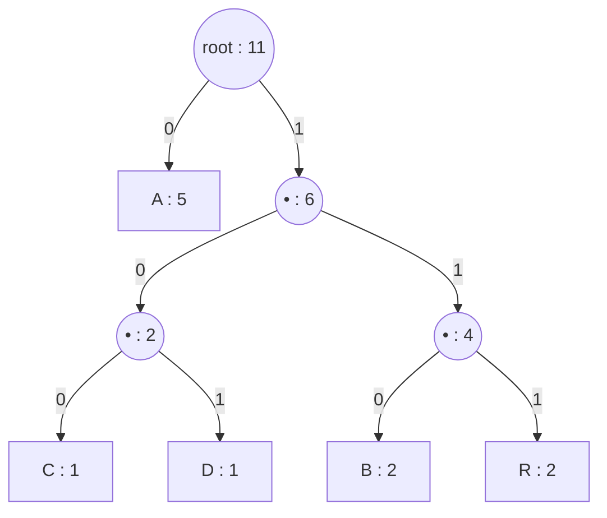

# Chapter 03 — The algorithm

> Huffman's algorithm is four lines of idea: put every symbol in a priority
> queue keyed by frequency; repeatedly remove the two smallest, join them under a
> new node whose frequency is their sum, and put it back; the last node standing
> is the root. That's it. This chapter traces it by hand, writes it as
> pseudocode, and pins down the details that bite — tie-breaking and the fact
> that the codes aren't unique.

## What you'll learn

- The greedy build, step by step, on `ABRACADABRA`, with the tree drawn at each
  merge.
- How to read the codes off the finished tree.
- Why a **priority queue** is the right data structure, and the $O(n \log n)$
  cost.
- Why two correct implementations can produce *different* codes — and why that's
  fine (until you want cross-language interop, which [Chapter 07](07-canonical-huffman.md)
  fixes).

---

## The idea

We're building the tree from [Chapter 02](02-prefix-codes-and-entropy.md) —
symbols at the leaves — but *bottom-up*. The rarest symbols should end up
**deepest** (longest codes), so we deal with them first, burying them under
layers of merges. The most frequent symbol is touched last and stays near the
root (shortest code).

The greedy rule:

> Repeatedly take the **two lowest-frequency** nodes and make them the children
> of a new parent whose frequency is their sum. Repeat until one node remains.

Each merge adds one bit to the codes of *everything* beneath the new parent. By
always merging the two smallest, we add those bits to the fewest symbols /
lowest total frequency — which is what keeps the weighted total minimal.
[Chapter 04](04-why-it-is-optimal.md) turns that intuition into a proof.

---

## Tracing it on `ABRACADABRA`

Frequencies: `A:5  B:2  R:2  C:1  D:1`.

We keep the nodes in a **min-priority-queue** — a bag that always hands back the
smallest-frequency node first. Start with one leaf per symbol:

```
queue (by frequency):  [ C:1  D:1  B:2  R:2  A:5 ]
```

**Merge 1.** Take the two smallest, `C:1` and `D:1`. Join them under a new
internal node of frequency `1+1 = 2`. Put it back.

```
                (•):2
               /     \
            C:1       D:1

queue:  [ B:2  R:2  (CD):2  A:5 ]
```

**Merge 2.** The two smallest are now `B:2` and `R:2`. Join them into `(BR):4`.

```
   (BR):4
   /    \
 B:2    R:2

queue:  [ (CD):2  (BR):4  A:5 ]
```

**Merge 3.** Smallest two: `(CD):2` and `(BR):4`. Join into a node of frequency
`2+4 = 6`.

```
        (•):6
        /    \
    (CD):2   (BR):4
    /   \    /    \
   C     D  B      R

queue:  [ A:5  (CDBR):6 ]
```

**Merge 4.** Only two nodes left: `A:5` and `(CDBR):6`. Join into the **root**,
frequency `11` — which had better equal the length of the string, and does.



The queue is down to one node. We're done.

---

## Reading the codes off the tree

Label every left edge `0` and every right edge `1`, then walk from the root to
each leaf:

| Symbol | Path from root | Code | Length |
| --- | --- | --- | --- |
| A | left | `0` | 1 |
| C | right, left, left | `100` | 3 |
| D | right, left, right | `101` | 3 |
| B | right, right, left | `110` | 3 |
| R | right, right, right | `111` | 3 |

`A` — the most frequent — got the 1-bit code, exactly as we wanted. The four rare
letters share the 3-bit codes. This matches the code table from Chapter 01 (up to
which 3-bit pattern lands on which letter — more on that below).

Notice the **frequency of an internal node equals the sum of the leaves beneath
it**, and the total number of bits in the encoded message equals the sum of all
*internal* node frequencies (`2 + 4 + 6 + 11 = 23`). That's not a coincidence —
each internal node's frequency counts exactly how many symbol-occurrences pass
through that node, i.e. how many get that extra bit. It's a handy way to compute
the compressed size without walking every symbol.

---

## The algorithm in pseudocode

```
build_tree(freq):                       # freq[s] = count of symbol s
    pq = min-priority-queue keyed by node.frequency
    for each symbol s with freq[s] > 0:
        pq.push( Leaf(symbol = s, frequency = freq[s]) )

    if pq is empty:                      # no symbols at all (empty input)
        return None

    while pq.size > 1:
        a = pq.pop_min()                 # two lowest-frequency nodes
        b = pq.pop_min()
        parent = Internal(frequency = a.frequency + b.frequency,
                          left = a, right = b)
        pq.push(parent)

    return pq.pop_min()                  # the root
```

To turn the tree into a code table, walk it once, accumulating the path:

```
assign_codes(node, prefix = ""):
    if node is a Leaf:
        code[node.symbol] = prefix       # empty prefix only for a 1-symbol tree
    else:
        assign_codes(node.left,  prefix + "0")
        assign_codes(node.right, prefix + "1")
```

In practice you'll record **code lengths** (leaf depths) rather than bit-strings,
because [Chapter 07](07-canonical-huffman.md) reconstructs the actual bits from
the lengths alone. But the walk is the same.

> **Edge case — a single distinct symbol.** If the input is `"AAAA"`, the tree is
> one lonely leaf with no branches, so the walk assigns it the *empty* code — zero
> bits. That's unusable: you can't write zero bits per symbol. The fix is a
> one-line special case: give the sole symbol a length of **1** (code `0`).
> [Chapter 08](08-the-file-format.md) handles it explicitly, and the
> `single-byte` test in the corpus exists to catch it.

---

## Why a priority queue, and how fast

The algorithm's inner need is "give me the two smallest, then let me insert their
sum." That's exactly a **min-heap** (binary heap):

- building the initial heap of $n$ leaves: $O(n)$,
- each merge does two `pop` and one `push`, all $O(\log n)$,
- there are $n-1$ merges.

Total: $O(n \log n)$. For our byte alphabet $n \le 256$, this is instant — the
work is dominated by *reading the file to count frequencies*, which is $O(N)$ in
the file size $N$. Every language in this guide has a heap in its standard library
(Python `heapq`, Java `PriorityQueue`, Rust `BinaryHeap`); in C you'll write a
small array-based one ([Chapter 09](09-implementing-it.md)).

> **Aside:** if the symbols are already sorted by frequency, there's an even
> slicker $O(n)$ method using **two queues** instead of a heap (van Leeuwen, 1976).
> You don't need it here, but it's a nice thing to know exists.

---

## The codes are not unique (and that's important)

Three independent choices in the algorithm change the *exact bits* without
changing the code's **optimality** (its expected length):

1. **Which child is `0`.** We labelled left `0`, right `1`. Swap them and every
   code flips bits, but lengths are identical.
2. **Ties in frequency.** At Merge 2 we had `B:2`, `R:2`, and `(CD):2` all tied
   at frequency 2. Which two you merge first depends on how your priority queue
   breaks ties — and different choices yield different (still optimal!) trees.
   Some produce code lengths `{1,3,3,3,3}`, another arrangement might yield
   `{2,2,2,3,3}` with the same weighted total.
3. **Library heap internals.** Two languages' heaps can pop equal-frequency
   nodes in different orders.

All of these give a *correct, optimal* code. None of them agree on the bits. That
is completely fine for a self-contained compressor — you decode with the same
table you encoded with. It becomes a problem only when you want your Python file
to open in your Rust tool, because now both sides must derive the **same** table.

Two tools solve that, and we'll use both:

- **Canonical codes** ([Chapter 07](07-canonical-huffman.md)) remove choices #1
  and part of #2 by fixing the bit patterns from the lengths.
- A **deterministic tie-break** in the priority queue ([Chapter 08](08-the-file-format.md))
  removes the rest, so every language builds the identical tree.

For now, just internalize the fact: *Huffman gives you an optimal code, not a
unique one.*

---

## Key takeaways

- Build **bottom-up**: repeatedly merge the two lowest-frequency nodes; the last
  node is the root.
- Codes are the root-to-leaf paths (`0` = left, `1` = right); frequent symbols
  end up shallow (short codes).
- A **min-heap** makes it $O(n \log n)$; the real cost of a file compressor is
  counting frequencies, $O(N)$.
- The result is **optimal but not unique** — remember this before you're
  surprised that two correct implementations disagree byte-for-byte.

Next: the proof that this greedy merge really is optimal.

---

*Next → [Chapter 04: Why it's optimal](04-why-it-is-optimal.md)*
