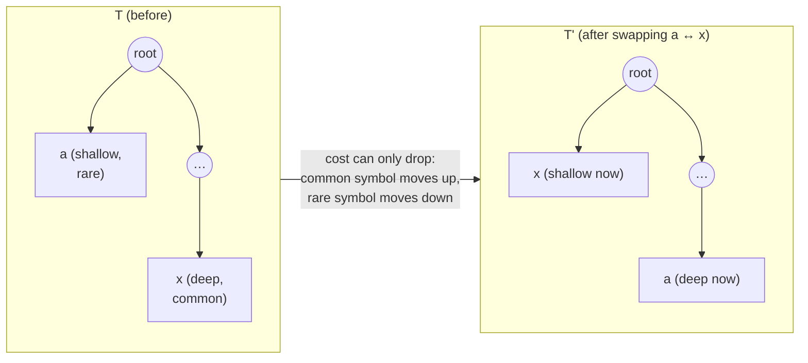

# Chapter 04 — Why it's optimal

> Greedy algorithms are usually *wrong*. "Take the best-looking local step" fails
> for most optimization problems. Huffman is one of the rare cases where greedy is
> provably, exactly optimal — and the proof is genuinely beautiful. It rests on
> two lemmas: a **greedy-choice** property (the two rarest symbols can be siblings
> at the bottom) and **optimal substructure** (merging them leaves a smaller
> problem of the same kind). This is the one piece of theory in the guide worth
> doing slowly.

## What you'll learn

- How to state "optimal" precisely, as minimizing a cost over trees.
- The **exchange argument** that proves the two least-frequent symbols belong
  together at maximum depth.
- The **substructure** relation that lets us shrink the alphabet by one and
  recurse.
- How the two combine, by induction, into a full optimality proof.

You don't need this chapter to *write* the codec. You need it to *trust* it — and
exchange arguments are a technique you'll reuse for the rest of your career.

---

## What "optimal" means, exactly

Fix an alphabet $C$ where each symbol $c$ has frequency $f(c)$ (a count, or a
probability — the proof works for either). A prefix code is a binary tree $T$
with the symbols at its leaves. Write $d_T(c)$ for the **depth** of $c$'s leaf =
the length of its codeword. Define the **cost** of the tree as the total number
of bits it spends on the whole message:

$$B(T) = \sum_{c \in C} f(c)\, d_T(c).$$

A tree is **optimal** if no other tree over the same alphabet has smaller
$B(T)$. Our goal: prove the tree Huffman builds achieves the minimum $B(T)$.

Two facts we'll use repeatedly:

- **An optimal tree is *full*:** every internal node has *two* children. If some
  internal node had only one child, you could delete that node and pull its
  subtree up one level, shortening some codewords and lowering the cost — so a
  one-child node can't appear in an optimal tree.
- Because the tree is full, **the deepest level contains at least two leaves that
  are siblings** (the deepest internal node has two leaf children).

---

## Lemma 1 — the greedy choice

> **Claim.** Let $a$ and $b$ be two symbols with the **lowest** frequencies in
> $C$. Then there exists an optimal tree in which $a$ and $b$ are **siblings at
> maximum depth**.

In words: it never hurts to bury the two rarest symbols together at the very
bottom. That's the move Huffman makes first, so we need to know it's safe.

**Proof (an exchange argument).** Take *any* optimal tree $T$. Let $x$ and $y$ be
two leaves that are siblings at the maximum depth of $T$ (they exist, because $T$
is full). Without loss of generality assume

$$f(a) \le f(b) \quad\text{and}\quad f(x) \le f(y).$$

Since $a$ and $b$ are the two *lowest*-frequency symbols in the whole alphabet,

$$f(a) \le f(x) \quad\text{and}\quad f(b) \le f(y).$$

Now **swap** $a$ with $x$, producing a tree $T'$. What did that do to the cost?
Only $a$ and $x$ changed depth, so:

$$B(T) - B(T') = \big(f(x) - f(a)\big)\big(d_T(x) - d_T(a)\big).$$

Let's read the two factors:

- $f(x) - f(a) \ge 0$, because $a$ is a lowest-frequency symbol.
- $d_T(x) - d_T(a) \ge 0$, because $x$ sits at *maximum* depth, so nothing is
  deeper than it.

A product of two non-negative numbers is non-negative, so $B(T) - B(T') \ge 0$,
i.e. $B(T') \le B(T)$. The swap **did not increase the cost**.

Repeat the same argument to swap $b$ with $y$, giving a tree $T''$ with
$B(T'') \le B(T')$. Chaining: $B(T'') \le B(T)$. But $T$ was optimal, so $B(T)$
can't be beaten — therefore $B(T'') = B(T)$, and $T''$ is *also* optimal. And in
$T''$, the symbols $a$ and $b$ now sit where $x$ and $y$ were: **siblings at
maximum depth.** ∎

The heart of it: moving a common symbol *up* and a rare symbol *down* can never
increase total cost. Huffman exploits exactly that.

---

## Lemma 2 — optimal substructure

Huffman's first move merges $a$ and $b$ under a new parent. Treat that parent as a
brand-new "combined" symbol $z$ with

$$f(z) = f(a) + f(b),$$

living in a smaller alphabet $C' = C \setminus \{a, b\} \cup \{z\}$. The next
lemma says solving the *smaller* problem solves the bigger one.

> **Claim.** Let $T'$ be any tree for $C'$. Build $T$ for $C$ by replacing the
> leaf $z$ with an internal node whose two children are $a$ and $b$. Then
> $$B(T) = B(T') + f(a) + f(b).$$
> Moreover, if $T'$ is **optimal** for $C'$, then $T$ is **optimal** for $C$.

**Proof of the cost relation.** Every symbol other than $a, b, z$ has the same
depth in $T$ and $T'$, so it contributes identically to both costs. The only
difference is at the bottom: $a$ and $b$ sit one level below where $z$ was, i.e.
$d_T(a) = d_T(b) = d_{T'}(z) + 1$. So

$$
f(a)\,d_T(a) + f(b)\,d_T(b)
= \big(f(a)+f(b)\big)\big(d_{T'}(z)+1\big)
= f(z)\,d_{T'}(z) + \big(f(a)+f(b)\big).
$$

The first term is exactly $z$'s contribution to $B(T')$; the leftover is
$f(a)+f(b)$. Summing over the whole alphabet, $B(T) = B(T') + f(a) + f(b)$. The
"+ f(a) + f(b)" is precisely the one extra bit each occurrence of $a$ and $b$ pays
for being one level deeper — the merge's price, paid once. ∎

**Proof that optimality transfers.** Suppose $T'$ is optimal for $C'$ but the
expanded $T$ is *not* optimal for $C$. Then some tree $S$ beats it: $B(S) < B(T)$.
By **Lemma 1**, we may assume $S$ has $a$ and $b$ as sibling leaves (if it
doesn't, exchange them down at no cost, exactly as before). Contract that
$\{a,b\}$ pair in $S$ into a single leaf $z$, giving a tree $S'$ for $C'$. By the
cost relation, $B(S') = B(S) - f(a) - f(b)$. Then

$$B(S') = B(S) - f(a) - f(b) < B(T) - f(a) - f(b) = B(T').$$

So $S'$ beats $T'$ on $C'$ — contradicting $T'$'s optimality. Hence no such $S$
exists, and $T$ is optimal. ∎

---

## Putting it together: induction

Now we prove Huffman is optimal for every alphabet size $n$, by induction on $n$.

**Base case ($n = 1$).** One symbol; give it a 1-bit code (the single-symbol
convention from [Chapter 03](03-the-algorithm.md)). There's nothing to optimize.
(For $n = 2$, the two symbols get `0` and `1` — trivially optimal.)

**Inductive step.** Assume Huffman produces an optimal tree for every alphabet of
size $n-1$. Take an alphabet $C$ of size $n$. Huffman's first action is to merge
the two lowest-frequency symbols $a, b$ into a combined symbol $z$, leaving an
alphabet $C'$ of size $n-1$. From then on, Huffman behaves *exactly* as it would
on $C'$ — it never looks at $a$ or $b$ again, only at $z$. By the induction
hypothesis, the tree Huffman builds for $C'$ is optimal. By **Lemma 2**, expanding
$z$ back into $a, b$ yields an optimal tree for $C$. And by **Lemma 1**, choosing
$a, b$ as that deepest sibling pair was a move that an optimal tree is free to
make. Therefore Huffman's tree for $C$ is optimal. ∎

That's the whole result:

> **Huffman coding produces a prefix code of minimum possible expected length.**

No prefix code — and, by McMillan's theorem from
[Chapter 02](02-prefix-codes-and-entropy.md), no *uniquely decodable* code at all —
can encode the message in fewer total bits, given one whole-number-length codeword
per symbol.

---

## The fine print: what "optimal" does *not* promise

The proof is airtight, but read its claim precisely:

- **Optimal among fixed, integer-length, per-symbol codes.** The "+1 bit" gap to
  entropy from Chapter 02 is *not* a failure of the proof — it's the cost of
  rounding each ideal length $-\log_2 p$ to a whole number. Arithmetic coding and
  ANS beat Huffman precisely by *not* being one-integer-length-per-symbol
  ([Chapter 11](11-beyond-huffman.md)); they don't violate this theorem, they
  sidestep its assumptions.
- **Optimal for a given model.** Huffman minimizes bits *for the frequencies you
  hand it*. If your model is poor (e.g. treating already-random data as bytes),
  the optimal code is still large. Garbage in, optimal-sized garbage out.
- **Optimal ≠ unique.** As Chapter 03 stressed, many different trees achieve the
  same minimal cost. The proof produces *an* optimal tree, not *the* optimal tree.

---

## Key takeaways

- Optimality means minimizing $B(T) = \sum f(c)\,d_T(c)$ over all leaf-labelled
  binary trees.
- **Lemma 1 (exchange):** swapping a rarer symbol deeper and a commoner one
  shallower never raises cost, so the two rarest symbols may be sibling leaves at
  maximum depth.
- **Lemma 2 (substructure):** merging them into one symbol reduces the problem by
  one and adds exactly $f(a)+f(b)$ to the cost; optimality of the smaller problem
  implies optimality of the larger.
- Induction closes the argument: **greedy bottom-up merging is exactly optimal.**

Next: leaving theory behind and turning codes into an actual stream of bits.

---

*Next → [Chapter 05: Encoding & bit I/O](05-encoding-and-bit-io.md)*
