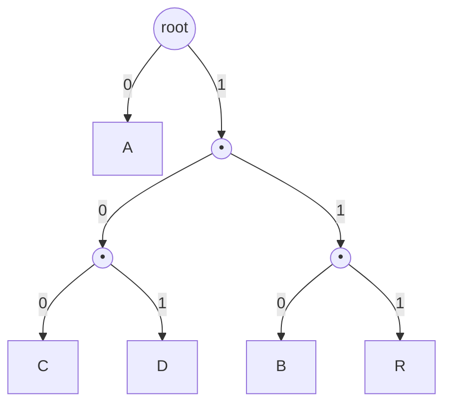

# Chapter 06 — Decoding

> Decoding reverses encoding, but it isn't symmetric in effort. The encoder does a
> table lookup per symbol; the decoder has to figure out *where each codeword ends*
> as it reads, one bit at a time. There are two classic ways to do it: **walk the
> tree** (simple, intuitive, the right place to start) and **table-driven canonical
> decode** (what production codecs use). We'll build the first and understand the
> second.

## What you'll learn

- The **tree-walk** decoder: follow bits from the root until you hit a leaf.
- Why the decoder must know **when to stop**, and how the stored symbol count
  gives it the answer.
- The **canonical table-driven** decoder that needs no explicit tree — just a few
  arrays derived from the code lengths.
- Where the single-symbol and empty-input edge cases hide in the decode path.

---

## Strategy 1: walk the tree

If you have the Huffman **tree**, decoding is a pleasant little state machine.
Start at the root. Read a bit: `0` means go to the left child, `1` the right
child. Keep going until you land on a **leaf** — that leaf's symbol is your
decoded byte. Emit it, jump back to the root, and repeat.



Decoding `0 1 0 0` against this tree:

```
bit 0 → left  → leaf A         emit A, back to root
bit 1 → right → internal
bit 0 → left  → internal
bit 0 → left  → leaf C         emit C, back to root
```

The prefix-free property is what makes this work without any lookahead: you can
*only* be at a leaf when a complete codeword has been consumed, and internal nodes
are never symbols, so you never stop early or ambiguously.

### The tree-walk decoder in pseudocode

```
decode(payload, tree, N):          # N = number of symbols to produce
    output = empty byte buffer
    reader = BitReader(payload)
    repeat N times:
        node = tree.root
        while node is an Internal node:
            bit = reader.read_bit()
            node = (bit == 0) ? node.left : node.right
        output.append(node.symbol)  # reached a leaf
    return output
```

**Cost.** Each symbol costs as many bit-reads as its code is long — so total work
is proportional to the number of bits in the stream, $O(\text{payload bits})$.
That's optimal in the sense that you must at least read every bit. The downside is
*pointer chasing*: one branch and one memory hop per bit, which is cache-unfriendly
on long streams. That's what motivates strategy 2.

### Where do you get the tree?

Two options, and they define two families of file format:

- **Rebuild it from a stored tree.** Some formats serialize the tree structure
  itself into the header. The decoder parses it back into nodes.
- **Rebuild it from the code table.** If the header stores each symbol's code (or,
  as we'll do, each symbol's code *length*), you can reconstruct an equivalent
  tree by inserting each codeword as a root-to-leaf path. Our format stores
  lengths and uses **canonical** codes, so we don't even need to build a tree —
  which brings us to strategy 2.

---

## The stop condition, again

Notice `decode` loops **exactly `N` times**, where `N` is the symbol count from
the header. This is the payoff of the design decision in
[Chapter 05](05-encoding-and-bit-io.md): because we stored `N`, the decoder knows
precisely how many symbols to emit and simply stops — the padding bits at the end
of the last byte are never consumed, so they can't corrupt the output.

If you *didn't* store `N`, you'd be forced into some in-band end-of-stream marker:
a special "EOF" symbol added to the alphabet with its own code, emitted once at
the very end. That works (it's a legitimate alternative design), but it complicates
the tree and the frequency counting. Storing the count is simpler and it's what our
format does.

---

## Strategy 2: canonical table-driven decode (no tree)

Production decoders rarely walk a tree of pointers. With **canonical codes**
([Chapter 07](07-canonical-huffman.md)) the codewords of each length are
*consecutive integers*, which lets you decode with plain arithmetic on a handful
of arrays. Here's the shape of it; the *construction* of these arrays is Chapter
07's job, but the *decode loop* belongs here.

For each code length `L` that occurs, precompute:

- `first_code[L]` — the numeric value of the **smallest** length-`L` codeword,
- `count[L]` — how many symbols have length `L`,
- a list `sorted_syms` of the present symbols, grouped by length then by value,
  and `first_index[L]` = where the length-`L` group starts in it.

Then decode each symbol by growing a candidate code one bit at a time and checking
whether it has landed inside the length-`L` band:

```
decode_one(reader):
    code = 0
    length = 0
    loop:
        code = (code << 1) | reader.read_bit()
        length += 1
        if count[length] > 0:
            delta = code - first_code[length]
            if 0 <= delta < count[length]:          # code is a valid length-`length` codeword
                return sorted_syms[first_index[length] + delta]
        # otherwise the codeword is longer; read another bit
```

Why this is correct: canonical assignment makes all length-`L` codewords the
consecutive integers `first_code[L], first_code[L]+1, …, first_code[L]+count[L]-1`.
So once your accumulated `code` has `L` bits and falls in that half-open range,
you've matched *exactly one* symbol, and its position in the range (`delta`) indexes
straight into the sorted symbol list. No tree, no pointers — just a compare and an
array index per candidate length.

This is still $O(\text{bits})$, but the inner state is a couple of integers and a
small array, which the CPU keeps in cache. Real decoders (zlib, JPEG libraries)
push it further with a **lookup table**: read `max_length` bits at once and index a
$2^{\text{max\_length}}$-entry table that yields `(symbol, actual_length)` in a
single step, then rewind the bit cursor by the unused bits. That's the fast path;
the bit-at-a-time loop above is the version you should write first because it's
obviously correct.

> **You'll implement the table-driven decoder for this guide's format**, because
> our header stores code *lengths* and the codes are canonical. The tree-walk is
> here so you understand *what* the table is standing in for — a tree you never
> have to build.

---

## The edge cases live in the decoder too

Two inputs from the test corpus exercise decode paths that the "compress a big
file" case never touches:

- **Empty input (`N = 0`).** The header says zero symbols. `decode` should produce
  an empty output and read **no** payload bits at all. Guard this at the top:
  `if N == 0: return empty`. Forgetting to, and then trying to read a bit from an
  empty payload, is a classic crash.
- **Single distinct symbol (`"AAAA"`).** Recall from
  [Chapter 03](03-the-algorithm.md) that we force the sole symbol's length to `1`
  (code `0`). The decoder then reads one `0` bit per symbol and emits the symbol,
  `N` times. This works in *both* strategies — in the tree walk, the "tree" is a
  root with the symbol as its `0`-child; in the canonical decoder, `count[1] = 1`,
  `first_code[1] = 0`. But if you *didn't* special-case length 1 during encoding,
  the symbol would have length 0, there'd be nothing to write or read, and the
  decoder would spin forever trying to accumulate a code. This is why the
  `single-byte` corpus test matters.

---

## Which should you write?

For the guide's format, **write the canonical table-driven decoder** — it matches
the stored code-lengths directly and it's what makes cross-language conformance
work. But if you're stuck, it's completely reasonable to *first* get a tree-walk
decoder passing round-trip (build a tree from the lengths by inserting canonical
codewords as paths), then switch. Both are correct; only the canonical one avoids
building a tree, and both stop after `N` symbols.

---

## Key takeaways

- **Tree walk:** from the root, `0` = left, `1` = right, emit on reaching a leaf,
  repeat. Simple and obviously correct; a hop per bit.
- The decoder loops a **known number of times** (`N` from the header) and never
  touches the padding — that's why we stored the count.
- **Canonical table decode** replaces the tree with arithmetic on `first_code`,
  `count`, and a sorted symbol list — no pointers, cache-friendly, and it's what
  our lengths-only header is built for.
- Handle **`N = 0`** and the **single-symbol** case explicitly; they're where
  decoders crash or loop forever.

Next: canonical Huffman — the idea that lets the header store just lengths and
makes all of this reproducible across languages.

---

*Next → [Chapter 07: Canonical Huffman](07-canonical-huffman.md)*
