# Space Fighter II — From Prototype to Game

> The second **build-along guide** for the Metal space fighter. The
> [first guide](../space-fighter-metal/) ends with a prototype: a ship you can
> fly, octahedra to shoot, a hull bar. This one turns it into a game — a
> **bank-and-pull flight model** with real inertia, a camera that remembers
> where it was, enemies that shoot back in escalating waves, upgrades that drop
> mid-run, a ship-select screen and menus, and **online multiplayer** built on a
> simulation that was made deterministic first.

<p align="center">
  <em>"Simulation is a pure function of state, input and one fixed step.
  Presentation is everything that's allowed to cheat."</em>
</p>

---

## What this guide is (and isn't)

This is a **from-scratch implementation guide**, in the same shape as the first:
every line of code is given, a handful at a time, with the reasoning around it,
and every chapter ends with a checkpoint you run. It starts from the project the
first guide leaves you with and changes it, chapter by chapter, into something
you'd choose to keep playing.

- **You need the first guide's project, finished through chapter 14.** This
  guide edits that code; it doesn't rebuild it. If you skipped chapter 14, the
  difference is one call in one file and [chapter 01](docs/01-audit.md) tells
  you where.
- **Most code arrives as diffs.** The first guide created files; this one
  rewrites them. Every change is a `diff` block with real context lines, or —
  when a function changes in more than half its lines — the whole new function
  under a **"replace the body of …"** location line. New files still arrive as
  `swift` blocks under a location line.
- **Every chapter is tested.** Each build chapter adds a test file under
  `Tests/SpaceFighterTests/` and the checkpoint runs `swift test` as well as the
  game. The tests aren't ceremony: a fixed-step simulation is *supposed* to be
  reproducible, and a test is the only honest way to say so.
- **The multiplayer chapters are the destination**, but they come last on
  purpose. Chapters 02 and 03 make the simulation deterministic and turn input
  into data, and every chapter between there and 12 is built on that footing —
  so when netcode arrives, nothing has to be torn out to make room for it.

> **Note:** this guide is for learning. It is not official Apple documentation.
> Cross-check the [Metal](https://developer.apple.com/documentation/metal),
> [Network.framework](https://developer.apple.com/documentation/network) and
> [GameController](https://developer.apple.com/documentation/gamecontroller)
> references (and the other links in [`resources.md`](resources.md)) before
> relying on a detail.

---

## Mental model (read this first)

The first guide gave you two ideas: an ECS separates data from behaviour, and a
frame is *simulate then draw*. This guide adds two more, and every chapter leans
on them.

**1. The simulation is a pure function of (state, input, one fixed step).**
`Game.step` runs sixty times a second of *simulated* time regardless of what the
display is doing. It reads an `InputFrame` — a struct, not a keyboard — and it
never touches a clock, a random number it didn't seed, or anything it can't
replay. Give it the same state and the same inputs and it produces the same
world, bit for bit. That single property is what makes a replay a file, a
determinism bug a test failure, and a multiplayer client something a server can
correct.

**2. Presentation is everything that's allowed to cheat.** The camera lags, the
field of view kicks, the screen shakes, the render blends between two simulation
steps that already happened. None of that is the game — it's how the game
*looks* — so it runs at the display's rate, with real elapsed time, and it may
smooth, randomise and interpolate however it likes. Keeping the two apart is a
discipline you'll apply in every chapter, and chapter 12 is where it pays out:
netcode replicates simulation state and never presentation state.

```mermaid
flowchart LR
  subgraph step["Game.step — fixed 60 Hz, deterministic"]
    direction LR
    F[FlightControl] --> AI[EnemyAI] --> EW[EnemyWeapon] --> W[Weapon]
    W --> P[Pickup] --> M[Movement] --> S[Spin] --> L[Lifetime]
    L --> C[Collision] --> D[Damage] --> WD[WaveDirector] --> X[flush]
  end
  subgraph frame["Game.frame — display rate, real dt"]
    direction LR
    I[interpolate] --> Cam[Camera] --> H[HUD + text] --> V[viewports]
  end
  In[InputFrame] --> step
  step -->|"world, alpha"| frame
  frame --> R[[Metal Renderer]]
```



The top row is the schedule at the end of chapter 11 — every box is one system
you'll write or rewrite. The bottom row is what happens between steps. Chapter
13 puts a server on the left of that diagram and clients on the right.

| Idea | One-liner | Chapter |
| --- | --- | --- |
| **Fixed step + interpolation** | Simulate in constant chunks, draw between them | [02](docs/02-the-simulation-clock.md) |
| **Input as data** | A struct per tick; keys, mice and pads all produce the same one | [03](docs/03-input-as-data.md) |
| **Angular inertia** | Input sets a *target* rate; the ship gets there in its own time | [04](docs/04-flight-bank-and-pull.md) |
| **A camera with state** | Orientation lags, position doesn't; the horizon rolls a beat late | [05](docs/05-a-camera-with-a-memory.md) |
| **Events, not side effects** | Collision reports pairs; damage decides what they mean | [06](docs/06-collision-that-keeps-its-promises.md) |
| **Enemies through the same code path** | AI writes the same components the player does | [07](docs/07-enemies-that-shoot-back.md) |
| **A run is a value** | Loadout, stats and outcome live on the run, not in globals | [08](docs/08-drops-and-the-loadout.md) |
| **One HUD pipeline** | Shapes and text are the same draw with a white pixel | [09](docs/09-text.md) |
| **Screens own the game** | A state machine decides who gets to `advance` | [10](docs/10-game-states-and-menus.md) |
| **No singular player** | Slots, not a field; split-screen is the proof | [11](docs/11-more-than-one-player.md) |
| **Host-authoritative** | One truth, predicted locally, interpolated remotely | [12](docs/12-netcode-the-shape-of-the-problem.md)–[14](docs/14-netcode-over-the-network.md) |

---

## What you'll build

Starting from the first guide's prototype, you'll end with:

- a **bank-and-pull flight model** — pitch to turn, roll to set the turn up, a
  weak rudder, throttle and boost, a ship that slides through a hard turn and
  keeps the bank you gave it — flyable on a keyboard, with mouse and gamepad as
  optional inputs you can add in an afternoon;
- a **chase camera that lags into banks and leads into turns**, a field-of-view
  kick on boost, screen shake on damage, and a reticle that shows where the nose
  is actually going;
- **collision that doesn't miss** — swept spheres for fast bolts, a spatial
  hash, layers that are honoured, and a single `Health` component for
  everything that can die;
- **enemies that shoot back** — drifters, chasers, gunners that lead their
  shots, strafers that orbit you, a boss every fifth wave — in waves that
  escalate, with explosions;
- **run-scoped upgrades** — pickups dropped on kills, a loadout that grows
  (rate of fire, spread, damage, missiles, a shield) and resets when you die;
  three ships to choose from with different flight tunables;
- **text**, a **title screen**, **ship select**, **pause** and a **run summary**;
- **online multiplayer** — LAN discovery, direct connect, PvE co-op and PvP
  deathmatch, on a host-authoritative design with client prediction and
  snapshot interpolation, tested first over an in-process loopback with
  simulated latency and loss.

Still no art assets: everything is code geometry, as before. Chapter 15 maps the
road from here to models, audio, bloom and a dedicated server.

---

## Prerequisites

- **The first guide's project, through chapter 14.** Every diff in this guide
  is against that code.
- **A Mac** with macOS 13+ and the **Swift 6.2** toolchain (Xcode 26 or
  later). The package's tools version is 6.2, and chapters 03 and 14 lean on
  Swift 6's concurrency checking.
- **Two machines on one network, or two accounts on one machine**, for chapter
  14's checkpoint. Everything before it runs on one machine, and chapter 13's
  loopback runs host and clients in a single process.

---

## Repository layout

```
space-fighter-metal-2/
├── README.md                 ← you are here (the map)
├── resources.md              ← primary sources & further reading
└── docs/                     ← the guide, one chapter per file
    ├── 01-audit.md
    ├── 02-the-simulation-clock.md
    ├── 03-input-as-data.md
    ├── 04-flight-bank-and-pull.md
    ├── 05-a-camera-with-a-memory.md
    ├── 06-collision-that-keeps-its-promises.md
    ├── 07-enemies-that-shoot-back.md
    ├── 08-drops-and-the-loadout.md
    ├── 09-text.md
    ├── 10-game-states-and-menus.md
    ├── 11-more-than-one-player.md
    ├── 12-netcode-the-shape-of-the-problem.md
    ├── 13-netcode-over-a-loopback.md
    ├── 14-netcode-over-the-network.md
    └── 15-where-to-go-next.md
```

By the end, the Swift package you built in the first guide has grown these
directories alongside the ones you already have:

```
Sources/SpaceFighter/
├── App/          ← Session, Screens         (chapter 10)
├── Input/        ← InputFrame, Sources      (chapter 03)
├── Net/          ← Transport, Server, Client (chapters 13–14)
└── Content/Fonts ← FontAtlas                (chapter 09)
Tests/SpaceFighterTests/
└── ChNN…Tests.swift, one per chapter
```

---

## The learning path

Concept chapters (🧠) build understanding; build chapters (🛠️) hand you code to
write. Go in order — each chapter's diffs assume the previous chapter's code.

| # | Chapter | What you'll learn | You'll have |
| --- | --- | --- | --- |
| 01 | 🧠 [Audit](docs/01-audit.md) | Exactly what the prototype gets wrong — in the flight model, the camera, the timestep, the collision maths, the singular player — and the order in which this guide fixes each one. | a map of every seam |
| 02 | 🛠️ [The simulation clock](docs/02-the-simulation-clock.md) | Fixed timestep with an accumulator; drawing between steps; a seeded RNG; the simulation/presentation split; a hash of the world and a test that two runs match. | a deterministic game |
| 03 | 🛠️ [Input as data](docs/03-input-as-data.md) | `InputFrame`; a keyboard virtual stick that ramps; optional mouse capture and gamepad; recording a run to a file and replaying it. | replays |
| 04 | 🛠️ [Flight: bank and pull](docs/04-flight-bank-and-pull.md) | Angular velocity as state; acceleration and damping; throttle; velocity that lags the nose; why roll must persist; a tuning procedure. | **a ship that feels like one** |
| 05 | 🛠️ [A camera with a memory](docs/05-a-camera-with-a-memory.md) | A camera rig with state; slerp-lagged orientation; turn lead; FOV kick; shake; projecting a world point to the screen. | a lead reticle |
| 06 | 🛠️ [Collision that keeps its promises](docs/06-collision-that-keeps-its-promises.md) | Entity generations; swept spheres; a spatial hash; layers and masks that work; collision events; `Health`, `Team`, `Owner`. | **shots that land** |
| 07 | 🛠️ [Enemies that shoot back](docs/07-enemies-that-shoot-back.md) | AI as a state component; four archetypes and a boss; intercept aiming; a wave director; explosions. | **a fight** |
| 08 | 🛠️ [Drops and the loadout](docs/08-drops-and-the-loadout.md) | Pickups; a drop table; a loadout that changes the weapon system; missiles; a shield; ship definitions; a run with an end. | **a run** |
| 09 | 🛠️ [Text](docs/09-text.md) | Rasterising a glyph atlas with CoreText; one HUD pipeline for shapes and text; a layout helper; a HUD with numbers. | words on screen |
| 10 | 🛠️ [Game states and menus](docs/10-game-states-and-menus.md) | A session state machine; screens; edge-triggered menu input; a menu world behind the UI; title, ship select, pause, summary. | **a game with a front door** |
| 11 | 🛠️ [More than one player](docs/11-more-than-one-player.md) | Deleting the player singleton; player slots; per-player camera and HUD; viewports and scissors; local split-screen. | two of you |
| 12 | 🧠 [Netcode: the shape of the problem](docs/12-netcode-the-shape-of-the-problem.md) | Lockstep vs host-authoritative vs peer-to-peer; the chosen design, drawn: roles, tick timeline, prediction and reconciliation, interpolation, the replication table, the message set, the modes. | *(the design)* |
| 13 | 🛠️ [Netcode over a loopback](docs/13-netcode-over-a-loopback.md) | A transport protocol; a loopback with latency, jitter and loss; binary encoding; replication; the server; the client; tests that prove convergence. | **multiplayer in one process** |
| 14 | 🛠️ [Netcode over the network](docs/14-netcode-over-the-network.md) | UDP with Network.framework; Bonjour discovery; lobby screens; PvE co-op and PvP deathmatch; a scoreboard and a kill feed. | **multiplayer over a network** |
| 15 | 🧠 [Where to go next](docs/15-where-to-go-next.md) | Audio, models, bloom, persistence, a dedicated server, lag compensation, replays as a feature, and porting the design to the Vulkan sibling. | *(roadmap)* |

---

## How to use this guide

- **Keep the first guide open.** This one says "chapter 10 of the first guide"
  when it changes something that chapter built, and assumes you can find it.
- **Run the tests, not just the game.** From chapter 02 on, `swift test` is half
  of every checkpoint. A determinism test that fails is telling you something
  the window can't.
- **Record a run early.** Chapter 03 gives you `--record` and `--replay`. Keep
  one recording from before chapter 04 and replay it after; the difference *is*
  the flight model.
- **Read chapter 12 twice.** Once before chapter 13, once after. The diagrams
  make more sense with the code beside them.

---

## Credits & lineage

The timestep and netcode chapters stand on Glenn Fiedler's *Fix Your Timestep!*
and networked-physics writing, Gabriel Gambetta's *Fast-Paced Multiplayer*
series, Valve's *Source Multiplayer Networking* and the Overwatch gameplay
architecture talk. The flight feel is chasing Ace Combat's expert controls and
Battlefield's jets, not cloning either. Full references live in
[`resources.md`](resources.md).

---

*Start here → [Chapter 01: Audit](docs/01-audit.md)*
