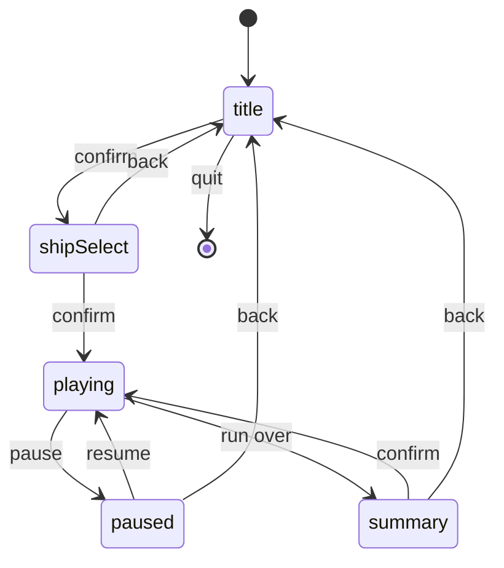

# 10 · Game states and menus 🛠️

> **You'll leave this chapter with:** a title screen, a hangar where you pick
> a ship and watch it turn, a pause that freezes the simulation and not the
> picture, and a summary screen at the end of a run — held together by a
> state machine that decides, every frame, which screen gets the input and
> whether the game is allowed to advance.
>
> **Files created:** `Sources/SpaceFighter/App/Session.swift`,
> `App/MenuWorld.swift`, `App/Screens/TitleScreen.swift`,
> `App/Screens/ShipSelectScreen.swift`, `App/Screens/PlayingScreen.swift`,
> `App/Screens/PausedScreen.swift`, `App/Screens/SummaryScreen.swift`,
> `Tests/SpaceFighterTests/Ch10SessionTests.swift`
> **Files changed:** `Systems/HUDSystem.swift`, `Input/KeyBindings.swift`,
> `GameView.swift`, `main.swift`

Until now the app *was* the game: `main.swift` built a `Game`, the
coordinator advanced it, and when the run ended chapter 08 printed a line
and built another. That was fine for a prototype and it's wrong for
anything else, because a game has moments when it isn't playing — a title
screen, a menu, a pause, a scoreboard — and each of them wants the same
input and the same renderer to mean something different.

The shape that handles this is old and small: a **state machine** whose
states are *screens*. Each screen takes the frame's input and draws a
picture; a **session** owns the current screen and swaps it when the screen
asks. The `Game` becomes something a screen *has*, not something the app
*is*.

---

## Screens and transitions

**`Sources/SpaceFighter/App/Session.swift`** — new file:

```swift
import Foundation
import simd

/// What a screen may ask the session to do when it's done with a frame.
enum Transition {
    case toTitle
    case toShipSelect
    case startRun(ShipDefinition)
    case pause
    case resume
    case toSummary
    case quit
}

/// One screen of the game: something that takes input every display frame and
/// produces a picture. The session decides which screen is current.
protocol Screen: AnyObject {
    /// `pressed` holds the buttons that went down this frame and weren't down
    /// last frame — the edges — so a menu moves one row per press.
    func update(input: InputFrame, pressed: Buttons, realDt: Float) -> Transition?
    func render(viewport: SIMD2<Float>, realDt: Float) -> FrameRenderData
    var title: String { get }
}
```

A screen is two methods and a name. `update` gets the input — both the raw
frame and the *edges*, the buttons that just went down — and may return a
`Transition`; `render` produces the same `FrameRenderData` the renderer has
always taken. A screen never knows which screen comes next; it says what
happened (`.toSummary`) and the session decides what that means.

`Transition` is an enum rather than a "next screen" object so that screens
can't construct each other. The hangar doesn't build the `Game`; it says
`.startRun(ship)` and the session builds it — which is the only way the
session can own the game, and owning the game is the point.

**`Session.swift`** — after `Screen`:

```swift
/// Owns the current screen and the game behind it, and moves between them.
/// This is the state machine; the screens are its states.
final class Session {
    private(set) var screen: Screen
    private(set) var game: Game?
    let menu = MenuWorld()
    var selectedShip: Int
    var onQuit: () -> Void = {}

    private var nextSeed: UInt64
    private let recordRuns: Bool
    private var lastButtons: Buttons = []

    init(seed: UInt64, ship: ShipDefinition, record: Bool) {
        nextSeed = seed
        recordRuns = record
        selectedShip = Ships.all.firstIndex { $0.name == ship.name } ?? 1
        screen = TitleScreen(menu: menu)
    }

    /// A replay skips the front door: straight into the recorded run.
    func startReplay(_ log: InputLog) {
        let ship = Ships.all[Int(log.ship) % Ships.all.count]
        let game = Game(seed: log.seed, ship: ship)
        game.replay = log
        self.game = game
        screen = PlayingScreen(game: game)
    }
}
```

The session holds the screen, the game (optional — there is no game on the
title screen), the little world the menus are drawn over, and the seed for
the *next* run. `onQuit` is how `.quit` reaches AppKit without the session
importing it.

**`Session.swift`**, in `Session` — after `startReplay`:

```diff
         screen = PlayingScreen(game: game)
     }
+
+    func update(input: InputFrame, realDt: Float, viewport: SIMD2<Float>) -> FrameRenderData {
+        let pressed = input.buttons.subtracting(lastButtons)
+        lastButtons = input.buttons
+        if let transition = screen.update(input: input, pressed: pressed, realDt: realDt) {
+            apply(transition)
+        }
+        return screen.render(viewport: viewport, realDt: realDt)
+    }
+
+    var title: String { screen.title }
 }
```

This is the whole frame, from the coordinator's point of view: one call in,
one picture out. The edge detection is one line — the buttons down now that
weren't down last frame — and it's done here, once, so no screen has to
remember what was pressed a frame ago. Chapter 04's debug toggle and
chapter 08's missile button each did this by hand; this is the general
version.

`render` is called on whichever screen `update` *left current* — so a
transition takes effect on the same frame it's requested, and there's never
a frame where the old screen draws after it asked to leave.

**`Session.swift`**, in `Session` — after `title`:

```diff
     var title: String { screen.title }
+
+    private func apply(_ transition: Transition) {
+        switch transition {
+        case .toTitle:
+            game = nil
+            screen = TitleScreen(menu: menu)
+        case .toShipSelect:
+            screen = ShipSelectScreen(menu: menu, session: self)
+        case .startRun(let ship):
+            let game = Game(seed: nextSeed, ship: ship)
+            nextSeed &+= 1
+            if recordRuns {
+                game.recording = InputLog(
+                    seed: nextSeed &- 1,
+                    ship: UInt8(Ships.all.firstIndex { $0.name == ship.name } ?? 1))
+            }
+            self.game = game
+            screen = PlayingScreen(game: game)
+        case .pause:
+            if let game { screen = PausedScreen(game: game) }
+        case .resume:
+            if let game { screen = PlayingScreen(game: game) }
+        case .toSummary:
+            if let game { screen = SummaryScreen(game: game) }
+        case .quit:
+            onQuit()
+        }
+    }
 }
```

Seven transitions, seven cases. Drawn out, it's the diagram every game of
this shape has:



Two are worth a sentence. `.toTitle` drops the game — a run
abandoned from the pause menu is gone, which is what a roguelike means by
"abandoned". `.startRun` builds a fresh `Game` from the *next* seed and
advances the seed, so playing again after a summary gives you a different
sky; with `--seed`, the sequence is still reproducible, just one run at a
time. A recording, if asked for, is created with the seed the game was
actually built from — `nextSeed` has already moved on by one.

---

## A world behind the menu

A menu drawn over black is a web page. A menu drawn over the game's own
renderer — the same stars, the same grid, a ship turning slowly in the
same light — is the game. It costs a `World` with one entity in it.

**`Sources/SpaceFighter/App/MenuWorld.swift`** — new file:

```swift
import simd

/// The little world behind the menus: one ship turning slowly under the same
/// renderer that draws the game. Presentation only; it is never stepped.
final class MenuWorld {
    let world = World(seed: 0)
    private(set) var ship: Entity
    private var shown = 1
    private let lightDirection = simd_normalize(Vec3(-0.3, -1.0, -0.55))

    init() {
        ship = world.createEntity()
        var t = Transform()
        t.scale = Vec3(repeating: 2.2)
        world.add(t, to: ship)
        world.add(Spinner(axis: Vec3(0, 1, 0), speed: 0.6), to: ship)
        show(Ships.all[shown])
    }

    /// Swap the displayed ship's mesh and colour without touching its spin.
    func show(_ definition: ShipDefinition) {
        world.add(Renderable(mesh: definition.mesh, color: definition.color), to: ship)
    }
}
```

A `World`, a `Transform`, a `Spinner`, a `Renderable`. Every one of those is
a type from the game, reused as-is; the menu doesn't need a special "3D
preview" facility because the ECS already is one. `show` swaps the
`Renderable` — `world.add` on an entity that already has one overwrites —
and the spin carries on.

**`MenuWorld.swift`**, in `MenuWorld` — after `show`:

```diff
         world.add(Renderable(mesh: definition.mesh, color: definition.color), to: ship)
     }
+
+    /// Advance the spin and produce a frame with `hud` laid over it.
+    func render(viewport: SIMD2<Float>, realDt: Float, hud: [HUDVertex]) -> FrameRenderData {
+        SpinSystem.update(world, dt: realDt)
+        let eye = Vec3(0, 1.5, 9)
+        let view = Math.lookAt(eye: eye, center: Vec3(0, 0.3, 0), up: Vec3(0, 1, 0))
+        let aspect = viewport.x / max(viewport.y, 1)
+        let projection = Math.perspective(fovyRadians: Float(50).radians, aspect: aspect, near: 0.1, far: 1200)
+        let frame = FrameUniforms(
+            viewProjection: projection * view, cameraPosition: eye, lightDirection: lightDirection)
+        return FrameRenderData(
+            frame: frame,
+            instances: SceneSystem.buildInstances(world, alpha: 1),
+            focus: Vec3(0, 6, 0),
+            hud: hud)
+    }
 }
```

`SpinSystem.update` with the *real* frame time: this world is presentation,
it's never stepped by the clock, and a ship that turns at the display's
rate is exactly right. A fixed camera nine units back, `SceneSystem` to bake
the one instance, and the HUD the caller built. `focus` is where the
renderer centres the ground grid; six units up puts the horizon under the
ship rather than through it.

---

## The front door

**`Sources/SpaceFighter/App/Screens/TitleScreen.swift`** — new file:

```swift
import simd

/// The front door. Enter to choose a ship, Escape to leave.
final class TitleScreen: Screen {
    private let menu: MenuWorld
    private var time: Float = 0

    init(menu: MenuWorld) {
        self.menu = menu
    }

    var title: String { "Space Fighter" }

    func update(input: InputFrame, pressed: Buttons, realDt: Float) -> Transition? {
        time += realDt
        if pressed.contains(.confirm) { return .toShipSelect }
        if pressed.contains(.pause) || pressed.contains(.back) { return .quit }
        return nil
    }

    func render(viewport: SIMD2<Float>, realDt: Float) -> FrameRenderData {
        var hud: [HUDVertex] = []
        let vp = viewport
        HUDSystem.text("SPACE FIGHTER", at: SIMD2(vp.x / 2, vp.y * 0.22), size: 64,
                       color: Vec4(0.92, 0.95, 1.0, 1), align: .center, into: &hud, vp)
        let blink = (sin(time * 3) + 1) / 2
        HUDSystem.text("PRESS ENTER", at: SIMD2(vp.x / 2, vp.y * 0.8), size: 26,
                       color: Vec4(0.9, 0.85, 0.5, 0.4 + 0.6 * blink), align: .center, into: &hud, vp)
        HUDSystem.text("ESC QUITS", at: SIMD2(vp.x / 2, vp.y * 0.86), size: 18,
                       color: Vec4(0.6, 0.6, 0.7, 0.8), align: .center, into: &hud, vp)
        return menu.render(viewport: viewport, realDt: realDt, hud: hud)
    }
}
```

The simplest screen, and the template for the rest: a little state (a
clock for the blink), two edges that mean something, and a render that
builds a HUD and hands it to the menu world. Both `.pause` and `.back` leave
— which keys those are is the next section's business. `HUDSystem.text` is
chapter 09's helper made non-private:

**`Sources/SpaceFighter/Systems/HUDSystem.swift`**, in `HUDSystem`:

```diff
-    private static func text(
+    /// A line of text in the HUD font, in pixels from the top-left.
+    static func text(
         _ s: String, at p: SIMD2<Float>, size: Float, color: Vec4, align: TextAlign = .left,
         into v: inout [HUDVertex], _ viewport: SIMD2<Float>
     ) {
```

---

## Two kinds of "get me out of here"

Chapter 03 bound `.pause` and `.back` to the same key, Escape, and said a
later chapter would sort it out. This is that chapter, and the sorting out
is one observation: a pause menu needs *two* ways out — resume, and abandon
the run — and they must not be the same key, or a nervous double-tap of
Escape throws away a forty-minute run. So Escape keeps its two meanings
where they don't conflict — pause in flight, leave in menus — and *abandon*
gets a key of its own.

**`Sources/SpaceFighter/Input/KeyBindings.swift`**, in `Key`:

```diff
     static let escape: UInt16 = 53
+    static let backspace: UInt16 = 51
 }
```

**`KeyBindings.swift`**, in `KeyBindings`:

```diff
-        (.back, [Key.escape]),
+        (.back, [Key.backspace]),
```

Every menu below accepts either: Escape or Backspace leaves the hangar,
Escape or Backspace leaves the summary. Only the pause screen tells them
apart, and only there does it matter.

---

## The hangar

**`Sources/SpaceFighter/App/Screens/ShipSelectScreen.swift`** — new file:

```swift
import simd

/// The hangar. Left and right browse the ships; the model behind the text
/// swaps as you do. Enter flies it.
final class ShipSelectScreen: Screen {
    private let menu: MenuWorld
    private unowned let session: Session

    init(menu: MenuWorld, session: Session) {
        self.menu = menu
        self.session = session
        menu.show(Ships.all[session.selectedShip])
    }

    var title: String { "Space Fighter — Hangar" }

    func update(input: InputFrame, pressed: Buttons, realDt: Float) -> Transition? {
        let count = Ships.all.count
        if pressed.contains(.menuRight) {
            session.selectedShip = (session.selectedShip + 1) % count
            menu.show(Ships.all[session.selectedShip])
        }
        if pressed.contains(.menuLeft) {
            session.selectedShip = (session.selectedShip + count - 1) % count
            menu.show(Ships.all[session.selectedShip])
        }
        if pressed.contains(.confirm) { return .startRun(Ships.all[session.selectedShip]) }
        if pressed.contains(.pause) || pressed.contains(.back) { return .toTitle }
        return nil
    }
}
```

The selection lives on the *session*, not the screen, so it survives a run:
play the Bulwark, die, go back to the hangar, and the Bulwark is still
selected. `unowned` because the session owns the screen and the screen must
not own the session back.

`menuLeft` and `menuRight` are chapter 03's bits — the same keys as roll,
which is fine, because no ship is flying while this screen is up.

**`ShipSelectScreen.swift`**, in `ShipSelectScreen` — after `update`:

```diff
+    func render(viewport: SIMD2<Float>, realDt: Float) -> FrameRenderData {
+        let ship = Ships.all[session.selectedShip]
+        var hud: [HUDVertex] = []
+        let vp = viewport
+        let white = Vec4(0.92, 0.95, 1.0, 1)
+        let dim = Vec4(0.6, 0.6, 0.7, 0.9)
+
+        HUDSystem.text("< \(ship.name.uppercased()) >", at: SIMD2(vp.x / 2, vp.y * 0.16), size: 44,
+                       color: white, align: .center, into: &hud, vp)
+        HUDSystem.text(ship.blurb.uppercased(), at: SIMD2(vp.x / 2, vp.y * 0.22), size: 20,
+                       color: dim, align: .center, into: &hud, vp)
+
+        // Four bars, each as a fraction of the roster's best.
+        let stats: [(String, Float)] = [
+            ("SPEED", ship.flight.maxSpeed / 80),
+            ("AGILITY", ship.flight.maxRate.x / 3),
+            ("HULL", ship.hull / 160),
+            ("GUNS", Float(ship.loadout.damage) * 0.14 / ship.loadout.fireInterval / 3),
+        ]
+        for (i, (label, value)) in stats.enumerated() {
+            let y = vp.y * 0.72 + Float(i) * 30
+            HUDSystem.text(label, at: SIMD2(vp.x * 0.32, y), size: 18, color: dim, align: .right, into: &hud, vp)
+            let x0 = vp.x * 0.34
+            let x1 = vp.x * 0.68
+            let barY = y - 7
+            let track = TextLayout.toNDC(SIMD2(x0, barY), vp)
+            let trackEnd = TextLayout.toNDC(SIMD2(x1, barY), vp)
+            let hh = 6 / vp.y
+            HUDSystem.appendRect(&hud, cx: (track.x + trackEnd.x) / 2, cy: track.y, hw: (trackEnd.x - track.x) / 2,
+                                 hh: hh, color: Vec4(0.1, 0.1, 0.12, 0.7))
+            let fill = min(max(value, 0), 1)
+            let fillEnd = TextLayout.toNDC(SIMD2(x0 + (x1 - x0) * fill, barY), vp)
+            HUDSystem.appendRect(&hud, cx: (track.x + fillEnd.x) / 2, cy: track.y, hw: (fillEnd.x - track.x) / 2,
+                                 hh: hh, color: ship.color)
+        }
+
+        HUDSystem.text("ENTER TO LAUNCH   ESC BACK", at: SIMD2(vp.x / 2, vp.y * 0.93), size: 18,
+                       color: dim, align: .center, into: &hud, vp)
+        return menu.render(viewport: viewport, realDt: realDt, hud: hud)
+    }
 }
```

Four bars from the ship definition, in the ship's colour, laid out in
pixels and converted with `TextLayout.toNDC` so they line up with the text
beside them. The first three denominators (80, 3, 160) are "a bit more than
the best ship in the roster", so the best bar is nearly full and nothing
overflows. `GUNS` is damage per second relative to the Kestrel's, over
three — so the Kestrel sits at a third and the Bulwark at about half,
leaving room on the bar for the loadout chapter 08's pickups will grow. Change a
ship's numbers and its bars change; that's the whole point of the bars being
computed from `ShipDefinition` rather than typed in.

---

## Playing, paused, over

**`Sources/SpaceFighter/App/Screens/PlayingScreen.swift`** — new file:

```swift
import simd

/// The game itself. Advances the simulation, and hands over to the summary
/// once the run is over — which the game delays a moment, so you see your own
/// wreckage fly before the world stops.
final class PlayingScreen: Screen {
    let game: Game

    init(game: Game) {
        self.game = game
    }

    var title: String {
        "Space Fighter — \(game.ship.name)    Score \(game.run.score)    Wave \(game.run.wave)"
    }

    func update(input: InputFrame, pressed: Buttons, realDt: Float) -> Transition? {
        if pressed.contains(.pause) && !game.isOver { return .pause }
        game.advance(realDt: realDt, input: input)
        return game.isOver ? .toSummary : nil
    }

    func render(viewport: SIMD2<Float>, realDt: Float) -> FrameRenderData {
        game.frame(viewport: viewport, realDt: realDt)
    }
}
```

The screen that *is* the game. `update` is what the coordinator used to do:
advance the game with this frame's input. It's the only screen that calls
`advance`, which is what makes the pause below trivially correct. When the
run is over it asks for the summary — and chapter 08's `Game` doesn't say so
until a second and a half after the last hull goes, which is the time you
spend watching your own wreckage fly.

**`Sources/SpaceFighter/App/Screens/PausedScreen.swift`** — new file:

```swift
import simd

/// The game, frozen, with a menu over it. Nothing advances: `frame` still
/// runs so the picture is live, `advance` is never called. Escape or Enter
/// resumes; Backspace — a different key, on purpose — abandons the run.
final class PausedScreen: Screen {
    private let game: Game

    init(game: Game) {
        self.game = game
    }

    var title: String { "Space Fighter — Paused" }

    func update(input: InputFrame, pressed: Buttons, realDt: Float) -> Transition? {
        if pressed.contains(.back) { return .toTitle }
        if pressed.contains(.confirm) || pressed.contains(.pause) { return .resume }
        return nil
    }

    func render(viewport: SIMD2<Float>, realDt: Float) -> FrameRenderData {
        var data = game.frame(viewport: viewport, realDt: 0)
        let vp = viewport
        HUDSystem.appendRect(&data.hud, cx: 0, cy: 0, hw: 1, hh: 1, color: Vec4(0, 0, 0.02, 0.55))
        HUDSystem.text("PAUSED", at: SIMD2(vp.x / 2, vp.y * 0.42), size: 56,
                       color: Vec4(0.92, 0.95, 1.0, 1), align: .center, into: &data.hud, vp)
        HUDSystem.text("ESC RESUMES   BACKSPACE ABANDONS THE RUN", at: SIMD2(vp.x / 2, vp.y * 0.52), size: 20,
                       color: Vec4(0.6, 0.6, 0.7, 0.9), align: .center, into: &data.hud, vp)
        return data
    }
}
```

Pause is chapter 02's split, made into a screen. `advance` is never called,
so the simulation is frozen and its clock banks nothing. `frame` *is*
called, with a `realDt` of zero, so the world is drawn exactly where it was
— interpolated by the same `alpha` — with the camera and the flash held
still. Darken it, write on it, done. There's no `isPaused` flag anywhere in
`Game`, because the game doesn't need to know.

Escape resumes — the same key that paused, which is what every game does —
and so does Enter. Abandoning the run is Backspace, and it's checked
*first*, so that a frame in which both arrive (it happens) abandons rather
than resumes; if the two were the same key, this screen couldn't tell them
apart, which is why the section above gave them different ones.

**`Sources/SpaceFighter/App/Screens/SummaryScreen.swift`** — new file:

```swift
import simd

/// What the run amounted to, over the wreckage. Enter flies the same ship
/// again; Escape goes back to the title.
final class SummaryScreen: Screen {
    private let game: Game

    init(game: Game) {
        self.game = game
    }

    var title: String { "Space Fighter — Run over" }

    func update(input: InputFrame, pressed: Buttons, realDt: Float) -> Transition? {
        if pressed.contains(.confirm) { return .startRun(game.ship) }
        if pressed.contains(.pause) || pressed.contains(.back) { return .toTitle }
        return nil
    }
}
```

**`SummaryScreen.swift`**, in `SummaryScreen` — after `update`:

```diff
+    func render(viewport: SIMD2<Float>, realDt: Float) -> FrameRenderData {
+        var data = game.frame(viewport: viewport, realDt: realDt)
+        let vp = viewport
+        let r = game.run
+        let white = Vec4(0.92, 0.95, 1.0, 1)
+        let dim = Vec4(0.6, 0.6, 0.7, 0.9)
+        HUDSystem.appendRect(&data.hud, cx: 0, cy: 0, hw: 1, hh: 1, color: Vec4(0, 0, 0.02, 0.6))
+        HUDSystem.text("RUN OVER", at: SIMD2(vp.x / 2, vp.y * 0.24), size: 56, color: white,
+                       align: .center, into: &data.hud, vp)
+
+        let rows: [(String, String)] = [
+            ("SHIP", game.ship.name.uppercased()),
+            ("SCORE", "\(r.score)"),
+            ("WAVE", "\(r.wave)"),
+            ("KILLS", "\(r.kills)"),
+            ("ACCURACY", "\(Int((r.accuracy * 100).rounded()))%"),
+            ("TIME", String(format: "%d:%02d", Int(r.seconds) / 60, Int(r.seconds) % 60)),
+        ]
+        for (i, (label, value)) in rows.enumerated() {
+            let y = vp.y * 0.36 + Float(i) * 40
+            HUDSystem.text(label, at: SIMD2(vp.x * 0.42, y), size: 24, color: dim, align: .right, into: &data.hud, vp)
+            HUDSystem.text(value, at: SIMD2(vp.x * 0.46, y), size: 24, color: white, into: &data.hud, vp)
+        }
+        HUDSystem.text("ENTER FLIES AGAIN   ESC TO TITLE", at: SIMD2(vp.x / 2, vp.y * 0.9), size: 20,
+                       color: dim, align: .center, into: &data.hud, vp)
+        return data
+    }
 }
```

The summary draws the game's last frame — the world stopped where the run
ended, the wreckage hanging where the camera last saw it — and a table of
`RunStats` in two columns: labels right-aligned to one x, values left-aligned
to another, which is how a table lines up without a layout engine. This is
the screen chapter 08 said would exist, and everything in it was counted
there. (`realDt` still goes in, for the flash and the toast to fade.)

---

## Wiring the session in

**`Sources/SpaceFighter/GameView.swift`** — replace the head of
`RenderCoordinator` through `init`, and delete `restartIfOver`:

```swift
/// MetalKit calls `draw(in:)` once per displayed frame. That is the game loop.
final class RenderCoordinator: NSObject, MTKViewDelegate {
    private let session: Session
    private let renderer: Renderer
    private let input: InputSource
    private var lastTime: CFTimeInterval
    private var announcedReplayEnd = false

    init(session: Session, renderer: Renderer, input: InputSource) {
        self.session = session
        self.renderer = renderer
        self.input = input
        self.lastTime = CACurrentMediaTime()
    }
```

**`GameView.swift`**, in `draw`:

```diff
         let frame = input.poll(dt: dt)
-        game.advance(realDt: dt, input: frame)
-        restartIfOver(dt: dt)
-        if game.replayFinished && !announcedReplayEnd {
+        let data = session.update(input: frame, realDt: dt, viewport: viewport)
+        if let game = session.game, game.replayFinished && !announcedReplayEnd {
             announcedReplayEnd = true
             print("replay finished at tick \(game.clock.tick)")
         }
-        let data = game.frame(viewport: viewport, realDt: dt)
         renderer.render(
```

```diff
-        view.window?.title = String(
-            format: "Space Fighter — %@    Score %d    Wave %d",
-            game.ship.name, game.run.score, game.run.wave)
+        view.window?.title = session.title
```

The coordinator gets shorter. It measures time, polls input, asks the
session for a picture, and draws it. It doesn't know there's a game.

**`Sources/SpaceFighter/main.swift`** — replace from `let seed = replayLog…`
through the `recording` block:

```swift
print("seed \(replayLog?.seed ?? options.seed)")

let session = Session(seed: options.seed, ship: options.ship, record: options.record != nil)
session.onQuit = { NSApp.terminate(nil) }
if let replayLog { session.startReplay(replayLog) }
```

**`main.swift`**:

```diff
-let coordinator = RenderCoordinator(game: game, renderer: renderer, input: input)
+let coordinator = RenderCoordinator(session: session, renderer: renderer, input: input)
```

**`main.swift`**, in the key monitor — Escape is a button now, not an exit:

```diff
     case .keyDown:
-        if event.keyCode == Key.escape { NSApp.terminate(nil) }
         if event.modifierFlags.contains(.command) { return event }
```

**`main.swift`**, in the termination observer:

```diff
-        guard let url = options.record, let log = game.recording else { return }
+        guard let url = options.record, let log = session.game?.recording else { return }
```

Chapter 03 said this line would go, and now it does: Escape reaches the
keyboard source like any other key, becomes `.pause`, and the current
screen decides what it means. On the title screen it quits — via
`onQuit`, which is the one line of AppKit the session is allowed to trigger
and doesn't have to import.

---

## The tests

**`Tests/SpaceFighterTests/Ch10SessionTests.swift`** — new file:

```swift
import Testing
import simd

@testable import SpaceFighter

private let frameDt: Float = 1.0 / 60.0
private let viewport = SIMD2<Float>(1600, 1000)

private func press(_ session: Session, _ buttons: Buttons) {
    var f = InputFrame()
    f.buttons = buttons
    _ = session.update(input: f, realDt: frameDt, viewport: viewport)
    _ = session.update(input: InputFrame(), realDt: frameDt, viewport: viewport)  // release
}

@Test func theFrontDoorLeadsToTheHangarAndIntoARun() {
    let session = Session(seed: 3, ship: Ships.all[1], record: false)
    #expect(session.screen is TitleScreen)
    press(session, .confirm)
    #expect(session.screen is ShipSelectScreen)
    press(session, .menuRight)
    #expect(session.selectedShip == 2)
    press(session, .confirm)
    #expect(session.screen is PlayingScreen)
    #expect(session.game?.ship.name == Ships.all[2].name)
}

@Test func holdingConfirmIsOnePress() {
    let session = Session(seed: 3, ship: Ships.all[1], record: false)
    var f = InputFrame()
    f.buttons = .confirm
    for _ in 0..<10 { _ = session.update(input: f, realDt: frameDt, viewport: viewport) }
    #expect(session.screen is ShipSelectScreen, "one edge, one transition — not ten")
}
```

`press` is a press and a release — two frames — which is what a person does
and what edge detection needs. The second test is the edge detection
itself: ten frames of a held Enter is one transition, not a sprint from the
title into a run.

**`Ch10SessionTests.swift`** — after `holdingConfirmIsOnePress`:

```swift
@Test func pauseFreezesTheClockButNotThePicture() {
    let session = Session(seed: 3, ship: Ships.all[1], record: false)
    press(session, .confirm)
    press(session, .confirm)
    for _ in 0..<30 { _ = session.update(input: InputFrame(), realDt: frameDt, viewport: viewport) }
    let ticks = session.game!.clock.tick
    #expect(ticks > 0)
    press(session, .pause)
    #expect(session.screen is PausedScreen)
    for _ in 0..<30 {
        let data = session.update(input: InputFrame(), realDt: frameDt, viewport: viewport)
        #expect(!data.hud.isEmpty)
    }
    #expect(session.game!.clock.tick == ticks)
    press(session, .confirm)
    #expect(session.screen is PlayingScreen)
    for _ in 0..<5 { _ = session.update(input: InputFrame(), realDt: frameDt, viewport: viewport) }
    #expect(session.game!.clock.tick > ticks)
}

@Test func deathLeadsToTheSummaryAndBackAround() {
    let session = Session(seed: 3, ship: Ships.all[1], record: false)
    press(session, .confirm)
    press(session, .confirm)
    let game = session.game!
    game.world.store(Health.self).mutate(game.player) { $0.current = 0 }
    for _ in 0..<120 { _ = session.update(input: InputFrame(), realDt: frameDt, viewport: viewport) }
    #expect(session.screen is SummaryScreen)
    press(session, .confirm)
    #expect(session.screen is PlayingScreen)
    #expect(session.game !== game, "a fresh run")
    #expect(session.game?.ship.name == game.ship.name, "same ship")
    press(session, .pause)
    press(session, .back)
    #expect(session.screen is TitleScreen)
    #expect(session.game == nil)
}

@Test func escapeOnTheTitleQuits() {
    let session = Session(seed: 3, ship: Ships.all[1], record: false)
    var quit = false
    session.onQuit = { quit = true }
    press(session, .back)
    #expect(quit)
}
```

The pause test is the claim in the section title, checked both ways: thirty
frames paused and the tick count hasn't moved but every frame produced a
HUD; five frames resumed and it has. The last test is why `onQuit` is a
closure — a test can catch it without an `NSApplication` to terminate.

---

## Checkpoint

```console
$ swift test
✔ Test run with 62 tests in 0 suites passed
```

**Sixty-two tests.** Then:

```console
$ swift run SpaceFighter
```

1. **A title screen**: a ship turning slowly over the grid, `SPACE FIGHTER`,
   a blinking `PRESS ENTER`. Escape quits.
2. **Enter: the hangar.** `< KESTREL >` and its four bars. `D` (or right
   arrow) cycles to the Bulwark — the model behind the text changes colour —
   and its bars change shape. `A` goes back. Enter launches it.
3. **Escape mid-run pauses.** The world stops dead, darkens, and says so.
   Escape or Enter resumes; Backspace abandons the run and returns to the
   title, and your ship choice is still selected in the hangar.
4. **Die.** A second and a half of debris, then `RUN OVER` and the table.
   Enter flies the same ship again against a new sky; Escape goes home.

**If Enter does nothing on the title**, `.confirm` isn't bound — check
chapter 03's table has `Key.enter` under it. **If holding Enter races
through the hangar into a run**, `lastButtons` isn't being updated, so every
frame is an edge. **If the pause menu's world keeps moving**, something is
calling `advance` outside `PlayingScreen`. **If Escape quits from
everywhere**, the `NSApp.terminate` line in `main.swift` is still there.
**If Escape on the pause screen abandons the run**, `.back` is still bound
to Escape — check the Backspace change in `KeyBindings`.

---

## Challenge

Add a **controls** screen off the title — a fifth `Screen` — that lists the
key bindings from chapter 03's `KeyBindings` table, one row per action, with
the key names looked up from the codes. Three things to get right: key
codes are numbers and you'll need a table from code to name (twenty entries,
for the keys this game uses); the bindings table is on the `KeyboardSource`,
which the session doesn't have — decide whether the screen shows
`KeyBindings.standard` or the live one, and what that implies for a future
rebinding screen; and the same key appears under several actions (`W` is
pitch down *and* menu up), which the list should make look intentional
rather than like a bug.

---

**Next:** more than one of you. →
[Chapter 11: More than one player](11-more-than-one-player.md)

---

*Back to the [guide map](../README.md) · references in [`resources.md`](../resources.md)*
