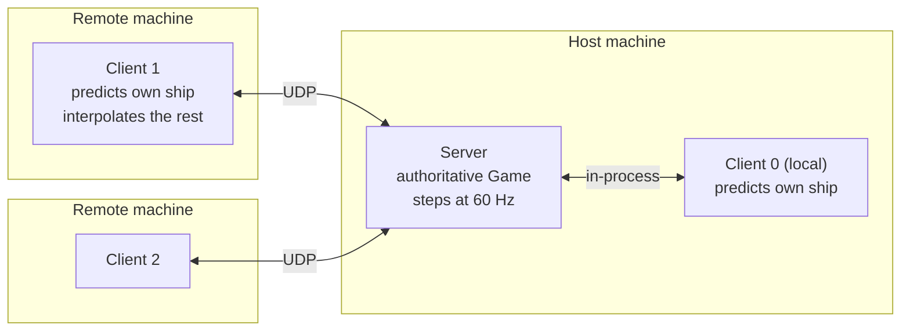
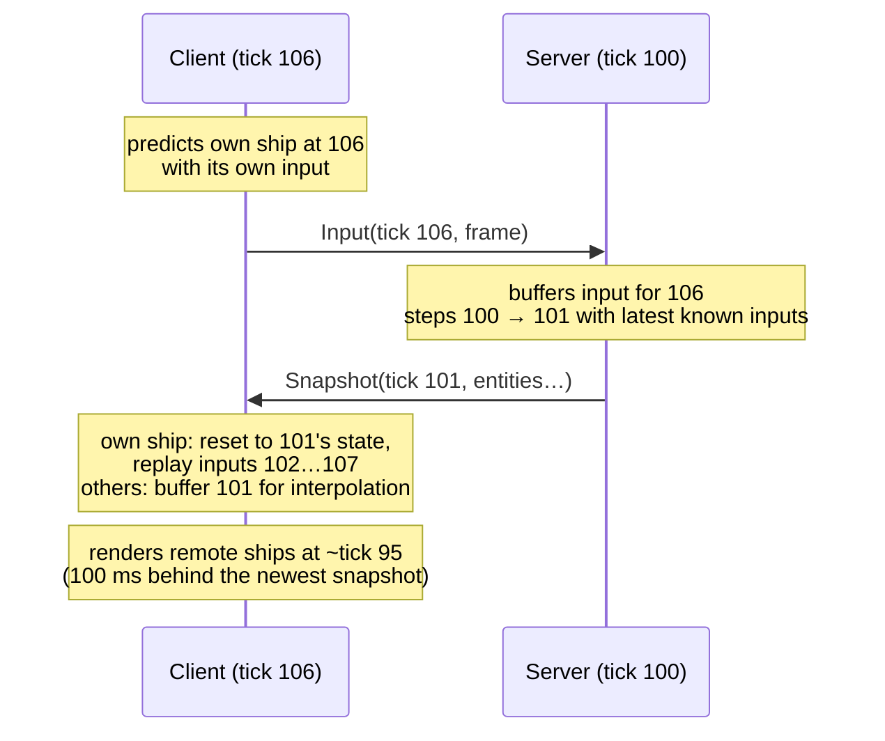
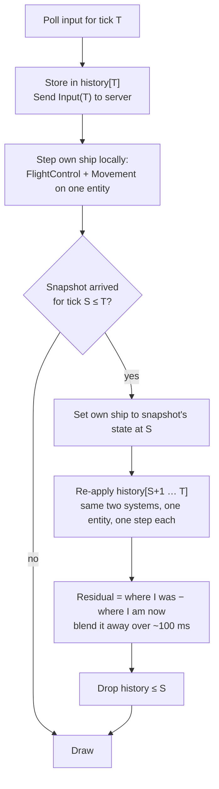

# 12 · Netcode: the shape of the problem 🧠

> **You'll leave this chapter with:** a decision — host-authoritative, with
> the local ship predicted and everyone else interpolated — and the reasons
> for it; and the design drawn out in enough detail that chapter 13 is
> transcription: who runs what, what goes in a packet, how a client corrects
> itself, which components cross the wire and which never do.
>
> **Files created: none.** Read it twice: once now, once after chapter 13
> with the code beside it.

Everything this guide has done since chapter 02 was in service of this
chapter. The simulation is a pure function of state, inputs and a fixed step
(02); inputs are a small struct with a tick number waiting to be stamped on
them (03); the player is a seat, and a seat is just a source of those structs
(11). None of that was netcode. All of it is what netcode needs, and what's
brutal to retrofit.

What's left is the part that can't be prepared for: two machines that each
have a picture of the world, a wire between them that's slow and loses
things, and a player on each who wants to feel like they're in the same
place. This chapter is about the shape of that problem and the three
standard answers, and why this game picks the one it does.

---

## What the wire does to you

Before designs, the facts. On a home LAN, a packet takes about a
millisecond to cross. Over the internet between two cities, thirty to
eighty milliseconds one way; across an ocean, over a hundred. At 60 Hz, a
step is 16.7 ms — so on a good internet connection, a message sent this
step arrives *two to five steps later*, and a round trip is four to ten.

That's the central fact. Whatever one machine knows about another is *old*,
by an amount that varies, and nothing in the design can change that. Every
netcode design is a decision about what to do with old information.

Two more facts. **Packets get lost** — a few percent on a mediocre
connection, bursts of them on a bad one — and UDP, which every action game
uses, does nothing about it; if you want something to arrive you have to
notice it didn't and send it again. And **packets are small**: about 1200
bytes is the safe payload before a packet gets split and its chances of
arriving intact drop. A snapshot of a hundred entities doesn't fit in one.

---

## Three designs

There are three ways to keep two machines' worlds in agreement, and every
shipping game is one of them or a hybrid.

**Deterministic lockstep: send only inputs.** Every machine runs the
*whole* simulation. Nobody sends state — only the `InputFrame`s, stamped
with the tick they're for. Machine A can't step tick 100 until it has
everyone's inputs for tick 100, so it waits, which means every player feels
the worst connection's latency as *input delay*: press a key, and your own
ship responds a few steps later. Age of Empires shipped this way with
hundreds of units on a modem, because a hundred units' worth of state won't
fit down a modem but eight players' inputs will. Chapter 03's challenge —
`--delay 3` — was this design's feel, measured.

Lockstep has one requirement and one killer. The requirement is that the
simulation be *bit-for-bit deterministic across machines*: the same inputs
must produce the same world on an M1 and an Intel Mac, or the two worlds
drift apart silently and the game is over without anyone noticing for a
minute. Chapter 02 made this game deterministic *within* one process — that
is checked every test run — but across CPUs, floating-point `exp` and `sin`
can differ in the last bit, and one bit is enough. The killer is *late
join*: a new machine has no world and no history, and the only way to give
it one is to ship the entire state, which is the thing lockstep exists not
to do.

**Rollback** is lockstep without the wait: step ahead with *predicted*
inputs (usually "same as last tick"), and when a real input arrives that
differs, rewind the world to that tick and re-simulate. Fighting games live
on this — two players, tiny state, and the wait would be unbearable.
It needs everything lockstep needs, plus the ability to save and restore the
whole world every tick, plus re-simulating several ticks in one frame when a
correction arrives. With forty enemies and their AI in the loop that's a
real cost, and it still can't late-join.

**Host-authoritative: one machine's world is the truth.** One machine —
the *server*, which in this game is also one of the players, a *listen
server* — runs the real simulation. Clients send their inputs to it. It
sends *state* back: snapshots of where everything is, several times a
second. Clients don't simulate the game; they *display* the server's game.

The obvious problem: a client's own ship would respond to its own stick a
round trip late, which at 80 ms is unplayable. The standard fix is
**client-side prediction**: the client applies its own inputs to its own
ship immediately, locally, using the same flight code the server uses, and
when the server's snapshot arrives it *reconciles* — resets its ship to
what the server said and replays the inputs the server hasn't seen yet.
Usually the result is what the client already had, and the correction is
invisible; when it isn't, there's a small snap, smoothed over a few frames.
Everyone *else's* ship is drawn a little in the past, interpolated between
two snapshots, so movement is smooth even though snapshots are twenty a
second.

The price: the server's machine has an advantage (its own ship is never
predicted, never corrected), the server can cheat, and state costs
bandwidth. The gains: no cross-machine determinism required — the server is
the truth and clients are corrected toward it, so a client that drifts by a
bit just gets a slightly bigger correction; late join is trivial (send the
new client a snapshot); and enemies, which have no inputs, cost nothing
extra to reason about — they're state like everything else.

| | Lockstep | Rollback | Host-authoritative |
| --- | --- | --- | --- |
| What's sent | inputs | inputs | inputs up, state down |
| Bandwidth | tiny | tiny | ~20 snapshots/s |
| Feel of own ship | delayed by worst link | immediate | immediate (predicted) |
| Cross-machine determinism | required | required | not required |
| Late join | very hard | very hard | trivial |
| Save/restore world each tick | no | yes | no (own ship only) |
| Server advantage / trust | none | none | host is trusted |
| Fits | RTS, few units per player | fighting games | shooters, this game |

---

## The decision

**Host-authoritative, listen server, client prediction for the local ship,
snapshot interpolation for everything else.** Three reasons in order of
weight.

First, **PvE with late join**. Forty enemies with AI are state the server
already owns; a friend joining wave six needs a snapshot and nothing else.
Lockstep would need every joiner to have been there from wave one.

Second, **determinism is only needed within a process**, which chapter 02
delivers and tests. Cross-machine determinism is a research project this
guide would have to build a chapter around — fixed-point math, or pinning
every transcendental to a software implementation — and it's the kind of
bug that appears once an hour on someone else's hardware. Host-authoritative
turns the same drift into a two-centimetre correction.

Third, **it's what the genre ships**. Frostbite (Battlefield), Source
(Team Fortress 2), Overwatch: all client-server with prediction. The
reference material in [`resources.md`](../resources.md) is written about
this design, so when you go deeper, the reading lines up with the code.

What it costs this game specifically: the host's ship is never corrected
and the clients' sometimes are; in PvP that's an edge the host has, and
chapter 14 says so on the scoreboard. And there is no dedicated server —
when the host quits, the game ends. Chapter 15 has the two paragraphs on
what a dedicated server would take.

---

## The roles



One process runs a `Server` and a `Client`; the others run a `Client`. The
local client talks to the server through the same `Transport` protocol the
remote ones do — chapter 13's loopback — so there is exactly one code path
for "client", and the host's own view isn't special-cased. That's also what
makes the whole design testable without a network: a loopback transport
with fake latency is a LAN you can put in a unit test.

Every `Client` owns a `Game`. The server's `Game` is *the* game; a client's
`Game` is a **mirror** — a world whose entities are created and moved by
snapshots, with one exception: its own ship, which it flies itself. The
rendering, the HUD, the camera, the menus from chapter 10: all of it runs
against the client's mirror unchanged. A client doesn't know it's a client
above the `Session`.

---

## The tick timeline

Both server and client run the chapter 02 clock. The client runs *ahead*.



The client's clock is set so that its inputs for tick *T* arrive at the
server *just before* the server steps *T*. That's `RTT/2 + a couple of
ticks` ahead, measured with `Ping`/`Pong` and adjusted slowly. If an input
arrives late, the server steps with the last input it had from that client
— a ship keeps doing what it was doing — and the client's prediction will
be corrected when the snapshot for that tick arrives.

Snapshots go out every third tick, 20 Hz, because 60 Hz of snapshots is
three times the bandwidth for a difference nobody sees once interpolation
is in place. Inputs go every tick, because they're twenty bytes and the
server can't do without them.

---

## Prediction and reconciliation

The loop the client runs for its own ship, every display frame:



The re-apply is the reason `FlightControlSystem.apply` takes *one entity*
(chapter 07) and `MovementSystem` is a pure function of components (guide
one): the client can run exactly the server's flight code on exactly one
ship, several steps in a row, inside a single frame, and get exactly what
the server will get — because the code is the same and the step is the
same. When the server's state at *S* matches what the client predicted at
*S*, the replay reproduces the client's current state to the bit and
nothing visibly happens. When it doesn't — a packet was lost, or a chaser
rammed you on the server before your client knew it was there — the replay
produces a slightly different *now*, and the residual is blended rather
than snapped.

What the client never predicts: firing. A bolt exists when the server says
it does. The client *shows* a muzzle flash on the trigger for feel, but the
projectile entity arrives in the next snapshot, a round trip later. At
80 ms that's noticeable and acceptable; predicting projectiles is the next
step up, and chapter 15 names it.

---

## Interpolation

Remote ships and enemies arrive as positions at ticks 95, 98, 101, … and
must be drawn sixty times a second. The client keeps a short buffer of
snapshots and draws each remote entity at a *render time* that trails the
newest snapshot by a fixed delay — 100 ms, six ticks — so that there is
always a snapshot on either side of the render time to interpolate between.

```
snapshots:   95 ──── 98 ──── 101 ──── (104 not yet arrived)
render at:                 ▲ 99.5   ← newest (101) minus 6 ticks, plus this frame's alpha
                 lerp(98, 101, 0.5)
```

The delay is the price: everyone else is drawn 100 ms in the past. It's
paid on every shipped game in the genre and it's why a shot that looks like
a hit on your screen can miss on the server, which is what *lag
compensation* — chapter 15 — is about.

Interpolation writes each remote entity's `Transform` *and*
`PreviousTransform` on the client — chapter 02's pair — so the existing
`SceneSystem` blend draws the in-between frames with no changes.

---

## What crosses the wire

Not every component. The replication table is the design's most concrete
artefact, and it's the table chapter 13 turns into code:

| Component | Replicated? | Why |
| --- | --- | --- |
| `Transform` (position, rotation) | **yes**, every snapshot | where things are |
| `Velocity` | **yes** | lets the client extrapolate a tick when a snapshot is late |
| `AngularVelocity` | players only | the local ship needs it to reconcile; remote ships are interpolated, not simulated |
| `Engine` | players only | throttle and speed are part of the predicted state |
| `Health` | **yes** | HUD and hit reactions |
| `Team`, `PlayerSlot` | **yes**, on spawn | who's who; never changes after |
| `Renderable` (mesh id, colour) | **yes**, on spawn | what to draw; never changes after |
| `Loadout` | own ship only, as an event when it changes | your HUD's pips; nobody else's business |
| `Collider` | no | derived from the archetype; the client never collides |
| `AIController`, `Weapon`, `Gun`, `Homing` | **no** | server-side behaviour; the client sees its results as movement |
| `PreviousTransform`, `CameraRig` | **no** | presentation, per chapter 02 |
| `Lifetime` | no | the server destroys; the snapshot omits, the client deletes |
| `Debris`, `Pickup` | debris **no**, pickups **yes** | debris is spawned client-side from `died` events; pickups matter |

Two rules fall out of it. **Simulation-only components that drive
behaviour don't replicate** — the server runs the AI, the clients see
where it went. **Presentation never replicates**, which is chapter 02's
line drawn one more time. Everything a client needs to *draw* an entity
crosses the wire; nothing a client would need to *simulate* one does,
except for its own ship.

Events cross the wire too, reliably, because a snapshot can say *that* an
enemy is gone but not *why*, and the difference is an explosion:

| Event | Reliable? | Client does |
| --- | --- | --- |
| `died(entity, killer)` | yes | spawn debris locally; kill feed |
| `damaged(entity)` | no (the next snapshot carries health, and a hull that dropped *is* the hit) | flash, shake if it's mine |
| `pickedUp(entity, kind)` | yes | toast if it's mine |
| `waveChanged(n, phase)` | yes | HUD banner |
| `scoreChanged(slot, score)` | yes | scoreboard |
| `loadout(slot, …)` | yes | HUD pips if it's mine |

---

## The message set

Seven messages, all encoded with chapter 03's `ByteWriter`, all small.

| Message | Direction | Payload | Reliability |
| --- | --- | --- | --- |
| `Hello` | client → server | protocol version | resent until `Welcome` |
| `Welcome` | server → client | your seat, the world seed, server tick, ship | resent for every repeated `Hello` |
| `Input` | client → server | tick, `InputFrame` (axes as `Int8`, buttons as `UInt16`) | unreliable, every tick |
| `Snapshot` | server → client | tick, then records: net id, kind, position, rotation, velocity, health | unreliable, every 3rd tick, split at 1200 bytes |
| `Event` | server → client | sequence number, event | reliable: resent until acked |
| `Ack` | client → server | highest event sequence received | unreliable, piggybacks on `Input` |
| `Ping` / `Pong` | both | tick | for clock offset and RTT |

*Reliable* here means one thing: the sender keeps the message and resends
it every few ticks until it sees an `Ack` covering it. That's the whole
reliability layer this game needs — a sequence number, an ack, a resend —
and it's forty lines. Snapshots are deliberately *not* reliable: a lost
snapshot is superseded by the next one 50 ms later, and resending it would
only deliver stale state late.

Axes quantise to `Int8` — 127 steps of stick deflection, more than a human
can produce — because an `InputFrame` at 60 Hz is the client's entire
upstream, and four floats become four bytes. Rotations go as four `Int16`s;
positions stay `Float` because the world is 500 units across and a
sixteen-bit position would be visibly steppy. The standard trick that makes
a rotation three `Int16`s — send the three smallest components and rebuild
the largest from the unit length — is left for you; chapter 13's challenge
is about something you'll notice sooner.

---

## Who is who

A server `Entity` is a slot and a generation; a client's mirror has its own
slots and generations, allocated in a different order. The wire carries the
*server's* handle as a **net id** — its slot and generation packed into 32
bits — and each client keeps a map from net id to its own local `Entity`. A
snapshot record whose net id isn't in the map is a new entity: create it
from its `kind` (player, enemy, bolt, missile, pickup) with the archetype's
non-replicated components, then apply the record. A net id in the map that
isn't in the snapshot is gone: destroy the local entity and forget the
mapping. Chapter 06's generations make this safe: a server slot reused for
a new enemy has a new generation, so it's a new net id, so the client
correctly sees a death and a spawn rather than a teleport.

Players are the one case with two identities: a net id *and* a seat. The
`Welcome` tells a client its seat; the snapshot's `PlayerSlot` tells it
which record is *itself*. That record is the one it predicts instead of
interpolates.

---

## Modes

The netcode is mode-agnostic; a mode is a handful of rules on top of the
server's `Game`:

| | PvE co-op | PvP deathmatch |
| --- | --- | --- |
| Enemies | waves, shared | none |
| Teams | all players team 0 | each player their own team, or two teams |
| Damage between players | none (same team) | yes |
| Death | respawn beside a teammate after 3 s (chapter 11) | respawn at a spawn point after 3 s |
| Score | shared run score | per seat: kills, deaths |
| End | everyone dead → summary | time or kill limit → scoreboard |

Chapter 11 already built the co-op rules; the server runs them. Chapter 14
adds the deathmatch rules as a `GameMode` the server is given at start, and
the scoreboard both modes show on `Tab`.

---

## What this design leaves out, by name

- **Lag compensation.** A client's shot at a target drawn 100 ms in the
  past is judged by the server at the present; the shot the client saw land
  can miss. Shooters rewind the target to where the shooter saw it before
  judging. Chapter 15.
- **Projectile prediction.** Bolts exist when the server says so, one round
  trip after the trigger. Chapter 15.
- **Interest management.** Every client gets every entity. At this game's
  size — a few hundred entities in a 500-unit world — that's fine; a big
  world would send each client only what's near it.
- **Cheating.** The host is trusted, and a modified client can send any
  `InputFrame` it likes — but only an `InputFrame`, which is the one thing
  a design that sends inputs up and state down gets for free.
- **Cross-machine determinism.** Not required, not attempted, not promised.
- **Dedicated servers.** When the host quits, the game ends.

Each is a real thing shipped games do, and each is a chapter that isn't in
this guide. What *is* here is the frame they all hang on.

---

**Next:** all of the above, in one process, with a fake network you can
make as bad as you like. →
[Chapter 13: Netcode over a loopback](13-netcode-over-a-loopback.md)

---

*Back to the [guide map](../README.md) · references in [`resources.md`](../resources.md)*
