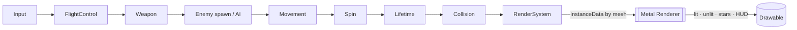

# Space Fighter — Build a Metal Game on an ECS, From Scratch

> A hands-on guide to writing a **space-combat game** — Star Fox / Ace Combat in
> spirit — directly on **Apple's Metal** with a hand-rolled
> **Entity–Component–System**. No game engine, no asset store: just Swift, the
> GPU, and geometry you generate in code. We start from *why* a GPU frame looks
> the way it does, build an ECS you can reason about, and end with a playable
> dogfight you fly with the keyboard.

<p align="center">
  <em>"An entity is a number. A component is data. A system is a verb. A frame is
  those verbs, in order, sixty times a second."</em>
</p>

---

## What this guide is (and isn't)

This is a **learning guide with a working game attached**. The
[`docs/`](docs/) chapters explain every idea — the GPU pipeline, the matrix
math, the ECS storage, the flight model — and the [`src/`](src/) directory is a
**complete, runnable prototype** those chapters describe. You can read first and
run later, or run it now and read to understand what you just flew.

- The [`docs/`](docs/) chapters teach the concepts, with diagrams and the exact
  code they refer to.
- The [`src/`](src/) directory is a real Swift Package: `cd src && swift run`
  and you're flying.

Unlike a fill-in-the-blanks tutorial, the code isn't stubbed — it works. The
skill this builds isn't "type what I typed"; it's **reading a small,
honest game codebase and knowing where every piece lives and why**, so you can
change it.

> **Note:** this guide is for learning. It is not official Apple documentation.
> Cross-check the [Metal](https://developer.apple.com/documentation/metal) and
> [MetalKit](https://developer.apple.com/documentation/metalkit) references (and
> the other links in [`resources.md`](resources.md)) before relying on a detail;
> GPU APIs drift.

---

## Mental model (read this first)

Two ideas carry the whole project. Hold both and everything else is detail.

**1. The ECS separates *data* from *behaviour*.** Nothing is a "Spaceship
object" with a `fly()` method. Instead an entity (a number) *has* a `Transform`,
a `Velocity`, a `Player` tag and a `Weapon` — and separate systems read those
and act. Want a homing missile? It's the same `Transform` + `Velocity` an enemy
uses, plus a `Homing` component. Composition, not inheritance.

**2. A frame is a fixed pipeline: simulate on the CPU, then draw on the GPU.**
Every displayed frame, the systems run in a set order to advance the world, and
then the renderer packages the survivors and hands the GPU a few instanced draw
calls. The seam between them is deliberately thin — a dictionary of
`InstanceData` — so neither side knows the other's internals.



Each box is one function in [`src/`](src/); the arrows are the order they run in
[`Game.update`](src/Sources/SpaceFighter/Game.swift). That's the game.

| Idea | One-liner | Chapter |
| --- | --- | --- |
| **Entities & components** | Identity is a number; everything it *is* comes from data attached to it | [04](docs/04-designing-the-ecs.md) |
| **Systems & schedule** | Behaviour is functions over components, run in a fixed order per frame | [04](docs/04-designing-the-ecs.md), [07](docs/07-the-game-loop.md) |
| **The GPU frame** | Command buffer → render pass → pipeline state → draw; depth sorts it | [02](docs/02-metal-fundamentals.md), [05](docs/05-the-render-pipeline.md) |
| **Transforms** | Position + a *quaternion* orientation + scale, baked to a matrix | [03](docs/03-the-math-you-need.md), [08](docs/08-flight-and-input.md) |
| **Instancing** | One mesh, many entities, a single draw call | [05](docs/05-the-render-pipeline.md) |

---

## What you'll build

A third-person space fighter you fly with the keyboard:

- a low-poly ship with an **arcade flight model** — pitch, yaw, roll, boost;
- **twin cannons** firing glowing bolts on a cooldown;
- **enemies** that warp in ahead of you — some tumble past, some home in;
- **sphere collisions**, a hull bar, score, a hit-flash, and respawns;
- a **starfield** that tiles endlessly and a **ground grid** for a horizon —
  both procedural, no art assets;
- all of it drawn by a small **Metal** renderer with lit, unlit, point and HUD
  pipelines, running through a **sparse-set ECS**.

Everything is simple geometry generated in code — exactly the "no fancy shapes
for now" brief — and chapter [12](docs/12-where-to-go-next.md) maps the road from
here to real models, lighting, audio and netcode.

---

## Prerequisites

- **A Mac.** Metal is Apple-only; this runs on macOS 13+ with any Metal GPU.
- **Xcode 15+** or the Swift 5.9+ toolchain (`xcode-select --install`).
- **Some Swift** (or another C-family / systems language — the ideas port). No
  prior graphics or game-engine experience assumed; that's what the guide is for.
- **A little comfort with vectors and matrices.** Chapter 03 re-derives what you
  need, but if "dot product" and "matrix times vector" ring a bell you're set.

You do **not** need any prior Metal, OpenGL, Vulkan, or ECS knowledge.

---

## Repository layout

```
space-fighter-metal/
├── README.md                 ← you are here (the map)
├── resources.md              ← primary sources & further reading
├── docs/                     ← the guide, one chapter per file
│   ├── 01-project-setup.md
│   ├── 02-metal-fundamentals.md
│   ├── 03-the-math-you-need.md
│   ├── 04-designing-the-ecs.md
│   ├── 05-the-render-pipeline.md
│   ├── 06-meshes-and-geometry.md
│   ├── 07-the-game-loop.md
│   ├── 08-flight-and-input.md
│   ├── 09-the-camera.md
│   ├── 10-gameplay-systems.md
│   ├── 11-hud-and-feedback.md
│   └── 12-where-to-go-next.md
└── src/                      ← the runnable game (swift run)
    ├── README.md             ← build, controls, file map
    ├── Package.swift
    └── Sources/SpaceFighter/ ← ECS, systems, renderer, shaders
```

---

## The learning path

Concept chapters (🧠) build understanding; build chapters (🛠️) walk the code that
uses it. Read 01–07 in order — they assemble the engine. 08–11 are the game on
top of it, and 12 is the horizon.

| # | Chapter | What you'll learn |
| --- | --- | --- |
| 01 | 🛠️ [Project setup](docs/01-project-setup.md) | What we're building and why Metal + ECS; running it with `swift run`; the shape of a frame; turning it into a real `.app`. |
| 02 | 🧠 [Metal fundamentals](docs/02-metal-fundamentals.md) | The GPU as a service: device, command queue, command buffer, render pass, pipeline state, `MTKView`, the vertex→fragment pipeline, and the depth buffer. |
| 03 | 🧠 [The math you need](docs/03-the-math-you-need.md) | Coordinate spaces; model/view/projection; why we orient with *quaternions* not Euler angles; `simd`, and every helper in `Math.swift` derived. |
| 04 | 🛠️ [Designing the ECS](docs/04-designing-the-ecs.md) | Entities, components, systems; array-of-structs vs **sparse set** vs archetypes; our `World` + `ComponentStore`; generations, and safe deferred destruction. |
| 05 | 🛠️ [The render pipeline](docs/05-the-render-pipeline.md) | Writing MSL shaders; the pull-vertex model; **instancing** one mesh across many entities; uniforms and the buffer-index contract; blend modes; a tour of `Renderer`. |
| 06 | 🛠️ [Meshes & simple geometry](docs/06-meshes-and-geometry.md) | Flat shading and face normals; generating the ship, enemy, bolt, endless starfield and grid in code — zero art assets. |
| 07 | 🛠️ [The game loop & timing](docs/07-the-game-loop.md) | The `MTKViewDelegate` heartbeat; delta time; fixed vs variable timestep; clamping hitches; why system *order* is the logic. |
| 08 | 🛠️ [Flight & input](docs/08-flight-and-input.md) | Abstracting input from keys; the arcade flight model; integrating body-space rotation with quaternions; auto-banking into turns. |
| 09 | 🛠️ [The camera](docs/09-the-camera.md) | The chase camera; `lookAt`; blending world-up with ship-up so banks read without nausea; field of view and smoothing. |
| 10 | 🛠️ [Gameplay systems](docs/10-gameplay-systems.md) | Spawning and difficulty; weapons and cooldowns; homing AI; sphere collision, layers and the broad-phase question; health, score, respawn. |
| 11 | 🛠️ [HUD & feedback](docs/11-hud-and-feedback.md) | Drawing in normalised device coordinates; the reticle, hull bar and hit-flash; aspect correction; and how you'd add real text. |
| 12 | 🧠 [Where to go next](docs/12-where-to-go-next.md) | Loading real models (Model I/O, glTF/USD); lighting & shadows; particles; audio; physics; multiplayer; and the performance work (triple buffering, GPU capture) a shipping game needs. |

---

## How to use this guide

- **Run it early.** `cd src && swift run`, fly around for two minutes, *then*
  read. Every chapter lands harder when you've seen the thing it explains move.
- **Follow the schedule.** The single most important file is
  [`Game.swift`](src/Sources/SpaceFighter/Game.swift): the list of systems, in
  order, is the entire game logic. Keep it open.
- **Change one number.** Halve `spawnInterval`, double a turn rate, tint the
  ship red. Fast feedback is the whole reason to build on something small.
- **Add one behaviour end-to-end.** A new component, a new system, one line in
  the schedule. Doing that once makes the ECS click for good — chapter 12 has
  starter ideas.

---

## Credits & lineage

This guide stands on the standard references: Apple's
[Metal](https://developer.apple.com/documentation/metal) and
[Metal Shading Language](https://developer.apple.com/metal/Metal-Shading-Language-Specification.pdf)
documentation; the data-oriented ECS lineage popularised by Mike Acton's
data-oriented design talks and libraries like EnTT and Bevy; and the arcade
flight feel of Star Fox and Ace Combat that we're chasing, not cloning. Full
references live in [`resources.md`](resources.md).

---

*Start here → [Chapter 01: Project setup](docs/01-project-setup.md)*
