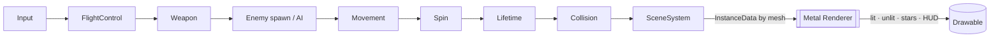

# Space Fighter — Build a Metal Game on an ECS, From Scratch

> A hands-on guide to writing a **space-combat game** — Star Fox / Ace Combat in
> spirit — directly on **Apple's Metal** with a hand-rolled
> **Entity–Component–System**. No game engine, no asset store: just Swift, the
> GPU, and geometry you generate in code. We start from *why* a GPU frame looks
> the way it does, build an ECS you can reason about, and end with a playable
> dogfight you fly with the keyboard.

<p align="center">
  <em>"An entity is a number. A component is data. A system is a verb. A frame is
  those verbs, in order, sixty times a second."</em>
</p>

---

## What this guide is (and isn't)

This is a **from-scratch implementation guide**. The [`docs/`](docs/) chapters
build the whole thing — the Metal renderer, the matrix and quaternion math, the
ECS storage, the flight model, the gameplay — and show every piece of code in
full, inline, as you go. You end with a small macOS Swift Package you wrote
yourself and run with `swift run`.

- Chapter [01](docs/01-project-setup.md) scaffolds the project and explains the
  reading conventions. Every later chapter names the **exact file and position**
  for each snippet: a `swift` block under a location line for new code, a `diff`
  block with real context lines for changes to existing code.
- Code arrives **a handful of lines at a time**, with the reasoning around it —
  not as finished files to paste. Every line is still given; nothing is elided.
- Every chapter ends with a **checkpoint** (run this, see that, and here's what
  each failure mode means) and most with a **challenge** that has no answer given.
- You get a ship on screen in chapter 08 and can fly it by chapter 10.
- There's no separate codebase to cross-reference; the guide *is* the source.

The skill this builds isn't "type what I typed"; it's **understanding a small,
honest game engine well enough to know where every piece lives and why** — so you
can build on it.

> **Note:** this guide is for learning. It is not official Apple documentation.
> Cross-check the [Metal](https://developer.apple.com/documentation/metal) and
> [MetalKit](https://developer.apple.com/documentation/metalkit) references (and
> the other links in [`resources.md`](resources.md)) before relying on a detail;
> GPU APIs drift.

---

## Mental model (read this first)

Two ideas carry the whole project. Hold both and everything else is detail.

**1. The ECS separates *data* from *behaviour*.** Nothing is a "Spaceship
object" with a `fly()` method. Instead an entity (a number) *has* a `Transform`,
a `Velocity`, a `Player` tag and a `Weapon` — and separate systems read those
and act. Want a homing missile? It's the same `Transform` + `Velocity` an enemy
uses, plus a `Homing` component. Composition, not inheritance.

**2. A frame is a fixed pipeline: simulate on the CPU, then draw on the GPU.**
Every displayed frame, the systems run in a set order to advance the world, and
then the renderer packages the survivors and hands the GPU a few instanced draw
calls. The seam between them is deliberately thin — a dictionary of
`InstanceData` — so neither side knows the other's internals.


```mermaid
flowchart LR
  I[Input] --> F[FlightControl]
  F --> W[Weapon]
  W --> E[Enemy spawn / AI]
  E --> M[Movement]
  M --> S[Spin]
  S --> L[Lifetime]
  L --> C[Collision]
  C --> R[SceneSystem]
  R -->|InstanceData by mesh| G[[Metal Renderer]]
  G -->|lit · unlit · stars · HUD| D[(Drawable)]
```

Each box is one system you'll build; the arrows are the order they run in
`Game.update` (chapter 09). That's the game.

| Idea | One-liner | Chapter |
| --- | --- | --- |
| **Engine, game, content** | Three layers, one target, and a test that keeps them apart | [02](docs/02-architecture.md) |
| **Assets by reference** | Gameplay names art with an id; only the renderer ever holds a buffer | [02](docs/02-architecture.md), [06](docs/06-meshes-and-geometry.md) |
| **Entities & components** | Identity is a number; everything it *is* comes from data attached to it | [05](docs/05-designing-the-ecs.md) |
| **Systems & schedule** | Behaviour is functions over components, run in a fixed order per frame | [05](docs/05-designing-the-ecs.md), [09](docs/09-the-game-loop.md) |
| **Archetypes** | What an entity is *made of*, in its own file — the Blueprint idea | [09](docs/09-the-game-loop.md), [12](docs/12-gameplay-systems.md) |
| **The GPU frame** | Command buffer → render pass → pipeline state → draw; depth sorts it | [03](docs/03-metal-fundamentals.md), [08](docs/08-the-renderer.md) |
| **Transforms** | Position + a *quaternion* orientation + scale, baked to a matrix | [04](docs/04-the-math-you-need.md), [10](docs/10-flight-and-input.md) |
| **Instancing** | One mesh, many entities, a single draw call | [08](docs/08-the-renderer.md) |
| **Doing work once** | Compile pipelines on first launch, not every launch | [14](docs/14-shader-caching.md) |

---

## What you'll build

A third-person space fighter you fly with the keyboard:

- a low-poly ship with an **arcade flight model** — pitch, yaw, roll, boost;
- **twin cannons** firing glowing bolts on a cooldown;
- **enemies** that warp in ahead of you — some tumble past, some home in;
- **sphere collisions**, a hull bar, score, a hit-flash, and respawns;
- a **starfield** that tiles endlessly and a **ground grid** for a horizon —
  both procedural, no art assets;
- all of it drawn by a small **Metal** renderer with lit, unlit, point and HUD
  pipelines, running through a **sparse-set ECS**.

Everything is simple geometry generated in code — exactly the "no fancy shapes
for now" brief — and chapter [15](docs/15-where-to-go-next.md) maps the road from
here to real models, lighting, audio and netcode.

---

## Prerequisites

- **A Mac.** Metal is Apple-only; this runs on macOS 13+ with any Metal GPU.
- **Xcode 26+** or the matching Command Line Tools (`xcode-select --install`).
  The manifest in chapter 01 declares tools-version 6.2, and the tests from
  chapter 02 on use Swift Testing, which ships with Swift 6.
- **Some Swift** (or another C-family / systems language — the ideas port). No
  prior graphics or game-engine experience assumed; that's what the guide is for.
- **A little comfort with vectors and matrices.** Chapter 04 re-derives what you
  need, but if "dot product" and "matrix times vector" ring a bell you're set.

You do **not** need any prior Metal, OpenGL, Vulkan, or ECS knowledge.

---

## Repository layout

```
space-fighter-metal/
├── README.md                 ← you are here (the map)
├── resources.md              ← primary sources & further reading
└── docs/                     ← the guide, one chapter per file
    ├── 01-project-setup.md
    ├── 02-architecture.md
    ├── 03-metal-fundamentals.md
    ├── 04-the-math-you-need.md
    ├── 05-designing-the-ecs.md
    ├── 06-meshes-and-geometry.md
    ├── 07-shaders.md
    ├── 08-the-renderer.md
    ├── 09-the-game-loop.md
    ├── 10-flight-and-input.md
    ├── 11-the-camera.md
    ├── 12-gameplay-systems.md
    ├── 13-hud-and-feedback.md
    ├── 14-shader-caching.md
    └── 15-where-to-go-next.md
```

The Swift project you build lives wherever you scaffold it in chapter 01 — the
guide walks you through creating it file by file.

---

## The learning path

Concept chapters (🧠) build understanding; build chapters (🛠️) hand you code to
write. Go in order — each chapter's checkpoint depends on the last one working.

| # | Chapter | What you'll learn | You'll have |
| --- | --- | --- | --- |
| 01 | 🛠️ [Project setup](docs/01-project-setup.md) | Why Metal + ECS; scaffolding the SwiftPM package; the directory layout; the shape of a frame; turning it into a real `.app`. | a binary that runs |
| 02 | 🧠🛠️ [Architecture](docs/02-architecture.md) | Actor-component vs ECS; how Unreal, Unity and Godot all reference art by id; `Source/` vs `Content/`; archetypes as Blueprints; why one SwiftPM target and not ten; a test that enforces the layers. | the layout, defended |
| 03 | 🧠 [Metal fundamentals](docs/03-metal-fundamentals.md) | The GPU as a service: device, command queue, command buffer, render pass, pipeline state, `MTKView`, the vertex→fragment pipeline, and the depth buffer. | *(concepts)* |
| 04 | 🧠🛠️ [The math you need](docs/04-the-math-you-need.md) | Coordinate spaces; model/view/projection; why we orient with *quaternions* not Euler angles; `simd`. Write `Core/Math.swift`. | matrices you can verify |
| 05 | 🛠️ [Designing the ECS](docs/05-designing-the-ecs.md) | Entities, components, systems; dictionary vs **sparse set** vs archetypes; generations; safe deferred destruction. Write the `World`. | entities + components |
| 06 | 🛠️ [Meshes & simple geometry](docs/06-meshes-and-geometry.md) | The CPU↔GPU struct contract and the `float3` alignment trap; flat shading and face normals; ship, enemy, bolt, starfield and grid in code; the asset registry the compiler keeps honest. | geometry you can print |
| 07 | 🛠️ [Shaders](docs/07-shaders.md) | Writing MSL; the pull-vertex model; `[[instance_id]]`; the buffer-index contract; the normal matrix; the starfield wrap; shipping `.metal` files as package resources. | four shader pairs, compiling |
| 08 | 🛠️ [The renderer](docs/08-the-renderer.md) | The RHI split; pipelines and depth states; blend modes; uploading meshes; **instancing**; the five passes; the AppKit window. | **a ship on screen** |
| 09 | 🛠️ [The game loop & timing](docs/09-the-game-loop.md) | Every component, grouped by who reads it; archetypes; the ECS→renderer seam; the `MTKViewDelegate` heartbeat; delta time; why system *order* is the logic. | it moves |
| 10 | 🛠️ [Flight & input](docs/10-flight-and-input.md) | Abstracting input from keys; the arcade flight model; body-space rotation with quaternions; auto-banking into turns. | **you can fly it** |
| 11 | 🛠️ [The camera](docs/11-the-camera.md) | The chase camera; `lookAt`; blending world-up with ship-up so banks read without nausea; field of view; smoothing. | it feels right |
| 12 | 🛠️ [Gameplay systems](docs/12-gameplay-systems.md) | Spawning and difficulty; weapons and cooldowns; homing AI; sphere collision, layers and the broad-phase question; health, score, respawn. | **a game** |
| 13 | 🛠️ [HUD & feedback](docs/13-hud-and-feedback.md) | Drawing in normalised device coordinates; the reticle, hull bar and hit-flash; aspect correction; how you'd add real text. | the finished thing |
| 14 | 🛠️ [Caching the compiled shaders](docs/14-shader-caching.md) | The two stages of shader compilation and which one macOS already caches; `MTLBinaryArchive`; atomic cache writes; recovering from a corrupt cache; where this stops scaling. | a launch that doesn't recompile |
| 15 | 🧠 [Where to go next](docs/15-where-to-go-next.md) | Real models (Model I/O, glTF/USD); lighting & shadows; particles; audio; physics; multiplayer; and the performance work a shipping game needs. | *(roadmap)* |

---

## How to use this guide

- **Build as you read, and run early.** Scaffold the project in chapter 01 and
  `swift run` often — every chapter lands harder once you've seen the thing it
  explains move.
- **Follow the schedule.** The heart of the game is `Game.update` (chapter 09):
  the list of systems, in order, is the entire game logic. Keep that chapter
  close.
- **Change one number.** Halve `spawnInterval`, double a turn rate, tint the
  ship red. Fast feedback is the whole reason to build on something small.
- **Add one behaviour end-to-end.** A new component, a new system, one line in
  the schedule. Doing that once makes the ECS click for good — chapter 15 has
  starter ideas.

---

## Credits & lineage

This guide stands on the standard references: Apple's
[Metal](https://developer.apple.com/documentation/metal) and
[Metal Shading Language](https://developer.apple.com/metal/Metal-Shading-Language-Specification.pdf)
documentation; the data-oriented ECS lineage popularised by Mike Acton's
data-oriented design talks and libraries like EnTT and Bevy; and the arcade
flight feel of Star Fox and Ace Combat that we're chasing, not cloning. Full
references live in [`resources.md`](resources.md).

---

*Start here → [Chapter 01: Project setup](docs/01-project-setup.md)*
