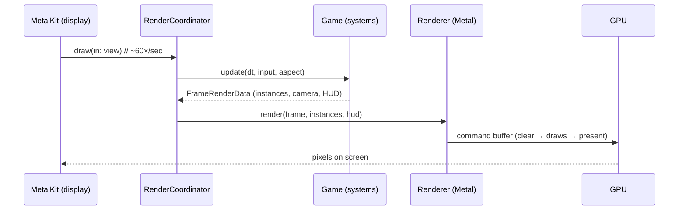

# 01 · Project setup 🛠️

> **You'll leave this chapter with:** the game running on your machine, a clear
> picture of what Metal and an ECS each buy us, and a map of what one frame
> actually does — so the rest of the guide has somewhere to hang.

---

## Run it first

Everything the guide explains already works. Before reading another word, fly it:

```console
$ cd src
$ swift run
```

The first run compiles the package (a few seconds) and opens a 1280×720 window.
You're sitting behind a pale low-poly fighter over a faint cyan grid, stars all
around. Enemies warp in ahead.

| Key | Action |
|---|---|
| `W` `S` / `↑` `↓` | Pitch down / up |
| `A` `D` / `←` `→` | Yaw left / right (banks automatically) |
| `Q` `E` | Roll |
| `Shift` | Boost |
| `Space` | Fire |
| `Esc` / `⌘Q` | Quit |

Score, hull and deaths are in the **window title**. If it doesn't build, jump to
[Troubleshooting](#troubleshooting) at the bottom.

---

## Why Metal?

**Metal** is Apple's low-level GPU API — the same layer game engines target on
Apple platforms. "Low-level" means you talk to the graphics hardware almost
directly: you allocate GPU buffers, describe a rendering pipeline, and record
commands into a buffer that the GPU executes. There is no scene graph, no
"draw a sphere" convenience — which is exactly why it's worth learning. You see
the whole machine.

The alternatives frame the choice:

- **SceneKit / RealityKit** — Apple's high-level 3D frameworks. Great for apps;
  they hide the pipeline we want to understand.
- **A game engine (Unity, Unreal, Godot)** — the right tool to *ship* a game,
  the wrong tool to *learn what an engine does*.
- **OpenGL** — cross-platform but deprecated on Apple hardware.
- **Metal** — modern, first-class on every Mac/iPhone/iPad, and small enough at
  its core to hold in your head. That's us.

We compile the shaders **at runtime from a string** (chapter 05), so the whole
thing builds with a plain `swift run` — no `.metal` files in a build phase, no
Xcode project required to get started.

## Why an ECS?

A space shooter has ships, bullets, enemies, pickups, explosions — hundreds of
things that are *mostly alike but not quite*. The object-oriented instinct is an
inheritance tree: `Entity → Vehicle → Ship → PlayerShip`. It works until an
enemy needs to be *both* a homing thing *and* a shielded thing *and* a splitter,
and single inheritance can't express it. You get deep hierarchies, `isKindOf`
checks, and copy-pasted behaviour.

An **Entity–Component–System** turns the model inside out:

- an **entity** is just an id (a number),
- a **component** is a plain struct of data with no behaviour, and
- a **system** is a function that runs over all entities that have a given set
  of components.

A "homing shielded splitter" is just an entity holding a `Homing`, a `Shield`
and a `Splitter` component. New behaviour is a new component plus a new system —
nothing else changes. And because components of one type live packed together in
memory, systems iterate them fast and cache-friendly. Chapter 04 builds ours;
for now, just know *data lives in components, behaviour lives in systems, and
they meet in the `World`.*

---

## The shape of a frame

Here is the whole program in one breath. MetalKit calls our
[`RenderCoordinator.draw(in:)`](../src/Sources/SpaceFighter/GameView.swift) once
per displayed frame. That callback does two things:

1. **Simulate.** [`Game.update`](../src/Sources/SpaceFighter/Game.swift) measures
   the time since the last frame and runs every system in order — read input,
   fly the ship, spawn and steer enemies, move everything, expire bolts, resolve
   collisions, and finally collect what's visible.
2. **Draw.** [`Renderer.render`](../src/Sources/SpaceFighter/Render/Renderer.swift)
   takes that collection and records Metal commands: clear the screen, draw the
   grid and stars, draw the lit ships and enemies, draw the glowing bolts, draw
   the HUD, and present the result.



Every chapter zooms into one part of that loop. Keep the picture: **simulate,
then draw, sixty times a second.**

---

## What's in the box

A quick orientation to the folders you'll be living in (full map in
[`src/README.md`](../src/README.md)):

- **`ECS/`** — the engine core: `Entity`, `ComponentStore`, `World`.
- **`Components.swift`** — every kind of data an entity can hold.
- **`Systems/`** — one file per behaviour.
- **`Render/`** — `Renderer`, the MSL `Shaders`, and the `RenderTypes` that must
  match them byte for byte.
- **`Mesh.swift`, `Math.swift`, `HUD.swift`, `Input.swift`** — supporting pieces.
- **`Game.swift`** — wires it together and owns the per-frame schedule.
- **`main.swift`, `GameView.swift`** — the AppKit window and the loop that drives
  everything.

---

## From `swift run` to a real app

`swift run` builds a bare Mach-O executable and we hand-build an `NSApplication`
inside [`main.swift`](../src/Sources/SpaceFighter/main.swift) — no storyboard, no
`.app` bundle. That's ideal for iterating: edit, `swift run`, see the change.

For anything you'd hand to another person — an icon, a Dock presence that
behaves, code signing, the App Store — you want a bundle. Two paths:

1. **Xcode "macOS App" target.** File → New → Project → App, then drop the
   contents of `Sources/SpaceFighter/` in. Move the shader string into a
   `.metal` file if you prefer compile-time shader errors (chapter 05 covers the
   trade-off). Use an `MTKView` in your storyboard or create it in code as we do.
2. **A SwiftPM app bundler.** Tools exist to wrap a SwiftPM executable into a
   `.app`; for a learning project the Xcode route is the least friction.

The *code* is identical either way — only the packaging changes. We stay with
`swift run` for the rest of the guide.

---

## Troubleshooting

- **"No Metal-capable GPU found."** You're on a machine (or VM) without a Metal
  device. This project needs real Apple hardware.
- **`swift: command not found`.** Install the toolchain with
  `xcode-select --install`, or open the project in Xcode.
- **A wall of shader errors on launch.** You edited `Shaders.swift` and the MSL
  no longer compiles. The console prints the exact line; the CPU struct in
  `RenderTypes.swift` and the MSL struct must stay in lockstep (chapter 05).
- **The window opens but ignores the keyboard.** Click the window to focus it.
  Input is read via a local event monitor set up in `main.swift`.

---

**Next:** the GPU is about to stop being a black box. →
[Chapter 02: Metal fundamentals](02-metal-fundamentals.md)
