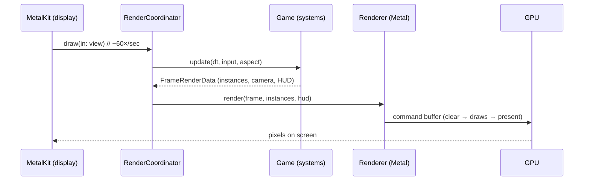

# 01 · Project setup 🛠️

> **You'll leave this chapter with:** an empty Swift package that builds and
> runs, the conventions this guide follows, and a map of which chapter creates
> which file — so you always know where you are.
>
> **Files created:** `Package.swift`, `Sources/SpaceFighter/main.swift`

This is a **build-along guide**. You type the code; every line is given, but a
handful at a time, with the reasoning around it. There is no finished project to
download — by chapter 13 you'll have written the whole thing.

---

## How this guide hands you code

Four conventions. Learn them here and you'll never have to guess where something
goes.

**1. New code arrives in a `swift` block under a location line.** The line above
the block always names the file, and where in it:

> **`Sources/SpaceFighter/Core/Math.swift`** — new file:

**2. Changes to existing code arrive as a `diff` block** with a few real lines of
context around them. Lines marked `+` are yours to add, lines marked `-` are
yours to delete, and unmarked lines are already in your file — they're there to
show you *where*:

> **`Game.swift`**, in `update` — swap the placeholder camera for the real one:
>
> ```diff
>      let dt = min(max(rawDt, 0), 1.0 / 30.0)
> -    let eye = t.position - t.forward * 9 + t.up * 3
> +    let (view, eye) = CameraSystem.viewMatrix(world, player: player)
> ```

**3. Explanation lives in the prose, not in comments.** The code you write will
be commented the way real code is — sparingly, for the non-obvious. The *why*
is in the paragraphs around it. If you want a chapter's reasoning later, reread
the prose, not the file.

**4. Every chapter ends with a `Checkpoint`** — a command, the output you should
see, and what to check when you don't. Run it. If it doesn't match, something is
wrong *now*, not three chapters later. Most build chapters also end with a
**Challenge**: an extension with no solution given.

Two chapters (03 and 14) are pure concept and create no files; they say so at the
top.

---

## Create the package

The whole game is a single macOS executable, and a Swift Package is the lightest
way to get one — no Xcode project, no storyboard, no build phases.

```console
$ mkdir SpaceFighter && cd SpaceFighter
$ swift package init --type executable
```

That generates a `Package.swift` we're going to overwrite completely.

**`Package.swift`** — replace the generated file with this:

```swift
// swift-tools-version:6.2
import PackageDescription

let package = Package(
    name: "SpaceFighter",
    platforms: [
        .macOS(.v13)
    ],
    targets: [
        .executableTarget(
            name: "SpaceFighter",
            path: "Sources/SpaceFighter"
        )
    ]
)
```

Two things worth noting. There are **no dependencies** — Metal, MetalKit and
AppKit are system frameworks on macOS, so `import Metal` just works. And the
macOS 13 floor isn't strictly required (the APIs we use are older) but it keeps
the code modern and matches a current Xcode toolchain.

This manifest grows exactly twice more. Chapter 02 adds a test target, and
chapter 07 declares the shader directory as a resource. Both wait until the
files they point at exist — a target with no sources, or a resource path that
doesn't resolve, is a build error, not a warning.

`swift package init` may also have created a `Sources/SpaceFighter/SpaceFighter.swift`.
Delete it — we use a `main.swift` entry point instead:

```console
$ rm -f Sources/SpaceFighter/SpaceFighter.swift
```

**`Sources/SpaceFighter/main.swift`** — new file:

```swift
// Chapter 08 replaces this with a real AppKit window and a Metal view.

import Foundation

print("SpaceFighter: toolchain OK")
```

A SwiftPM executable runs the top-level code in `main.swift`, so this three-line
file is a complete program. It exists only so the package has an entry point and
builds; you'll throw it away in chapter 08.

### Checkpoint

```console
$ swift run
SpaceFighter: toolchain OK
```

If you see that line, your toolchain is good and everything from here is adding
files.

---

## The layout

Make the directories now, in one go. Every later chapter drops files into this
skeleton, so no chapter has to interrupt itself with a `mkdir`:

```console
$ mkdir -p Sources/SpaceFighter/{Core,ECS,Input,Components,Systems,Archetypes}
$ mkdir -p Sources/SpaceFighter/Render/{Types,RHI}
$ mkdir -p Sources/SpaceFighter/Content/{Meshes,Shaders}
$ mkdir -p Tests/SpaceFighterTests
```

Empty directories don't bother SwiftPM, and `swift run` still works.

Here is what fills them:

```
SpaceFighter/
├── Package.swift
├── Sources/SpaceFighter/
│   ├── main.swift              app + window + Metal view
│   ├── Game.swift              the world, and the per-frame system schedule
│   ├── GameView.swift          the MTKViewDelegate that drives each frame
│   ├── Core/
│   │   └── Math.swift          simd helpers: matrices, projection, quaternions
│   ├── ECS/
│   │   ├── Entity.swift
│   │   ├── ComponentStore.swift
│   │   └── World.swift
│   ├── Input/
│   │   └── InputState.swift    key codes, InputController, the input snapshot
│   ├── Components/
│   │   ├── Spatial.swift       Transform, Velocity
│   │   ├── Rendering.swift     Renderable
│   │   ├── Physics.swift       Collider, CollisionLayer
│   │   └── Gameplay.swift      Player, Weapon, Enemy, Projectile, Lifetime, …
│   ├── Systems/
│   │   ├── MovementSystem.swift
│   │   ├── FlightControlSystem.swift
│   │   ├── CameraSystem.swift
│   │   ├── WeaponSystem.swift
│   │   ├── EnemySystem.swift
│   │   ├── LifetimeSystem.swift
│   │   ├── CollisionSystem.swift
│   │   ├── SceneSystem.swift   walks the world, hands the renderer flat data
│   │   └── HUDSystem.swift     crosshair, hull bar, hit-flash geometry
│   ├── Archetypes/
│   │   ├── Player.swift        which components a player ship is made of
│   │   ├── Enemy.swift
│   │   └── Projectile.swift
│   ├── Render/
│   │   ├── Types/
│   │   │   ├── GPUContract.swift  CPU structs that mirror the shader structs
│   │   │   ├── Mesh.swift         Mesh, Primitive — CPU geometry, no GPU
│   │   │   └── HUDVertex.swift    the 2D overlay vertex
│   │   ├── RHI/
│   │   │   ├── Device.swift       device, queue, the MTKView's formats
│   │   │   ├── Pipelines.swift    pipeline states and depth states
│   │   │   ├── PipelineCache.swift  compiled pipelines, kept between launches
│   │   │   └── Buffers.swift      making and filling MTLBuffers
│   │   ├── MeshRegistry.swift     every mesh, uploaded once, keyed by id
│   │   └── Renderer.swift         the passes, in order, once per frame
│   └── Content/
│       ├── MeshID.swift        the ids gameplay uses to name art
│       ├── ShaderLibrary.swift loads the .metal files and compiles them
│       ├── Meshes/
│       │   ├── MeshBuilder.swift    flat shading, quads, shared helpers
│       │   ├── ShipMesh.swift
│       │   ├── EnemyMesh.swift
│       │   ├── ProjectileMesh.swift
│       │   └── SceneryMesh.swift    the starfield and the ground grid
│       └── Shaders/
│           ├── ShaderTypes.metal    the CPU↔GPU struct contract
│           ├── lit.metal            ship + enemies
│           ├── unlit.metal          grid lines + bolts
│           ├── star.metal           the starfield
│           └── hud.metal            the 2D overlay
└── Tests/SpaceFighterTests/
    └── BoundaryTests.swift     keeps the layers from leaking into each other
```

Four groups, and the split is the whole architecture:

- **Engine** — `Core/`, `ECS/`, `Input/`, `Render/`. Nothing here knows this is
  a space game.
- **Game** — `Components/`, `Systems/`, `Archetypes/`, `Game.swift`. Everything
  here knows.
- **Content** — `Content/`. The art, and the ids that name it. Referenced by the
  game, owned by neither.
- **Launch** — `main.swift`, `GameView.swift`.

Chapter 02 is about why those four exist, why `Content/` is a sibling of the
code rather than a subfolder of anything, and what `BoundaryTests.swift` is for.
If you want the shape without the argument, the tree above is the shape.

## What you'll create, and when

Keep this table handy — it's the whole project. Every path is relative to
`Sources/SpaceFighter/` unless it starts with `Tests/`.

| Chapter | Files you create | After it, you can… |
|---|---|---|
| 01 | `main.swift` (placeholder) | run a binary |
| 02 | `Tests/SpaceFighterTests/BoundaryTests.swift` | keep the layers honest |
| 03 | *(none — concepts)* | — |
| 04 | `Core/Math.swift` | print a transformed point |
| 05 | `ECS/Entity.swift`, `ECS/ComponentStore.swift`, `ECS/World.swift` | create entities and attach data |
| 06 | `Render/Types/GPUContract.swift`, `Render/Types/Mesh.swift`, `Content/MeshID.swift`, `Content/Meshes/*.swift` | print the geometry you generated |
| 07 | `Content/Shaders/*.metal`, `Content/ShaderLibrary.swift` | compile MSL at launch |
| 08 | `Render/RHI/*.swift`, `Render/MeshRegistry.swift`, `Render/Renderer.swift`, `Render/Types/HUDVertex.swift`, `main.swift` (real) | **see a ship on screen** |
| 09 | `Components/*.swift`, `Systems/SceneSystem.swift`, `Systems/MovementSystem.swift`, `Archetypes/Player.swift`, `Game.swift`, `GameView.swift` | watch it move, driven by the ECS |
| 10 | `Input/InputState.swift`, `Systems/FlightControlSystem.swift` | **fly it** |
| 11 | `Systems/CameraSystem.swift` | fly it with a camera that feels right |
| 12 | `Systems/WeaponSystem.swift`, `Systems/EnemySystem.swift`, `Systems/LifetimeSystem.swift`, `Systems/CollisionSystem.swift`, `Archetypes/Enemy.swift`, `Archetypes/Projectile.swift` | **play it** — shoot, get hit, score |
| 13 | `Systems/HUDSystem.swift` | see a reticle and a hull bar |
| 14 | `Render/RHI/PipelineCache.swift` | launch it without recompiling shaders |
| 15 | *(none — roadmap)* | — |

Most files you create once and never touch again. Two grow with the guide:
`Game.swift`, which accumulates the system schedule, and `main.swift`, which
accumulates the wiring. Those are the files you'll see `diff` blocks for.

### What you're building toward

A third-person space fighter with these controls (wired up in chapter 10):

| Key | Action |
|---|---|
| `W` `S` / `↑` `↓` | Pitch down / up |
| `A` `D` / `←` `→` | Yaw left / right (banks automatically) |
| `Q` `E` | Roll |
| `Shift` | Boost |
| `Space` | Fire |
| `Esc` / `⌘Q` | Quit |

Score, hull and deaths appear in the **window title**.

---

## Why Metal?

**Metal** is Apple's low-level GPU API — the same layer game engines target on
Apple platforms. "Low-level" means you talk to the graphics hardware almost
directly: you allocate GPU buffers, describe a rendering pipeline, and record
commands into a buffer that the GPU executes. There is no scene graph, no
"draw a sphere" convenience — which is exactly why it's worth learning. You see
the whole machine.

The alternatives frame the choice:

- **SceneKit / RealityKit** — Apple's high-level 3D frameworks. Great for apps;
  they hide the pipeline we want to understand.
- **A game engine (Unity, Unreal, Godot)** — the right tool to *ship* a game,
  the wrong tool to *learn what an engine does*.
- **OpenGL** — cross-platform but deprecated on Apple hardware.
- **Metal** — modern, first-class on every Mac/iPhone/iPad, and small enough at
  its core to hold in your head. That's us.

The shaders live in ordinary `.metal` files, but they're compiled **at launch
rather than at build time** (chapter 07), because SwiftPM has no rule for
compiling them. The whole thing still builds with a plain `swift run` — no build
phase, no Xcode project required. 07 explains what that trade actually costs.

## Why an ECS?

A space shooter has ships, bullets, enemies, pickups, explosions — hundreds of
things that are *mostly alike but not quite*. The object-oriented instinct is an
inheritance tree: `Entity → Vehicle → Ship → PlayerShip`. It works until an
enemy needs to be *both* a homing thing *and* a shielded thing *and* a splitter,
and single inheritance can't express it. You get deep hierarchies, `isKindOf`
checks, and copy-pasted behaviour.

An **Entity–Component–System** turns the model inside out:

- an **entity** is just an id (a number),
- a **component** is a plain struct of data with no behaviour, and
- a **system** is a function that runs over all entities that have a given set
  of components.

A "homing shielded splitter" is just an entity holding a `Homing`, a `Shield`
and a `Splitter` component. New behaviour is a new component plus a new system —
nothing else changes. And because components of one type live packed together in
memory, systems iterate them fast and cache-friendly. Chapter 05 builds ours.

That is the short version. Unreal and Unity answer the same question a different
way, and the differences are what shaped the tree above; chapter 02 works through
them.

---

## The shape of a frame

Here is the whole program in one breath. MetalKit will call our
`RenderCoordinator.draw(in:)` (chapter 09) once per displayed frame, and that
callback does two things:

1. **Simulate.** `Game.update` measures the time since the last frame and runs
   every system in order — read input, fly the ship, spawn and steer enemies,
   move everything, expire bolts, resolve collisions, then collect what's visible.
2. **Draw.** `Renderer.render` takes that collection and records Metal commands:
   clear the screen, draw the grid and stars, draw the lit ships and enemies,
   draw the glowing bolts, draw the HUD, present.


```mermaid
sequenceDiagram
    participant MK as MetalKit (display)
    participant CO as RenderCoordinator
    participant GA as Game (systems)
    participant RE as Renderer (Metal)
    participant GPU
    MK->>CO: draw(in: view)   // ~60×/sec
    CO->>GA: update(dt, input, aspect)
    GA-->>CO: FrameRenderData (instances, camera, HUD)
    CO->>RE: render(frame, instances, hud)
    RE->>GPU: command buffer (clear → draws → present)
    GPU-->>MK: pixels on screen
```

Every chapter zooms into one part of that loop. Keep the picture: **simulate,
then draw, sixty times a second.**

---

## From `swift run` to a real app

`swift run` builds a bare Mach-O executable, and in chapter 08 you hand-build an
`NSApplication` inside `main.swift` — no storyboard, no `.app` bundle. That's
ideal for iterating: edit, `swift run`, see the change.

For anything you'd hand to another person — an icon, a Dock presence that
behaves, code signing — you want a bundle. Two paths:

1. **Xcode "macOS App" target.** File → New → Project → App, then drop the
   contents of `Sources/SpaceFighter/` in. Xcode *does* know how to compile
   `.metal` files, so this is also the cheapest route to compile-time shader
   errors: add `Content/Shaders/` to the target's Compile Sources phase and swap
   `ShaderLibrary.make` for `device.makeDefaultLibrary()`. It needs the Metal
   toolchain installed (`xcodebuild -downloadComponent MetalToolchain`); chapter
   07 covers why that isn't the default here.
2. **A SwiftPM app bundler.** Tools exist to wrap a SwiftPM executable into a
   `.app`; for a learning project the Xcode route is the least friction.

The *code* is identical either way — only the packaging changes.

---

## Build issues you might hit

- **"No Metal-capable GPU found."** (From chapter 08 onward.) You're on a machine
  or VM without a Metal device; this project needs real Apple hardware.
- **`swift: command not found`.** Install the toolchain with
  `xcode-select --install`, or open the project in Xcode.
- **`error: no such module 'Metal'`.** You're not on macOS, or the `platforms`
  line in `Package.swift` is missing.

---

**Next:** why the tree looks like that, and how the engines you've heard of
solve the same problem. → [Chapter 02: Architecture](02-architecture.md)
