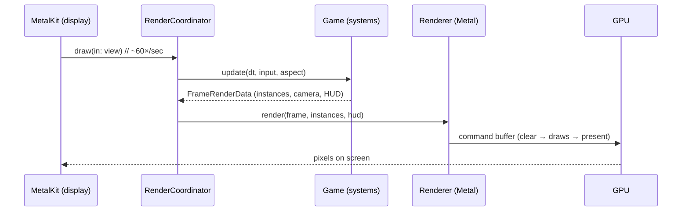

# 01 · Project setup 🛠️

> **You'll leave this chapter with:** an empty Swift package that builds and
> runs, the conventions this guide follows, and a map of which chapter creates
> which file — so you always know where you are.
>
> **Files created:** `Package.swift`, `Sources/SpaceFighter/main.swift`

This is a **build-along guide**. You type the code; every file is given in full,
and every chapter ends with something you can run. Nothing is elided, and there
is no finished project to download — by chapter 11 you'll have written the whole
thing.

---

## How this guide hands you code

Three conventions, so you're never guessing:

1. **"Create `path/to/File.swift`" means a complete new file.** Everything
   between the fences is the entire contents. Paste it, save it, move on.
2. **Two files grow as the guide goes:** `Game.swift` (the system schedule) and
   `main.swift` (the wiring). When a chapter changes one, it says so plainly and
   shows you either the complete new version or the exact method to replace —
   never a diff you have to reconstruct.
3. **Every chapter ends with a `Checkpoint`.** Run it. If the output doesn't
   match, something's wrong *now*, not three chapters later.

Two chapters (02 and 12) are pure concept and create no files; they say so at the
top.

---

## Create the package

The whole game is a single macOS executable, and a Swift Package is the lightest
way to get one — no Xcode project, no storyboard, no build phases.

```console
$ mkdir SpaceFighter && cd SpaceFighter
$ swift package init --type executable
```

**Replace** the generated `Package.swift` with this:

```swift
// swift-tools-version:5.9
import PackageDescription

let package = Package(
    name: "SpaceFighter",
    platforms: [
        // Metal and the simd APIs we use predate this, but macOS 13 keeps the
        // code modern and matches a current Xcode toolchain.
        .macOS(.v13)
    ],
    targets: [
        .executableTarget(
            name: "SpaceFighter",
            path: "Sources/SpaceFighter"
        )
    ]
)
```

Metal, MetalKit and AppKit are **system frameworks** on macOS, so there are no
dependencies to declare — `import Metal` just works.

`swift package init` may have created `Sources/SpaceFighter/SpaceFighter.swift`.
Delete it; we use a `main.swift` entry point instead:

```console
$ rm -f Sources/SpaceFighter/SpaceFighter.swift
```

Now **create `Sources/SpaceFighter/main.swift`** — a placeholder we replace in
chapter 06, just so the package has an entry point and builds:

```swift
// Entry point. A SwiftPM executable runs the top-level code in `main.swift`.
// Chapter 06 replaces this with a real AppKit window and a Metal view.

import Foundation

print("SpaceFighter: toolchain OK")
```

### Checkpoint

```console
$ swift run
SpaceFighter: toolchain OK
```

If you see that line, your toolchain is good and everything from here is just
adding files.

---

## What you'll create, and when

Keep this table handy — it's the whole project. Every path is relative to
`Sources/SpaceFighter/`.

| Chapter | Files you create | After it, you can… |
|---|---|---|
| 01 | `main.swift` (placeholder) | run a binary |
| 02 | *(none — concepts)* | — |
| 03 | `Math.swift` | print a transformed point |
| 04 | `ECS/Entity.swift`, `ECS/ComponentStore.swift`, `ECS/World.swift` | create entities and attach data |
| 05 | `Render/RenderTypes.swift`, `Mesh.swift` | print the geometry you generated |
| 06 | `Render/Shaders.swift`, `Render/Renderer.swift`, `main.swift` (real) | **see a ship on screen** |
| 07 | `Components.swift`, `Systems/RenderSystem.swift`, `Systems/MovementSystem.swift`, `Game.swift`, `GameView.swift` | watch it move, driven by the ECS |
| 08 | `Input.swift`, `Systems/FlightControlSystem.swift` | **fly it** |
| 09 | `Systems/CameraSystem.swift` | fly it with a camera that feels right |
| 10 | `Systems/WeaponSystem.swift`, `Systems/EnemySystem.swift`, `Systems/LifetimeSystem.swift`, `Systems/CollisionSystem.swift` | **play it** — shoot, get hit, score |
| 11 | `HUD.swift` | see a reticle and a hull bar |
| 12 | *(none — roadmap)* | — |

The final layout:

```
SpaceFighter/
├── Package.swift
└── Sources/SpaceFighter/
    ├── main.swift              app + window + Metal view
    ├── Game.swift              the world, and the per-frame system schedule
    ├── GameView.swift          the MTKViewDelegate that drives each frame
    ├── Input.swift             InputState, key codes, InputController
    ├── Math.swift              simd helpers: matrices, projection, quaternions
    ├── Components.swift        every component (pure data structs)
    ├── HUD.swift               crosshair, hull bar, hit-flash geometry
    ├── Mesh.swift              procedural ship / enemy / bolt / stars / grid
    ├── ECS/
    │   ├── Entity.swift
    │   ├── ComponentStore.swift
    │   └── World.swift
    ├── Systems/
    │   ├── FlightControlSystem.swift
    │   ├── MovementSystem.swift
    │   ├── WeaponSystem.swift
    │   ├── EnemySystem.swift
    │   ├── LifetimeSystem.swift
    │   ├── CollisionSystem.swift
    │   ├── CameraSystem.swift
    │   └── RenderSystem.swift
    └── Render/
        ├── RenderTypes.swift   CPU structs that mirror the shader structs
        ├── Shaders.swift       all Metal Shading Language source
        └── Renderer.swift      device, pipelines, depth states, the draw loop
```

### What you're building toward

A third-person space fighter with these controls (wired up in chapter 08):

| Key | Action |
|---|---|
| `W` `S` / `↑` `↓` | Pitch down / up |
| `A` `D` / `←` `→` | Yaw left / right (banks automatically) |
| `Q` `E` | Roll |
| `Shift` | Boost |
| `Space` | Fire |
| `Esc` / `⌘Q` | Quit |

Score, hull and deaths appear in the **window title**.

---

## Why Metal?

**Metal** is Apple's low-level GPU API — the same layer game engines target on
Apple platforms. "Low-level" means you talk to the graphics hardware almost
directly: you allocate GPU buffers, describe a rendering pipeline, and record
commands into a buffer that the GPU executes. There is no scene graph, no
"draw a sphere" convenience — which is exactly why it's worth learning. You see
the whole machine.

The alternatives frame the choice:

- **SceneKit / RealityKit** — Apple's high-level 3D frameworks. Great for apps;
  they hide the pipeline we want to understand.
- **A game engine (Unity, Unreal, Godot)** — the right tool to *ship* a game,
  the wrong tool to *learn what an engine does*.
- **OpenGL** — cross-platform but deprecated on Apple hardware.
- **Metal** — modern, first-class on every Mac/iPhone/iPad, and small enough at
  its core to hold in your head. That's us.

We compile the shaders **at runtime from a Swift string** (chapter 06), so the
whole thing builds with a plain `swift run` — no `.metal` files in a build phase,
no Xcode project required.

## Why an ECS?

A space shooter has ships, bullets, enemies, pickups, explosions — hundreds of
things that are *mostly alike but not quite*. The object-oriented instinct is an
inheritance tree: `Entity → Vehicle → Ship → PlayerShip`. It works until an
enemy needs to be *both* a homing thing *and* a shielded thing *and* a splitter,
and single inheritance can't express it. You get deep hierarchies, `isKindOf`
checks, and copy-pasted behaviour.

An **Entity–Component–System** turns the model inside out:

- an **entity** is just an id (a number),
- a **component** is a plain struct of data with no behaviour, and
- a **system** is a function that runs over all entities that have a given set
  of components.

A "homing shielded splitter" is just an entity holding a `Homing`, a `Shield`
and a `Splitter` component. New behaviour is a new component plus a new system —
nothing else changes. And because components of one type live packed together in
memory, systems iterate them fast and cache-friendly. Chapter 04 builds ours.

---

## The shape of a frame

Here is the whole program in one breath. MetalKit will call our
`RenderCoordinator.draw(in:)` (chapter 07) once per displayed frame, and that
callback does two things:

1. **Simulate.** `Game.update` measures the time since the last frame and runs
   every system in order — read input, fly the ship, spawn and steer enemies,
   move everything, expire bolts, resolve collisions, then collect what's visible.
2. **Draw.** `Renderer.render` takes that collection and records Metal commands:
   clear the screen, draw the grid and stars, draw the lit ships and enemies,
   draw the glowing bolts, draw the HUD, present.


```mermaid
sequenceDiagram
    participant MK as MetalKit (display)
    participant CO as RenderCoordinator
    participant GA as Game (systems)
    participant RE as Renderer (Metal)
    participant GPU
    MK->>CO: draw(in: view)   // ~60×/sec
    CO->>GA: update(dt, input, aspect)
    GA-->>CO: FrameRenderData (instances, camera, HUD)
    CO->>RE: render(frame, instances, hud)
    RE->>GPU: command buffer (clear → draws → present)
    GPU-->>MK: pixels on screen
```

Every chapter zooms into one part of that loop. Keep the picture: **simulate,
then draw, sixty times a second.**

---

## From `swift run` to a real app

`swift run` builds a bare Mach-O executable, and in chapter 06 you hand-build an
`NSApplication` inside `main.swift` — no storyboard, no `.app` bundle. That's
ideal for iterating: edit, `swift run`, see the change.

For anything you'd hand to another person — an icon, a Dock presence that
behaves, code signing — you want a bundle. Two paths:

1. **Xcode "macOS App" target.** File → New → Project → App, then drop the
   contents of `Sources/SpaceFighter/` in. Move the shader string into a
   `.metal` file if you prefer compile-time shader errors (chapter 06 covers the
   trade-off).
2. **A SwiftPM app bundler.** Tools exist to wrap a SwiftPM executable into a
   `.app`; for a learning project the Xcode route is the least friction.

The *code* is identical either way — only the packaging changes.

---

## Build issues you might hit

- **"No Metal-capable GPU found."** (From chapter 06 onward.) You're on a machine
  or VM without a Metal device; this project needs real Apple hardware.
- **`swift: command not found`.** Install the toolchain with
  `xcode-select --install`, or open the project in Xcode.
- **`error: no such module 'Metal'`.** You're not on macOS, or the platform line
  in `Package.swift` is missing.

---

**Next:** the GPU stops being a black box. →
[Chapter 02: Metal fundamentals](02-metal-fundamentals.md)
