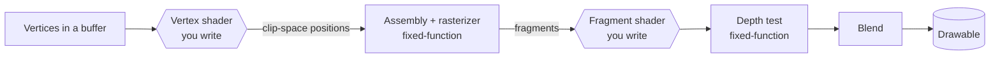

# 02 · Metal fundamentals 🧠

> **You'll leave this chapter with:** a working mental model of the GPU as a
> service you submit work to, and names for the seven or eight Metal objects that
> show up in every frame — so `Renderer.swift` reads like prose, not spells.

---

## The GPU is a separate computer

Treat the GPU as a second machine on the far end of a wire. You don't call
functions on it; you **write down a list of commands**, hand the list over, and
it runs them and signals when it's done. Everything in Metal is in service of
that: describing work precisely, up front, so thousands of cores can chew
through it in parallel.

Two consequences shape the whole API:

1. **State is baked ahead of time.** How to interpret vertices, which shaders to
   run, how to blend colours — all of that is compiled into an immutable
   *pipeline state object* once, not set flag-by-flag per draw.
2. **Work is recorded, then submitted.** You fill a *command buffer* with
   encoded commands and `commit()` it. The GPU runs it asynchronously.

## The cast of objects

Here's everyone you'll meet, roughly in the order they appear, with the line in
`Renderer.swift` or
`main.swift` that creates them.

| Object | What it is | Lifetime |
|---|---|---|
| `MTLDevice` | The GPU itself. The factory for everything else. | Once, at startup |
| `MTLCommandQueue` | An ordered pipe you submit command buffers to. | Once |
| `MTLLibrary` | A bag of compiled shader functions. | Once |
| `MTLRenderPipelineState` | A frozen recipe: which shaders, vertex layout, pixel format, blending. | Once per material |
| `MTLDepthStencilState` | How depth testing behaves (test? write?). | Once per mode |
| `MTLBuffer` | A block of GPU-accessible memory (vertices, instances). | Meshes: once. Per-frame data: each frame |
| `MTLCommandBuffer` | One frame's worth of recorded commands. | **Every frame** |
| `MTLRenderCommandEncoder` | The thing you record draw commands *into*. | **Every frame** |
| `CAMetalDrawable` | The texture you're drawing this frame that gets shown. | **Every frame** |

The split matters: the top rows are built **once** and reused; the bottom rows
are created **fresh every frame**. Our `Renderer.init` does all the once-only
setup; `Renderer.render` does the per-frame recording.

### Device, queue, library

```swift
let device = MTLCreateSystemDefaultDevice()!          // main.swift
let queue  = device.makeCommandQueue()!               // Renderer.init
let library = try device.makeLibrary(source: Shaders.source, options: nil)
```

`makeLibrary(source:)` compiles our Metal Shading Language string on the spot and
hands back the functions by name. (Bigger projects ship a precompiled
`.metallib`; we trade a few milliseconds at launch for a one-file build —
chapter 05.)

### Pipeline state — the frozen recipe

A `MTLRenderPipelineState` bundles the decisions the GPU can't afford to
re-check per triangle:

```swift
let d = MTLRenderPipelineDescriptor()
d.vertexFunction   = library.makeFunction(name: "lit_vertex")
d.fragmentFunction = library.makeFunction(name: "lit_fragment")
d.colorAttachments[0].pixelFormat = view.colorPixelFormat   // .bgra8Unorm
d.depthAttachmentPixelFormat      = view.depthStencilPixelFormat
let state = try device.makeRenderPipelineState(descriptor: d)
```

You build one per "material". We build four — lit, unlit, star, HUD — in
`Renderer.init`, each pairing a vertex + fragment shader with a blend mode.
Switching materials mid-frame is just `encoder.setRenderPipelineState(state)`.

### Buffers — memory both sides can see

A `MTLBuffer` is raw bytes the GPU can read. We upload each mesh's vertices into
one at startup and never touch it again; we build a small instance buffer each
frame. `.storageModeShared` means CPU and GPU see the same memory (fine on Apple
silicon's unified memory).

---

## One frame, encoded

Per frame, `Renderer.render` performs this dance:

```swift
guard let rpd = view.currentRenderPassDescriptor,   // where to draw + how to clear
      let drawable = view.currentDrawable,           // the texture to show
      let command = queue.makeCommandBuffer(),       // this frame's command list
      let encoder = command.makeRenderCommandEncoder(descriptor: rpd)
else { return }

// ... encoder.setRenderPipelineState(...), setVertexBuffer(...), drawPrimitives(...)

encoder.endEncoding()
command.present(drawable)   // schedule the result to appear
command.commit()            // hand the whole list to the GPU
```

The **render pass descriptor** (`rpd`) says which textures this pass draws into
and what to do with them first — clear the colour texture to deep blue, clear
depth to 1.0. Because we told the `MTKView` it has a depth format, MetalKit hands
us a descriptor with both a colour *and* a depth attachment already wired up, so
we never manage a depth texture by hand.

The **render command encoder** is where you actually record draws. You set a
pipeline state, bind buffers to numbered slots, and call `drawPrimitives` /
`drawIndexedPrimitives`. Each call appends commands to the buffer.

`present(drawable)` schedules the finished image to be shown; `commit()` submits.
The GPU runs it while the CPU races ahead to build the next frame.

---

## What the GPU does with a draw call

When you call `drawIndexedPrimitives`, the GPU runs a fixed pipeline. The two
stages *you* program are shaded; the rest is fixed-function hardware.



- **Vertex shader** — runs once per vertex. Its job: place the vertex in
  *clip space* by multiplying through the model and camera matrices. Ours also
  passes the world normal and colour along. (`lit_vertex` in `Shaders.swift`.)
- **Rasterizer** — fixed hardware. Turns each triangle into the *fragments*
  (candidate pixels) it covers, interpolating the vertex outputs across the face.
- **Fragment shader** — runs once per fragment. Its job: compute a colour. Ours
  does a cheap directional-light calculation (`lit_fragment`).
- **Depth test** — fixed hardware. Compares each fragment's depth to what's
  already there and discards the ones behind. This is what makes near things
  hide far things without you sorting anything.

### The depth buffer, concretely

Draw an enemy, then draw a star behind it. Without depth testing, whichever you
drew *last* wins and the star punches through the ship. The depth buffer fixes
this: alongside the colour image the GPU keeps a same-size image of *distances*.
A fragment is kept only if it's nearer than the stored distance, and (if enabled)
it updates that stored distance.

We express the policy as a `MTLDepthStencilState`:

```swift
// solids: test against depth AND write our depth
depthCompareFunction = .less ; isDepthWriteEnabled = true
// glows (bolts, stars): test so solids occlude them, but DON'T write
depthCompareFunction = .less ; isDepthWriteEnabled = false
// HUD: ignore depth entirely, always draw on top
depthCompareFunction = .always ; isDepthWriteEnabled = false
```

`Renderer` keeps all three and swaps between them per pass. Getting these right
is why the ship correctly hides the grid behind it while a glowing bolt in front
still lets you see the ship through its halo.

---

## MetalKit smooths the edges

Raw Metal makes *you* create the window's drawable textures, a display link to
pace frames, and a depth texture. **MetalKit**'s `MTKView` does all three:

- it owns the `CAMetalView` layer and vends a fresh `currentDrawable` each frame,
- it calls your delegate's `draw(in:)` at `preferredFramesPerSecond`, and
- given a `depthStencilPixelFormat`, it manages the depth texture and folds it
  into `currentRenderPassDescriptor`.

We set it up in `main.swift` and `Renderer.init`, then let it drive us. Chapter
07 picks up that `draw(in:)` callback as the game loop's heartbeat.

---

## The one-screen summary

- The GPU runs **recorded command buffers**, asynchronously.
- Build **pipeline states, depth states and mesh buffers once**; build a
  **command buffer + encoder + instance buffers every frame**.
- A draw runs **vertex shader → rasterizer → fragment shader → depth test →
  blend**; you write the two shaders, the hardware does the rest.
- The **depth buffer** is how near hides far — and choosing *test/write* per pass
  is a real rendering decision, not boilerplate.

You now have the vocabulary. Chapter 05 spends it on our actual shaders and draw
loop — but first we need the matrices those shaders multiply by.

---

**Next:** the vectors, matrices and quaternions the whole thing runs on. →
[Chapter 03: The math you need](03-the-math-you-need.md)
