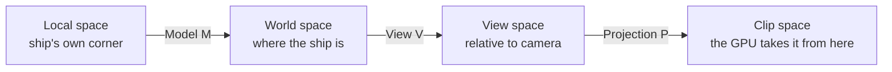

# 03 · The math you need 🧠

> **You'll leave this chapter with:** enough linear algebra to read every matrix
> in the project, an understanding of *why we orient ships with quaternions*, and
> a line-by-line grip on [`Math.swift`](../src/Sources/SpaceFighter/Math.swift).

You do not need to love math to build this. You need four things: vectors, the
model/view/projection chain, quaternions for rotation, and the `simd` library
that makes all of it one-liners. We'll take them in order.

---

## Our conventions (pin these up)

Everything in the codebase obeys these four rules. Most 3D bugs are a violation
of one of them.

1. **Right-handed world space.** +X is right, +Y is up, +Z points *toward* the
   viewer. So a ship's **forward is its local −Z**. (Point your right hand's
   fingers from +X to +Y; your thumb points +Z, out of the screen.)
2. **Column-major matrices.** A transform applies as `M * v`, and composition
   reads **right-to-left**: `translate * rotate * scale` scales first, rotates
   next, translates last. This is what Metal and `simd_float4x4` expect.
3. **Clip-space depth in [0, 1].** Metal's normalised depth runs 0 (near) to 1
   (far). (OpenGL used −1…1; a projection matrix copied from an OpenGL tutorial
   will render a depth-fighting mess.)
4. **Angles in radians.** `simd` trig is radians; `Float.radians` converts from
   the degrees humans think in.

---

## Vectors

A `SIMD3<Float>` (`Vec3`) is a point or a direction. Two operations do almost all
the work:

**Dot product** — `simd_dot(a, b)` — a single number that measures alignment.
For unit vectors it's the cosine of the angle between them: `1` same direction,
`0` perpendicular, `−1` opposite. Our lighting is one dot product: how aligned is
a surface normal with the direction to the light?

```
diffuse = max(dot(surfaceNormal, directionToLight), 0)
```

**Cross product** — `simd_cross(a, b)` — a new vector *perpendicular to both*.
We use it to build coordinate frames (the camera's right axis is `up × forward`)
and to find a rotation axis (to turn a homing enemy toward you, rotate about
`currentHeading × desiredHeading`).

**Length & normalize** — `simd_length(v)` gives magnitude; `simd_normalize(v)`
scales a vector to length 1 while keeping its direction. Directions should almost
always be normalized before you use them.

---

## Why matrices: one type for every transform

We want to move, rotate and scale geometry, and — crucially — *compose* those.
A 4×4 matrix expresses all of it and composes by multiplication. The trick that
makes translation fit into a matrix is the **homogeneous coordinate**: we tack a
`w = 1` onto each 3D point, making it 4D. Now a matrix's last column can add a
translation, something a 3×3 can't do.

A model matrix has this anatomy:

```
| Rx  Ux  Fx  Tx |   the upper-left 3×3 is rotation × scale
| Ry  Uy  Fy  Ty |   (the object's right/up/forward axes, scaled)
| Rz  Uz  Fz  Tz |
|  0   0   0   1 |   the last column T is translation
```

`Transform.matrix` builds exactly this via `Math.trs`:

```swift
static func trs(translation t: Vec3, rotation r: Quat, scale s: Vec3) -> Mat4 {
    translation(t) * rotation(r) * scale(s)   // read right-to-left
}
```

---

## The MVP chain: from a local corner to a screen pixel

A vertex of the ship mesh starts in **local space** (relative to the ship's own
origin). Three matrices carry it to the screen. This is *the* pipeline; memorise
its shape.



- **Model (M)** — places the mesh in the world: the ship's `Transform.matrix`.
- **View (V)** — moves the world so the camera sits at the origin looking down
  −Z. Built by `Math.lookAt`.
- **Projection (P)** — applies perspective: far things shrink, and depth is
  mapped into [0, 1]. Built by `Math.perspective`.

The vertex shader does the multiply. We even pre-multiply `P * V` on the CPU once
per frame (into `FrameUniforms.viewProjection`) so the shader is a single matrix
per vertex:

```metal
out.position = frame.viewProjection * (inst.model * float4(v.position, 1.0));
```

### Projection, derived

`Math.perspective` builds the standard right-handed, [0,1]-depth matrix:

```swift
let ys = 1 / tan(fovyRadians * 0.5)   // vertical scale from field of view
let xs = ys / aspect                  // horizontal scale corrects for a wide window
let zs = far / (near - far)           // maps z into [0,1] non-linearly
```

Two things to feel rather than memorise: a **narrower FOV zooms in** (bigger
`ys`), and dividing by `aspect` is what stops the image stretching when you
resize the window. We pass the live window aspect every frame from
`Game.update`.

### View, derived

`Math.lookAt(eye:center:up:)` builds an orthonormal camera frame and its inverse
in one shot:

```swift
let z = simd_normalize(eye - center)     // camera looks down -z, so +z points back
let x = simd_normalize(simd_cross(up, z))// right = up × back
let y = simd_cross(z, x)                 // true up, re-orthogonalised
```

The rows are the camera's axes and the last column undoes the camera's position
(`-dot(axis, eye)`). Multiplying a world point by this expresses it *relative to
the camera* — which is exactly what projection expects. Chapter 09 uses it.

---

## Rotation: quaternions, not Euler angles

Here's the one genuinely non-obvious choice in the project.

The tempting way to store orientation is three angles — pitch, yaw, roll. It's
readable and it's a trap. Applying three sequential angle-rotations has a failure
mode called **gimbal lock**: at certain orientations (nose straight up), two of
your three axes line up and you lose a degree of freedom — the ship gets stuck or
snaps. Interpolating Euler angles is also ugly. A flight game, where the ship
pitches and rolls through *every* orientation, hits these constantly.

A **quaternion** stores orientation as four numbers `(x, y, z, w)` — think of it
as "an axis and an amount of spin about it," encoded so that composition is just
multiplication. It has none of the pathologies:

- **No gimbal lock.** Every orientation has a clean representation.
- **Composes by multiplication.** "Then rotate a bit more" is `q * delta`.
- **Interpolates smoothly** (slerp), which matters the moment you want a camera
  or missile to ease toward a target.

`simd` gives us `simd_quatf` with everything we need:

```swift
Quat(angle: θ, axis: Vec3(1,0,0))   // a rotation
q1 * q2                              // compose (apply q2 in q1's frame)
q.act(Vec3(0,0,-1))                  // rotate a vector — here, "which way is forward?"
simd_normalize(q)                    // keep it unit after many multiplies
```

That last one matters: repeatedly multiplying quaternions accumulates tiny
floating-point error, so we renormalise after each update (see
`FlightControlSystem`).

### Local-space rotation, the heart of the flight feel

When you pitch the ship, you want it to pitch about *its own* wings, not the
world's X axis. That's the difference between `q * delta` and `delta * q`:

```swift
// FlightControlSystem: build this frame's tumble from pitch/yaw/roll...
let delta = Quat(angle: pitch·dt, axis: [1,0,0])
          * Quat(angle: yaw·dt,   axis: [0,1,0])
          * Quat(angle: roll·dt,  axis: [0,0,1])
// ...and apply it on the RIGHT, so it's relative to the current orientation.
t.rotation = simd_normalize(t.rotation * delta)
```

Multiplying on the right means "in the ship's local frame." Roll ninety degrees
and now "pitch up" tilts you sideways — exactly what a real aircraft does, and
what makes the controls feel like flying rather than steering a cursor.

### From quaternion to matrix

The vertex shader wants a matrix, so `Math.rotation(_:)` expands a quaternion's
four numbers into the 3×3 rotation block (padded to 4×4). We write it out by hand
rather than lean on a specific `simd` initializer, so the formula is right there
to read:

```swift
let x = q.vector.x, y = q.vector.y, z = q.vector.z, w = q.vector.w
// ...the classic quaternion→matrix expansion...
Vec4(1 - 2*(yy+zz),  2*(xy+wz),      2*(xz-wy),      0)   // first column
```

You never have to derive that expansion; you just have to know *this* is where
orientation becomes a matrix the GPU can use.

---

## `simd`, and why the code is short

Apple's `simd` module gives us `SIMD3<Float>`, `simd_float4x4`, `simd_quatf` and
their operators, mapping to single CPU vector instructions **and** matching the
memory layout Metal expects. That second point is doing quiet, load-bearing work:
a `SIMD3<Float>` is 16-byte aligned exactly like MSL's `float3`, so we can hand a
Swift struct straight to a shader with no marshalling (chapter 05 leans on this
hard, and warns about the one place — a lone `float3` — where it bites).

Our type aliases keep the signatures readable:

```swift
typealias Vec3 = SIMD3<Float>
typealias Vec4 = SIMD4<Float>
typealias Mat4 = simd_float4x4
typealias Quat = simd_quatf
```

---

## The one-screen summary

- **Directions:** dot = alignment (and our lighting); cross = a perpendicular
  (and our coordinate frames). Normalize directions.
- **Transforms:** `translate * rotate * scale`, applied right-to-left; the MVP
  chain carries a vertex local → world → view → clip.
- **Orientation is a quaternion**, integrated as `q = normalize(q * delta)` in
  the ship's local frame — that's the flight feel, and it's gimbal-lock-free.
- **`simd`** makes it terse and, not coincidentally, GPU-layout-compatible.

---

**Next:** with math in hand, we build the engine core. →
[Chapter 04: Designing the ECS](04-designing-the-ecs.md)
