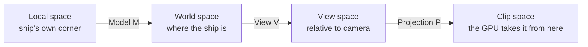

# 03 · The math you need 🧠🛠️

> **You'll leave this chapter with:** enough linear algebra to read every matrix
> in the project, an understanding of *why we orient ships with quaternions*, and
> your first real file — `Math.swift`, complete and verified.
>
> **Files created:** `Sources/SpaceFighter/Math.swift`

You do not need to love math to build this. You need four things: vectors, the
model/view/projection chain, quaternions for rotation, and the `simd` library
that makes all of it one-liners. We'll take them in order, then write the file.

---

## Our conventions (pin these up)

Everything you write from here obeys these four rules. Most 3D bugs are a
violation of one of them.

1. **Right-handed world space.** +X is right, +Y is up, +Z points *toward* the
   viewer. So a ship's **forward is its local −Z**. (Point your right hand's
   fingers from +X to +Y; your thumb points +Z, out of the screen.)
2. **Column-major matrices.** A transform applies as `M * v`, and composition
   reads **right-to-left**: `translate * rotate * scale` scales first, rotates
   next, translates last. This is what Metal and `simd_float4x4` expect.
3. **Clip-space depth in [0, 1].** Metal's normalised depth runs 0 (near) to 1
   (far). (OpenGL used −1…1; a projection matrix copied from an OpenGL tutorial
   will render a depth-fighting mess.)
4. **Angles in radians.** `simd` trig is radians; we'll add a `.radians` helper
   for the degrees humans think in.

---

## Vectors

A `SIMD3<Float>` is a point or a direction. Two operations do almost all the work:

**Dot product** — `simd_dot(a, b)` — a single number that measures alignment.
For unit vectors it's the cosine of the angle between them: `1` same direction,
`0` perpendicular, `−1` opposite. Our lighting is one dot product: how aligned is
a surface normal with the direction to the light?

```
diffuse = max(dot(surfaceNormal, directionToLight), 0)
```

**Cross product** — `simd_cross(a, b)` — a new vector *perpendicular to both*.
We use it to build coordinate frames (the camera's right axis is `up × back`)
and to find a rotation axis (to turn a homing enemy toward you, rotate about
`currentHeading × desiredHeading`).

**Length & normalize** — `simd_length(v)` gives magnitude; `simd_normalize(v)`
scales a vector to length 1 while keeping its direction. Normalize directions
before you use them.

---

## Why matrices: one type for every transform

We want to move, rotate and scale geometry, and — crucially — *compose* those.
A 4×4 matrix expresses all of it and composes by multiplication. The trick that
makes translation fit is the **homogeneous coordinate**: tack a `w = 1` onto each
3D point, making it 4D. Now a matrix's last column can add a translation,
something a 3×3 can't do.

A model matrix has this anatomy:

```
| Rx  Ux  Fx  Tx |   the upper-left 3×3 is rotation × scale
| Ry  Uy  Fy  Ty |   (the object's right/up/forward axes, scaled)
| Rz  Uz  Fz  Tz |
|  0   0   0   1 |   the last column T is translation
```

---

## The MVP chain: from a local corner to a screen pixel

A vertex of the ship mesh starts in **local space** (relative to the ship's own
origin). Three matrices carry it to the screen. This is *the* pipeline.


```mermaid
flowchart LR
  L[Local space<br/>ship's own corner] -->|Model M| W[World space<br/>where the ship is]
  W -->|View V| C[View space<br/>relative to camera]
  C -->|Projection P| K[Clip space<br/>the GPU takes it from here]
```

- **Model (M)** — places the mesh in the world. Built per entity from its
  position, rotation and scale.
- **View (V)** — moves the world so the camera sits at the origin looking down
  −Z. Built by `lookAt`.
- **Projection (P)** — applies perspective: far things shrink, and depth is
  mapped into [0, 1]. Built by `perspective`.

The vertex shader does the multiply. We'll pre-multiply `P * V` on the CPU once
per frame so the shader is a single matrix per vertex.

### Projection, derived

Two things to feel rather than memorise: a **narrower field of view zooms in**,
and dividing the horizontal scale by the aspect ratio is what stops the image
stretching when you resize the window.

### View, derived

`lookAt(eye:center:up:)` builds an orthonormal camera frame and its inverse in
one shot: `z` points *back* from the target to the eye (because the camera looks
down −z), `x` is `up × z`, and `y = z × x` re-orthogonalises up. The last column
undoes the camera's position with `-dot(axis, eye)`.

---

## Rotation: quaternions, not Euler angles

Here's the one genuinely non-obvious choice in the project.

The tempting way to store orientation is three angles — pitch, yaw, roll. It's
readable and it's a trap. Applying three sequential angle-rotations has a failure
mode called **gimbal lock**: at certain orientations (nose straight up), two of
your three axes line up and you lose a degree of freedom — the ship gets stuck or
snaps. A flight game, where the ship pitches and rolls through *every*
orientation, hits this constantly.

A **quaternion** stores orientation as four numbers `(x, y, z, w)` — think "an
axis and an amount of spin about it," encoded so composition is multiplication.
It has none of the pathologies:

- **No gimbal lock.** Every orientation has a clean representation.
- **Composes by multiplication.** "Then rotate a bit more" is `q * delta`.
- **Interpolates smoothly** (slerp), which matters the moment a camera or missile
  needs to ease toward a target.

`simd` gives us `simd_quatf`:

```swift
simd_quatf(angle: θ, axis: SIMD3<Float>(1,0,0))   // a rotation
q1 * q2                                            // compose
q.act(SIMD3<Float>(0,0,-1))                        // rotate a vector: "which way is forward?"
simd_normalize(q)                                  // keep it unit after many multiplies
```

That last one matters: repeatedly multiplying quaternions accumulates
floating-point error, so we renormalise after each update (chapter 08).

---

## Create `Sources/SpaceFighter/Math.swift`

Everything above, in one file. Type it in:

```swift
import Foundation   // for scalar tan() used in the perspective projection
import simd

// Small, self-contained linear-algebra helpers built on Apple's `simd`.
//
// Conventions (see chapter 03):
//   * Right-handed world space. +X right, +Y up, +Z toward the viewer, so the
//     "forward" a ship faces is -Z in its own local space.
//   * Column-major 4x4 matrices (what Metal and `simd_float4x4` both expect),
//     so a transform is `M * v` and composition reads right-to-left:
//     `translate * rotate * scale`.
//   * Clip-space depth in [0, 1], the Metal convention (OpenGL used [-1, 1]).

typealias Vec3 = SIMD3<Float>
typealias Vec4 = SIMD4<Float>
typealias Mat4 = simd_float4x4
typealias Quat = simd_quatf

extension Float {
    /// Degrees -> radians. `simd` trig works in radians; designers think in degrees.
    var radians: Float { self * .pi / 180 }
}

enum Math {
    /// Identity transform.
    static let identity = matrix_identity_float4x4

    /// Translation matrix.
    static func translation(_ t: Vec3) -> Mat4 {
        Mat4(columns: (
            Vec4(1, 0, 0, 0),
            Vec4(0, 1, 0, 0),
            Vec4(0, 0, 1, 0),
            Vec4(t.x, t.y, t.z, 1)
        ))
    }

    /// Uniform scale matrix.
    static func scale(_ s: Float) -> Mat4 { scale(Vec3(repeating: s)) }

    /// Non-uniform scale matrix.
    static func scale(_ s: Vec3) -> Mat4 {
        Mat4(columns: (
            Vec4(s.x, 0, 0, 0),
            Vec4(0, s.y, 0, 0),
            Vec4(0, 0, s.z, 0),
            Vec4(0, 0, 0, 1)
        ))
    }

    /// Rotation matrix from a unit quaternion.
    ///
    /// We build it by hand from the quaternion's components rather than relying
    /// on a specific `simd_float4x4(quat)` initializer, so the code is obvious
    /// and portable across toolchains. `q.vector` is `(x, y, z, w)`.
    static func rotation(_ q: Quat) -> Mat4 {
        let x = q.vector.x, y = q.vector.y, z = q.vector.z, w = q.vector.w
        let xx = x * x, yy = y * y, zz = z * z
        let xy = x * y, xz = x * z, yz = y * z
        let wx = w * x, wy = w * y, wz = w * z
        return Mat4(columns: (
            Vec4(1 - 2 * (yy + zz), 2 * (xy + wz),     2 * (xz - wy),     0),
            Vec4(2 * (xy - wz),     1 - 2 * (xx + zz), 2 * (yz + wx),     0),
            Vec4(2 * (xz + wy),     2 * (yz - wx),     1 - 2 * (xx + yy), 0),
            Vec4(0, 0, 0, 1)
        ))
    }

    /// Compose a full model matrix: scale, then rotate, then translate.
    static func trs(translation t: Vec3, rotation r: Quat, scale s: Vec3) -> Mat4 {
        translation(t) * rotation(r) * scale(s)
    }

    /// Right-handed perspective projection with clip depth in [0, 1].
    ///
    /// `fovyRadians` is the *vertical* field of view; horizontal FOV follows
    /// from the aspect ratio. Objects nearer than `near` or beyond `far` are
    /// clipped.
    static func perspective(fovyRadians: Float, aspect: Float, near: Float, far: Float) -> Mat4 {
        let ys = 1 / tan(fovyRadians * 0.5)
        let xs = ys / aspect
        let zs = far / (near - far)
        return Mat4(columns: (
            Vec4(xs, 0, 0, 0),
            Vec4(0, ys, 0, 0),
            Vec4(0, 0, zs, -1),
            Vec4(0, 0, zs * near, 0)
        ))
    }

    /// Right-handed "look at" view matrix. `up` need not be exactly orthogonal
    /// to the view direction; it is re-orthogonalised here.
    static func lookAt(eye: Vec3, center: Vec3, up: Vec3) -> Mat4 {
        let z = simd_normalize(eye - center)   // camera looks down -z
        let x = simd_normalize(simd_cross(up, z))
        let y = simd_cross(z, x)
        return Mat4(columns: (
            Vec4(x.x, y.x, z.x, 0),
            Vec4(x.y, y.y, z.y, 0),
            Vec4(x.z, y.z, z.z, 0),
            Vec4(-simd_dot(x, eye), -simd_dot(y, eye), -simd_dot(z, eye), 1)
        ))
    }

    /// Move `current` toward `target` at up to `maxDelta` per call. Handy for
    /// easing throttle, camera and control rates without overshoot.
    static func moveToward(_ current: Float, _ target: Float, _ maxDelta: Float) -> Float {
        let d = target - current
        if abs(d) <= maxDelta { return target }
        return current + (d < 0 ? -maxDelta : maxDelta)
    }
}
```

Two notes on what you just typed. `Math.rotation` is the classic
quaternion-to-matrix expansion written out in full — you never have to derive it,
but this is where orientation becomes something the GPU can use. And
`Math.perspective` is the one place the `[0, 1]` depth convention is baked in;
that `zs = far / (near - far)` is what makes it Metal's projection and not
OpenGL's.

---

## Checkpoint

Temporarily **replace `main.swift`** with this to prove the math works:

```swift
import Foundation
import simd

// Put a point 1 unit down the ship's nose (local -Z), rotate the ship 90 degrees
// about +Y, and move it to (10, 0, 0). The nose should end up pointing down -X,
// so the point lands at (9, 0, 0).
let rotation = Quat(angle: 90.radians, axis: Vec3(0, 1, 0))
let model = Math.trs(translation: Vec3(10, 0, 0), rotation: rotation, scale: Vec3(repeating: 1))
let nose = model * Vec4(0, 0, -1, 1)

print(String(format: "nose -> (%.2f, %.2f, %.2f)", nose.x, nose.y, nose.z))
print(String(format: "forward -> %@", "\(rotation.act(Vec3(0, 0, -1)))"))
```

```console
$ swift run
nose -> (9.00, 0.00, 0.00)
forward -> SIMD3<Float>(-1.0, 0.0, ...)
```

The `9.00` is the whole chapter in one number: the local nose at −Z got rotated
to point down −X and then translated to `x = 10`, landing at `x = 9`. If you get
`11.00`, your rotation went the other way; if you get `10.00, 0.00, -1.00`, the
rotation didn't apply at all — check that `trs` multiplies in the order
`translation * rotation * scale`.

---

**Next:** the engine core — entities, components, and the storage that makes
them fast. → [Chapter 04: Designing the ECS](04-designing-the-ecs.md)
